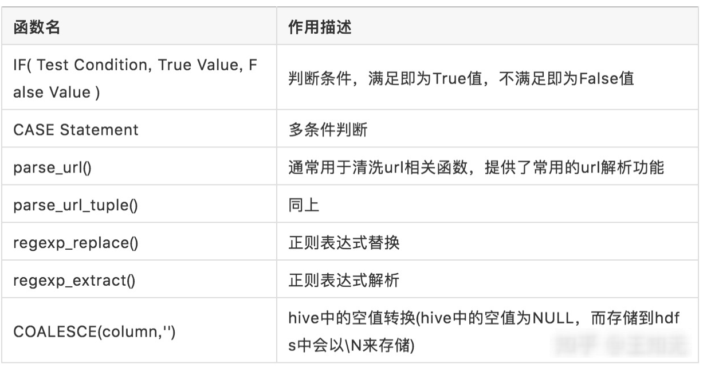

# Hive必知必会

## 一、Hive的几种数据模型

+ **内部表** (Table 将数据保存到Hive 自己的数据仓库目录中：/usr/hive/warehouse)
+ **外部表** (External Table 相对于内部表，数据不在自己的数据仓库中，只保存数据的元信息)
+ **分区表** (Partition Table将数据按照设定的条件分开存储，提高查询效率，分区-----> 目录)
+ **桶表** (Bucket Table本质上也是一种分区表，类似 hash 分区 桶 ----> 文件)
+ **视图表** (视图表是一个虚表，不存储数据，用来简化复杂的查询)

注意:内部表删除表后数据也会删除，外部表数据删除后不会从hdfs中删除  

### 1. 内部表/管理表

+ 每一个Table在Hive中都有一个相应的目录存储数据
+ 所有的Table数据都存储在该目录

```
# 创建表
create table if not exists aiops.appinfo (
    appname string,
    level string,
    leader string,
    appline string,
    dep string,
    ips  array<string>)
    ROW FORMAT DELIMITED
    FIELDS TERMINATED BY ' '
    COLLECTION ITEMS TERMINATED BY ',';

# 自定义文件和记录格式
## 使用create table创建表，最后使用stored as sequencefile保存成sequence格式[默认是text格式]

# 数据库授权
hive> grant create on database dbname to user hadoop;

# 导入数据(本地导入和hdfs导入)
hive> load data inpath  'hdfs://hdfs-name/sure.csv' overwrite into table aiops.appinfo;
load data local inpath '/home/hdfs/online_state1' overwrite into table online_state PARTITION (end_dt='99991231');

# 查看表结构
hive> describe extended bgops;
hive> describe bgops;

# 修改列名
## 这个命令可以修改表的列名，数据类型，列注释和列所在的位置顺序，FIRST将列放在第一列，AFTER col_name将列放在col_name后面一列
hive> ALTER TABLE aiops.appinfo CHANGE hostnum ipnum int comment 'some 注释' AFTER col3;

# 修改表结构
ALTER TABLE aiops.appinfo replace columns (appname string,level string,leader string,appline string,dep string,ips array<string>);
ALTER TABLE appinfo replace columns (appname string,appline string,level string,leader string,dep string,idcnum int,idcs array<string>,hostnum int,ips array<string>);
## 增加表的列字段(默认增加到最后一列，可以使用change column 来调整位置)
hive> alter table appinfo add columns (appclass string comment 'app_perf_class');

# 导出表查询结果(会将结果导出到testoutput目录下)
hive> insert overwrite local directory './testoutput'
    > row format delimited fields terminated by "\t"
    > select ip,appname,leader from appinfo  LATERAL VIEW explode(ips) tmpappinfo  AS ip;
```

### 2.外部表的使用场景

+ 原始日志文件或同时被多个部门同时操作的数据集，需要使用外部表
+ 如果不小心将meta data删除了，HDFS上的数据还在，可以恢复，增加了数据的安全性

注意:使用insert插入数据时会产生临时表，重新连接后会表会小时，因此大批量插入数据时不建议用insert  
tips1:在hdfs的hive路径下以.db结尾的其实都是实际的数据库
tips2:默认的default数据库就在hive的家目录

### 3. 分区表

注意:分区表通常分为静态分区表和动态分区表，前者需要导入数据时静态指定分区，后者可以直接根据导入数据进行分区。分区的好处是可以让数据按照区域进行分类，避免了查询时的全表扫描。  

```
# 创建外部分区表，指定静态分区为dt
CREATE EXTERNAL TABLE if not exists aiops.tmpOnline(ip string,
status string,
....
)
PARTITIONED BY (
  dt string);

# 导入数据到静态分区表中(需要注意的是数据中没有dt字段)
load data local inpath '/home/hdfs/tmpOnline' overwrite into table aiops.tmpOnline PARTITION (dt='99991231');

# 动态分区表的使用(动态分区和静态分区表的创建时没有区别的)
# 注意:hive默认没有开启动态分区，需要进行参数修改
# 使用动态分区的记录中，必须在指定位置包含动态分区的字段才能被动态分区表识别
hive>set hive.exec.dynamic.partition.mode=nonstrict;
hive>
insert
  overwrite
table aiops.tmpOnline
partition(dt)
select
ip,appname,....,from_unixtime(unix_timestamp(),'yyyyMMdd') as dt from table;
  
# 手动添加分区
alter table tablename add partition (dt='20181009');
# 删除分区，数据也会删除(所以一般会使用外部分区表？)
## 注意:如果数据有变动，是无法将数据load到同一个时间分区的记录的
alter table tablename drop partition (dt='20181009');
# 查询分区表没有加分区过滤，会禁止提交这个任务(strict方式每次查询必须制定分区)
set hive.mapred.mode = strict|nostrict;

```

注意:在外部分区表中，如果将表删除了，重建表后只需要将分区加载进来即可恢复历史相关分区的数据。  

多重分区的使用  

```
# 创建多重分区表
create table log_m (
    id  int,
    name string,
    age int
)
partitioned by (year string,month string,day string)
row format delimited
fields terminated by '|'
collection items terminated by ','
map keys terminated by ':'
lines terminated by '\n';

# 插入数据
insert into table log_m partition  (year='2018',month='10',day='10') values(1,'biaoge',24);
insert into table log_m partition  (year='2018',month='10',day='09') values(2,'bgbiao',25);
hive> show partitions log_m;
OK
year=2018/month=10/day=09
year=2018/month=10/day=10
Time taken: 0.055 seconds, Fetched: 2 row(s)
hive>

# 多重动态分区
# 好像动态分区表不能直接load data
hive> insert into table log_m partition(year,month,day) values(3,'xuxuebiao',28,'2016','09','10');
hive> show partitions log_m;
OK
year=2016/month=09/day=10
year=2018/month=10/day=09
year=2018/month=10/day=10

# 查询分区数据
hive> select * from log_m where year = '2018';
OK
2 bgbiao  25  2018  10  09
1 biaoge  24  2018  10  10
2 bgbiao  25  2018  10  10

```

## 二、Hive的复杂数据类型的使用

注意:Hive之所以能在大数据领域比较受欢迎，很大一部分原因在于相比其他SQL类存储系统支持更加复杂的数据类型

+ map: (key1, value1, key2, value2, ...) 一些列的k/v对 map<int,string...>
+ struct: (var1,var2,var3...) 不同类型的值的组合 struct<abc:string,def:int...>
+ array: (var1,var2,var3...) 一种类型的值的组合 array<string...>
+ uniontype: (string,map<>,struct<>,array<>)

注意:在创建hive表时可根据需要导入的数据进行类型识别并创建适合的数据类型  

hive数据类型数据识别标识:  

字段分割标识含义FIELDS TERMINATED BY表示字段与字段之间的分隔符COLLECTION ITEMS TERMINATED BY表示一个字段中各个item之间的分隔符[可用于array和struct类型]MAP KEYS TERMINATED BY表示map类型中的key/value的分隔符[可用于map类型]

```
# 创建表
create table union_testnew(
  foo uniontype<int, double, string, array<string>, map<string, string>>
)
row format delimited
collection items terminated by ','
map keys terminated by ':'
lines terminated by '\n'
stored as textfile;

# 数据准备
[root@master wadeyu]# vim union_test.log
  1 0,1
  2 1,3.0
  3 2,world
  4 3,wade:tom:polly
  5 4,k1^Dv1:k2^Dv2

# 导入数据
hive (badou)> load data local inpath './union_test.log' overwrite into table union_testnew;

# 查询数据
hive (badou)> select * from union_testnew;
OK
union_testnew.foo
{0:1}
{1:3.0}
{2:"world"}
{3:["wade","tom","polly"]}
{4:{"k1":"v1","k2":"v2"}}
Time taken: 0.225 seconds, Fetched: 5 row(s)
```

### 1. array类型的使用

#### 1.1 array类型的基本使用

类型结构: array<struct> 例如:array<string>,array<int>
数据表示: 例如:[string1,string2],[int1,int2]

```
# 原始文件
bmpjob P2 bgops 服务研发组 10.0.0.212,10.0.0.225,10.0.0.243,10.0.55.31

# 创建数据库
hive> create table appinfo
    > (
    > appname string,
    > level string,
    > leader string,
    > dep string,
    > ips  array<string>)
    > ROW FORMAT DELIMITED
    > FIELDS TERMINATED BY ' '
    > COLLECTION ITEMS TERMINATED BY ',';

# 加载数据到hive
hive> load data inpath 'hdfs://hdfs-name/aiops/wander/appinfo.txt' overwrite into table appinfo;
Loading data to table test.appinfo
Table test.appinfo stats: [numFiles=1, numRows=0, totalSize=32568, rawDataSize=0]
OK

# 查询相关数据
hive> select * from appinfo limit 1;
OK
bmpjob P2 bgops 服务研发组 ["10.0.0.212","10.0.0.225","10.0.0.243","10.0.55.31"]

hive> select appname,leader,ips[0] from appinfo limit 1;
OK
bmpjob bgops 10.0.0.212
```

#### 1.2 array<struct>类型数据转换处理

背景:  

使用array结构时，一个字段中通常会有多个值，这个时候通常情况下是需要对某个值进行过滤的，一般情况下会使用lateral view结合UDTF(User-Defined Table-Generating Functions)进行过滤。而UDTF为了解决一行输出多行的需求，典型的就是explode()函数。  

lateral view语法结构

```
lateralView: LATERAL VIEW udtf(expression) tableAlias AS columnAlias (',' columnAlias)
```

##### array<struct>转字符串

```
# 借用split函数将array<string>结构内容转换为以","分割的字符串
select split(array<string>,',') from tablename
```

##### hive使用explode()函数进行【行转列】

```
语法:lateral view explode(col3) col3 as name
```

+ explode(ARRAY): 列表中的每个元素生成一行
+ explode(MAP): map中每个key-value对，生成一行，key为一列，value为一列

```
hive> select ip,appname from appinfo LATERAL VIEW explode(ips) tmpappinfo  AS ip limit 2;
10.0.0.212 bmpjob
10.0.0.225 bmpjob
```

##### hive使用concat_ws()函数进行【列转行】

```
# 借用concat_ws()和collect_set()函数进行相同列的重复数据转换
# collect_set()函数可以将相关列合并成array<>类型；concat_ws()函数会将array<>类型根据指定的分隔符进行合并
## 示例数据
hive> select * from tmp_jiangzl_test;
tmp_jiangzl_test.col1   tmp_jiangzl_test.col2   tmp_jiangzl_test.col3
a       b       1
a       b       2
a       b       3
c       d       4
c       d       5
c       d       6
## 对于以上数据，我们可以将col3列根据列col1和col2进行合并
hive> select col1,col2,concat_ws(',',collect_set(col3)) from tmp_jiangzl_test group by col1,col2;
col1    col2    _c2
a       b       1,2,3
c       d       4,5,6
```

### 2. struct<>类型的使用

数据定义: struct<name:STRING, age:INT>  
数据表示: biaoge:18  

示例:

```
# 元数据格式
1,zhou:30
2,yan:30
3,chen:20
# 相关数据库结构
hive> create table test-struct(id INT, info struct<name:STRING, age:INT>)
    > ROW FORMAT DELIMITED FIELDS TERMINATED BY ','
    > COLLECTION ITEMS TERMINATED BY ':';
# 加载数据
hive> LOAD DATA LOCAL INPATH '/home/work/data/test5.txt' INTO TABLE test-struct;
# 查询相关数据
hive> select info.age from test-struct;
Total MapReduce jobs = 1
......
Total MapReduce CPU Time Spent: 490 msec
OK
30
30
```

### 3. map<>类型的使用

数据定义: map<string,int>
数据表示: key:value,key:value...

示例：  

```
# 原始数据格式
1       job:80,team:60,person:70
2       job:60,team:80
3       job:90,team:70,person:100

# map结构的表结构创建
hive> create table employee(id string, perf map<string, int>)
    > ROW FORMAT DELIMITED
    > FIELDS TERMINATED BY '\t'
    > COLLECTION ITEMS TERMINATED BY ','
    > MAP KEYS TERMINATED BY ':';

# 数据导入
hive>  LOAD DATA LOCAL INPATH '/home/work/data/test7.txt' INTO TABLE employee;

# 数据查询
hive> select perf['person'] from employee;
Total MapReduce jobs = 1
......
Total MapReduce CPU Time Spent: 460 msec
OK
70
NULL

# 使用explode()函数查询
hive> select explode(perf) as (p_name,p_score) from employee limit 4;
OK
job 80
team 60
person 70

# 使用explode()和lateral view结合查询
hive> select id,p_name,p_score from employee lateral view explode(perf) perf as p_name,p_score limit 3;
OK
1 job 80
1 team 60
1 person 70

# 使用size()函数查看map结构中的键值对个数[也可查看array中的元素个数]
hive> select size(perf) from employee
3
2
3
```

## 三、Hive的常用函数

注意:使用show functions可以查看hive支持的相关函数  

### 1. hive常用函数列表

#### 标准函数使用:  


注意:聚合方法通常需要和group by语句组合使用  

#### 表生成函数:

表生成函数接收零个或者多个输入，然后产生多列或多行输出。  


注意:当split被包含在""之中的时候需要使用四个\进行转义[比如在hive -e ""中执行split函数]  

```
## array()函数可以将一列输入转换成一个数组输出
hive> select array(1,2,3) from xuxuebiao;
OK
[1,2,3]
[1,2,3]

## explode()函数以array数据类型作为输入，对数组中数据进行迭代，返回多行结果
hive> select explode(array(1,2,3)) from xuxuebiao;
OK
1
2
3
## 使用explode()函数查看array中的某个元素
hive> select * from appinfo LATERAL VIEW explode(ips) tmpappinfo  AS realid         where realid ='10.0.0.125' ;

## collect_set函数
### 该函数的作用是将某字段的值进行去重汇总，产生Array类型字段
hive> select * from test;
OK
1       A
1       C
1       B
hive>  select id,collect_set(name) from test group by id;
OK
1       ["A","C","B"]
```

### 2.常用的条件判断以及数据清洗函数

在使用hive处理数据过程中，通常我们需要对相关数据进行清洗转换，此时我们可能会使用一些条件判断以及默认值处理函数。  



示例:  

```
# if条件判断常用于不同规格数据的清洗操作
hive> select ip,if(assign != '分配状态未知',0,assign) as fenpei  from asset ;
OK
10.0.0.1 分配状态未知

# case多条件判断
hive> select ip,
    case
        when assign = '已分配' then 1
        when assign = '未分配' then 2
        else 0
    end
    as fenpei
from asset

hive (ods)> select name,salary,
          > case when salary < 800 then 'low'
          > when salary >= 800 and salary <=5000 then 'middle'
          > when salary >5000 and salary <10000 then 'high'
          > else 'very high'
          > end as bracket
          > from emp1;


# parser_url()函数
hive> select parse_url('https://www.baidu.com/s?cl=3&tn=baidutop10&fr=top1000&wd=%E8%BF%AA%E5%A3%AB%E5%B0%BC%E6%94%B6%E8%B4%AD%E7%A6%8F%E5%85%8B%E6%96%AF&rsv_idx=2','HOST') ;
www.baidu.com

# 正则表达式
hive> select regexp_replace('foobar', 'oo|ar', '');
select regexp_replace('foobar', 'oo|ar', '-');
## 输出第一个回溯引用(.*?)匹配到的内容即the
select regexp_extract('foothebar', 'foo(.*?)(bar)', 1);
## 输出第而个回溯引用(bar)匹配到的内容即bar
select regexp_extract('foothebar', 'foo(.*?)(bar)', 2);
## 输出全部内容
select regexp_extract('foothebar', 'foo(.*?)(bar)', 0);


# 清洗组合
select if(4>5,5000,1000),coalesce(null,1,3,5),coalesce(null,null,null,null), case 3 when 1 then 'lala' when 2 then 'chye' else 'abc' end;
```

### 3. hive高级函数

row_number() over()

## 四、hive常用的环境变量


