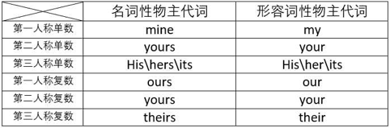
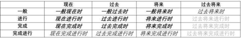

# 语法

目录：
第一部分：基本句子结构
第二部分：词类与基本句子结构之间的关系
第三部分：人称代词与物主代词所有格
第四部分：时态
第五部分：被动语态
第六部分：从句入门

更新日志：
许久没更新，更新一下，从句入门，完善一下排版
修正被动语态中完成时态相关错误，感谢
@是棱不是连结

被动语态更新时态相关修改，应该更加准确。
更正错误，我吃一个苹果，I eat an apple.谢谢无敌的星提醒。
更正错误，我的表列了一个错误，将来完成时谓语动词变换写错了，重新贴一个新的。
更新，时态相关

第一部分：基本句子结构
主谓宾是指英语中的基本句子结构，这是语言学习中最基本的知识。
为啥叫基本呢，因为所有的高级句式全部都要建立在基本句子结构之上。

英语中基本句子结构一共五种：
1.主语+谓语(简称主谓结构)：
I(主语) escape(谓语).我逃脱了。

2.主语+谓语+宾语(简称主谓宾结构)：
I(主语) eat(谓语) an apple(宾语).我吃一个苹果。

3.主语+谓语+间接宾语+直接宾语(简称主谓双宾语结构)：
I(主语) buy(谓语) you(间接宾语) a book(直接宾语).我给你买了本书。
说明：一般来说代词为间接宾语，物品名词为直接宾语。

4.主语+谓语+宾语+宾语补足语(简称主谓宾宾补结构)：
I(主语) named(谓语) the car(宾语) Big boy(宾语补足语).我为这辆车起了个名字，叫Big boy。
说明：宾语补足语，在谓语动词之后，接了宾语但句义依旧不完整，需要再加另外的成分补充说明宾语的意义，这个成分就是宾语补足语。

5.主语+系动词+表语(简称主系表结构)：
I(主语) look(系动词) handsome(表语).我看起来超级帅。
说明：系动词不可单独使用，后面必须跟表语。

英语中所有的句子都是由这五种基本结构构成，例外存在于口语或者祈使句中。

第二部分：词类与基本句子结构之间的关系
对于很多新学英语的人来说，如果不知道（基本的词类）与（单词在句中所做成份）的区别，很可能造成混淆。比如不知道谓语动词到底是什么，是谓语还是动词？不明白为什么有时候名词前面加的是定语，有的时候加的是形容词？同理，谓语前面加的是副词还是状语？这里混淆对于以后的英语学习有很大的不便。

我们都知道，英语单词是分词类的，各个语法学家都有自己的一套理论，我这里说的词性分类是比较好理解的一种
英语中词类分为以下几种：
动词，名词，形容词，副词，冠词，介词，数词，代词，连词，感叹词。
英语中的构成句子的语法成份有以下几种：
主语，谓语，宾语，定语，状语，补足语，表语，同位语。

词类和语法成份是两个概念，但是这两个概念在很多情况下是说的一个单词，举例说明：
I quickly dropped the club in hands.我迅速地丢掉了手中的棒子。
quickly在这里既是状语，同时也是副词。

我们写句子是由基本句型构成，而不同类别的词只能用在不同的句子位置上。

e.g.：I eat an apple.我吃一个苹果。
1.主语
主语是指我们要表达的句子的主角，整个句子都是围绕主语来写的，句子要表达的是 我 吃一个苹果。所以主语往往是人或者物体，而在英语词类中，人或者物体都是名词或者代词，我们可以笼统的说，主语是由名词或者代词担任。

2.谓语
谓语要表达的是主语的动作、状态或者行为，在句中的表达的是我 吃 一个苹果。由于表达的是动作，所以，我们一般说谓语的位置由动词担任。一个句子只有一个谓语，但有可能出现多个动词，也就是说，谓语都是动词，但是动词不一定都是谓语。

3.宾语
宾语是谓语的承受者，换句话说是主语动作的承受者，也就是我吃 一个苹果 。这个承受者可能是人可能是物，所以一般来说，宾语也是由代词和名词担任。

e.g.：I eat a big apple.我吃一个大苹果
4.定语
定语是用来起修饰作用的，可以看到在基本句式结构中见不到定语，状语，他们的存在与否不会对句子的整体结构产生破坏性的影响。定语一般是用来修饰主语和宾语的，比如上面的句子：我吃一个 大 苹果。这个big就是一个修饰词，而这些用来修饰名词或者代词(又说主语或者宾语)的词一般是由形容词担任，所以说定语一般是形容词。

e.g.：I quickly dropped the club in hands.我迅速丢掉了手中的棒子。
5.状语
状语和定语相同，同样是一个修饰作用的语法成份，状语一般是用来形容谓语的状态，比如上面的句子，我 迅速 丢掉了手中的棒子。这里迅速是用来表达我是怎么丢掉这个棒子的。一般来说，状语是由副词担任。

e.g.：I am so handsome.我真帅。
6.表语
表语的位置和宾语基本一致，但是跟宾语有根本上的区别。宾语是指主语动作的承受者，是另外的人或物，但是表语是表达主语的状态样貌工作等状态的成份，在句中帅是用来表达说明我的样貌的，并不是我发出动作的承受者。

7.同位语
同位语，简单的说就是对名词进行解释说明的成份，同位语与其修饰的名词地位相同。同位语可以是词，可以是短语，可以是句子，一般紧跟在它修饰的名词之后。
e.g.
（1）Mr. Smith, our English teacher（同位语）, is very kind to us.
（2）I have to do my best to change the thoughts that our group can not deal with the murderer.（同位语从句）
从上面两个句子可以看出来，同位语和它所要修饰的词语之间是并列的关系，他所充当的语法成分与前面的词是一样的，比如（1）中同位语与Mr. Smith相同，充当主语；（2）中同位语从句充当的成分，就是thoughts在句中充当的宾语

8.补语
一般来说如果构成主语或宾语的词语不够完整，需要加入另外的成份对主语或者宾语进行补充说明，这个成份就是补语。补语和同位语相似，但可以明确在五中基本句型中看到有一种叫做主谓宾宾补的结构，换句话说，就是如果去掉补语，会导致句子的意思不完整。
e.g.
（1）This is my book(补语). 这是我的书。
（2）I find the book hard to understand（补语）. 我发现这本书很难理解。
注：关于定语从句，同位语从句和补语之间的详细区别我会在后文中的从句部分详细说明

第三部分：人称代词与物主代词所有格
这次简单介绍一下关于人称代词和物主代词的问题：
上面说过基本句型结构，里面出现了主语和宾语，人称代词担任主语和宾语时，需要使用不同的代词格。英语中的人称代词是有格的，分为主格和宾格。主格是用在主语位置上人称代词的形式，宾格是用在宾语位置上人称代词的形式。人称代词有我们认识的很简单的I, you, he,还有me, your,our.
这样就可以造句啦：

看，第二人称单复数全长得一个样子~在一般现在时的情况下记得在的三人称单数后的动词结尾加s哦（我也不知道为啥，按照中国老师教育方法，记住就行，固定搭配）~
我爱你\你们：I love you.
他爱你们：He loves you.(一般现在时中第三人称单数后动词结尾加s)
我爱她\他\它：I love him\her\it.
你爱我们：You love us.
我们爱他们：We love them.

下一个问题，物主代词，什么是物主代词呢？物主代词是为了表达物品从属关系的代词，也叫人称代词所有格。通俗点说就是代替物品的代词，比如我的X，他的XX，你的XXX，我们的XXX。
这里有两个分支，第一个叫做名词性物主代词，第二个叫做形容词性物主代词。看名字就能看出来，一个代替形容词的位置，一个代替名词的位置，好，我们复习一下名词放在什么位置呢？主语或者宾语的位置，形容词呢？修饰名词。Okay~又来一个表

名词性物主代词必须是在前面提到过的物品才能代替，而形容词性物主代词理解起来就很容易了，表明的就是“谁的”。看例子：
1.That's not my book. Mine is in the water.这不是我的书，我的书在水里。
2.You shut your mouth. This is my lover! He is mine!你闭嘴！这是我的男人!是我的！
其实两个例子就足够了，想必大家已经会用了，有问题请评论区提问。

第四部分：时态
时态简介（本次篇幅较长，各位请耐心观看）：
这次简单说一下关于时态的事情，对于有些同学来说，时态是挺令人头疼的。
在说之前我要引入几个自己发明的词可以方便大家理解记忆。
1. 时间状态
2. 时间语态
3. 讲述人视角

现在给大家说说，我编这么几个词是什么意思。
1.时间状态：
时间状态我分成了 现在，过去，将来，过去将来 几个状态。比较好理解

2.时间语态：
时间语态我分成了 一般，进行，完成，完成进行 几个语态。

3.讲述人视角：
说话的人与事件发生的相对时间。详细请看时态第二部分，关于不同时态的运用方法。

通过时间状态和时间语态的拼接搭配可以组成英语中的16种时态，具体如下表。

粗体加斜体字的是高中需要掌握的9种时态，只有斜体字的是想熟练掌握英语所需掌握的4种时态，剩下3个基本只需要知道如何变化谓语动词就可以了，平时基本不会使用。我主要介绍前13种时态，后面3种只说动词变化方式。

关于时态，主要有两个重点，第一，谓语动词的变化方式；第二，不同时态的应用方法。

一、谓语动词的变化方式
先放图，这个图是不同时态谓语动词的变化方式。

do代表动词原形，doing代表动词现在分词，done代表动词过去分词，did代表动词过去式，be代表be动词，been代表be动词过去分词。看不懂不要紧，我会在下面一个一个写例句作介绍。
这里我以时间语态（一般，进行，完成，完成进行）作为分类来介绍。

1.一般：
1.1一般现在时：谓语动词为动词原形
e.g.：
(1) I love you. 我爱你
(2) He loves you. 他爱你。
注：在一般现在时的主动状态下，当主语是第三人称单数时谓语动词后要加s\es。

1.2一般过去时：谓语动词为动词过去式
e.g.:I was a doctor. 我曾经是个医生。
对比：
I am a doctor. 我是个医生。上句中将谓语动词am变为了相应的过去式was。

1.3一般将来时：谓语动词为will+动词原形
注：此处可以理解为will是将来时态的标志，只要看到will做助动词（助动词，用来帮助表示时态或语态的动词，本身没意义）就一定是将来的某种时态。
e.g.:
(1) I will go to the supermarket tomorrow. 我明天会去超市。
(2) He will go to the supermarket tomorrow. 他明天会去超市。

1.4过去将来时：谓语动词为would+动词原形
注：would是will的过去式，这个句子可以看做把将来时放到过去说，所以将来时态的标志will应变为相应的过去式would.
e.g.:He was a student; he would be a doctor in two years. 他当时还是个学生，两年后他成为了医生。

2.进行：
2.1现在进行时：谓语动词为相应be动词+动词现在分词形式
注：be动词就是am\is\are,动词现在分词一般是在动词原形的词尾加-ing，现在分词形式是进行时的标志。
e.g.:I am talking. 我正在说话。

2.2过去进行时：谓语动词为相应be动词的过去式+现在分词
注：be动词过去式为was(单)\were(复).
e.g.:I was talking. 我刚才正在说话。

2.3将来进行时：谓语动词为will+ be动词原形+动词现在分词
注：将来时中will后面不论是什么动词都加原形，am\is\are的原形就是be，所以这三个词被称为be动词。
e.g.:I will be doing my homework tomorrow morning. 明天早上的时候我将会在写作业。

2.4过去将来进行时：谓语动词为would+ be + 动词现在分词
e.g.: He was playing computer, he would be doing his homework later. 他刚才正在玩电脑，过一会再写作业。

3.完成：
3.1现在完成时：谓语动词为have+动词过去分词形式
注：此处have没有任何含义，只是单纯地作为助动词使用，可以将助动词have看作完成时\完成进行时的标志，如果动词前出现助动词have\has(第三人称单数）时就可以确定是完成类时态，过去分词形式变化跟过去式相似，也有很多不规则的情况，对于常见规则变化就是在动词词尾加ed。
e.g.:
（1）I have finished my work. 我已经完成了我的工作。
（2）He has finished his work.他已经完成了他的工作。

3.2过去完成时：谓语动词为had+动词过去分词
注：had是have的过去式，可以看做是现在完成时向后倒退一个时态，于是助动词have要变成相应的过去式had.
e.g.:I had finished my work before you sent me that e-mail yesterday.
在你昨天给我发那封电子邮件之前我就已经完成了工作。

3.3将来完成时：谓语动词为will+ have+动词过去分词
注：仔细看了前面的同学应该能推测出来这个谓语动词的变化方式了，将来时态的标志是will，完成时态的标志是have，在will后要跟动词原形，所以have不变，在have后要加完成时态的动词过去分词。
e.g.：I will have finished my work tomorrow. 我明天将会完成我的工作。

3.4过去将来完成时：谓语动词为would + have + 动词过去分词
e.g.: He told me he would have finished his work before yesterday. 他当时告诉我他昨天之前就能完成他的工作。

4.完成进行：
4.1现在完成进行时：谓语动词为have + be动词过去分词 + 动词现在分词
注：have\has做助动词时后面加的不论什么动词都是过去分词形式，而进行时态的标志是动词现在分词形式，而如果要使用动词的现在分词在前面必须有一个be动词。所以组合起来就变成了have + been(be动词过去分词) + 动词现在分词。
e.g.：I have been studying English for 15 years. 我学英语已经有15年了。

4.2过去完成进行时：谓语动词为had + be动词过去分词 + 动词现在分词
e.g.: By the end of last year, I had been studying English for 15 years. 去年年底时，我已经学了15年英语了。

4.3将来完成进行时：谓语动词为will + have + be动词过去分词 + 动词现在分词
e.g.: By the end of next year, I will have been studying English for 15 years. 明年年底时，我将已经学了15年英语了。

4.4.过去将来完成进行时：谓语动词为would + have + be动词过去分词 + 动词现在分词
e.g.: Three years ago, he told me that by the time of last year he would have been studying English for 15 years. 三年前，他告诉我，到去年年底时，他就将学了15年英语了。

标志：
时间状态：
1.将来：助动词will
2.过去将来：助动词would

时间语态：
1.进行：be + doing
2.现在完成类时态：have\has
3.过去完成类时态：had

16种时态的谓语动词变化方式已经说完，如果认真读完的同学会发现，这里的逻辑性非常强，只要记住我说的几个标志基本上就可以推导出所有时态的动词变化方式。各位小伙伴可以参照我的表格自己列一列试试看，然后反过头来对照看看有没有错误，如果能列出来说明你成功啦！

二、不同时态的应用方法和应用环境
只写13个时态，剩下的自己领悟吧，如果你能看懂我前面的例句其实就可以明白到底在那种环境下使用。
在这里需要强调一下有关于讲述人视角的问题，讲述事情发生的人与事情发生时的相对时间构成了不同的时态的运用方式，假如讲述人视角与事情发生的相对时间是相同的，那时态的运用也需要相对改变。
e.g. :
The story began in a dark night two years ago.
"What are you doing down there?" The tall man asked.
"I'm doing nothing, sir." The short man answered.
这里我运用了直接引语来表达我的意思，这个故事发生在两年之前，但是对话时运用的是现在进行时态，对于这两个人来说事情正在进行，但是对于读者来说事情发生在过去。

现在请详细看下面例句

在写谓语动词变化方法时我以时间语态的类别介绍的，这里用时间状态（现在，过去，将来，过去将来）来介绍。

一、现在：

1.一般现在时：很简单，最简单直白的表达方式，讲述人时间状态与事情发生的时间相同，没有正在进行的动作时使用。
e.g.: I study English. 我学英语。

2.现在进行时：事情发生时间与讲述人视角相同，强调动作正在进行。
e.g.: I am studying English. 我正在学英语。

3.现在完成时：事情发生在讲述人视角之前，一直在持续进行，在到达讲述人所处时间时已经完成。
e.g.: I have studied English for 15 years. 我已经学了15年英语。

4.现在完成进行时：事情发生在讲述人视角之前，一直持续进行，到达讲述人后可能继续持续进行下去。
e.g.: I have been studying English for 15 years. 我已经学了15年英语(并且会继续学下去)。

二、过去：
1.一般过去时：事情发生在讲述人时间之前。
e.g.: I read a book. 我刚才读书了。

2.过去进行时：事情发生在讲述人时间之前，强调当时正在进行的事情。
e.g.: I was reading a book. 我刚才正在读书。

3.过去完成时：事情发生在讲述人时间之前，一直持续进行，并在讲述人时间之前完成。
e.g.: Yesterday, he told me he had finished his work. 昨天他告诉我他已经完成了工作。

4.过去完成进行时：事情发生在讲述人时间之前，一直持续进行，持续到讲述人时间之前某个时间并可能会继续下去。
e.g.: He had been studying English for 15 years until the end of last year. 到去年年底，他已经学了15年英语了(并将继续学习下去)。

三、将来：
1. 一般将来时：事情发生在讲述人时间之后，不强调进行。
e.g.: I will read a book tomorrow. 我明天将会读书。

2. 将来进行时：事情发生在讲述人时间之后，强调进行。
e.g.: I will be reading a book tomorrow. 我明天这时候将会在读书。

3. 将来完成时：事情发生在讲述人时间之前或与讲述人处在同一时间状态，在讲述人时间之后会完成。
e.g.: I will have finished this book tomorrow. 我明天就会把这本书读完。

4. 将来完成进行时：事情发生在讲述人时间之前或与讲述人处在相同时间状态，事情持续进行，在讲述人时间之后会继续持续下去。
e.g.: I will have been reading this book for next few days. 以后几天我都会在读这本书。

四、过去将来：
过去将来类时态相对特殊，但也不难理解。

过去将来时：事件发生在讲述人时间之后，但讲述人所处时间状态为过去，不强调进行。
e.g.: He was 66, three years later, he would be 69 years old. 他当时66岁，三年之后他69岁。

第五部分：被动语态
被动语态简单地说就是中文种常见的“被”字句，但是同时态一样，英文中需要通过变化谓语动词来反映句子的主被动情况。
关于被动语态，首先要明白，不同时态下被动语态的变化是不一样的，如果想搞懂被动语态，需要掌握好时态的谓语动词变化方式。
我们还是先以表格的形式看一下，被动语态的谓语动词变化方式。

（请忽略大小写，wps排版问题。。）
估计好多人看起来一脸懵逼，没关系我们从头来讲。
被动语态的最基本特征就是be动词加动词的过去分词形式，与不同时态拼接搭配就可以产生16种不同时态的被动语态。
首先说明，从语法结构上来说被动语态同时态一样有16种，但是呢，实际运用起来进行时态与完成进行时态下的被动语态的运用环境极其稀少。
从语法结构上来分析一下。大家注意，如果对废话不感兴趣，请看第一部分和第三部分，二四部分基本可以直接忽略。

一.一般时态下的被动语态（包括一般现在时，一般过去时，一般将来时，过去将来时）
1.一般现在时的被动语态：
e.g. The window is(be) broken(done).窗户被打破了。

2.一般过去时的被动语态：
e.g.
（1）The window was(be) broken(done) ten days ago. 窗户十天前被打破了。
（2）Sometime ago, an interesting discovery was(be) made(done) by archeaologist on the Aegean island of Kea. 不久之前，在爱琴海的基亚岛上，考古工作者有一项有趣的发现。（摘自新概念英语第三册第三课）

3.一般将来时的被动语态：
e.g. The window will be(be) broken(done). 窗户将会被打破。

4.过去将来时的被动语态：
e.g. The window would be(be) broken(done). 窗户将会被打破。

二.进行时态下的被动语态（包括现在进行时，过去进行时，将来进行时，过去将来进行时）
此处需注意，进行时态下很少使用被动语态，比如说你被人揍了，没有任何的语言环境会产生“我正在被揍”这种语句。

5.现在进行时的被动语态：
e.g. The window is being(be) broken(done). 窗户正在被打破。
此处需注意，is是为了表示时态的助动词，being是被动语态的助动词，真正的动词是broken.

6.过去进行时的被动语态：
e.g. The window was being(be) broken(done). 窗户当时正在被打破。

7.将来进行时的被动语态：
e.g. The window will be being(be) broken(done). 窗户将正在被打破。
大家可以看到这句话的中文是没有意义的，对于英语中也是，很少有什么环境会用到将来进行时的被动语态。

8.过去将来进行时的被动语态：
e.g. The window would be being(be) broken(done). 窗户将正在被打破。
同上，没见过

三.完成时态下的被动语态（包括现在完成时，过去完成时，将来完成时，过去将来完成时）
9.现在完成时的被动语态：
e.g. The window has been(be) broken(done). 窗户已经被打破了。

10.过去完成时的被动语态：
e.g. The window had been(be) broken(done). 窗户已经被打破了。

11.将来完成时的被动语态：
e.g. The window will have been(be) broken(done). 窗户将会被打破。

12.过去将来完成时的被动语态：
e.g. The window would have been(be) broken(done). 窗户将会被打破。

四.完成进行时的被动语态（包括现在完成进行时，过去完成进行时，将来完成进行时，过去将来完成进行时）
同进行时态的被动语态一样，几乎不会使用。在一般情况下造出来的句子甚至狗屁不通
13.现在完成进行时的被动语态
e.g. The window has been being broken. 窗户将会一直被打破。（呵呵）

14.过去完成进行时的被动语态
e.g. The window had been being broken. 窗户将会被一直打破。

15.将来完成进行时的被动语态
e.g. The window will have been being broken. 窗户将会被一直打破。

16.过去将来完成进行时的被动语态
e.g. The window would have been being broken. 窗户将会被一直打破。

第六部分：从句入门
提到从句，我们就需要掌握到第一二部分的内容，从句就是代替某个单词或者词组直接充当句子成分的句子，看起来很难以理解，但其实就是句子套句子，既然是用句子充当语法成分，那么从从句也要符合基本句子结构。
从句多种多样，基本上所有的语法成分都可以用从句代替，基本上不代表全部，没有谓语从句和补语从句。有主语从句，宾语从句，状语从句，定于从句，表语从句，同位语从句。
在这个入门部分，我会简单的列出每个从句的例句，然后分章详细介绍。
在开始写之前，首先介绍几个概念，简单句与复合句。在第一部分为了从简介绍，我写的句子全部都是简单句，也就是句子中只有一个主谓结构，并且全部成分都由单词或者词组担任，而那些看起来很长很高大上的句子一般都是复合句，就是含有两个或更多主谓结构的句子，其中有一个主谓结构充当整个句子的成分。单纯看概念可能很难理解这都是什么鬼，我们来看例子。
e.g.
(1) He（主） had at last been allowed（谓） to send a fax（宾）. In the fax, he（主） informed（谓） the editor（宾） one thing（宾）. At that time， he（主） was counting（谓） the 1084 steps（宾） to the president's palace, and the palace（主） was surrounded（谓） by fifteen-foot wall（宾）. He（主） was arrested（谓）.
(2) He had at last been allowed to send a fax in which he informed the editor（定从） that he has been arrested（宾从） while counting the 1084 steps leading to the fifteen-foot wall（状从） which surrounded the president's palace（定从）. 他终于获准发回了一份传真。在传真中他告诉编辑，就在他数通向15英尺高的总统府围墙的 1，084级台阶时，被抓了起来。（摘自新概念第三册第五课）
第一个句子和第二个句子表达的内容是一样的，但是看起来是不是第二个句子感觉十分666啊，因为第一个句子全部都是短句，用标点符号断句，所以相对简单，第二个句子使用的是循环套用的从句结构，看起来很长很高级。在英文里，可以通过这种循环套用的方法写出无限长的句子。
好了，不要纠结这两个句子了，当你学会使用从句，这种句子写出来的难度不大。

从句也是句子，只要是句子就必须符合五种基本句子结构。
主语从句：
e.g.: What you think(主从) is(系) not true(表). 你想的不对。
整个句子是主系表结构，主语从句是主谓宾结构，you是主语，think是谓语，what是宾语

宾语从句
e.g.: They（主） said（谓） that（引导词） you have pushed my car into that lake（宾从）. 他们说你把我的车推到那个湖里了。
注意，为了区别主句从句，往往在引导从句的时候前面加一个引导词，宾语从句一般使用that引导。整个句子是主谓宾结构，宾语从句是主谓宾宾补结构，you为主语，have pushed为谓语动词，my car是宾语从句中的宾语, into that lake是补语

定语从句：
e.g.: She comes from Qingdao, which is my hometown（定从）. 她来自青岛，我的家乡。
由于定语是用来修饰名次的，它修饰的名词叫做先行词，定语从句的引导词叫做关系词，在定语从句中先行词在定语从句中充当成分，由关系词替代。整个句子是主谓宾结构,从句是主系表结构，定语修饰Qingdao，所以先行词是Qingdao, 关系词是which，在从句中，which替代先行词在从句中充当主语，从句的主语就是青岛，系动词is, 表语my hometown.

状语从句：
状语从句有很多很多种，时间、地点、原因、条件、目的、结果、让步、方式和比较，这些每种都可以写成从句，举一个时间状语的例子。
e.g.:He was in the shower when the door bell rang（状从）. 他在洗澡时门铃响了。
整个句子是主谓结构，从句是主谓结构，when 是时间引导词，the door bell是主语，rang是谓语。

表语从句：
The question is that we have no money（表从）.问题是我们没钱。
整个句子是主系表结构，从句是主谓宾结构，主语we, 谓语have, 宾语no money.

同位语从句：
The fact that we have to go before the girl come out（同从） is really sad. 我们只能在那个女孩出来之前离开的这个事实很令人悲伤。
整个句子是主系表结构，从句是主谓结构，主语是we，谓语是have to go, before the girl come out是状语。
