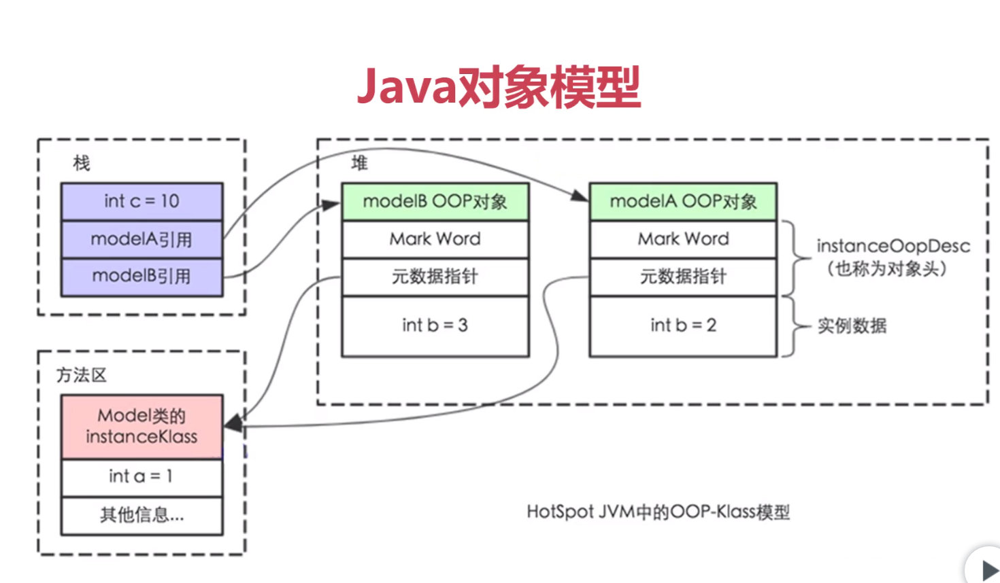
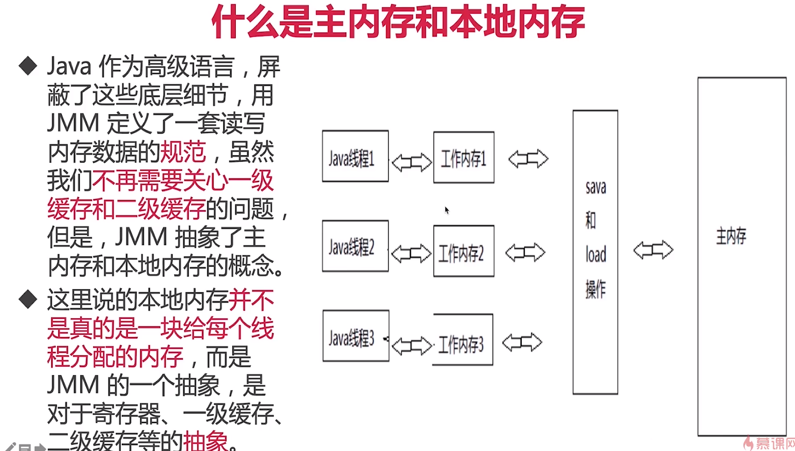

# 从Java代码到CPU指令的变化过程？

我们在Java代码中，使用的控制并发的手段例如synchronized关键字，最终也是要转化为CPU指令来生效的，我们来回顾一下从Java代码到最终执行的CPU指令的流程：

最开始，我们编写的Java代码，是*.java文件
在编译（javac命令）后，从刚才的*.java文件会变出一个新的Java字节码文件（*.class）
JVM会执行刚才生成的字节码文件（*.class），并把字节码文件转化为机器指令
机器指令可以直接在CPU上执运行，也就是最终的程序执行
而不同的JVM实现会带来不同的“翻译”，不同的CPU平台的机器指令又千差万别；所以我们在java代码层写的各种Lock，其实最后依赖的是JVM的具体实现（不同版本会有不同实现）和CPU的指令，才能帮我们达到线程安全的效果。
由于最终效果依赖处理器，不同处理器结果不一样，这样无法保证并发安全，所以需要一个标准，让多线程运行的结果可预期，这个标准就是JMM。

#JVM、JMM、  

jvm内存结构
java内存模型
java对象模型

容易混淆：三个截然不同的概念，但是很多人容易弄混

jvm内存结构，和java虚拟机的运行时区域有关。
java内存模型，和java的并发编程有关。
java对象模型，和java对象在虚拟机中的表现形式有关。




# java对象模型

java对象自身的存储模型
jvm会给这个类创建一个instanceKlass，保存在方法区，用来在jvm层表示该java类。
当我们在java代码中，使用new创建一个对象的时候，jvm会创建一个instanceOopDesc对象，这个对象中包含了对象头以及实例数据。

JMM是规范（Java Memory Model）
是一组规范，需要各个JVM的实现来准守JMM规范，以便于开发者可以利用这些规范，更方便地开发多线程程序。
如果没有这样的一个JMM内存模型来规范，那么很可能经过了不同jvm的不同规则的重排序之后，导致不同的虚拟机上运行的结果不一样，那是很大的问题。
最重要的3点内容：重排序、可见性、原子性

为什么需要JMM
c语言不存在内存模型的概念，依赖处理器，不同处理器结果不一样，无法保证并发安全。
需要一个标准，让多线程运行的结果可预期

(顶层java开发者：应用层开发者)

jmm是工具类和关键字的原理
volatile、synchronized、Lock等的原理都是jmm
如果没有jmm，那就需要我们自己指定什么时候用内存栅栏等，那是相当麻烦的，幸好有了jmm，让我们只需要用同步工具和关键字就可以开发并发程序。

# Java内存模型——底层原理

重排序
重排序的代码案例、什么是重排序
重排序的好处：提高处理速度
重排序的3种情况：编译器优化、cpu指令重排、内存的“重排序”

重排序分析：

```java
public class OutOfOrderExecution {

    private volatile static int x = 0, y = 0;
    private volatile static int a = 0, b = 0;

    public static void main(String[] args) throws InterruptedException {
        int i = 0;
        for (; ; ) {
            i++;
            x = 0;
            y = 0;
            a = 0;
            b = 0;

            CountDownLatch latch = new CountDownLatch(1);

            Thread one = new Thread(new Runnable() {
                @Override
                public void run() {
                    try {
                        latch.await();
                    } catch (InterruptedException e) {
                        e.printStackTrace();
                    }
                    a = 1;
                    x = b;
                }
            });
            Thread two = new Thread(new Runnable() {
                @Override
                public void run() {
                    try {
                        latch.await();
                    } catch (InterruptedException e) {
                        e.printStackTrace();
                    }
                    b = 1;
                    y = a;
                }
            });
            two.start();
            one.start();
            latch.countDown();
            one.join();
            two.join();

            String result = "第" + i + "次（" + x + "," + y + ")";
            if (x == 0 && y == 0) {
                System.out.println(result);
                break;
            } else {
                System.out.println(result);
            }
        }
    }
}
```

这4行代码的执行顺序决定了最终x和y的结果，一共有3种情况：
1. a=1;x=b(0);b=1;y=a(1)，最终结果是x=0,y=1
2. b=1;x=a(0);a=1;y=b(1)，最终结果是x=1,y=0
3. a=1;b=1;x=b(1);y=a(1)，最终结果是x=1,y=1
4. 会出现x=0,y=0的情况：
1）y=a;a=1;x=b;b=1;

什么是重排序：在线程1内部的两行代码的实际执行顺序和代码在Java文件中的顺序不一致，代码指令并不是严格按照代码语句顺序执行的，它们的顺序被改变了，这就是重排序，这里被颠倒的是y=a和b=1这两行语句。

重排序的好处：提高处理速度
对比重排序前后的指令优化：
a=3;
b=2;
a=a+1;

Instructions
Load a
Set to 3
Store a

Load b
Set to 2
Store b

Load a
Set to 4
Store a

假设重排序之后：
a=3;
a=a+1;
b=2;

Instructions
Load a
Set to 3
Set to 4
Store a

Load b
Set to 2
Store b

重排序明显提高了性能


重排序的3种情况
编译器优化：包括JVM，JIT编译器等
CPU指令重排：就算编译器不发生重排，CPU也可能对指令进行重排
内存的“重排序”：线程A的修改线程B却看不到，引出可见性问题

重排序有哪3种可能性？
重排序的3种情况分别是什么？
解答：

编译器优化
编译器（包括JVM，JIT编译器等）出于优化的目的（例如当前有了数据a，那么如果把对a的操作放到一起效率会更高，避免了读取b后又返回来重新读取a的时间开销），在编译的过程中会进行一定程度的重排，导致生成的机器指令和之前的字节码的顺序不一致。
在刚才的例子中，编译器将y=a和b=1这两行语句换了顺序（也可能是线程2的两行换了顺序，同理），因为它们之间没有数据依赖关系，那就不难得到 x =0，y = 0 这种结果了。
指令重排序
CPU 的优化行为，和编译器优化很类似，是通过乱序执行的技术，来提高执行效率。所以就算编译器不发生重排，CPU 也可能对指令进行重排，所以我们开发中，一定要考虑到重排序带来的后果。
内存的“重排序”
内存系统内不存在重排序，但是内存会带来看上去和重排序一样的效果，所以这里的“重排序”打了双引号。由于内存有缓存的存在，在JMM里表现为主存和本地内存，由于主存和本地内存的不一致，会使得程序表现出乱序的行为。
在刚才的例子中，假设没编译器重排和指令重排，但是如果发生了内存缓存不一致，也可能导致同样的情况：线程1 修改了 a 的值，但是修改后并没有写回主存，所以线程2是看不到刚才线程1对a的修改的，所以线程2看到a还是等于0。同理，线程2对b的赋值操作也可能由于没及时写回主存，导致线程1看不到刚才线程2的修改。


为什么会有可见性问题？
cpu有多级缓存，导致读的数据过期

高速缓存的容量比主内存小，但是速度仅次于寄存器，所以在cpu和主内存之间就多了Cache层。
线程间的对于共享变量的可见性问题不是直接由多核引起的，而是由多缓存引起的。

如果所有核心都只用一个缓存，那么也就不存在内存可见性问题了。
每个核心都会将自己需要的数据读到独占缓存中，数据修改后也是写入到缓存中，然后等待刷入到主存中。所以会导致有些核心读取的值是一个过期的值。

什么是主内存和本地内存
Java作为高级语言，屏蔽了这些底层细节，用jmm定义了一套读写内存数据的规范，虽然我们不再需要关心一级缓存和二级缓存的问题，但是，jmm抽象了主内存和本地内存的概念。





什么是JMM里面的主内存和本地内存？
Java 作为高级语言，屏蔽了CPU多层缓存这些底层细节，用 JMM 定义了一套读写内存数据的规范，虽然我们不再需要关心一级缓存和二级缓存的问题，但是，
JMM 抽象了主内存和本地内存的概念。
这里说的本地内存并不是真的是一块给每个线程分配的内存，而是 JMM 的一个抽象，是对于寄存器、一级缓存、二级缓存等的抽象。

主内存和本地内存的图示：


主内存和本地内存的关系是什么？
JMM有以下规定:

所有的变量都存储在主内存中，同时每个线程也有自己独立的工作内存，工作内存中的变量内容是主内存中的拷贝
线程不能直接读写主内存中的变量,而是只能操作自己工作内存中的变量，然后再同步到主内存中
主内存是多个线程共享的，但线程间不共享工作内存,如果线程间需要通信，必须借助主内存中转来完成
所有的共享变量存在于主内存中，每个线程有自己的本地内存，而且线程读写共享数据也是通过本地内存交换的，所以才导致了可见性问题。