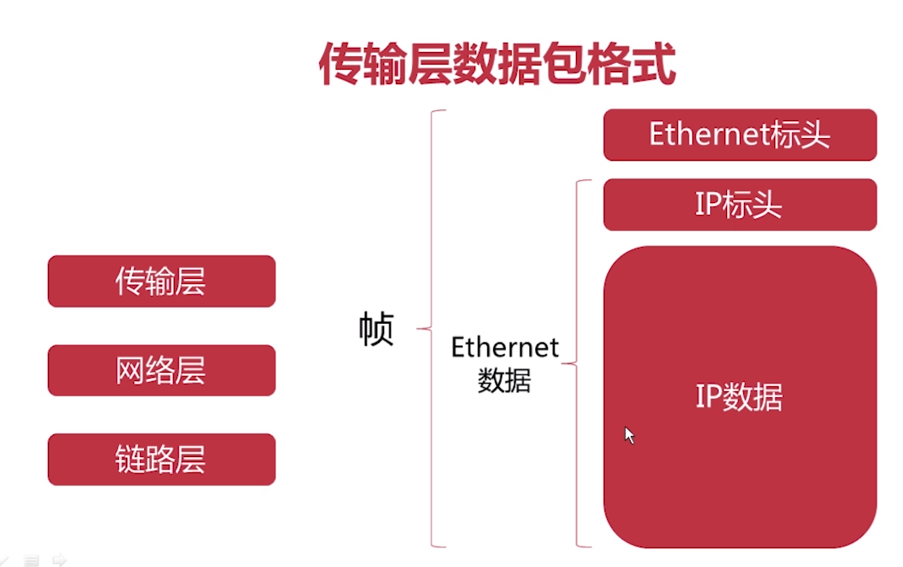
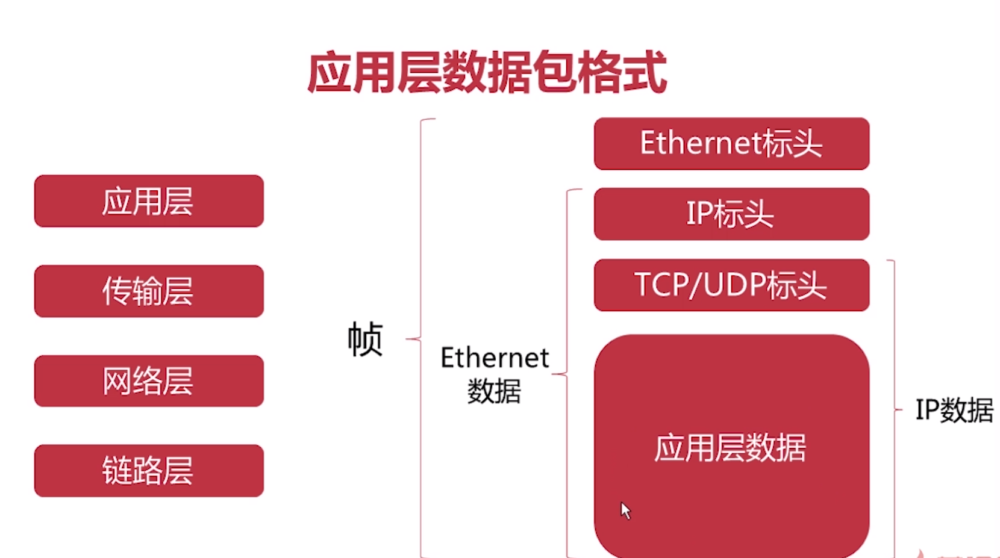

# dns解析
www.google.com dns解析 ip地址

域名的解析
www.google.com.root 从右向左解析
.root 根域名（都是root，省略）
.com/.edu/.org 顶级域名
.google/.baidu/.youtube 次级域名
www 主机名

# 网络协议

应用层：用户的应用（HTTP、FTP、SMTP）
传输层：端口到端口的链接（TCP、UDP）
网络层：主机到主机（IP）
链路层：网卡与网卡（Ethernet）【MAC地址】
实体层：光缆、wifi、网线（电信号）【物理连接】

一帧最大1518byte

