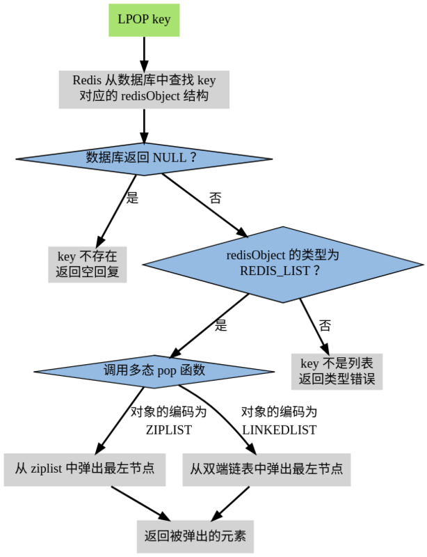

[TOC]

# redis 关键字
高性能Key-Value服务器、多种数据结构、ops官方说可以达到10w、阿里云Redis开发规范、完全内存
# 数据结构与内部编码



# redisObject
```c
struct redisObject
{
    数据类型（type）[string,hash,list,set,sorted set];
    编码方式（encoding）[raw,int,ziplist,linkedlist,hashmap,intset];
    数据指针（ptr）;
    虚拟内存（vm）;
    其他信息;
};
```
# 单线程为什么这么快？
1. 纯内存
2. 非阻塞IO
3. 避免了线程切换和竞态消耗

# 速度快根本原因
|  类型  | 每秒读写次数 | 随机读写延迟 | 访问宽带 |
| ------ | ------------ | ------------ | -------- |
| Memory | 千万         | 80ns         | 5GB      |
| SSD    | 35000        | 0.1-0.2ms    | 100-300M |
| HDD    | 100左右      | 10ms         | 100M左右     |
# 使用单线程要注意：
1. 一次只运行一条命令
2. 拒绝长（慢）命令：keys,flushall,flushdb,slow lua script,mutil/exec,operate big value(collection)
3. 其实不是单线程:fysnc file descriptor,close file descriptor
# redis应用场景
+ 缓存系统
+ 计数器
+ 消息队列系统
+ 排行榜
+ 社交网络
+ 实时系统
+ 分布式锁
# redis启动
## 最简启动（动态参数启动）
redis-server [--port port]
ps -ef|grep redis
netstat -antpl|grep redis
redis-cli -h ip -p port ping
## 配置文件启动
redis-server configPath
# redis常用配置
daemonize是否是守护线程no|yes
port对外端口（默认6379）
logfile系统日志
dir工作目录
# redis commond
+ redis-server
+ redis-cli -h host -p port -a password
+ redis-benchmark
+ redis-check-aof
+ redis-check-dump
+ redis-sentinel
+ config get * #获取当前redis全部配置
+ ping
+ dbsize #计算key的总数，不会遍历全部key，是读取redis内置计数器【时间复杂度O(1)】
# key
## 概览
## commond
|  命令   |        语法        |         简介          | 复杂度 |                                                                                    备注                                                                                    |
| ------- | ------------------ | --------------------- | ------ | -------------------------------------------------------------------------------------------------------------------------------------------------------------------------- |
| keys    | keys [pattern]     | 验证key是否存在       | O(n)   | keys命令一般不在生产环境使用<br>一般生产环境key比较多，keys是一个比较重的命令，速度慢<br>redis是单线程，所以可能会阻塞其他命令<br>用scan命令代替较好，或者在热备从节点执行 |
| exists  | exists             | 验证key是否存在       | O(1)   |                                                                                                                                                                            |
| del     | del [key ...]      | 删除key               | O(1)   |                                                                                                                                                                            |
| expire  | expire key seconds | expire key seconds    | O(1)   |                                                                                                                                                                            |
| ttl     | ttl key            | 查看key剩余的过期时间 | O(1)   | (integer)-1 key存在，并且没有过期时间<br>                                                                                                                       (integer)-2 已过期                                                                                    |
| persist | persist            | 去掉key的过期时间     | O(1)   |                                                                                                                                                                            |
| type    | type key           | 返回key的类型         | O(1)   | string、hash、list、set、zset、none                                                                                                                                        |
# string
## 概览
## commond
|    命令     |                   语法                   |                    简介                    | 复杂度 |                               备注                                |
| ----------- | ---------------------------------------- | ------------------------------------------ | ------ | ----------------------------------------------------------------- |
| get         | get key                                  | 通过key获取值                              | O(1)   |                                                                   |
| set         | set key value                            | 设置key的值,不管key是否存在，都设置        | O(1)   |                                                                   |
| del         | del [key ...]                            | 删除key                                    | O(1)   |                                                                   |
| incr        | incr key                                 | key自增1，如果key不存在，自增后get(key)=1  | O(1)   |                                                                   |
| decr        | decr key                                 | key自减1，如果key不存在，自减后get(key)=-1 | O(1)   |                                                                   |
| incrby      | incrby key k                             | key自增k，如果key不存在，自增后get(key)=k  | O(1)   | 实战：分布式系统主键自增，单线程原子操作计数器                    |
| decrby      | decrby key k                             | key自减k，如果key不存在，自减后get(key)=-k | O(1)   |                                                                   |
| setnx       | setnx key value                          | key不存在，才设置                          | O(1)   |                                                                   |
| setxx       | set key value                            | key存在，才设置                            | O(1)   |                                                                   |
| mget        | mget key1 key2 key3...                   | 批量获取key,原子操作                       | O(1)   | n次get=n次网路时间+n次命令时间<br>1次mget=1次网路时间+n次命令时间 |
| mset        | mset key1 value1 key2 value2 key3 value3 | 批量设置key-value                          | O(1)   | 同上                                                              |
| getset      | getset key newvalue                      | set key newvalue并返回value                | O(1)   |                                                                   |
| append      | append key value                         | 将value追加到旧的value                     | O(1)   |                                                                   |
| strlen      | strlen key                               | 返回字符串的长度（注意中文）               | O(1)   |                                                                   |
| incrbyfloat | incrbyfloat key 3.5                      | 增加key对应的值3.5                         | O(1)   |                                                                   |
| getrange    | getrange key start end                   | 获取字符串指定下标所有的值                 | O(1)   |                                                                   |
| setrange    | setrange key index value                 | 设置指定下标所有对应的值                   | O(1)   |                                                                   |
# hash
## 概览
哈希键值结构：key->[field,value]
特点
map的map
small的redis
field不能相同，value可以相同
hash分为两种：hashtable、ziplist，如果量达到一定就会使用ziplist压缩节省内存
hash缺点：不能对key设置过期时间
## commond
|     命令     |                  语法                   |                  简介                  | 复杂度 |                                  备注                                  |
| ------------ | --------------------------------------- | -------------------------------------- | ------ | ---------------------------------------------------------------------- |
| hget         | hget key field                          | 获取hash key对应的的field的value       | O(n)   | 小心使用hgetall，其复杂度为O(n)，redis为单线程，如果数据量大会造成阻塞 |
| hset         | hset key field value                    |                                        | O(1)   |                                                                        |
| hdel         | hdel key field                          |                                        | O(1)   |                                                                        |
| hexists      | hexists key                             |                                        | O(1)   |                                                                        |
| hlen         | hlen key                                | 获取hash key field的数量               | O(1)   | 读计数器                                                               |
| hmget        | hmget key field1 field2...fieldN        |                                        | O(1)   |                                                                        |
| hmset        | hmset key field1 value1...fieldN valueN |                                        | O(1)   |                                                                        |
| hincrby      | hincrby key field count                 |                                        | O(1)   |                                                                        |
| hgetall      | hgetall key                             | 返回hash key对应所有的field**和**value | O(n)   |                                                                        |
| hvals        | hvals key                               | 返回hash key对应所有field**的**value   | O(n)   |                                                                        |
| hkeys        | hkeys key                               | 返回hash key对应所有field              | O(n)   |                                                                        |
| hsetnx       |                                         |                                        | O(1)   |                                                                        |
| hincrby      |                                         |                                        | O(1)   |                                                                        |
| hincrbyfloat |                                         |                                        | O(1)   |                                                                        |


注意：


实战
记录网站每个用户个人主页的访问量？
hincrby user:1:info pageview count
缓存视频的基本信息（数据源在mysql中）伪代码


String VS Hash
api相似


