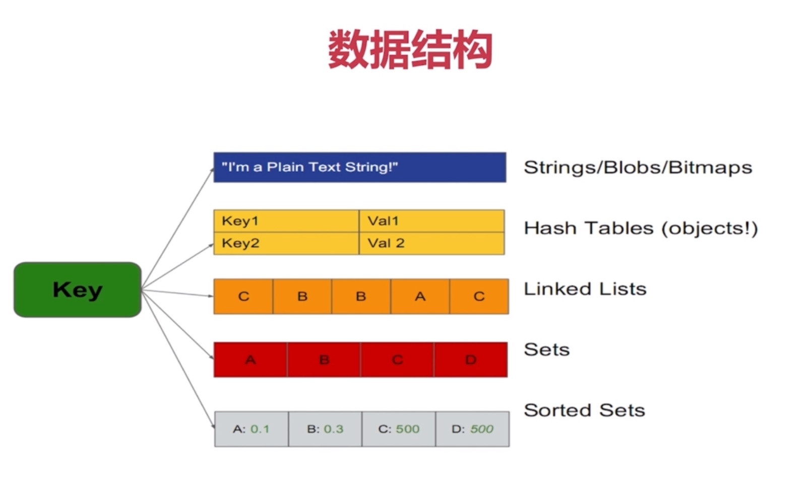
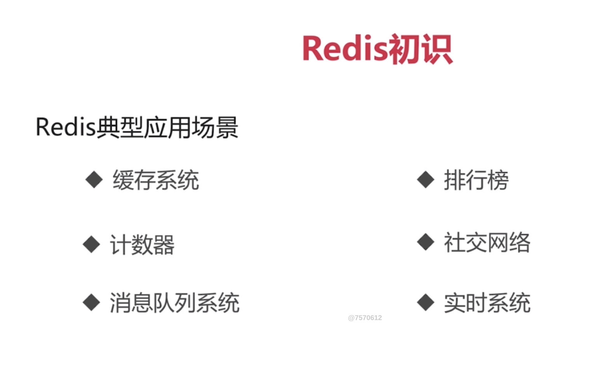
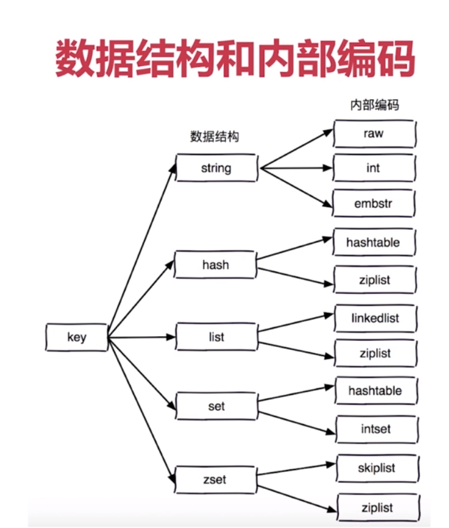
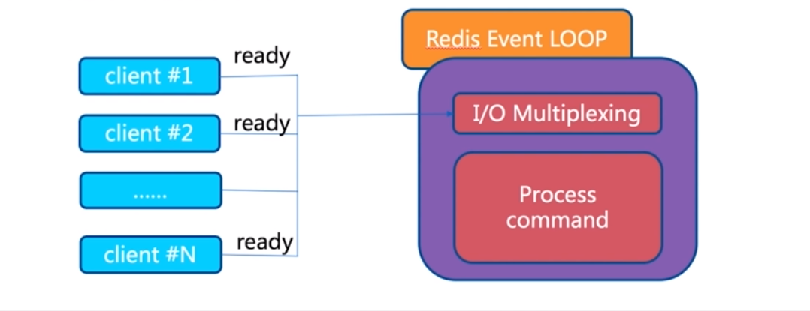
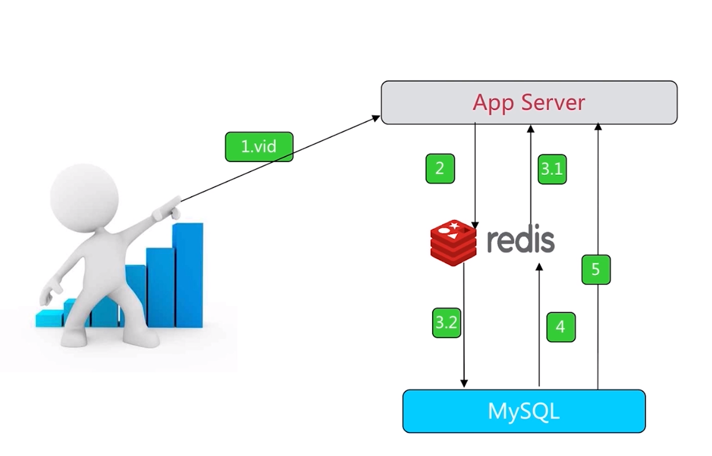
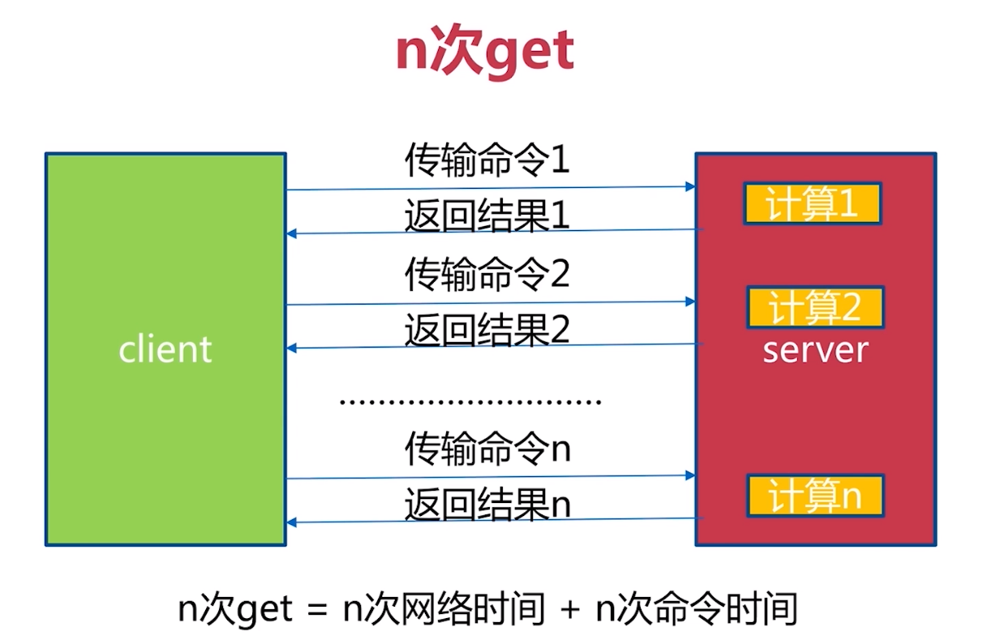
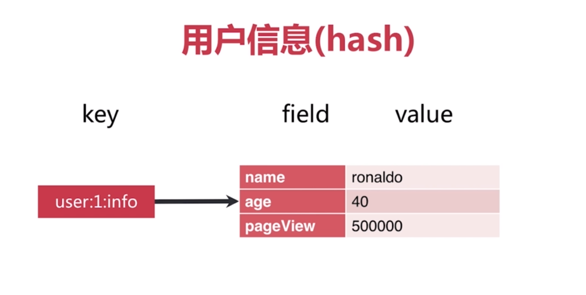

高性能Key-Value服务器
多种数据结构

redis ops 可以达到10w

阿里云Redis开发规范






reids可执行文件说明
redis-server
redis-cli
redis-benchmark
redis-check-aof
redis-check-dump
redis-sentinel

启动方式：
最简启动
redis-server
ps -ef|grep redis
netstat -antpl|grep redis
redis-cli -h ip -p port ping
动态参数启动reids
redis-server --port 6380
配置文件启动
redis-server configPath

redis常用配置
daemonize是否是守护线程no|yes
port6379对外端口
logfile系统日志
dir工作目录

config get *

get
set
ping
del
exit

cat redis.conf|grep -v "#"|grep -v "^$"
ps -ef | grep redis-server | grep 6382

# 通用命令和数据结构
redis是hashtable

keys [pattern]
```
set hello world
set php good
keys *

keys 命令一般不在生产环境使用
时间复杂度O(n)
一般生产环境key比较多，keys是一个比较重的命令，速度慢，redis是单线程，所以可能会阻塞其他命令
用scan命令代替较好，或者在热备从节点执行
```
dbsize
dbsize不会遍历全部key，是读取redis内置计数器
```
时间复杂度O(1)
计算key的总数
```
exists key
```
O(1)
set a b
exists a -> (integer)1
del a -> (integer)1
exists a -> (integer)0
```
del key [key ...]
expire key seconds 设置key过期时间
ttl key 查看key剩余的过期时间
```
set hello world
ttl hello -> (integer)-1 【-1代表key存在，并且没有过期时间】
expire hello 10
ttl hello -> (integer)7
ttl hello -> (integer)-2 已过期
```
persist key 去掉key的过期时间
```
persist hello
```
type key
```
string
hash
list
set
zset
none
```

时间复杂度

| 命令    |   时间复杂度  |
| --- | --- |
|   keys  |     O(n)|
|   dbsize  |  O(1)   |
|    del |    O(1)    |
|   exists  |    O(1)    |
|   expire  |    O(1)    |
|    type |    O(1)    |





# 单线程为什么这么快？
1. 纯内存
2. 非阻塞IO
3. 避免了线程切换和竞态消耗



使用单线程要注意：
1. 一次只运行一条命令
2. 拒绝长（慢）命令：keys,flushall,flushdb,slow lua script,mutil/exec,operate big value(collection)
3. 其实不是单线程:fysnc file descriptor,close file descriptor


# 字符串
get
set
del

```
set hello world
get hello
del hello
```

incr
decr
incrby
decrby

```
incr key key自增1，如果key不存在，自增后get(key)=1
decr key key自减1，如果key不存在，自减后get(key)=-1
incrby key k key自增k，如果key不存在，自增后get(key)=k
decrby key k key自减k，如果key不存在，自减后get(key)=-k
```

实例
incr userid:pageview （单线程：无竞争）页面访问量

实战


分布式id生成器：


set setnx setxx
set key value #不管key是否存在，都设置
setnx key value #key不存在，才设置
set key value xx #key存在，才设置

mget mset
mget key1 key2 key3... #批量获取key,原子操作
mset key1 value1 key2 value2 key3 value3 #批量设置key-value



getset key newvalue #set key newvalue并返回value
append key value #将value追加到旧的value
strlen key #返回字符串的长度（注意中文）

incrbyfloat #incrbyfloat key 3.5增加key对应的值3.5
getrange key start end #获取字符串指定下标所有的值
setrange key index value #设置指定下标所有对应的值

# hash 哈希
哈希键值结构
key->[field,value]


特点
map的map
small的redis
field不能相同，value可以相同

重要api

hget #het key field 获取hash key对应的的field的value
hset #hset key field value
hdel #hdel key field
hexists #
hlen #hlen key 获取hash key field的数量 O(1)
hmget #hmget key field1 field2...fieldN
hmset #hmset key field1 value1...fieldN valueN
hincrby key field count
hgetall key #返回hash key对应所有的field**和**value O(n)
hvals key #返回hash key对应所有field**的**value O(n)
hkeys key #返回hash key对应所有field O(n)
hsetnx
hincrby
hincrbyfloat

注意：
小心使用hgetall，其复杂度为O(n)，redis为单线程，如果数据量大会造成阻塞

实战
记录网站每个用户个人主页的访问量？
hincrby user:1:info pageview count
缓存视频的基本信息（数据源在mysql中）伪代码


String VS Hash
api相似





hash分为两种：hashtable、ziplist，如果量达到一定就会使用ziplist压缩节省内存

hash缺点：不能对key设置过期时间