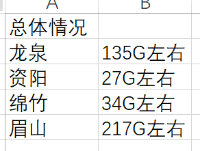

[toc]

# 概览
1. 主要分为两个模块
+ 配置（医疗数据质量核查及分析系统）
+ 运行（python脚本）

2. 难点
+ 要根据现场的条件做各种调整
+ 负载均衡
+ 核查结果分析

# 配置（java部分）
划分为【任务】与【规则】两个模块
## 核查任务
类型
+ 全量
+ 增量
+ ETL（import表）
+ 前置机（抽样，目前工作重心）


## 规则
+ 绝对值规则（字段类型）
+ 主子关系规则（字段类型）
+ 非空规则（字段类型）
+ 枚举值规则（字段类型）
+ 源目规则（sql类型）
+ 行数规则

###  非空规则
评分规则：
score = (1-问题条数/总条数)*100
```sql
select count(0) as total,
       sum(case when 字段1 is not null and 字段1 != '' then 1 end) as detection
       ......
from 目标表 where 业务时间 and 医联体
```

### 主子关系规则
评分规则：
score = 能关联到主表的子表数据量 / 子表数据量 * 100
```sql
select count(子表.id) as total, -- 子表数据总量
       count(主表.id) as match -- 满足规则的数据量
from 子表
left join 主表
on 数据来源 and 医联体 and id
where 子表时间区间 between '{0}' and '{1}'
```

### 绝对值规则
评分规则：
score = 符合标准数据条数/总条数*100
```sql
select sum(case when 目标字段 is not null and 目标字段 != '' then 1 end) as detection
       sum(cast (目标字段 as double) >= 值1 and cast(目标字段as double) <= 值2) as satisfied -- 符合标准
from 目标表 where 业务时间 and 医联体
```

# 调度（python部分）
## 工具类
+ application.properties 配置信息
+ common.py 工具类，读写properties之类
+ db_helper.py 封装数据库操作
+ logger_helper.py 日志操作
+ sql_constant.py sql语句常量
+ create_job 创建任务
## 规则
+ abs_rule.py 绝对值规则
+ main_detail_rule.py 主子关系规则
+ non_empty_rule.py 非空规则
+ row_count_rule.py 行数规则
+ source_target_rule.py 源目规则
+ enum_rule.py 枚举值规则


