[TOC]

# 递归
+ 本质上，将原来的问题，转化为更小的同一问题

# 举例
数组求和
Sum(arr[0...n-1])=arr[0]+Sum(arr[1...n-1])
前一个sum中要对n个元素求和，后一个sum中要对n-1个元素求和

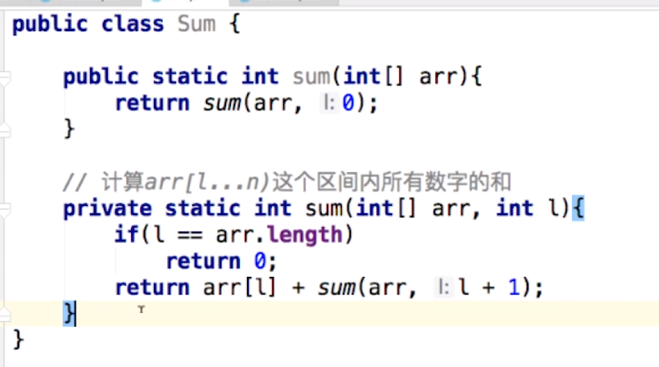

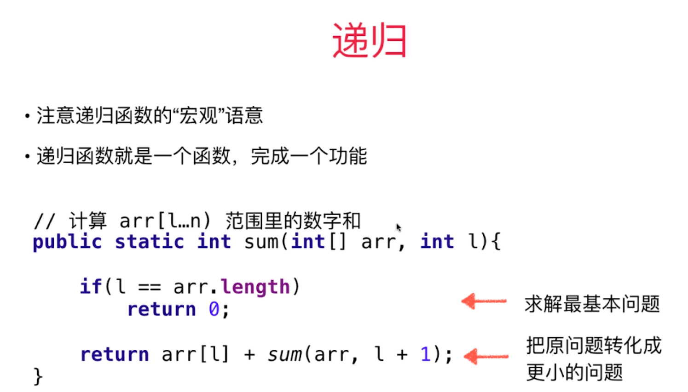

# 链表与递归

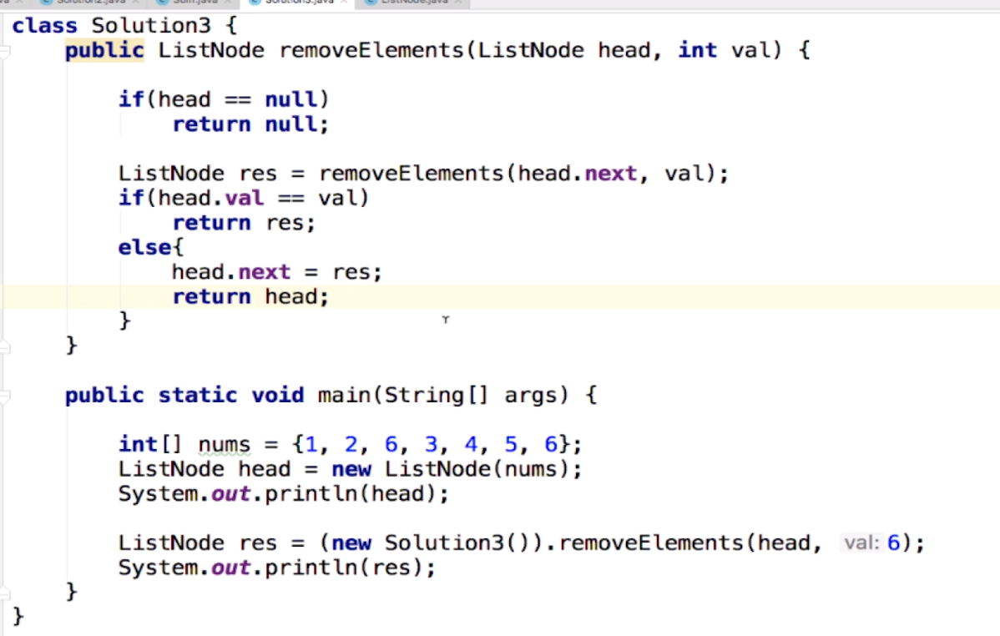
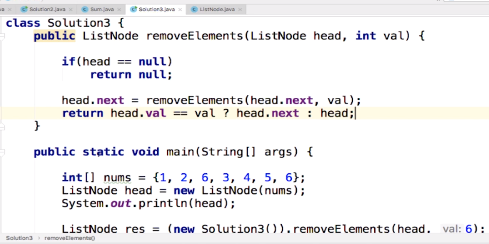

虚拟头结点方法
递归方法

递归宏观语义
# 递归函数的“微观”解读
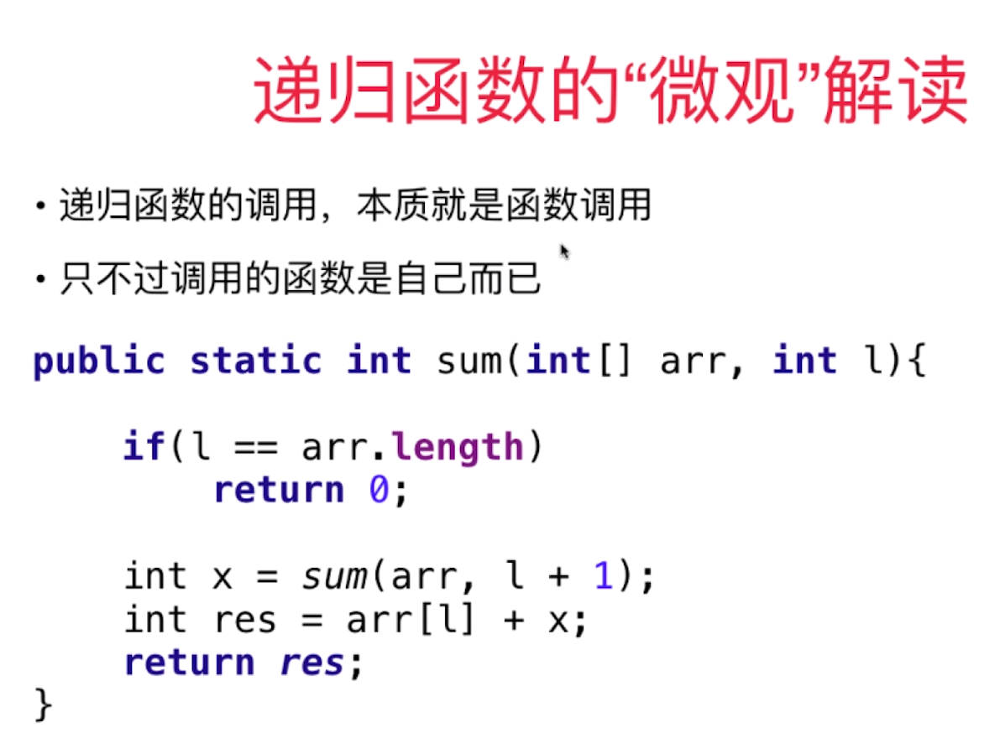

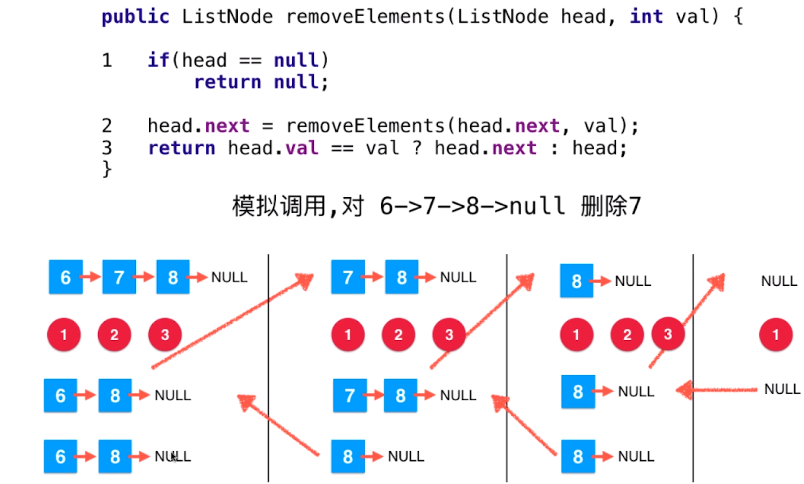

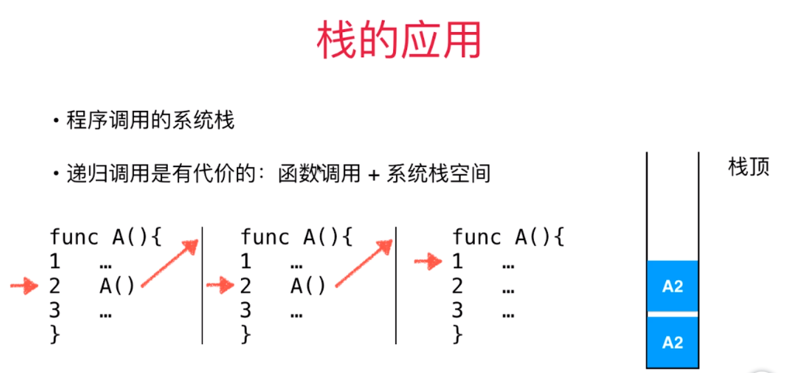

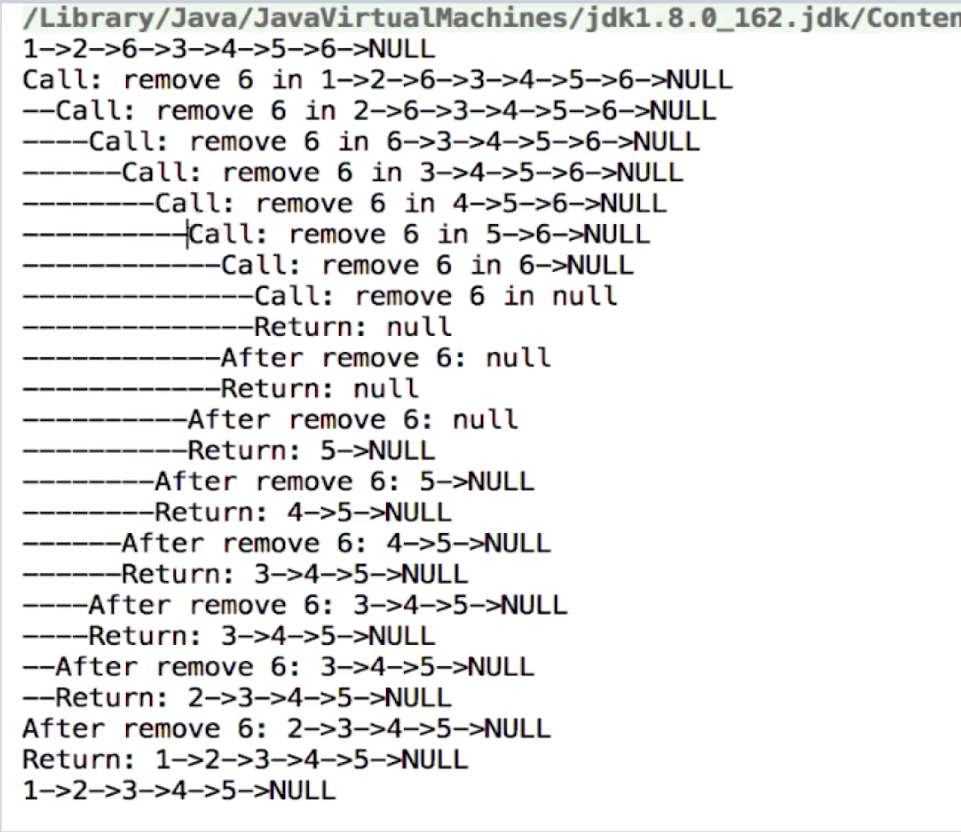

# 更多和链表相关的话题
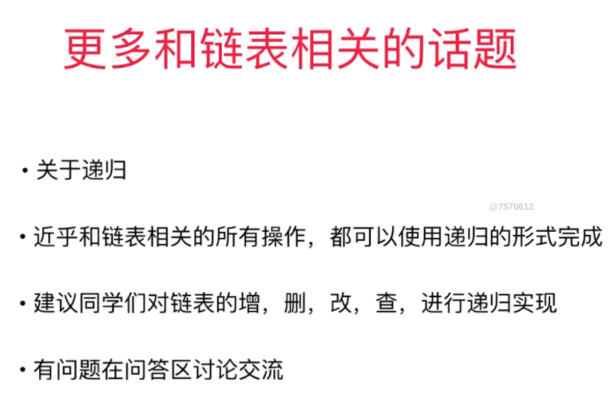

斯坦福文档：LinkedListProblems.pdf

https://mp.weixin.qq.com/s?__biz=MzU4NTIxODYwMQ==&mid=2247483779&idx=1&sn=555eeab210e54dc420f2b0cb106a2779&chksm=fd8caec5cafb27d3e5ecf692911883ccfc1abfd125a1268b24ae57860dc9e3f44ac49576010b&token=842435376&lang=zh_CN#rd

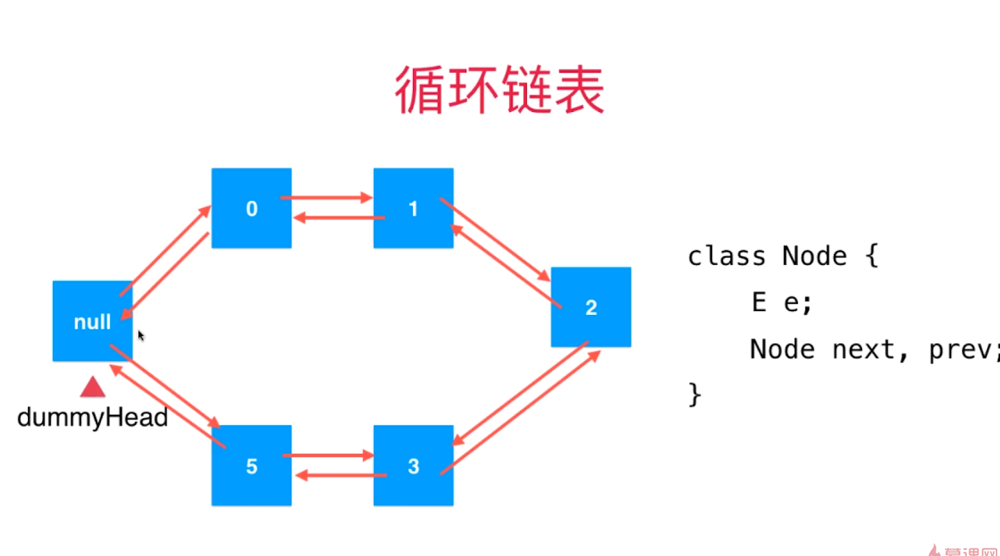

java底层的链表就是循环双向链表

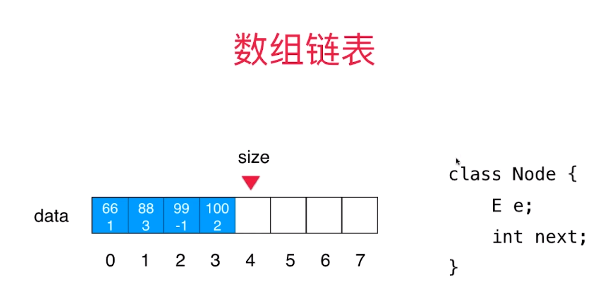

