# 链表

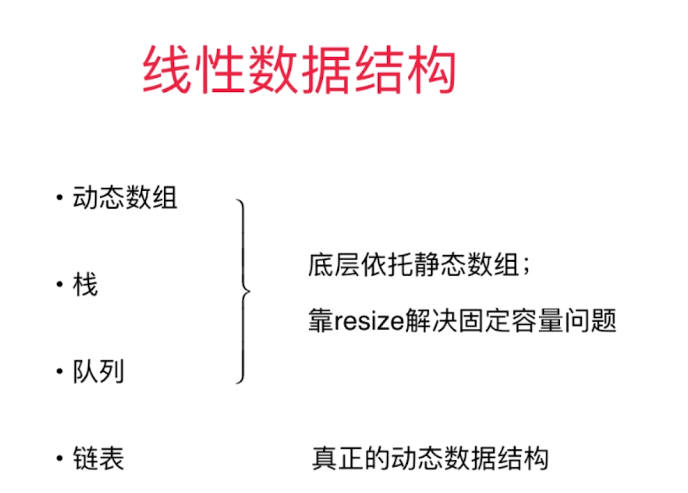

# 为什么链表很重要
+ 链表：真正的动态数据结构
+ 最简单的动态数据结构
+ 更深入的理解引用（或者指针）
+ 更深入的理解递归
+ 辅助组成其他数据结构

# 链表Linked List
数据存储在“节点”（Node）中
```java
class Node{
    E e;
    Node next;
}
```

链表像火车一样

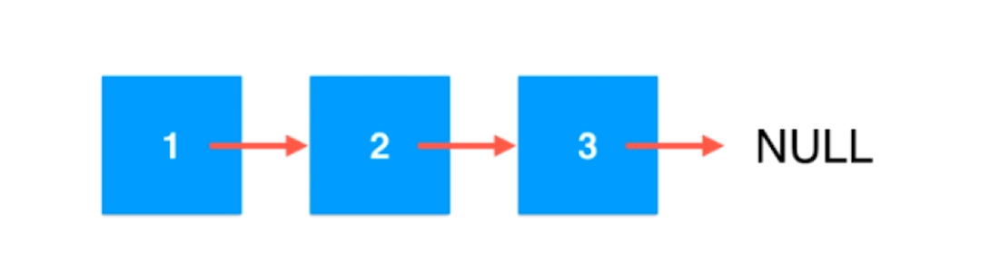

优点：真正的动态，不需要处理固定容量的问题
缺点：丧失了随机访问的能力（数组开辟的空间在内存里是连续分布的，可以直接通过索引的偏移找到对应的数据o(1)）

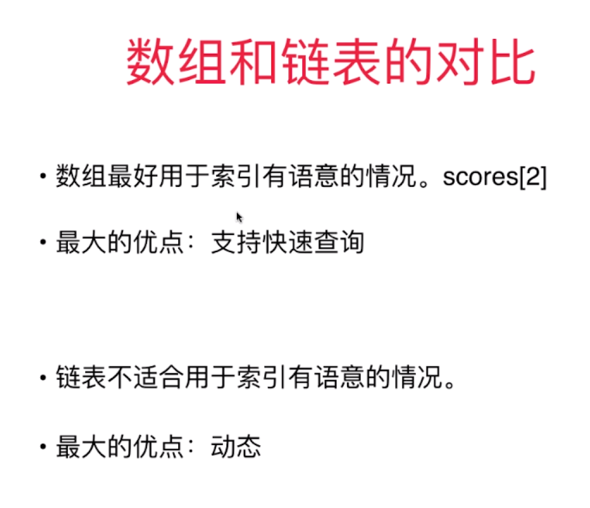

也不是索引有语义就适合使用数组，例如身份证号

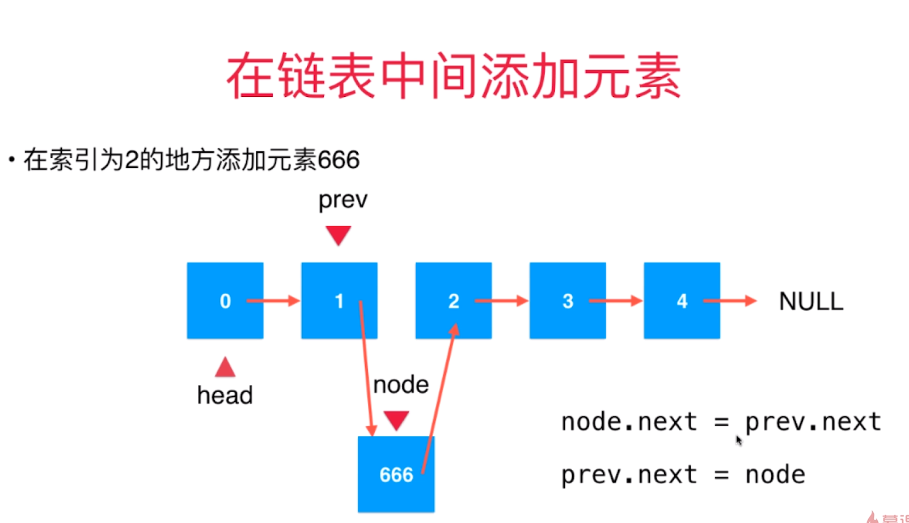

# 虚拟头结点
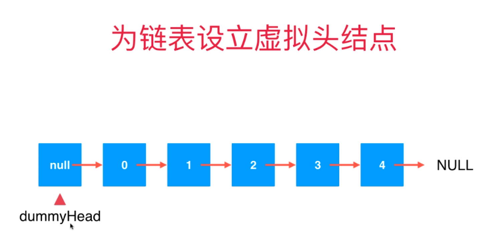
简化add边界


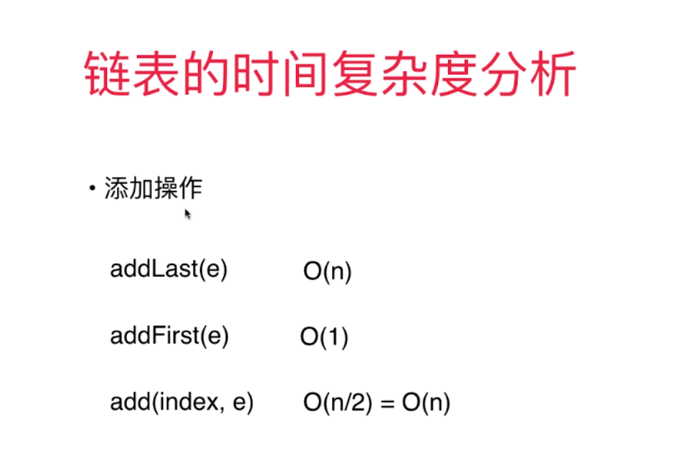
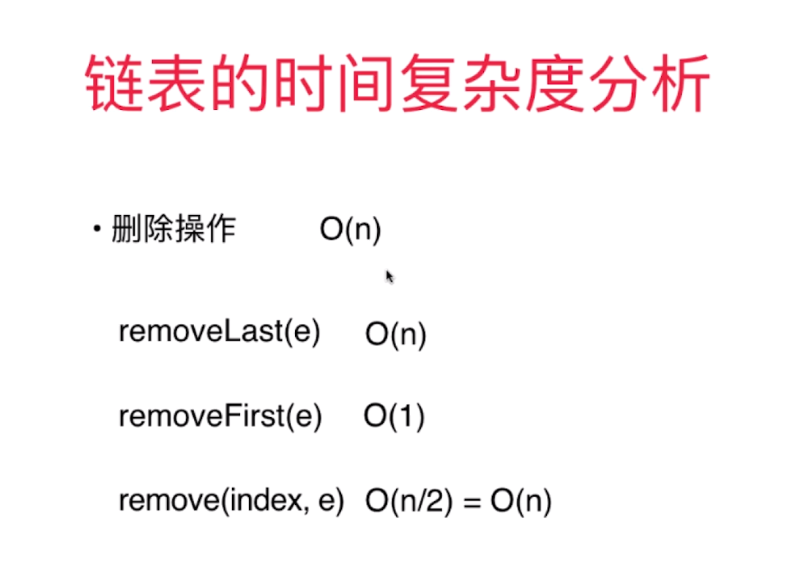
不支持随机访问
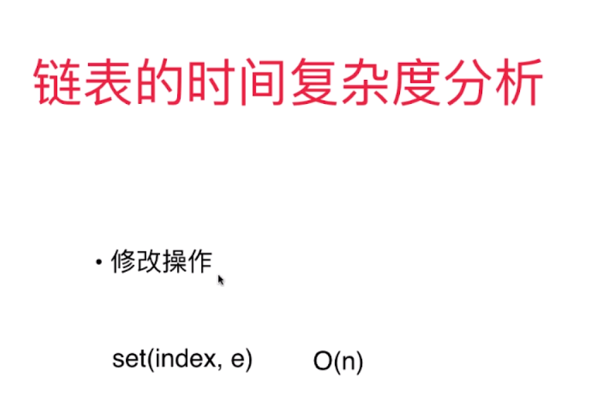
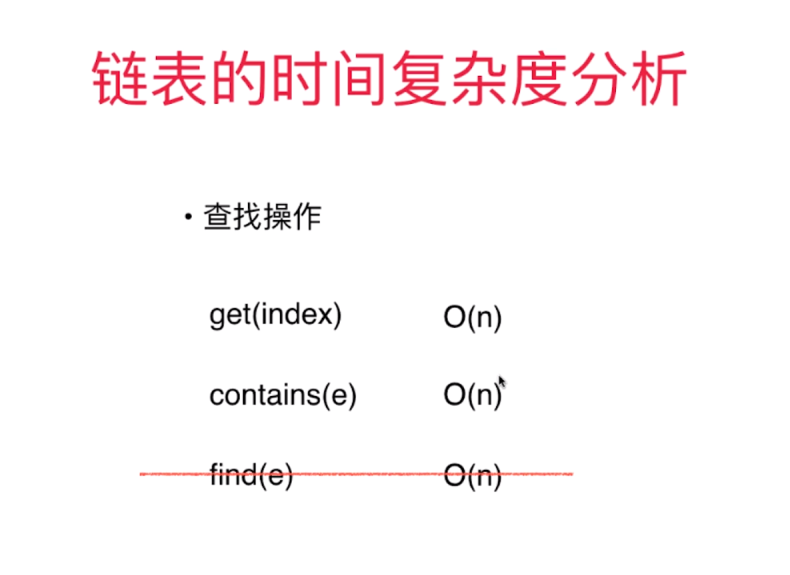

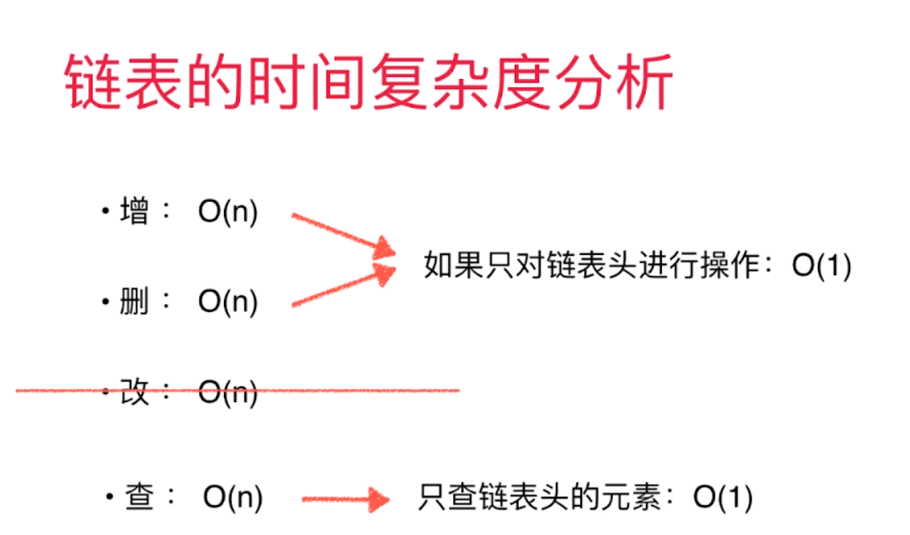

# 使用链表实现栈
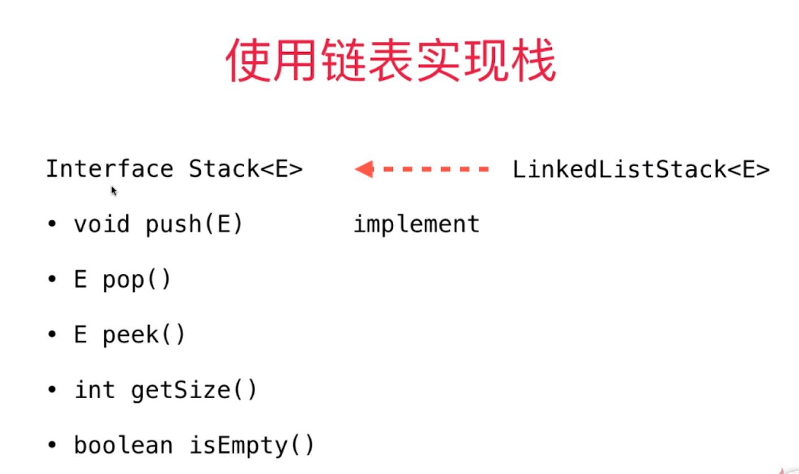

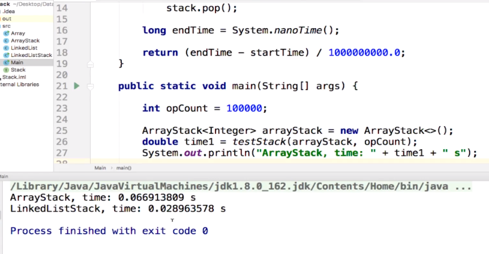
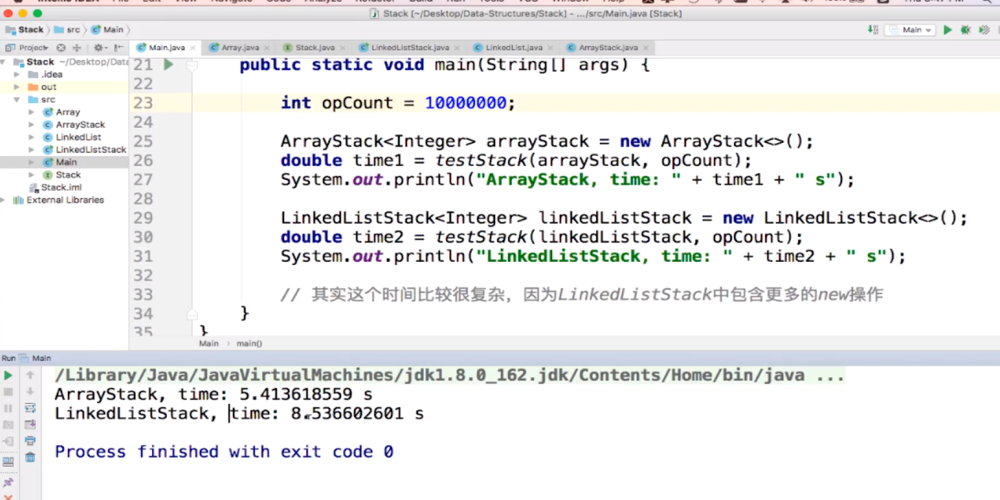

# queue
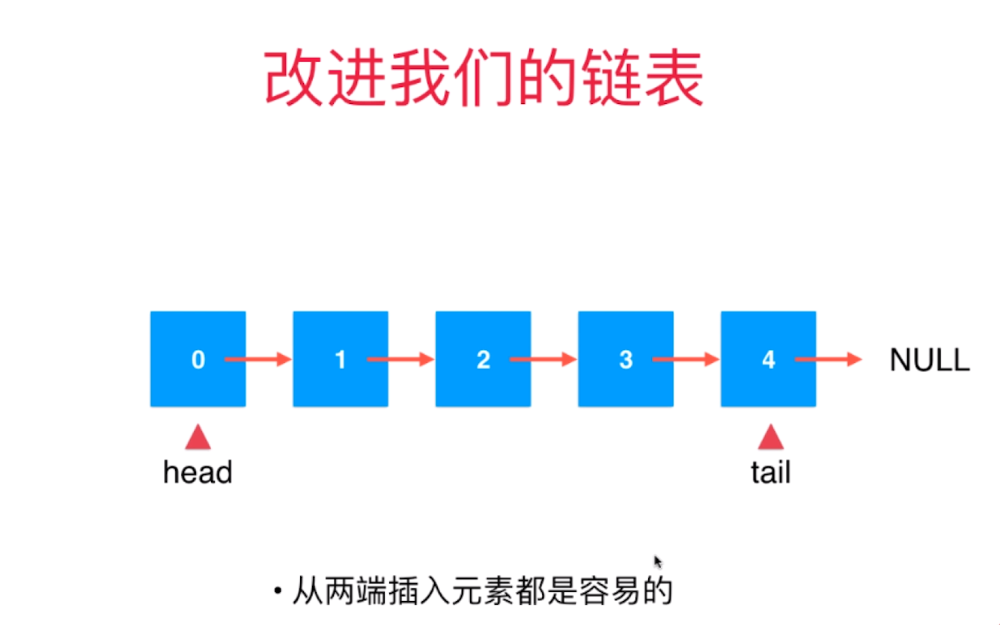

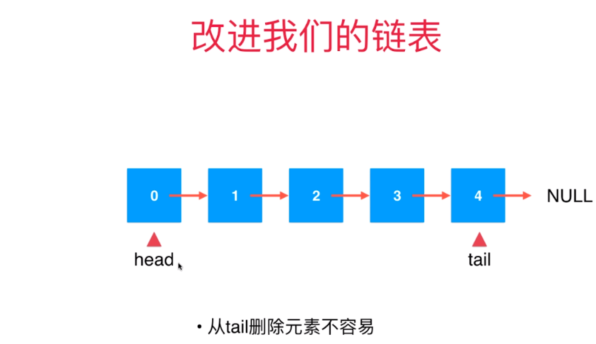

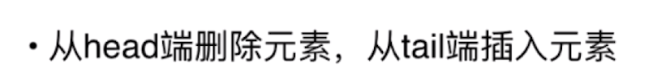


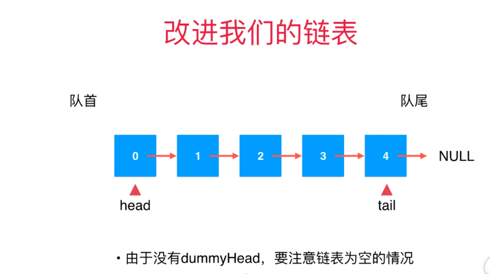

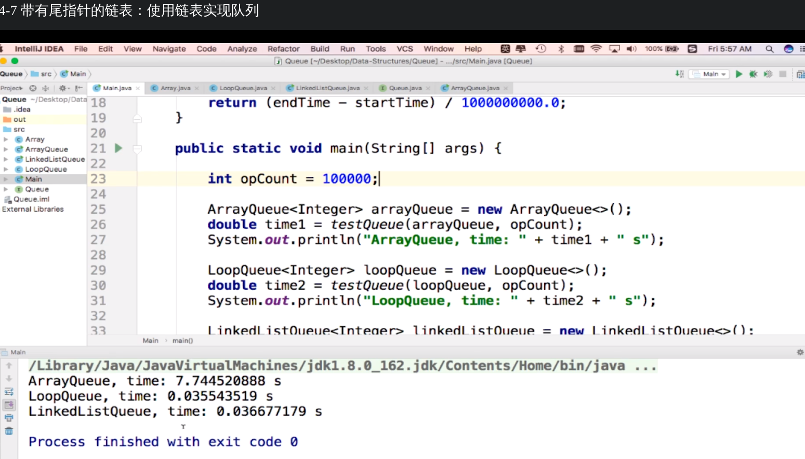

# 链表与递归
