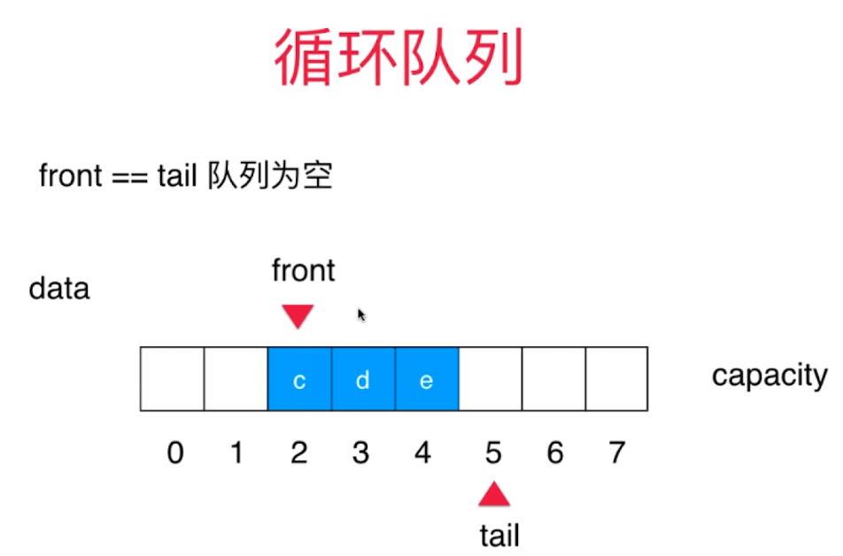
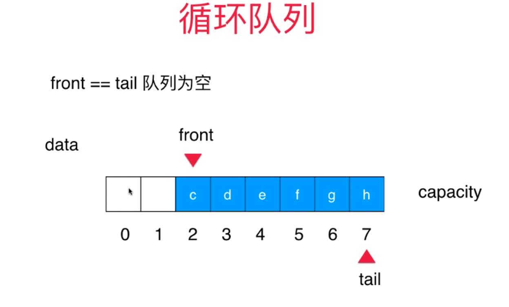
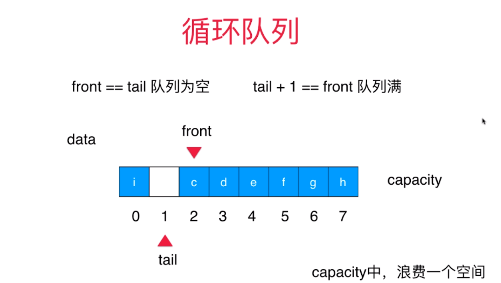
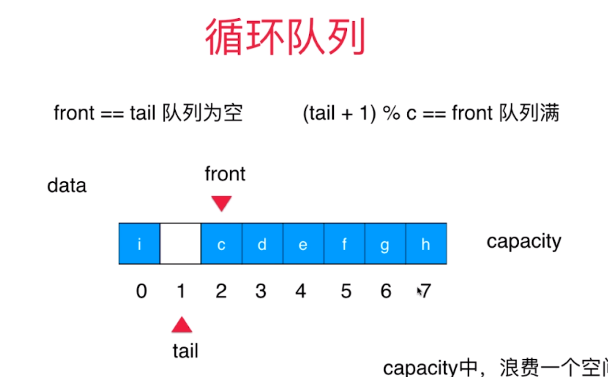

# 队列

+ 队列也是一种线性结构
+ 相比数组，队列对应的操作是数组的子集
+ 只能从一端（队尾）添加元素，只能从另一端（队首）取出元素
+ 队列是一种先进先出的数据结构（先进先出fist in fist out FIFO）

队列要实现的方法
```
Queue<E>
    void enqueue(E)    o(1)均摊
    E dequeue()    o(n)数组队列的局限性
    E getFront()    o(1)
    int getSize()    o(1)
    boolean isEmpty()    o(1)
```

# 循环队列




类似钟表