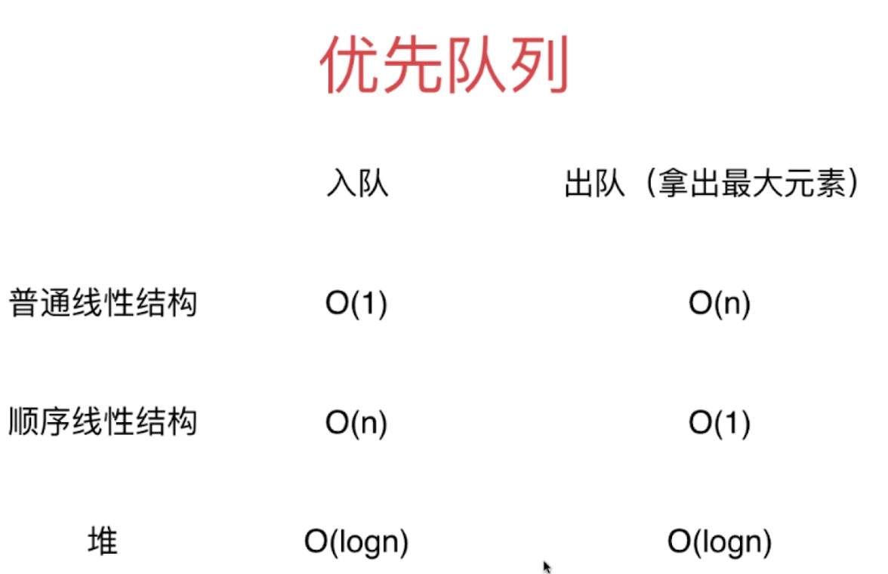
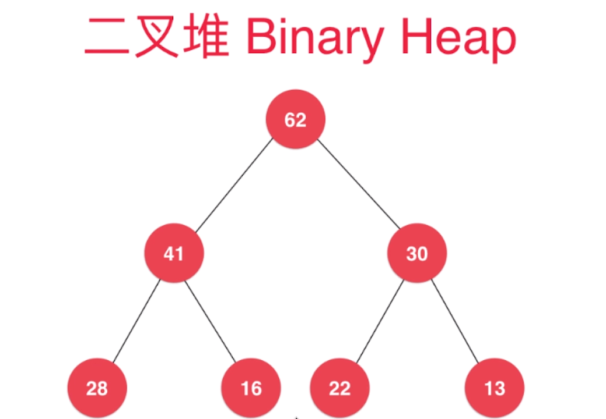
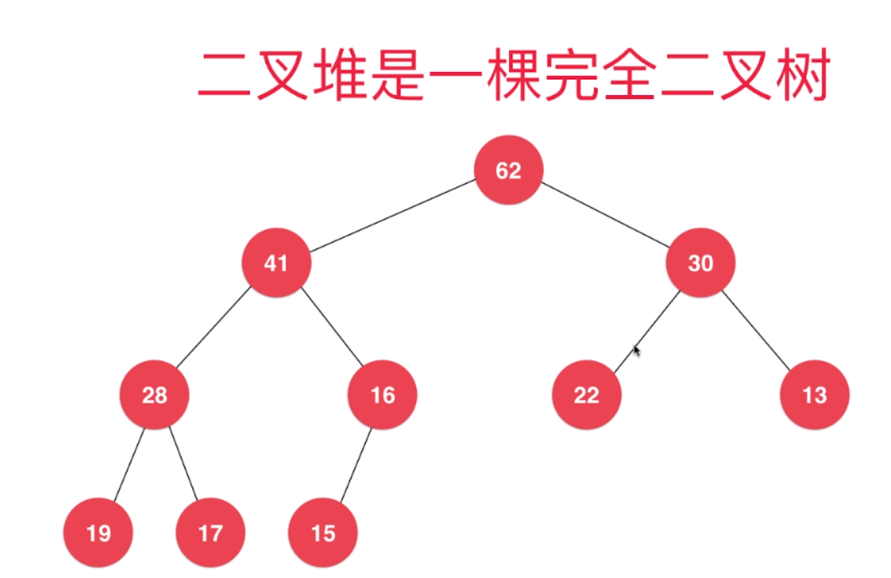
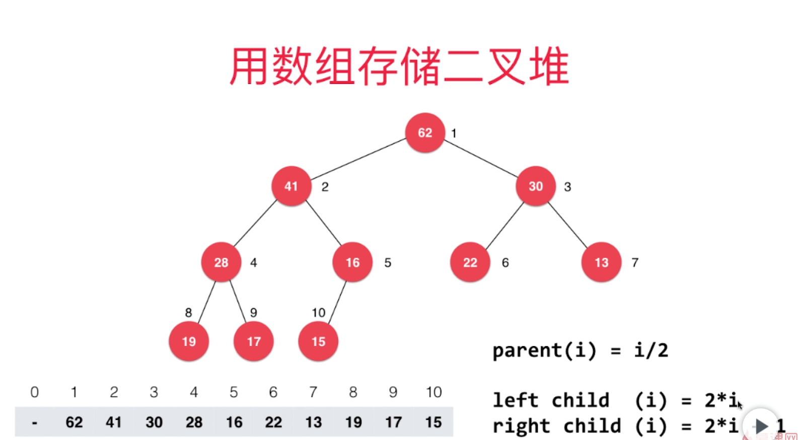
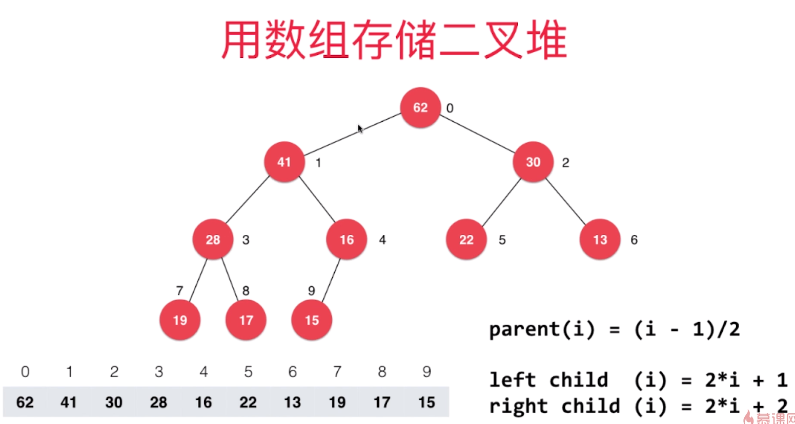

[TOC]

# 优先队列
普通队列：先进先出；后进后出
优先队列：出队顺序和入队顺序无关；和优先级相关
```java
Interface Queue<E>
void enqueue(E)
E dequeue()
E getFront()
int getSize()
boolean isEmpty()

PriorityQueue<E> implement Queue<E>
```



# 堆
## 堆的基本结构






完全二叉树：把元素顺序排列成树的形状

重要性质：
堆中某个节点的值总是不大于其父节点的值，最大堆（相应的可以定义最小堆）



不用虚拟头结点偏移

