[TOC]

# 集合
```java
Set<E>
void add(E)    //不能添加重复元素
void remove(E)
boolean contains(E)
int getSize()
boolean isEmpty()
```

集合与映射是高层定义，底层可以用各种方式实现

BST实现
链表实现

# 性能对比
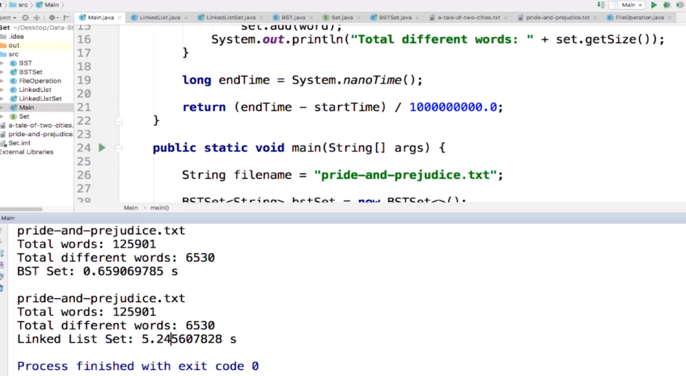

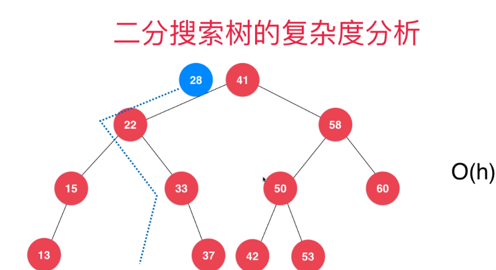

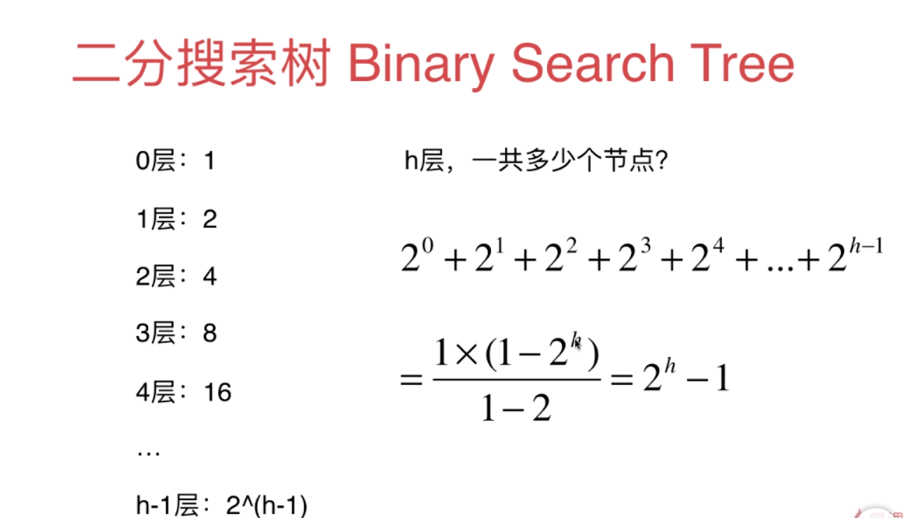

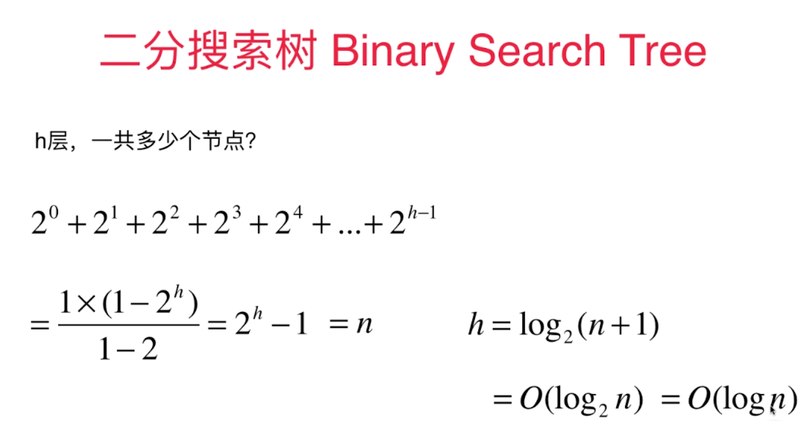

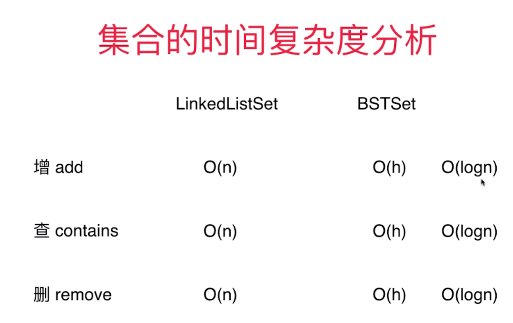

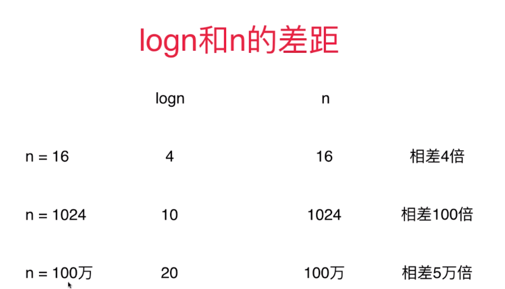

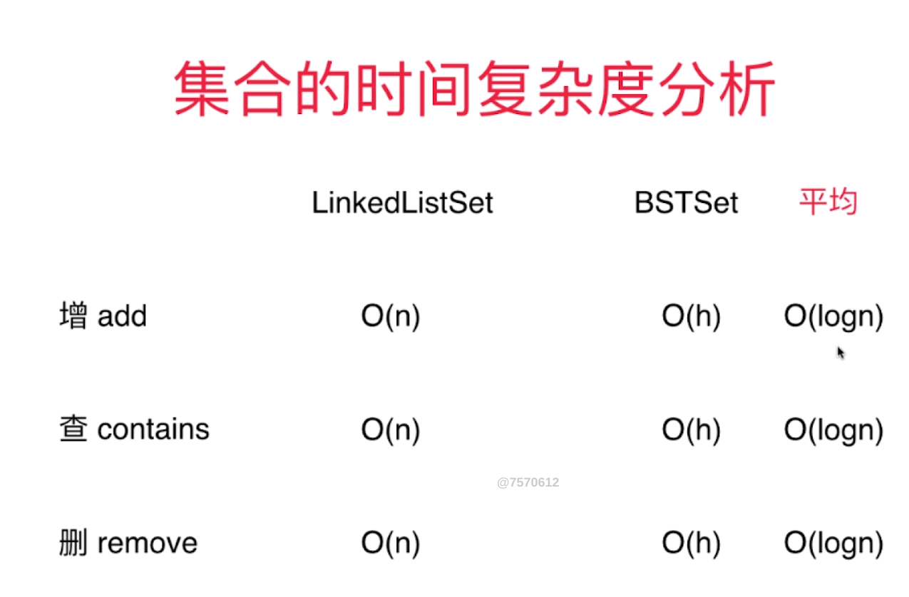
满二叉树、倾斜二叉树

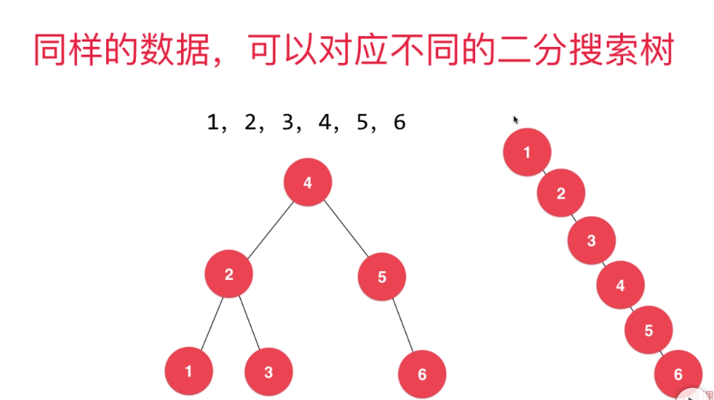

二分搜索树可能退化成链表

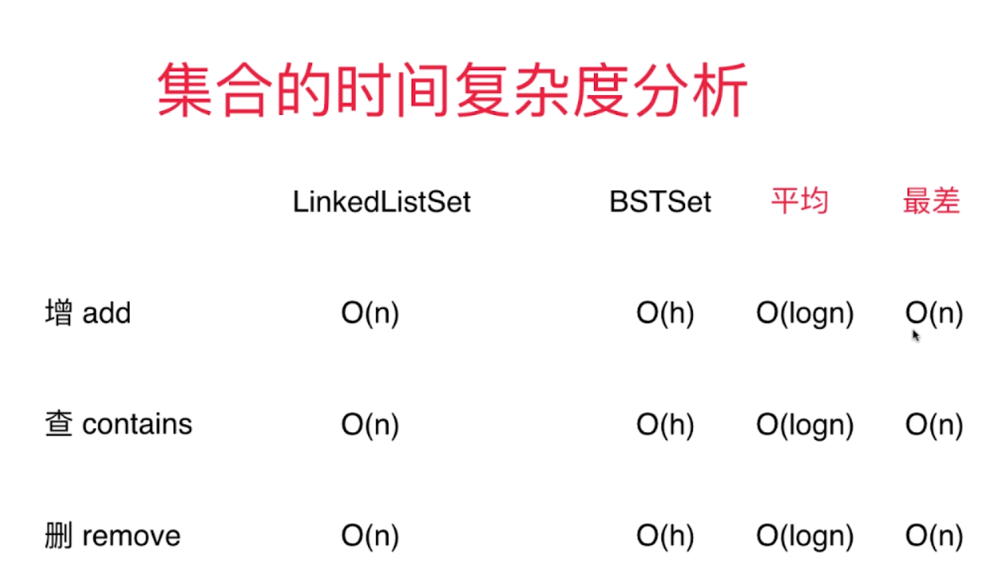

# 映射
map、dict
存储（键、值）数据对的数据结构（key、value）
根据键（key），寻找值（value）

```java
Map<K,V>
void add(K,V)
V remove(K)
boolean contains(K)
V get(K)
void set(K,V)
int getSize()
boolean isEmpty()
```

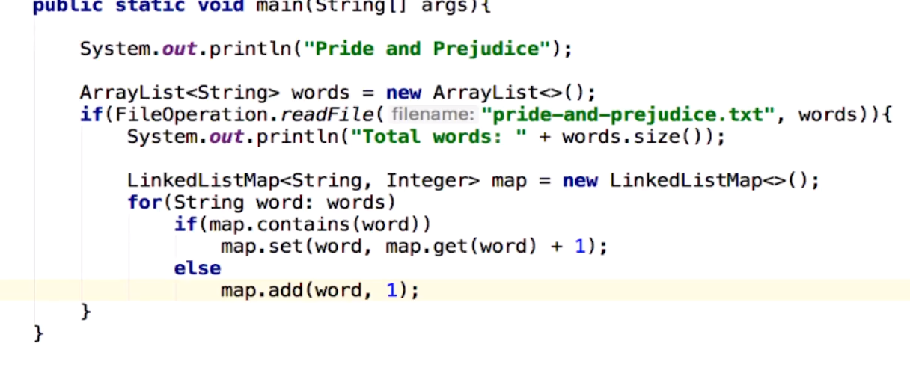


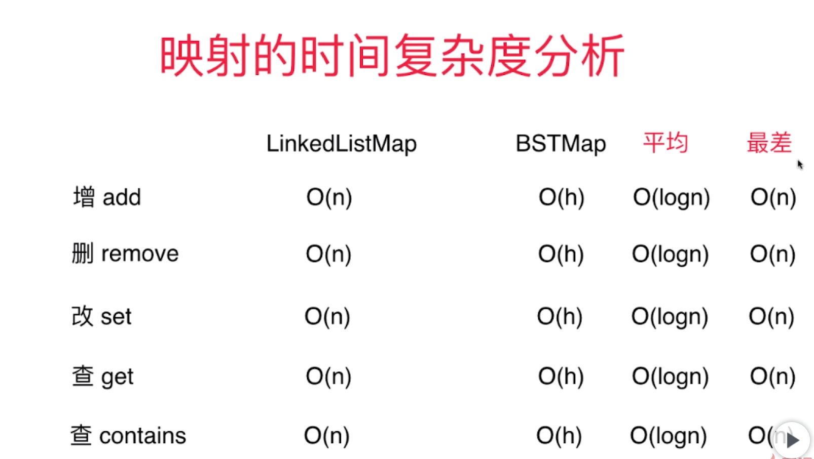

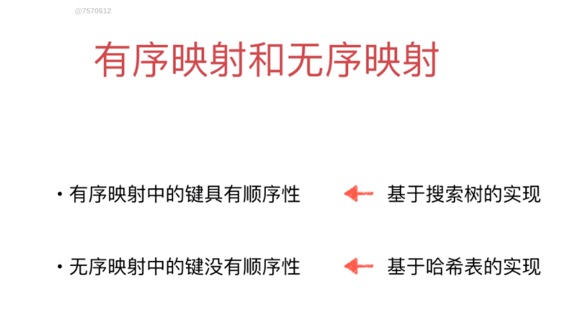

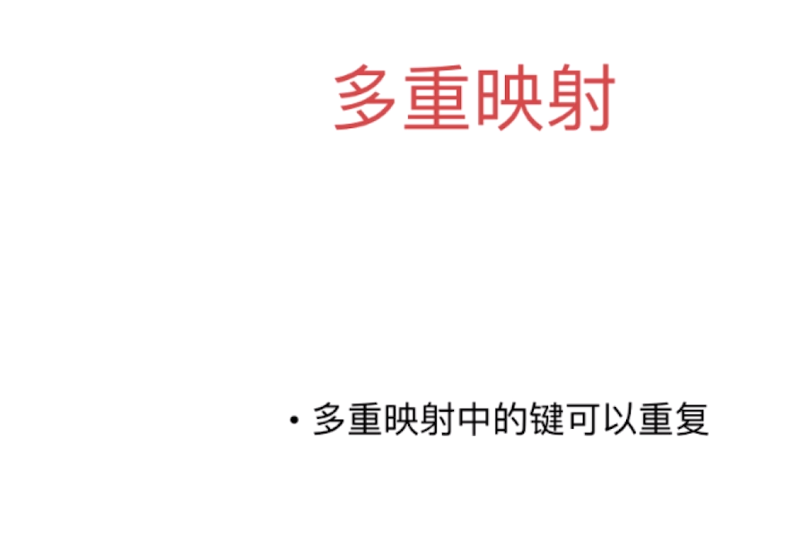

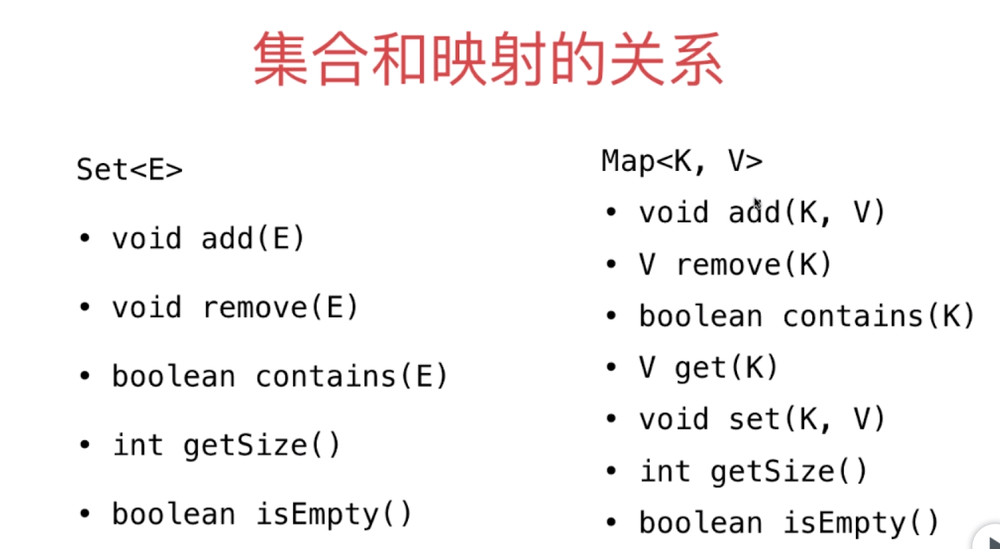

也可以基于映射包装集合，key=empty，value=null