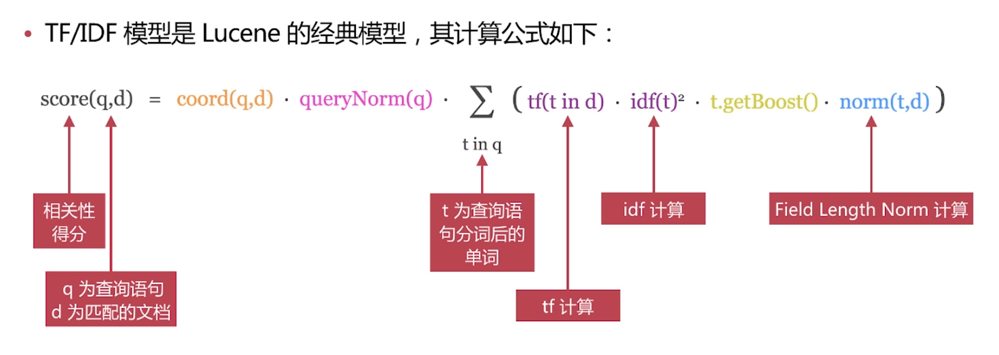
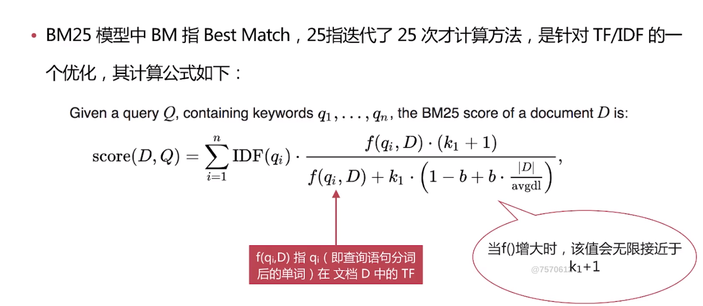
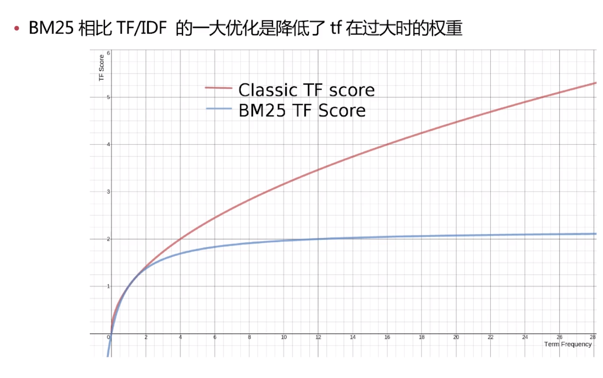

[TOC]

相关性算分是指文档与查询语句间的相关度，英文为relevance
通过倒排索引可以获取与查询语句相匹配的文档列表，那么如何将最符合用户查询的文档放到前列呢？
本质是一个排序问题，排序的依据是相关性算分

# 相关性算分的几个重要概念
+ Term Frequency(TF)词频，即单词在该文档中出现的次数。词频越高，相关度越高
+ Document Frequency(DF)文档频率，即单词出现的文档数
+ Inverse Document Frequency(IDF)逆向文档频率，与文档频率相反，简单理解为1/DF。即单词出现的文档数越少，相关度越高
+ Field-length Norm文档越短，相关性越高

# ES目前主要有两个相关性算分模型
+ TF/IDF模型
+ BM25模型，5.x之后默认的模型

可以通过explain参数来查看具体的计算方法，但要注意：
+ es的算分是按照shard进行的，即shard的分数计算是相互独立的，所以在使用explain的时候注意分片数
+ 可以通过设置索引的分片数为来避免这个问题

