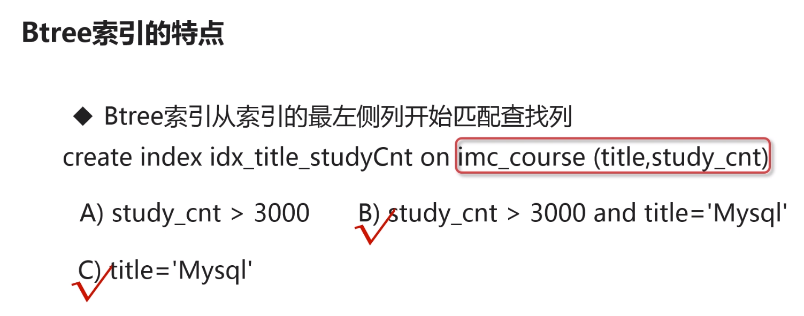

# 优化的手段
+ 优化sql查询所涉及到的表中的索引
+ 改写sql已达到更好的利用索引的目的

mysql索引是在存储引擎层实现的

# innodb支持的索引类型
+ Btree索引
+ 自适应hash索引
+ 全文索引（对中文支持不好）
+ 空间搜索

# Btree索引的特点
+ 以B+树的结构存储索引数据
+ Btree搜索适用于全值匹配的查询
+ Btree搜索适合处理范围查找

mysql使用in关键字也是可以使用b+树索引的，只有在in后的字段太多时，mysql优化器认为全表搜索更划算

