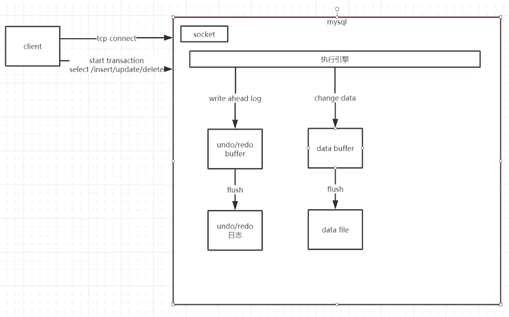

[TOC]

# 通用性能优化口诀
+ 缓存
+ 异步
+ 批处理

写操作
批量insert
批量update

读操作
索引

mysql批量写
for each {insert into table values (1)}
Execute once insert into table values (1),(2),(3),...;

mysql批量写优势
sql编译N次和1次的时间与空间复杂度
网络消耗的时间复杂度
磁盘寻址的复杂度

mysql查询索引
主键查询千万条记录 1-10ms
唯一索引 千万条记录10-100ms
非唯一索引 千万条记录 100-1000ms
无索引 百万台记录 1000ms+

---


# 单机应用的性能优化
```
# socket连接数量，默认是100
max_connection=1000
```

mysql两种日志（write ahead log）
+ undo
+ redo

```
# 
innodb_file_per_table=1
```

```
# 
innodb_buffer_pool_size=1G
```

```
# 一旦日志文件发生了一个切分的时间点之后，所有的操作都会被block掉
innodb_log_file_size=256M
```

```
# 在日志发生切换的时候仍然能做一个缓冲
innodb_log_buffer_size=16M
```

```
# 
innodb_flush_log_at_trx_commit=2
需要放在[mysqld_safe]节点下
```

```
innodb_data_file_path=ibdata1:1G;ibdata2:1G;ibdata3:1G:auto extend
```