# 两种安装方式
+ 原生命令安装
+ 官方工具安装

# 原生命令安装--理解架构
1. 配置开启节点
2. meet（通信）
3. 指派槽
4. 主从

# 配置
```
port ${port}
daemonize yes
dir "/opt/redis/redis/data/"
dbfilename "dump-${port}.rdb"
logfile "${port}.log"
cluster-enabled yes
cluster-config-file nodes-${port}.conf
```
# 开启节点
```
redis-server redis-7000.conf
redis-server redis-7001.conf
redis-server redis-7002.conf
redis-server redis-7003.conf
redis-server redis-7004.conf
redis-server redis-7005.conf
```

# meet
`cluster meet ip port`

```
redis-cli -h 127.0.0.1 -p 7000 cluster meet 127.0.0.1 7001
redis-cli -h 127.0.0.1 -p 7000 cluster meet 127.0.0.1 7002
redis-cli -h 127.0.0.1 -p 7000 cluster meet 127.0.0.1 7003
redis-cli -h 127.0.0.1 -p 7000 cluster meet 127.0.0.1 7004
redis-cli -h 127.0.0.1 -p 7000 cluster meet 127.0.0.1 7005
```

# cluster节点主要配置
```
cluster-enabled yes
# 最好使用默认配置
cluster-node-timeout 15000
cluster-config-file "nodes.conf"
# 集群中一个节点挂掉了，集群就不提供服务了，这个一般不用
cluster-require-full-coverage no
```

# 分配槽
```
cluster addslots slot [slot ...]
redis-cli -h 127.0.0.1 -p 7000 cluster addslots {0...5461}
redis-cli -h 127.0.0.1 -p 7001 cluster addslots {5462...10922}
redis-cli -h 127.0.0.1 -p 7002 cluster addslots {10923...16383}
```
# 设置主从
cluster replicate node-id
redis-cli -h 127.0.0.1 -p 7003 cluster replicate ${node-id-7000}
redis-cli -h 127.0.0.1 -p 7004 cluster replicate ${node-id-7001}
redis-cli -h 127.0.0.1 -p 7005 cluster replicate ${node-id-7002}

---

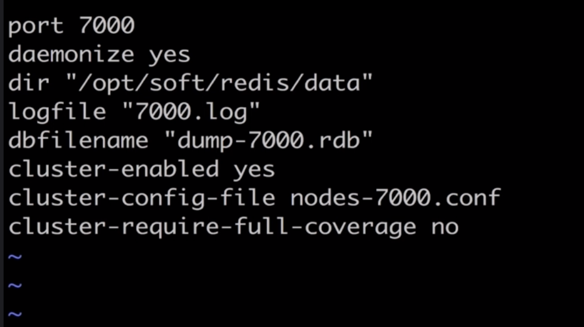

sed 's/7000/7001/g' redis-7000.conf > reids-7001.conf

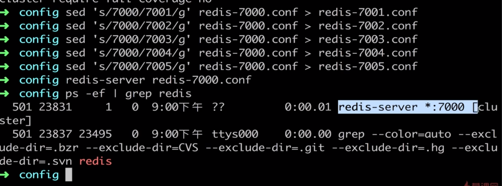


因为未分配槽，所以显示集群不可用
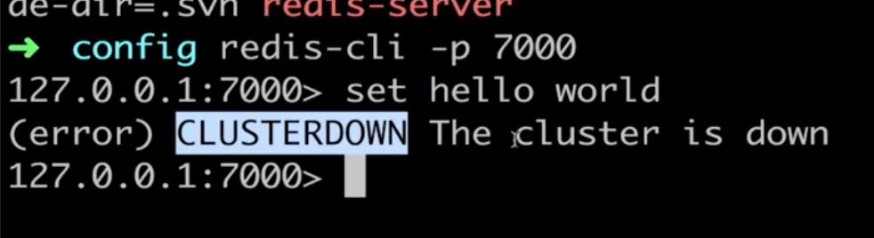


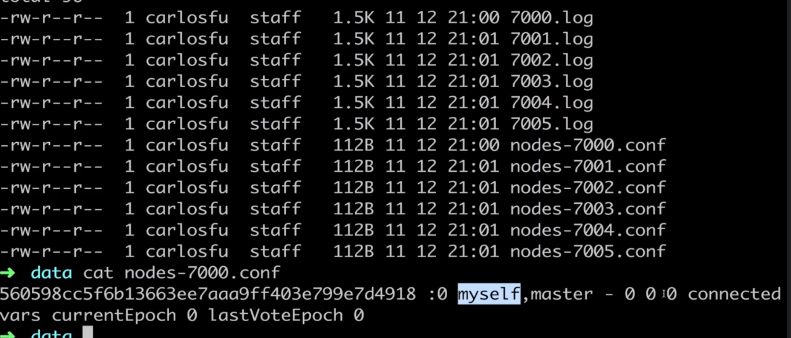

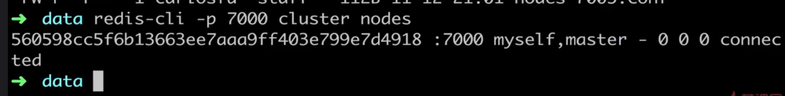

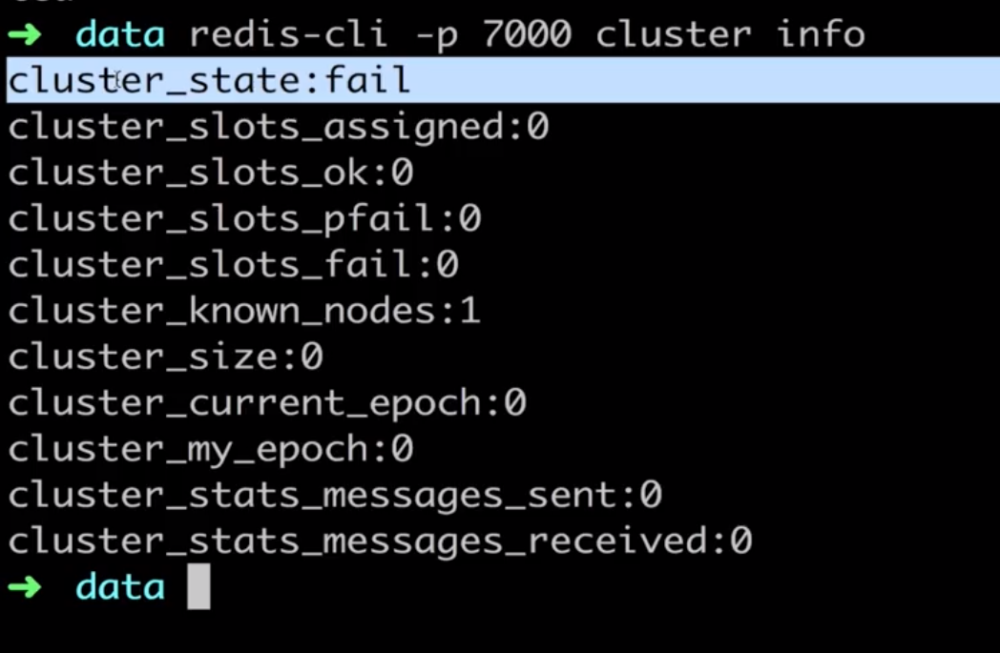


meet
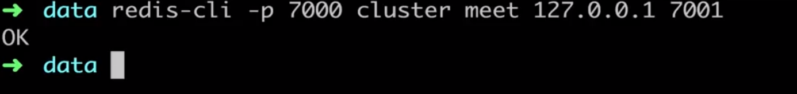

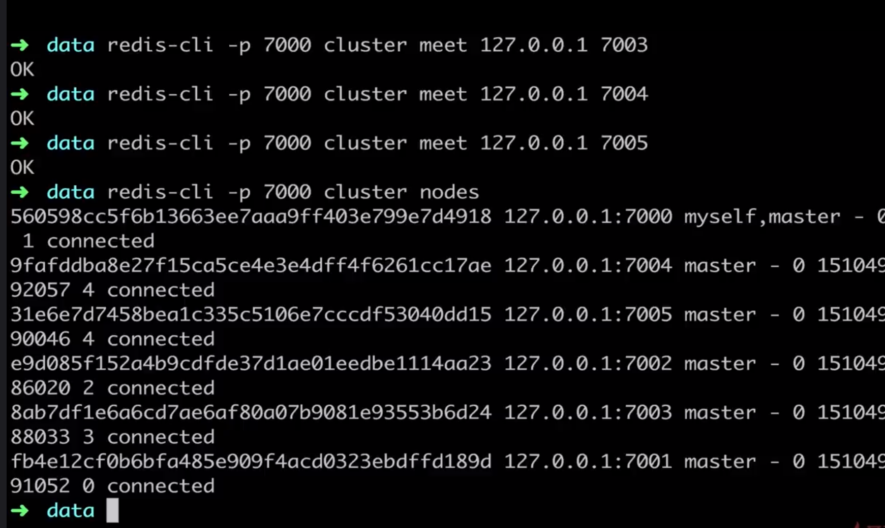

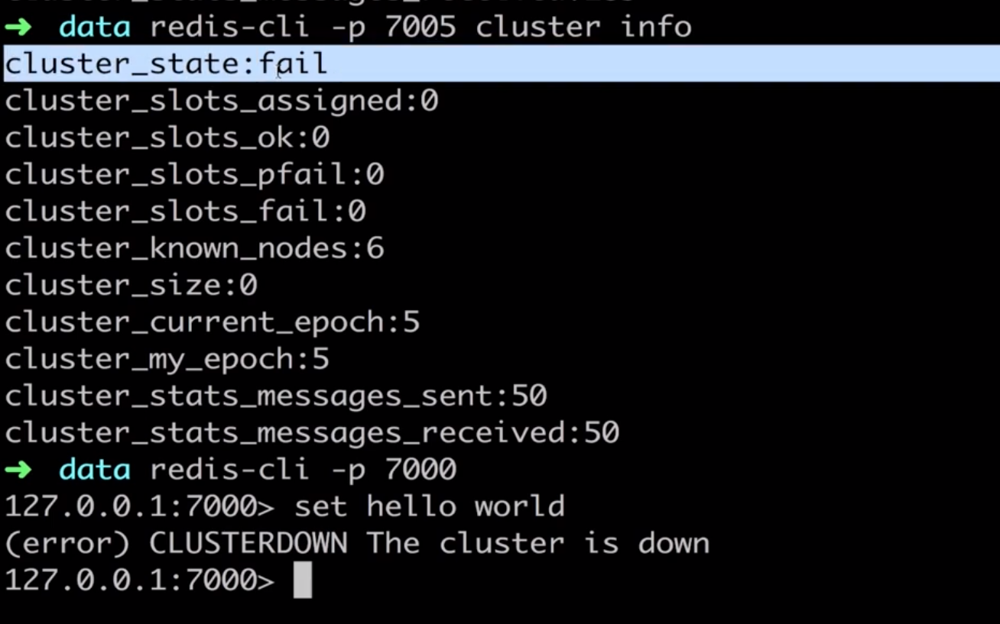


分配槽


通过id主从复制
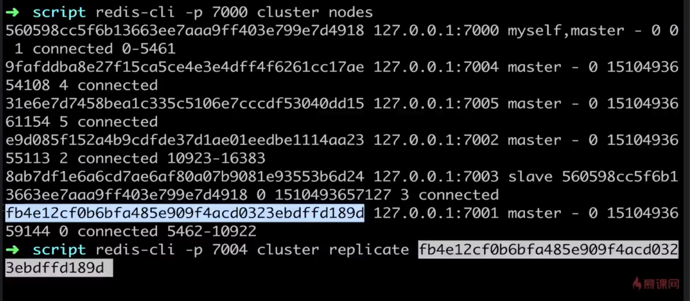


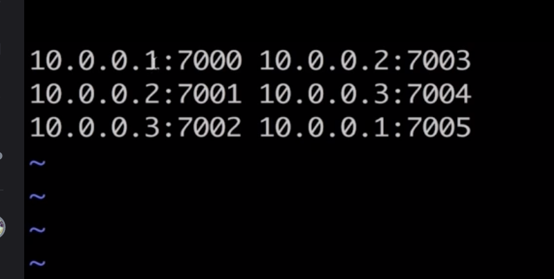

# Ruby安装脚本
## 环境准备
下载、编译、安装Ruby
安装rubygem redis
安装redis-trib.rb

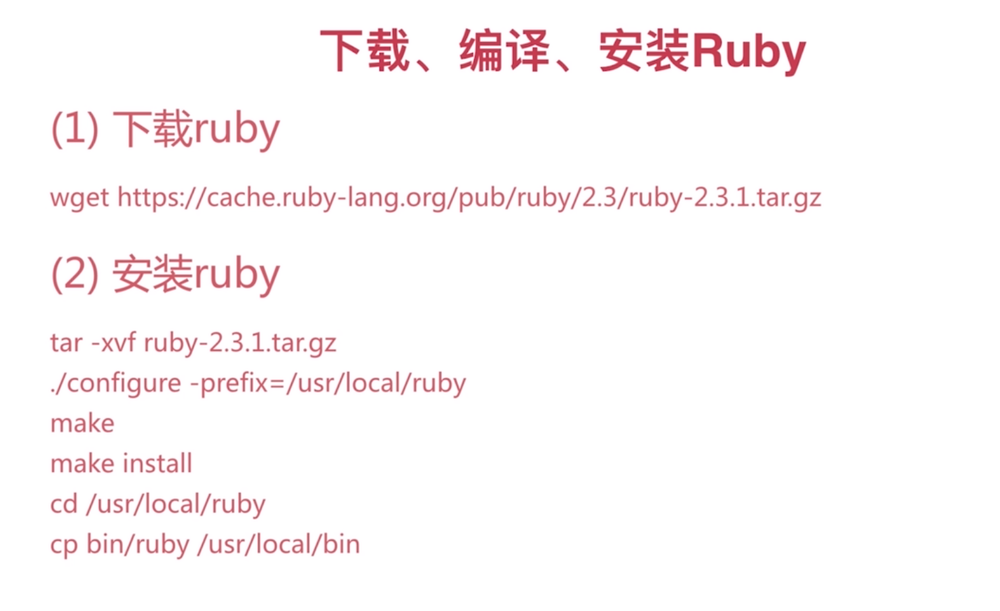

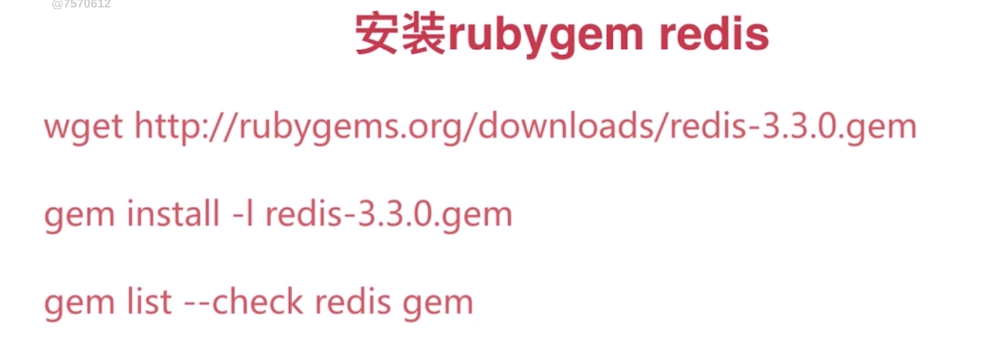

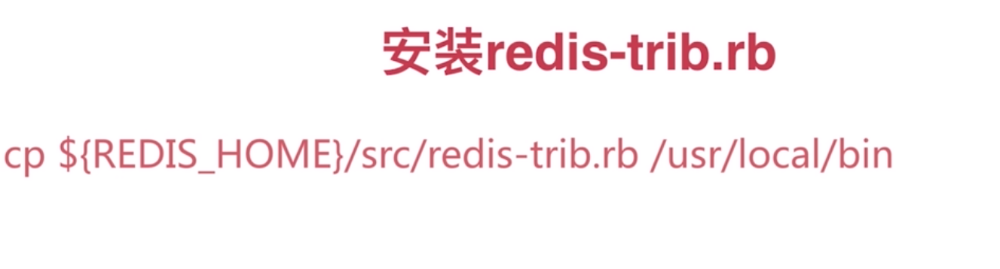


sudo gem install redis

sudo gem list -- check redis gem


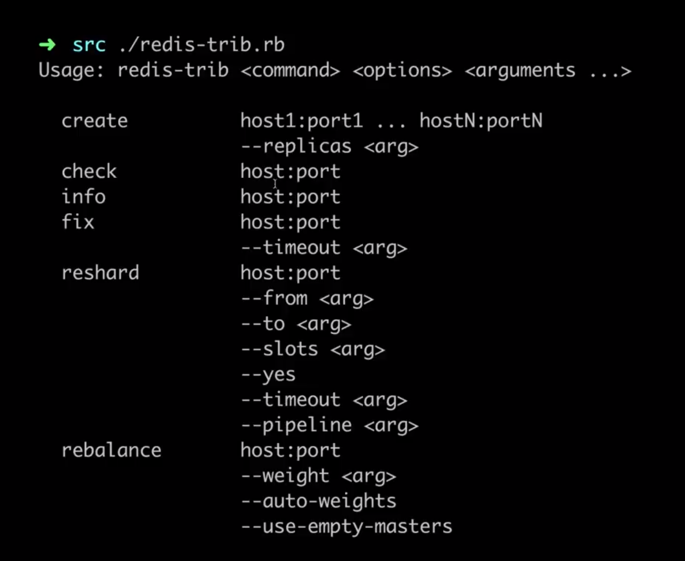

# reids-trib.rb搭建集群
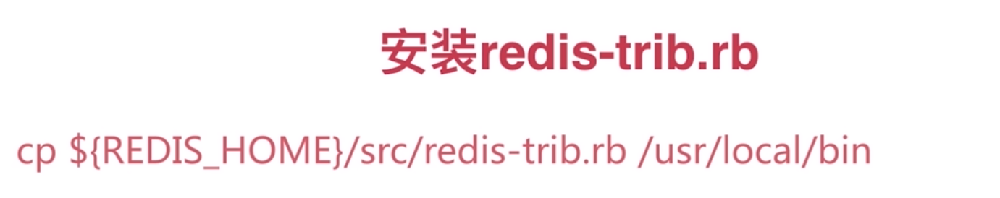

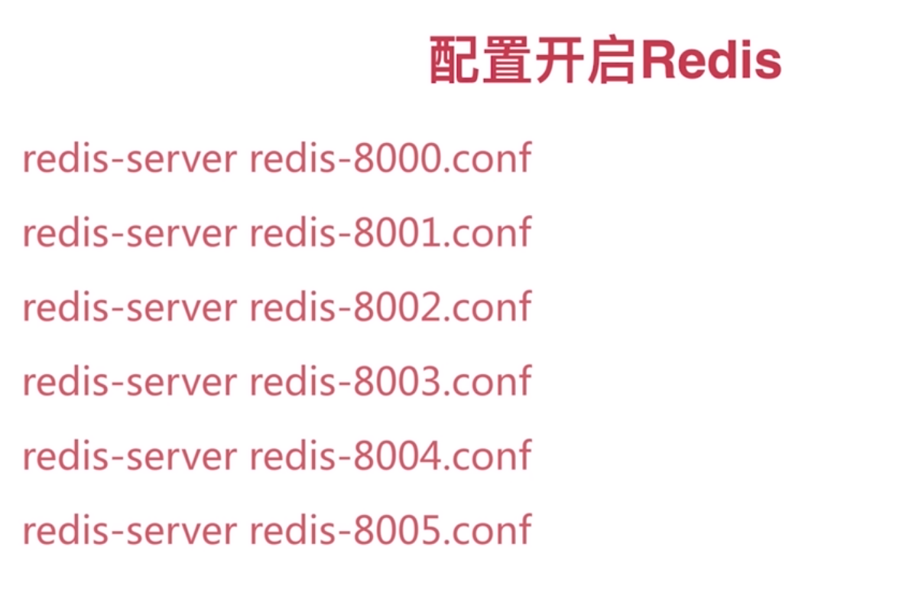

有节点数量判断
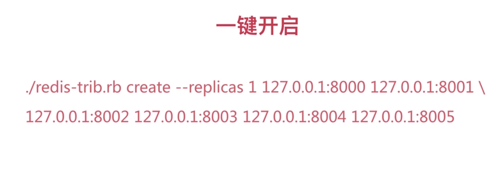

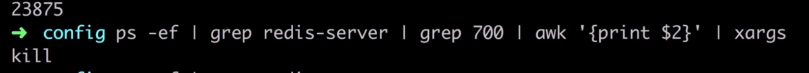

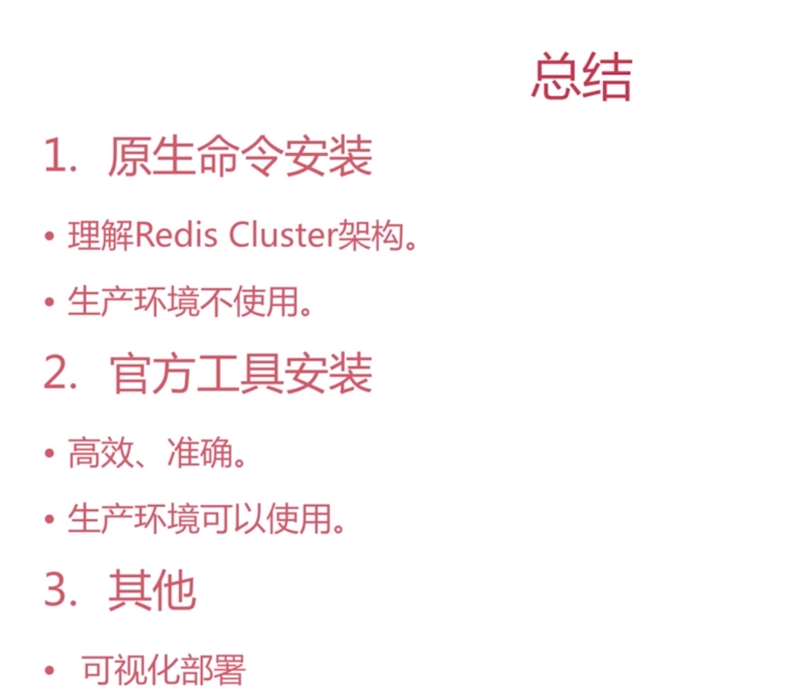


