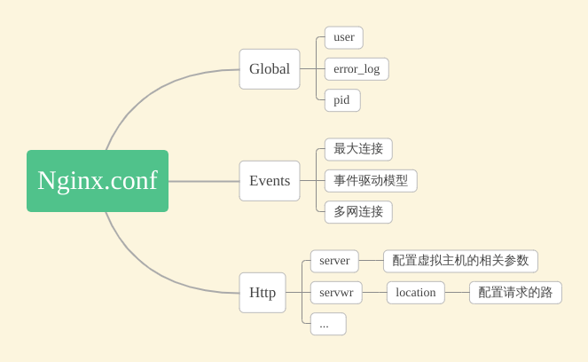

[TOC]

# 语法
1. 配置文件由指令与指令块构成
2. 每条指令以；分号结尾，指令与参数间以空格符号分隔
3. 指令块以{}大括号将多条指令组织在一起
4. include语句允许组合多个配置文件以提升可维护性
5. 使用#符号添加注释，提高可控性
6. 使用$符号使用变量
7. 部分指令的参数支持正则表达式



```
#user  nobody;

#开启进程数 <=CPU数 
worker_processes  1;

#错误日志保存位置
#error_log  logs/error.log;
#error_log  logs/error.log  notice;
#error_log  logs/error.log  info;

#进程号保存文件
#pid        logs/nginx.pid;

#每个进程最大连接数（最大连接=连接数x进程数）每个worker允许同时产生多少个链接，默认1024
events {
    worker_connections  1024;
}


http {
    #文件扩展名与文件类型映射表
    include       mime.types;
    #默认文件类型
    default_type  application/octet-stream;

    #日志文件输出格式 这个位置相于全局设置
    log_format  main  '$remote_addr - $remote_user [$time_local] "$request" '
                      '$status $body_bytes_sent "$http_referer" '
                      '"$http_user_agent" "$http_x_forwarded_for"';

    #请求日志保存位置
    #access_log  logs/access.log  main;
    
    #打开发送文件
    sendfile        on;
    #tcp_nopush     on;

    #keepalive_timeout  0;
    #连接超时时间
    keepalive_timeout  65;

    #打开gzip压缩
    #gzip  on;
    
    #设定请求缓冲
    #client_header_buffer_size 1k;
    #large_client_header_buffers 4 4k;
    
    #设定负载均衡的服务器列表
    #upstream myproject {
        #weigth参数表示权值，权值越高被分配到的几率越大
        #max_fails 当有#max_fails个请求失败，就表示后端的服务器不可用，默认为1，将其设置为0可以关闭检查
        #fail_timeout 在以后的#fail_timeout时间内nginx不会再把请求发往已检查出标记为不可用的服务器
    #}
    
    #webapp
    #upstream myapp {   
    # server 192.168.122.133:8080 weight=1 max_fails=2 fail_timeout=30s;   
    # server 192.168.122.134:8080 weight=1 max_fails=2 fail_timeout=30s;   
    #} 

    #配置虚拟主机，基于域名、ip和端口
    server {
        #监听端口
        listen       80;
        #监听域名
        server_name  localhost;

        #charset koi8-r;
        
        #nginx访问日志放在logs/host.access.log下，并且使用main格式（还可以自定义格式）
        #access_log  logs/host.access.log  main;

        #返回的相应文件地址
        location / {
            #设置客户端真实ip地址
            #proxy_set_header X-real-ip $remote_addr;       
            #负载均衡反向代理
            #proxy_pass http://myapp;
            
            #返回根路径地址（相对路径:相对于/usr/local/nginx/）
            root   html;
            #默认访问文件
            index  index.html index.htm;
        }

        #配置反向代理tomcat服务器：拦截.jsp结尾的请求转向到tomcat
        #location ~ \.jsp$ {
        #    proxy_pass http://192.168.122.133:8080;
        #}      
        
        #error_page  404              /404.html;
        # redirect server error pages to the static page /50x.html
        #
        
        #错误页面及其返回地址
        error_page   500 502 503 504  /50x.html;
        location = /50x.html {
            root   html;
        }

        # proxy the PHP scripts to Apache listening on 127.0.0.1:80
        #
        #location ~ \.php$ {
        #    proxy_pass   http://127.0.0.1;
        #}

        # pass the PHP scripts to FastCGI server listening on 127.0.0.1:9000
        #
        #location ~ \.php$ {
        #    root           html;
        #    fastcgi_pass   127.0.0.1:9000;
        #    fastcgi_index  index.php;
        #    fastcgi_param  SCRIPT_FILENAME  /scripts$fastcgi_script_name;
        #    include        fastcgi_params;
        #}

        # deny access to .htaccess files, if Apache's document root
        # concurs with nginx's one
        #
        #location ~ /\.ht {
        #    deny  all;
        #}
    }
    
    #虚拟主机配置：
    server {
        listen 1234;
        server_name wolfcode.cn;
        location / {
        #正则表达式匹配uri方式：在/usr/local/nginx/wolfcode.cn下 建立一个test123.html 然后使用正则匹配
        #location ~ test {
            ## 重写语法：if return （条件 = ~ ~*）
            #if ($remote_addr = 192.168.122.1) {
            #       return 401;
            #}      
            
            #if ($http_user_agent ~* firefox) {
            #      rewrite ^.*$ /firefox.html;
            #      break;
            #}          
                        
            root wolfcode.cn;
            index index.html;
        }
        
        #location /goods {
        #       rewrite "goods-(\d{1,5})\.html" /goods-ctrl.html;
        #       root wolfcode.cn;
        #       index index.html;
        #}
        
        #配置访问日志
        access_log logs/wolfcode.cn.access.log main;
    }
    


    # another virtual host using mix of IP-, name-, and port-based configuration
    #
    #server {
    #    listen       8000;
    #    listen       somename:8080;
    #    server_name  somename  alias  another.alias;

    #    location / {
    #        root   html;
    #        index  index.html index.htm;
    #    }
    #}


    # HTTPS server
    #
    #server {
    #    listen       443 ssl;
    #    server_name  localhost;

    #    ssl_certificate      cert.pem;
    #    ssl_certificate_key  cert.key;

    #    ssl_session_cache    shared:SSL:1m;
    #    ssl_session_timeout  5m;

    #    ssl_ciphers  HIGH:!aNULL:!MD5;
    #    ssl_prefer_server_ciphers  on;

    #    location / {
    #        root   html;
    #        index  index.html index.htm;
    #    }
    #}

}
```

# Global块
配置影响nginx全局的指令。一般有运行nginx服务器的用户组，nginx进程pid存放路径，日志存放路径，配置文件引入，允许生成worker process数等。
## user 指定运行Nginx服务器的用户（组）
```
user user [group];
默认
# user nobody;
user nobody nobody;
```
user是个主模块指令，指定Nginx Worker进程运行以及用户组
+ user：指定可以运行Nginx服务器的用户；
+ group：可选项，可以运行Nginx服务器的用户组。

如果user指令不配置或者配置为user nobody nobody，默认由nobody账户运行。

## worker process 设置worker进程数
woker_processes是个主模块指令，制定了Nginx要开启的进程数。每个Nginx进程平均耗费10M~12M内存。建议指定和CPU的数量一致即可。

```
worker_processes number | auto;
worker_processes 2;
```
指令格式：
+ number : Nginx 进程最多可以产生的worker process 数。
+ auto ： Nginx 进程将自动检测

在按照上面的配置格式配置了之后，假如上面的数目是2，那么启动Nginx服务器后，在后台主机上查看Nginx的进程情况，可以看到应该是有2个Nginx进程。

nginx进程模型：master-worker

# events块
配置影响nginx服务器或与用户的网络连接。有每个进程的最大连接数，选取哪种事件驱动模型处理连接请求，是否允许同时接受多个网路连接，开启多个网络连接序列化等。
```
events {
    use epoll;
    worker_connections  1024;
}
```
## use 指定使用的io模型
1. select
2. poll
3. kqueue
4. epoll
5. rtsig
6. /dev/poll

其中select 和poll 都是标准的工作模式，kqueue和epoll是高效的工作模式，不同的是epoll用在Linux平台上，而kqueue用在BSD系统中。对于Linux系统，epoll工作模式是首选。

## worker_connections
用于定义nginx每个worker进程的最大连接数，默认1024，最大65536

# http块
可以嵌套多个server，配置代理，缓存，日志定义等绝大多数功能和第三方模块的配置。如文件引入，mime-type定义，日志自定义，是否使用sendfile传输文件，连接超时时间，单连接请求数等。
## include 文件扩展名与文件类型映射表
```
include  mime.types;
```
## default_type 属于HTTP核心模块指令，这里设定默认类型为二进制流。也就是当文件类型未定义时使用这种方式
```
default_type  application/octet-stream;
```
## log_format 日志文件输出格式 这个位置相于全局设置
```
log_format  main  '$remote_addr - $remote_user [$time_local] "$request" '
                      '$status $body_bytes_sent "$http_referer" '
                      '"$http_user_agent" "$http_x_forwarded_for"';
```
## access_log 请求日志保存位置
```
access_log  logs/access.log  main;
```
## sendfile 打开发送文件
```
sendfile on;
```
这个指令中的参数on是表示开启高效文件传输模式，默认是关闭状态（off），将tcp_nopush和tcp_nodelay两个指令设置为on用于防止网络阻
塞；
## keepalive_timout 连接超时时间
```
keepalive_timout 60;
```
## gzip 打开gzip压缩
## unpstream 设定负载均衡的服务器列表
```
upstream myapp {
    server 192.168.122.133:8080 weight=1 max_fails=2 fail_timeout=30s;
    server 192.168.122.134:8080 weight=1 max_fails=2 fail_timeout=30s;
}
```
### weigth 餐表示权重，值越高被分配到的几率越大
### max_fails 当有max_fails个请求失败，就表示后端服务器不可用，默认为1，将其设置为0可以关闭
### fail_timeout 在以后的fail_timeout时间内nginx不会再把请求发往已检查出标记为不可用的服务器
# server 配置虚拟主机，基于域名、ip和端口
配置虚拟主机的相关参数，一个http中可以有多个server。
## listen 监听端口
```
listen 80;
```
## server_name 监听域名
```
server_name localhost;
```
## error_page 错误页面及其返回地址
```
error_page   500 502 503 504  /50x.html;
location = /50x.html {
    root   html;
}
```
# location 返回的相应文件地址
配置请求的路由，以及各种页面的处理情况。
```
location / {
    proxy_pass http://backend_server;
    proxy_set_header Host $http_host:$proxy_port;
    proxy_set_header X-Real-IP $remote_addr;
    proxy_set_header X-Forwarded-For $proxy_add_x_forwarded_for;
}
```
## root 返回根路径地址（相对路径:相对于/usr/local/nginx/）
```
root html;
```
## index 默认访问文件
```
index index.html index.htm;
```
## proxy_pass 负载均衡反向代理
```
proxy_pass http://unpstream_name;
```
## proxy_set_header 设置客户端真实ip地址
`proxy_set_header field value;`
+ field：为要更改的项目，也可以理解为变量的名字，比如host
+ value：为变量的值
```
proxy_set_header Host $http_host:$proxy_port;
proxy_set_header X-Real-IP $remote_addr;
proxy_set_header X-Forwarded-For $proxy_add_x_forwarded_for;
```
## alise
## access_log 配置访问日志
```
access_log logs/wolfcode.cn.access.log main;
```