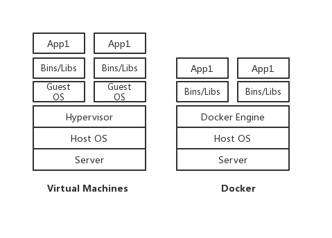

[TOC]

容器是app层面的隔离
虚拟化是物力资源层面的隔离

# 虚拟化vs容器化
虚拟化的优点
资源池：一个物理机的资源分配到了不同的虚拟机里
很容易扩展：加物理机器or加虚拟机
很容易云化：亚马逊AWS,阿里云等
虚拟化的局限性
每一个虚拟机都是一个完整的操作系统，要给其分配资源，当虚拟机数量增多时，操作系统本身消耗的资源势必增多

# 什么是容器
对软件和其依赖的标准化打包
应用之间相互隔离
共享一个OS Kernel
可以运行在很多主流操作系统上

# 虚拟机
首先，大家需要明确一点，Docker容器不是虚拟机！
使用虚拟机运行多个相互隔离的应用时，如下图：

+ 基础设施（Infrastructure）。它可以是你的个人电脑，数据中心的服务器，或者是云主机。
+ 主操作系统（Host Operating System）。你的个人电脑之上，运行的可能是MacOS，Windows或者某个Linux发行版。
+ **虚拟机管理系统（Hypervisor）**。利用Hypervisor，可以在主操作系统之上运行多个不同的从操作系统。类型1的Hypervisor有支持MacOS的HyperKit，支持Windows的Hyper-V以及支持Linux的KVM。类型2的Hypervisor有VirtualBox和VMWare。
+ 从操作系统（Guest Operating System）。假设你需要运行3个相互隔离的应用，则需要使用Hypervisor启动3个从操作系统，也就是3个虚拟机。这些虚拟机都非常大，也许有700MB，这就意味着它们将占用2.1GB的磁盘空间。更糟糕的是，它们还会消耗很多CPU和内存。

各种依赖。每一个从操作系统都需要安装许多依赖。如果你的的应用需要连接PostgreSQL的话，则需要安装libpq-dev；如果你使用Ruby的话，应该需要安装gems；如果使用其他编程语言，比如Python或者Node.js，都会需要安装对应的依赖库。
应用。安装依赖之后，就可以在各个从操作系统分别运行应用了，这样各个应用就是相互隔离的。

# Docker容器
使用Docker容器运行多个相互隔离的应用时，如下图：

+ 主操作系统（Host Operating System）。所有主流的Linux发行版都可以运行Docker。对于MacOS和Windows，也有一些办法"运行"Docker。
+ Docker守护进程（Docker Daemon）。Docker守护进程取代了Hypervisor，它是运行在操作系统之上的后台进程，负责管理Docker容器。
+ 各种依赖。对于Docker，应用的所有依赖都打包在Docker镜像中，Docker容器是基于Docker镜像创建的。
+ 应用。应用的源代码与它的依赖都打包在Docker镜像中，不同的应用需要不同的Docker镜像。不同的应用运行在不同的Docker容器中，它们是相互隔离的。

# 对比虚拟机与Docker
Docker守护进程可以直接与主操作系统进行通信，为各个Docker容器分配资源；它还可以将容器与主操作系统隔离，并将各个容器互相隔离。虚拟机启动需要数分钟，而Docker容器可以在数毫秒内启动。由于没有臃肿的从操作系统，Docker可以节省大量的磁盘空间以及其他系统资源。

说了这么多Docker的优势，大家也没有必要完全否定虚拟机技术，因为两者有不同的使用场景：
+ 虚拟机更擅长于彻底隔离整个运行环境。例如，云服务提供商通常采用虚拟机技术隔离不同的用户。
+ Docker通常用于隔离不同的应用，例如前端，后端以及数据库。

+ 容器使用由Linux内核提供的命名空间，大多数人把命名空间认为是一个上下文或域的授权决定（进程X有权访问资源Y）。
+ 如果容器内的进程扫描文件系统来寻找要获取的东西，它只能找到容器内明确可见的文件。
+ 如果容器内的进程中想尝试做一些恶意的事情，比如打开端口31337后门服务，它不会有多大用处，因为这个端口实际上不会暴露在容器外的任何地方。容器内部的恶意进程不能访问的任何容器外的其他进程的内存。
+ 有几个方法可以摆脱容器的束缚，但这些通常需要容器的root访问权限。
+ 不要以root运行应用程序，通过简单的几个步骤稳固root访问权限。
+ 容器使用cgroup来提供与虚拟机相同级别的资源使用保护机制。容器和虚拟机都可以获取整个网络链接。
+ 容器运行的是不完整的操作系统（尽管它们可以），虚拟机必须运行完整的。
+ 容器比虚拟机使用更少的闲置资源，它们不运行完整的操作系统。
+ 容器在在云硬件（或虚拟机）中可以被复用，就像虚拟机在裸机上可以被复用。
+ 容器需要毫秒分配，虚拟机需要几分钟。所以，你可以另配、重新平衡、释放以及使用容器比虚拟机的迭代更加迅速。
+ 如果每个容器运行的只有一个服务或者数据库，这是比较容易管理的。而且比较容易监控性能，了解故障的影响，并预测成本。
+ 离目标进程越远，隔离会变得更昂贵。虚拟机是伟大的，它通过抽象来增加并行，服务于多操作系统的使用情况以及业界最好的安全性。但对于隔离，它们相当的昂贵，容器提供的隔离就便宜。

# 服务器虚拟化vs Docker
服务器好比运输码头：拥有场地和各种设备（服务器硬件资源）

服务器虚拟化好比作码头上的仓库：拥有独立的空间堆放各种货物或集装箱

(仓库之间完全独立，独立的应用系统和操作系统）

Docker比作集装箱：各种货物的打包

(将各种应用程序和他们所依赖的运行环境打包成标准的容器,容器之间隔离)

Docker有着小巧、迁移部署快速、运行高效等特点，但隔离性比服务器虚拟化差：不同的集装箱属于不同的运单（Docker上运行不同的应用实例），相互独立（隔离）。但由同一个库管人员管理（主机操作系统内核），因此通过库管人员可以看到所有集装箱的相关信息（因为共享操作系统内核，因此相关信息会共享）。

服务器虚拟化就好比在码头上（物理主机及虚拟化层），建立了多个独立的“小码头”—仓库（虚拟机）。其拥有完全独立（隔离）的空间，属于不同的客户（虚拟机所有者）。每个仓库有各自的库管人员（当前虚拟机的操作系统内核），无法管理其它仓库。不存在信息共享的情况

因此，我们需要根据不同的应用场景和需求采用不同的方式使用Docker技术或使用服务器虚拟化技术。例如一个典型的Docker应用场景是当主机上的Docker实例属于单一用户的情况下，在保证安全的同时可以充分发挥Docker的技术优势。对于隔离要求较高的环境如混合用户环境，就可以使用服务器虚拟化技术。正则科技提供了丰富的Docker应用实例，满足您的各种应用需求，并且支持在已经安装了自在（Isvara）服务器虚拟化软件的主机上同时使用服务器虚拟化技术和Docker技术提供不同技术场景。

# 容器 & Docker & 虚拟机
Container(容器)是一种轻量级的虚拟化技术，它不需要模拟硬件创建虚拟机。在Linux系统里面，使用到Linux kernel的cgroups，namespace(ipc，network， user，pid，mount），capability等用于隔离运行环境和资源限制的技术，我们称之为容器。容器技术早就出现。例如Solaris Zones 和 BSD jails 就是非 Linux 操作系统上的容器，而用于 Linux 的容器技术也有很多如 Linux-Vserver、OpenVZ 和 FreeVPS。虽然这些技术都已经成熟，但是这些解决方案还没有将它们的容器支持集成到主流 Linux 内核。总的来说，容器不等同于Docker，容器更不是虚拟机。

LXC项目由一个 Linux 内核补丁和一些 userspace 工具组成，它提供一套简化的工具来维护容器，用于虚拟环境的环境隔离、资源限制以及权限控制。LXC有点类似chroot，但是它比chroot提供了更多的隔离性。

Docker最初目标是做一个特殊的LXC的开源系统，最后慢慢演变为它自己的一套容器运行时环境。Docker基于Linux kernel的CGroups，Namespace，UnionFileSystem等技术封装成一种自定义的容器格式，用于提供一整套虚拟运行环境。毫无疑问，近些年来Docker已经成为了容器技术的代名词，如其官网介绍的Docker is world's leading software containerization platform。本文会先简单介绍Docker基础概念，然后会分析下Docker背后用到的技术。Debian上安装Docker方法参见docker-ce-installation-in-debian。

# Docker和虚拟机有各自擅长的领域，在软件开发、测试场景和生产运维场景中各有优劣
1. Docker启动快速属于秒级别。虚拟机通常需要几分钟去启动。
2. Docker需要的资源更少，Docker在操作系统级别进行虚拟化，Docker容器和内核交互，几乎没有性能损耗，性能优于通过Hypervisor层与内核层的虚拟化。
3. Docker更轻量，Docker的架构可以共用一个内核与共享应用程序库，所占内存极小。同样的硬件环境，Docker运行的镜像数远多于虚拟机数量。对系统的利用率非常高。
4. 与虚拟机相比，Docker隔离性更弱，Docker属于进程之间的隔离，虚拟机可实现系统级别隔离。
5. 安全性：Docker的安全性也更弱。Docker的租户root和宿主机root等同，一旦容器内的用户从普通用户权限提升为root权限，它就直接具备了宿主机的root权限，进而可进行无限制的操作。虚拟机租户root权限和宿主机的root虚拟机权限是分离的，并且虚拟机利用如Intel的VT-d和VT-x的ring-1硬件隔离技术，这种隔离技术可以防止虚拟机突破和彼此交互，而容器至今还没有任何形式的硬件隔离，这使得容器容易受到攻击。
6. 可管理性：Docker的集中化管理工具还不算成熟。各种虚拟化技术都有成熟的管理工具，例如VMware vCenter提供完备的虚拟机管理能力。
7. 高可用和可恢复性：Docker对业务的高可用支持是通过快速重新部署实现的。虚拟化具备负载均衡、高可用、容错、迁移和数据保护等经过生产实践检验的成熟保障机制，VMware可承诺虚拟机99.999%高可用，保证业务连续性。
8. 快速创建、删除：虚拟化创建是分钟级别的，Docker容器创建是秒级别的，Docker的快速迭代性，决定了无论是开发、测试、部署都可以节约大量时间。
9. 交付、部署：虚拟机可以通过镜像实现环境交付的一致性，但镜像分发无法体系化；Docker在Dockerfile中记录了容器构建过程，可在集群中实现快速分发和快速部署。
