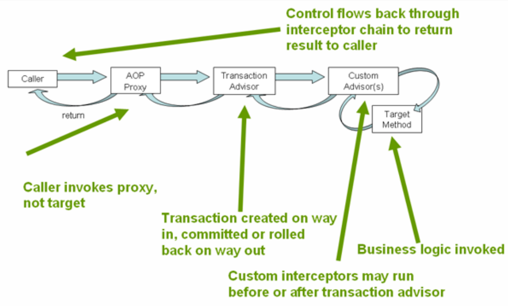

[TOC]

# 事务抽象的核心接口
PlatformTransactionManager
+ DataSourceTransactionManager
+ HibernateTransactionManager
+ JtaTransactionManager

TransactionDefinition
+ Propagation
+ Isolation
+ Timeout
+ Read-only status

```java
public interface PlatformTransactionManager extends TransactionManager {
    TransactionStatus getTransaction(@Nullable TransactionDefinition definition)
    			throws TransactionException;
    void commit(TransactionStatus status) throws TransactionException;
    void rollback(TransactionStatus status) throws TransactionException;
}
```

# 事务的传播特性
|          传播值           | 值  |                描述                |
| ------------------------ | --- | ---------------------------------- |
| PROPAGATION_REQUIRED(*)  | 0   | 当前有事务就用当前的，没有就用新的（默认） |
| PROPAGATION_SUPPORTS     | 1   | 事务可有可无，不是必须的               |
| PROPAGATION_MANDATORY    | 2   | 当前一定要有事务，不然就抛异常           |
| PROPAGATION_REQUIRES_NEW(*) | 3   | 无论是否有事务，都起个新的事务           |
| PROPAGATION_NOT_SUPPORTED| 4   | 不支持事务，按非事务方式运行            |
| PROPAGATION_NEVER         | 5   | 不支持事务，如果有事务则抛异常           |
| PROPAGATION_NESTED(*)        | 6   | 当前有事务就在当前事务里再起一个事务      |

# 事务隔离特性
|           隔离值           | 值  |  脏读  | 不可重复读 | 幻读 |
| ------------------------- | --- | ----- | -------- | --- |
| ISOLATION_READ_UNCOMMITTED | 1   | 允许   | 允许      | 允许 |
| ISOLATION_READ_COMMITTED   | 2   | 不允许 | 允许      | 允许 |
| ISOLATION_REPEATABLE_READ  | 3   |    不允许   |    不允许      | 允许 |
| ISOLATION_SERIALIZABLE     | 4   |    不允许   |   不允许       |  不允许   |

默认为：-1由数据库决定
ProgrammaticTransaction

# 编程式事务
TransactionTemplate

# 声明式事务(基于注解)

## 开启事务注解的方式
+ @EnableTransactionManagement
+ <tx:annotation-driven/>
## 一些配置
+ proxyTargetClass：aop基于接口还是基于类
+ mode
+ order
# Transactional
+ transactionManager
+ propagation
+ isolation
+ timeout
+ readOnly

# Spring的JDBC异常抽象