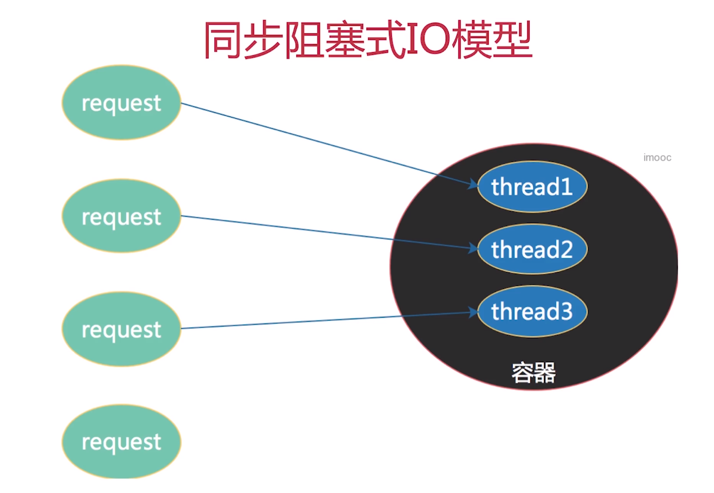
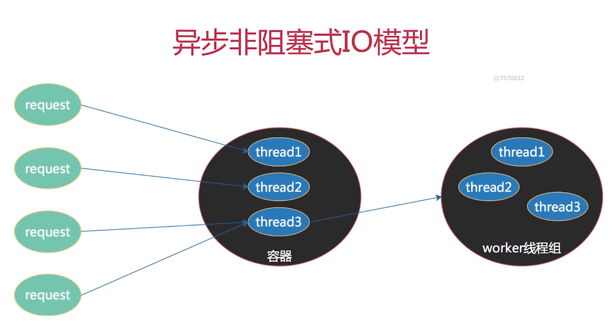
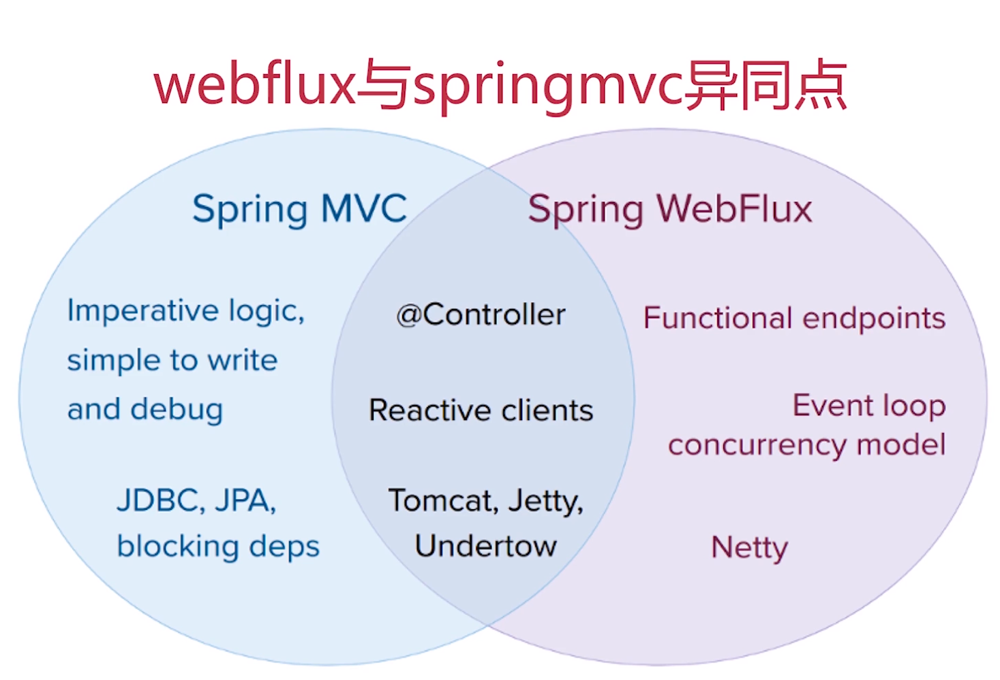
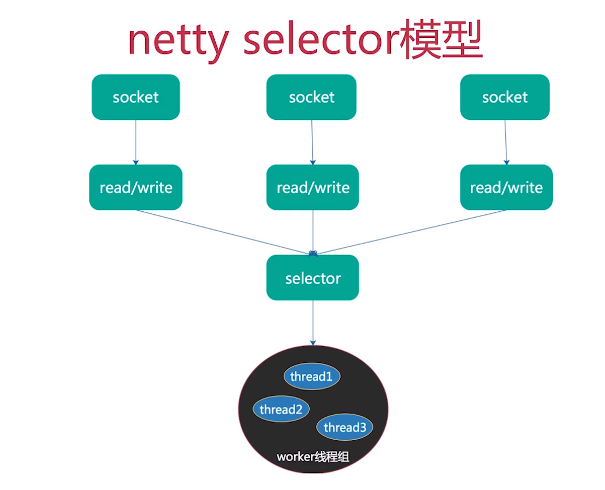

[TOC]

传统的spring mvc使用的是同步阻塞式io模型

springflux使用异步非阻塞io模型

spring webflux不支持mysql，因其为异步非阻塞模式
不易调试
不支持阻塞的持久化api
响应式编程

# Reactive Streams
+ 一套基于jvm面向流式类库2的标准和规范
+ 具有处理无限数量数据的能力
+ 异步非阻塞的传递数据
+ 按序处理数据
+ 必须实现非阻塞的背压