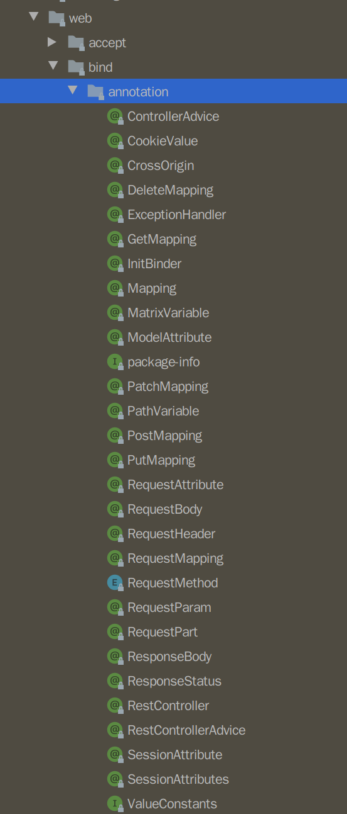

[TOC]

# @SpringBootApplication：配置启动类
组合注解
```java
@Target(ElementType.TYPE)
@Retention(RetentionPolicy.RUNTIME)
@Documented
@Inherited
@SpringBootConfiguration
@EnableAutoConfiguration
@ComponentScan(excludeFilters = { @Filter(type = FilterType.CUSTOM, classes = TypeExcludeFilter.class),
		@Filter(type = FilterType.CUSTOM, classes = AutoConfigurationExcludeFilter.class) })
public @interface SpringBootApplication {
    @AliasFor(annotation = EnableAutoConfiguration.class)
	Class<?>[] exclude() default {};

	@AliasFor(annotation = EnableAutoConfiguration.class)
	String[] excludeName() default {};

	@AliasFor(annotation = ComponentScan.class, attribute = "basePackages")
	String[] scanBasePackages() default {};

	@AliasFor(annotation = ComponentScan.class, attribute = "basePackageClasses")
	Class<?>[] scanBasePackageClasses() default {};

	@AliasFor(annotation = Configuration.class)
	boolean proxyBeanMethods() default true;
}
```
# @Component：注入容器
把普通pojo实例化到spring容器中，相当于配置文件中的 `<bean id="" class=""/>`
```java
@Target(ElementType.TYPE)
@Retention(RetentionPolicy.RUNTIME)
@Documented
@Indexed
public @interface Component {

	/**
	 * The value may indicate a suggestion for a logical component name,
	 * to be turned into a Spring bean in case of an autodetected component.
	 * @return the suggested component name, if any (or empty String otherwise)
	 */
	String value() default "";

}
```
# @Configuration：
指示一个类声明一个或多个@Bean方法，并且可以由Spring容器处理，这些方法将会被AnnotationConfigApplicationContext或AnnotationConfigWebApplicationContext类进行扫描，并用于构建bean定义，以便在运行时为这些bean生成BeanDefinition和服务请求，它也是一组合注解，其内置@Component，这表明它也会被注入容器
```java
@Target(ElementType.TYPE)
@Retention(RetentionPolicy.RUNTIME)
@Documented
@Component
public @interface Configuration {}
```
demo
```java
@Configuration
public class AnnConfiguration {

    @Bean
    public DemoEntry demoEntry() {
        return new DemoEntry();
    }

    @Bean("userMap")
    public HashMap diMap(){
        return new HashMap(){
            {
                put("xiaoming",'1');
                put("xiaohong",'2');
            }
        };
    }
}
public class DemoEntry {
    private int id = 1;
    public void print(){
        System.out.println("DemoEntry is new and id is "+id);
    }
}
等同于
@Component
public class DemoEntry {
    private int id = 1;
    public void print(){
        System.out.println("DemoEntry is new and id is "+id);
    }
}
```
# @Bean
该注解主要用在@Configuration注解的类里，也可以用在@Component注解的类里。添加的bean的id为方法名。相当于配置文件里的`<bean></bean>`
```
@Configuration
public class AnnConfiguration {
    @Bean("userMap")
    public HashMap diMap(){
        return new HashMap(){
            {
                put("xiaoming",'1');
                put("xiaohong",'2');
            }
        };
    }
}

@Component
public class AnnConfiguration {
    @Bean("userMap")
    public HashMap diMap(){
        return new HashMap(){
            {
                put("xiaoming",'1');
                put("xiaohong",'2');
            }
        };
    }
}
```
# @SpringbootConfiguration：
拓展@Configuration
# @ComponentScan

# @EnableAutoConfiguration

# @PathVariable

# @PathParam 错的
`localhost:8080/introduction/1/2/3/4/5  对应下面的  /{bookId}/{gg}/{version}/{plarform}/{vps}`
代码
```java
@GET
@Path("/introduction/{bookId}/{gg}/{version}/{plarform}/{vps}")
Response introduction(
    @PathParam ("bookId") Integer bookId,
    @PathParam ("gg") Integer gg,
    @PathParam ("version") String version,
    @PathParam ("platform") String platform,
    @PathParam ("vps") String vps
);
```
# @QueryParam 错的
`localhost:8080/introduction?booId=1?gg=2?version=3?platform=4?vps=5`
代码
```java
@GET
@Path("/introduction")
Response introduction(
    @QueryParam("bookId") Integer bookId,
    @QueryParam("gg") Integer gg,
    @QueryParam("version") String version,
    @QueryParam("platform") String platform,
    @QueryParam("vps") String vps
);
```

# Springboot集成Mybatis
spring中结合mybatis中，默认情况下，数据库处于自动提交模式，每一条sql语句处于一个单独的事务中，语句执行完毕时，如果执行成功则隐式提交事务。而mybatis的一级缓存在这种情况下是无效的，想要一级缓存起作用，则要开启事务：
+ 开启事务：spring使用ThreadLocal获取当前资源绑定同一个SQLSession
+ 未开启事务：每次查询，spring关闭旧的SslSession，创建一个新的Sqlsession对象，一级缓存补气作用

有一点需要注意：如果对某个SqlSession执行了commit，则会清空这个SqlSession中的一级缓存，目的是为了防止脏读，在上面的例子中，如果第一次查询后，，做了一次更新操作，然后sqlSession.commit()了，此时会清空整个SqlSession的一级缓存，那么第二次查询时就得重新的从数据中查询了
