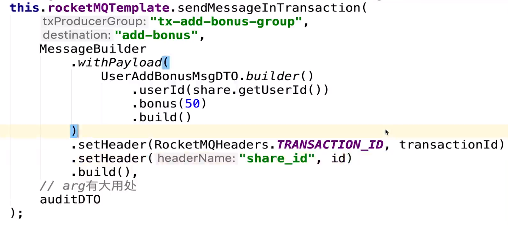
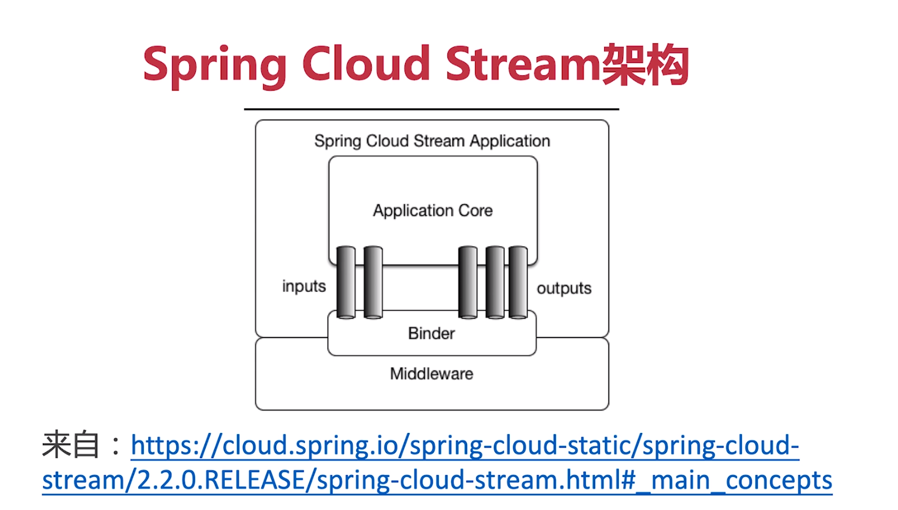
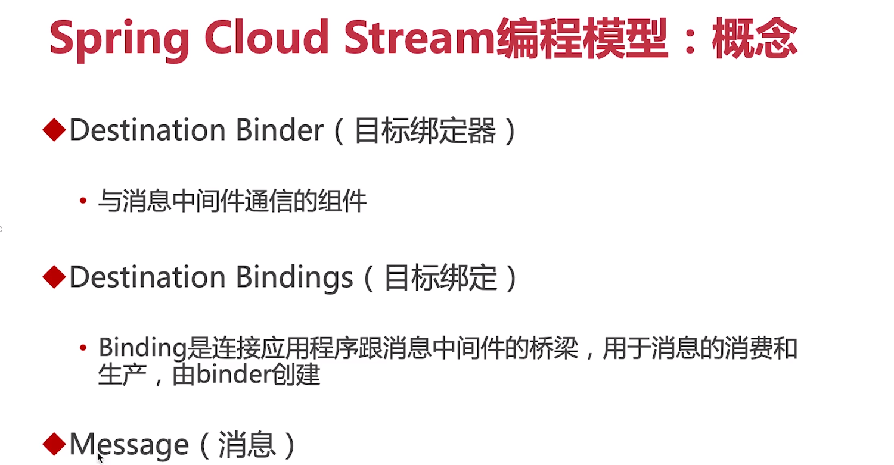
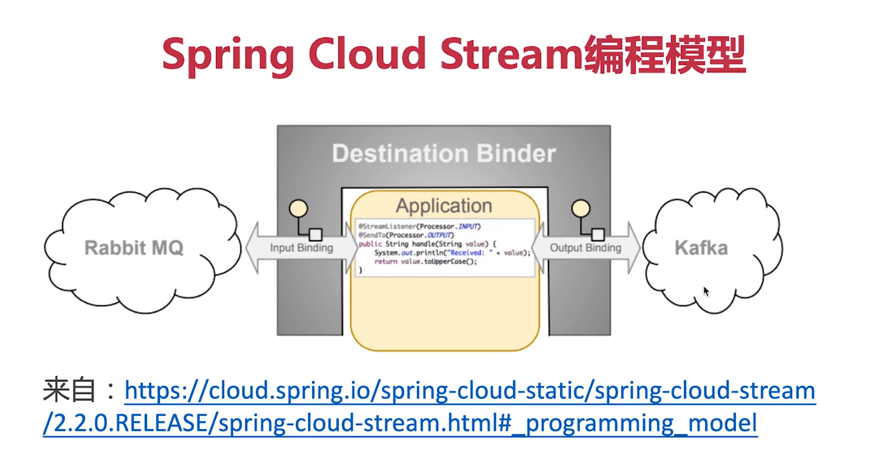

二次确认


```sql
create table rocketmq_transaction_log
(
  id             int auto_increment comment 'id'
    primary key,
  transaction_Id varchar(45) not null comment '事务id',
  log            varchar(45) not null comment '日志'
)
comment 'RocketMQ事务日志表';
```

# 发送半消息
sendMessageInTransaction



idea抽出方法
idea的停止按钮的优雅停机，会将代码执行完成

# Spring Cloud Stream
+ 一个用于构建消息驱动的微服务框架








