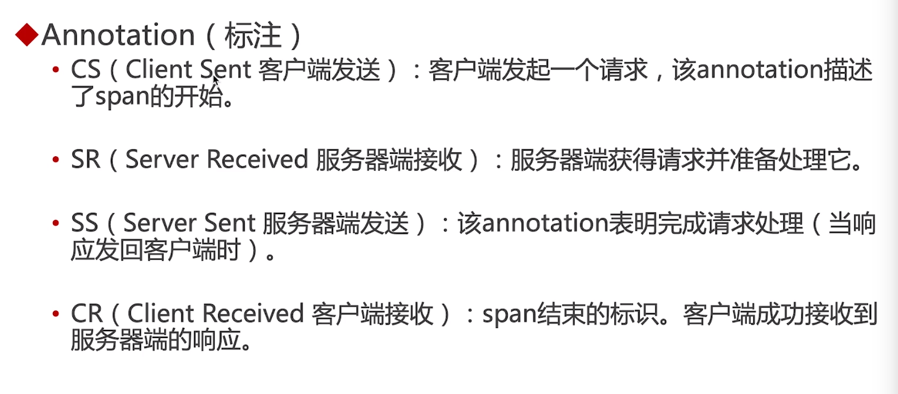

[TOC]

sleuth是一个spring cloud的分布式跟踪解决方案
sleuth集成在每个微服务上，负责产生数据

# 术语
Span（跨度）：sleuth的基本工作单元，它用一个64位的id唯一标识。除id外，span还包含其他数据，例如描述、时间戳事件、键值对的注解（标签）、span id、span父id等
trace（追踪）：一组span组成的树状结构称为trace
annotation（标注）：



# 配置
pom依赖
```xml
<dependency>
    <groupId>org.springframework.cloud</groupId>
    <artifactId>spring-cloud-starter-sleuth</artifactId>
</dependency>
```
不需要添加注解配置，将sleuth日志级别设置为debug，打印出链路日志
```yml
logging:
    level:
        org.springframework.cloud.sleuth: debug
```


