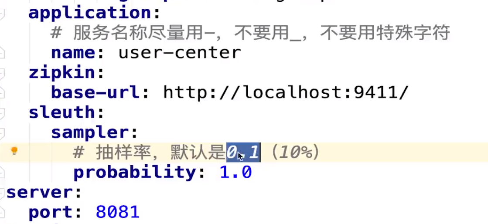
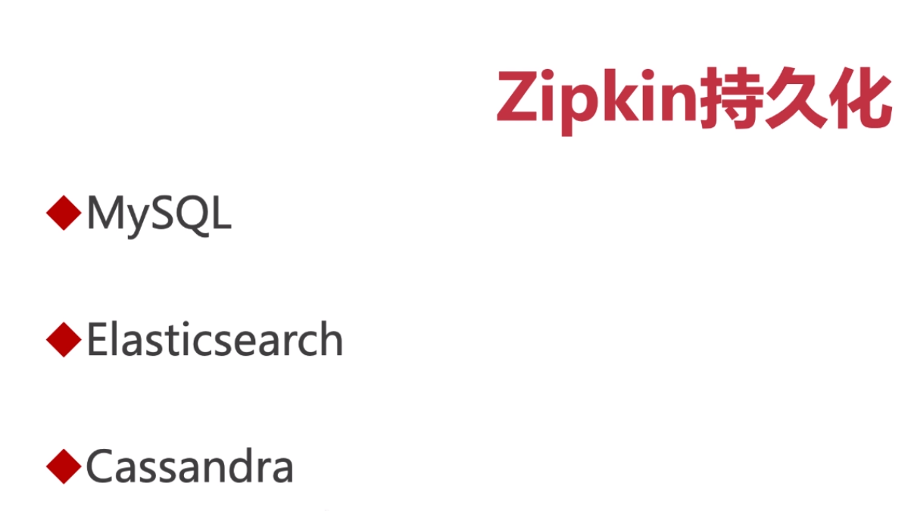
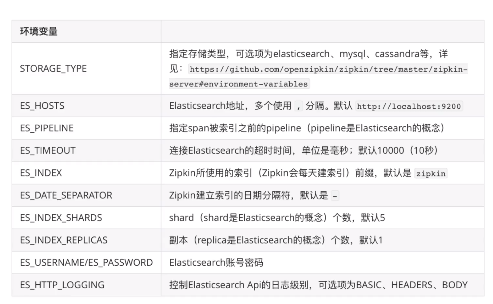
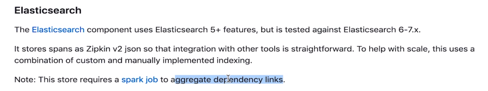
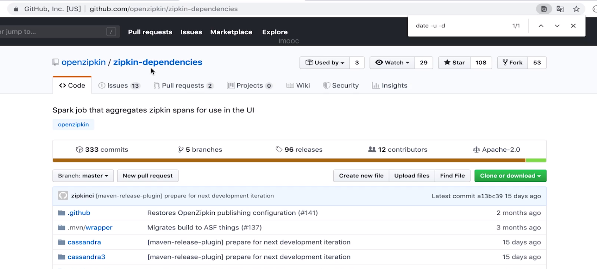
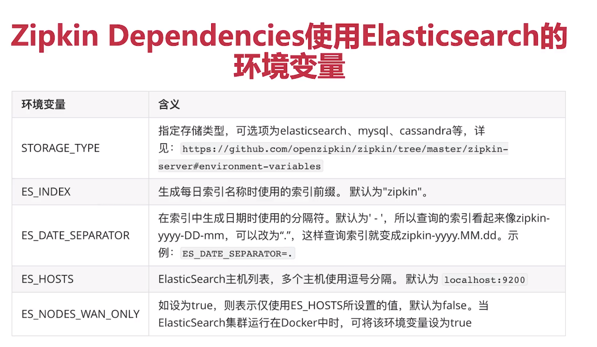
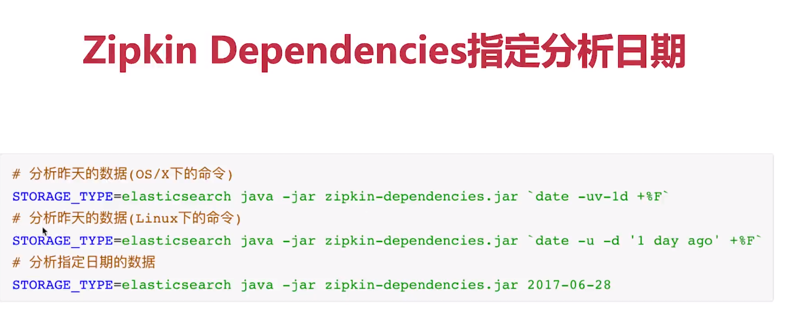

[TOC]

zipkin是twitter开源的分布式跟踪系统，主要用来收集系统的时序数据，从而追踪系统的调用问题

# 下载最新的zipkin
官方下载工具下载最新版
```
$ curl -sSL https://zipkin.io/quickstart.sh | bash -s
```
# 启动
```
$ java -jar zinpin.jar
```

# 配置
配置zipkin就不需要配置sleuth
```xml
<dependency>
    <groupId>org.springframework.cloud</groupId>
    <artifactId>spring-cloud-starter-zipkin</artifactId>
</dependency>
```




nacos报错

291578




zipkin环境变量，配置之后会将数据存储到es里面了


如果使用es来存储，需要一个sparkjob来分析，才会有流程图








