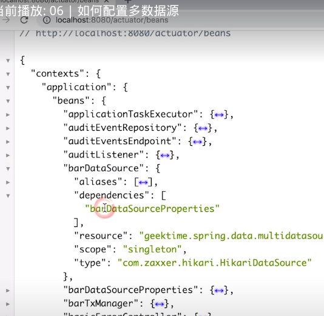

[TOC]

区分数据源与连接池

不同数据源的配置要分开

关注每次使用的数据源
+ 有多个DataSource时系统如何判断
+ 对应的设施（事务、ORM等）如何选择DataSource

手工配置两组DataSource及相关内容

与SpringBoot协同工作（二选一）
+ 配置@Primary类型的Bean
+ 排除SpringBoot的自动配置
    + DataSourceAutoConfiguration
    + DataSourceTransactionManagerAutoConfiguration
    + JdbcTemplateAutoCOnfiguration

beans页面