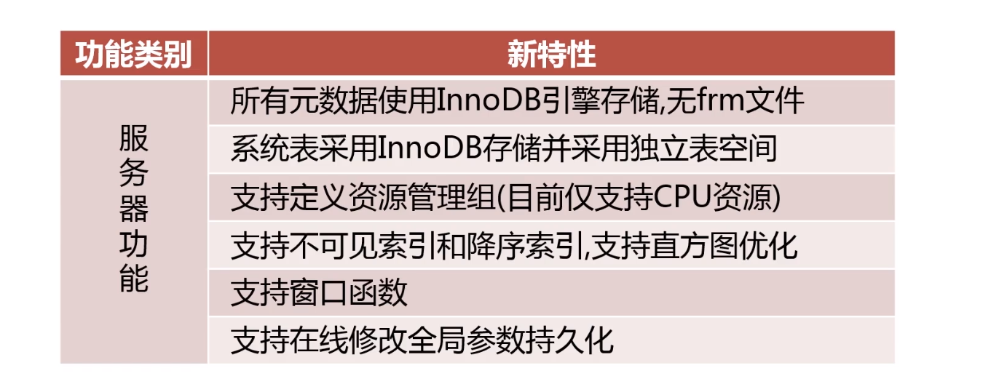

[TOC]

# MySQL常见发行版本（企业版、社区版）
## MySQL
## Percona MySQL
集成了很多企业版有的功能，是在官方社区版本上二次开发的，所以版本会落后于官方版本
## MariaDB

mariaDB远程服务器表连接

innoDB不是开源产品

# 高可用

mariaBD可以作为MySQL官方版本的从来使用，反过来不行

多主复制集群MGR集群
主从延迟

# 安全

# 开发及管理

支持基于日志的回滚：类似于oracle的闪回
Super read_only：防止特权用户在slave写操作

---

# 如何对MySQL进行升级
+ 为什么要升级？
+ 升级的具体步骤

先升级slave，后将slave变成master，在mysql中高版本的数据库是可以作为低版本服务器的slave来使用的

# 升级前考虑的因素
+ 升级可以给业务带来的益处
+ 升级可能对业务带来的影响
+ 数据库升级方案的制定
+ 升级失败的回滚方案

# 是否可以解决业务上的某一方法的痛点：
例如mysql5.6升级到mysql5.7，由于5.7增强了多线程复制，支持更好的并发性，大幅度的缓解了主从延迟的时间

例如业务上使用了大量的json类型，mysql8之前的版本在使用row格式进行二进制复制时，对json类型的复制是全部复制，而不是只复制被修改的一部分

# 是否可以解决运维上某一方法的痛点：

# 对原业务程序的性能是否有影响

# 数据库升级方案的制定
+ 评估受影响的业务系统

# mysql8.0新特性
5.6对比5.7

原来的版本只支持生序索引

