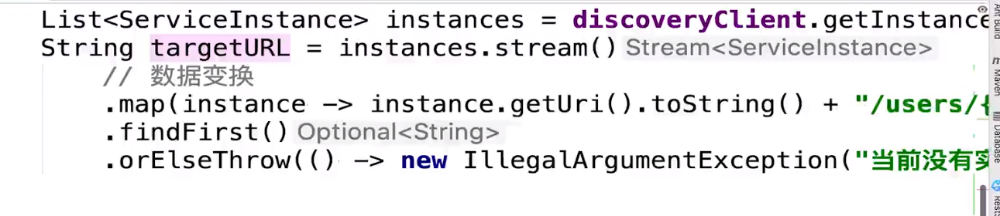
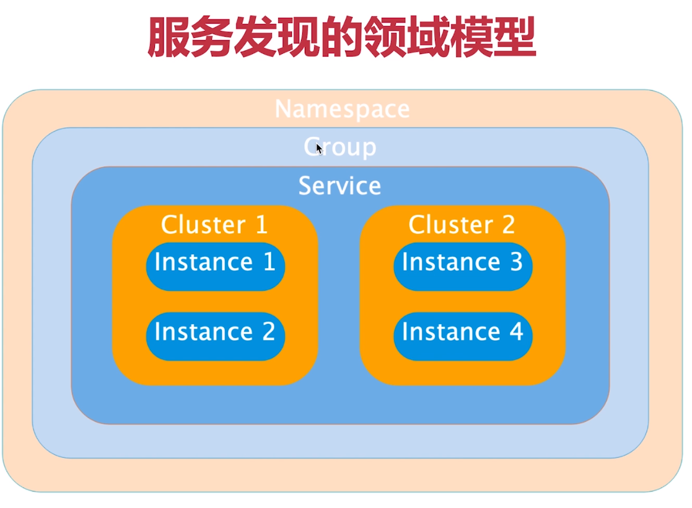
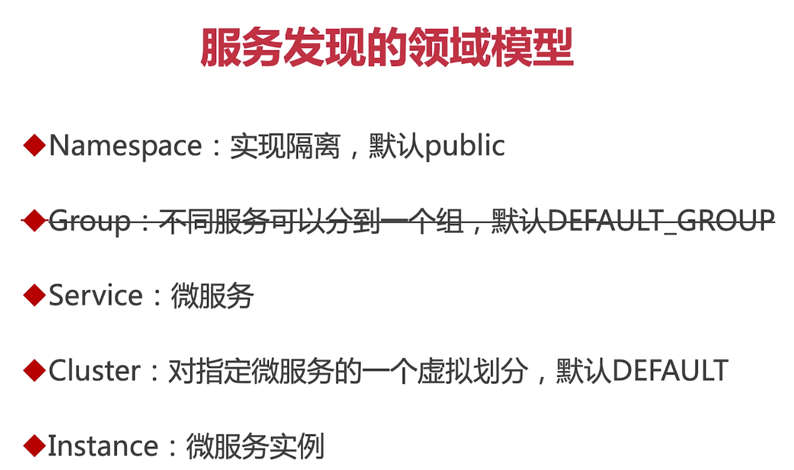
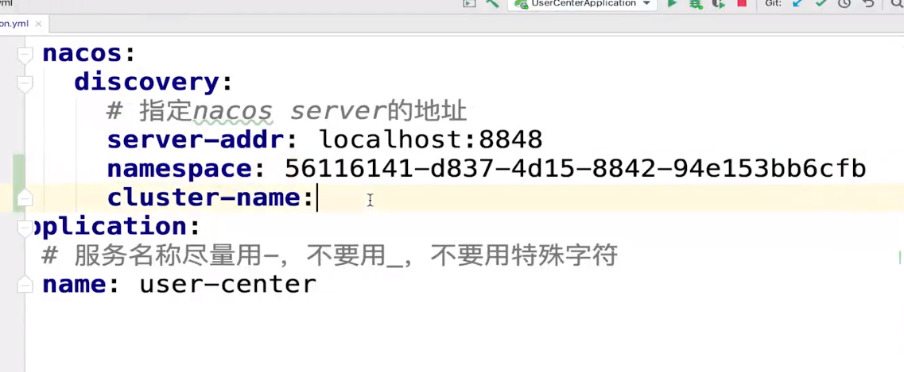

[TOC]

# 服务提供者与服务消费者
|   名词    |                   定义                    |
| -------- | ---------------------------------------- |
| 服务提供者 | 服务的被调用方（即：为其他微服务提供接口的微服务） |
| 服务消费者 | 服务的调用方（即：调用其他微服务接口的微服务）    |

# Nacos
+ 服务发现组件
+ 配置服务器

# 下载
https://github.com/alibaba/nacos/tags

# 文档
https://nacos.io/zh-cn/docs/quick-start.html

# 启动命令
```
sh startup.sh -m standalone
```

# Nacos依赖
```xml
<dependency>
    <groupId>org.springframework.cloud</groupId>
    <artifactId>spring-cloud-starter-alibaba-nacos-discovery</artifactId>
</dependency>
```

@EnableDiscoveryClient
早期版本需要添加注解

```yml
cloud:
    nacos:
        discovery:
            # 指定nacos server地址
            server-addr:localhost：8848
application：
    # 服务名称尽量用-，不要用_，不要用特殊字符
    name:user-center
```

控制台：
http://localhost:8848/nacos
默认用户名
amdin:nacos
pwd:nacos

# DiscoveryClient







