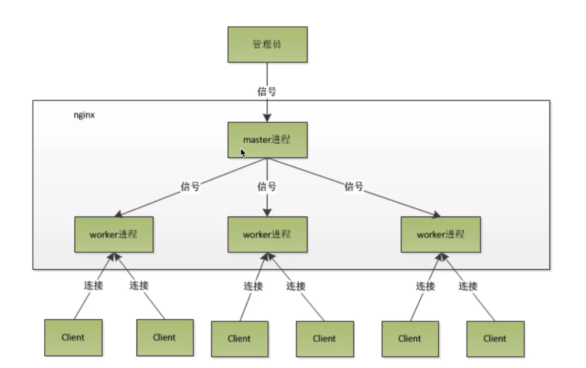

[TOC]

# 版本选择
+ 原版nginx模块太多，配置lua复杂
+ openResty版本比较懒人包

# 安装OpenResty版本安装
1. 配置`.configure`
2. 编译`make`
3. 安装`make install`

# 常用命令
```
>nginx -c nginx.conf    #启动
>nginx -s reload    #无缝重启
>nginx -s quit    #安全退出服务
>nginx -s stop    #强制关闭
```

# 配置文件
## server节点
```
http {
    #设定mime类型,类型由mime.type文件定义
    include    mime.types;
    default_type  application/octet-stream;
    #设定日志格式
    log_format  main  '$remote_addr - $remote_user [$time_local] "$request" '
                      '$status $body_bytes_sent "$http_referer" '
                      '"$http_user_agent" "$http_x_forwarded_for"';
 
    access_log  logs/access.log  main;
 
    #sendfile 指令指定 nginx 是否调用 sendfile 函数（zero copy 方式）来输出文件，
    #对于普通应用，必须设为 on,
    #如果用来进行下载等应用磁盘IO重负载应用，可设置为 off，
    #以平衡磁盘与网络I/O处理速度，降低系统的uptime.
    sendfile     on;
    #tcp_nopush     on;
 
    #连接超时时间
    #keepalive_timeout  0;
    keepalive_timeout  65;
    tcp_nodelay     on;
 
    #开启gzip压缩
    gzip  on;
    gzip_disable "MSIE [1-6].";
 
    #设定请求缓冲
    client_header_buffer_size    128k;
    large_client_header_buffers  4 128k;
 
 
    #设定虚拟主机配置
    server {
        #侦听80端口
        listen    80;
        #定义使用 www.nginx.cn访问
        server_name  www.nginx.cn;
 
        #定义服务器的默认网站根目录位置
        root html;
 
        #设定本虚拟主机的访问日志
        access_log  logs/nginx.access.log  main;
 
        #默认请求
        location / {
            
            #定义首页索引文件的名称
            index index.php index.html index.htm;   
 
        }
 
        # 定义错误提示页面
        error_page   500 502 503 504 /50x.html;
        location = /50x.html {
        }
 
        #静态文件，nginx自己处理
        location ~ ^/(images|javascript|js|css|flash|media|static)/ {
            
            #过期30天，静态文件不怎么更新，过期可以设大一点，
            #如果频繁更新，则可以设置得小一点。
            expires 30d;
        }
 
        #PHP 脚本请求全部转发到 FastCGI处理. 使用FastCGI默认配置.
        location ~ .php$ {
            fastcgi_pass 127.0.0.1:9000;
            fastcgi_index index.php;
            fastcgi_param  SCRIPT_FILENAME  $document_root$fastcgi_script_name;
            include fastcgi_params;
        }
 
        #禁止访问 .htxxx 文件
            location ~ /.ht {
            deny all;
        }
 
    }
}
```

# mine.type文件

# 功能
+ 使用nginx作为web服务器
+ 使用nginx作为动静分离服务器
+ 使用nginx作为反向代理服务器

## 静态代理
```nginx
http {
    include mine.types;
    default_type application/octet-stream;
    server{
        listen 80;
        server_name localhost;

        location / {
            root /html#路径，注意权限
            index index.html index.htm;
        }
    }
}
```
## 动静分离
```nginx
http {
    include mine.types;
    default_type application/octet-stream;
    server{
        listen 80;
        server_name localhost;

        location /resources/ {
            alise /resources/#注意，这里一定要有个/ 
            index index.html index.htm;
        }
    }
}
```
## 反向代理
```nginx
http {
    include mine.types;
    default_type application/octet-stream;

    upstream servers{
        server ip:port weight=1;#weigth权重
        server ip:port weight=1;#weigth权重
    }

    server{
        listen 80;
        server_name localhost;

        location / {
            proxy_pass http://servers;
            proxy_set_header Host $http_host:$proxy_port;
            proxy_set_header X-Real-IP $remote_addr;
            proxy_set_header X-Forwarded-For $proxy_add_x_forwarded_for;
        }
    }
}
```

# nginx keepalivetime长连接
http1.0协议默认是不支持keepalive的，使用http1.1自动设置keepalive，并将header头文件置空
```
upstream servers{
    server ip:port weight=1;
    keepalive 30;
}

location / {
    proxy_http_version 1.1;
    proxy_set_header Connection "";
}
```

netstat -an | grep ip | grep ESTABLISHED
netstat -an | grep ip | grep TIME_WAIT

---

# nginx高性能原因
+ epoll多路复用
+ master worker进程模型
+ 协程机制

# epoll多路复用
+ java bio模型，阻塞进程式
+ linux select模型，变更触发轮训查找，有1024数量上限
+ epoll模型，变更查房回调直接读取，理论上无上限

## java bio模型
client与server通过tcp/ip的一个socket长连接去完成建联的操作
client向server发送数据的时候就会有一个socker.write操作，这个操作就是一个bio模型
client只有等到socket.write的所有字节流input到server的缓冲区之后，对应的client才会返回
若网络发送的很慢，我们的tcp/ip的缓冲区被塞满的时候，client就不得不等待网络当中把对应的信息传输过去，使得缓冲区有空间给上游的人去写的时候，才可能会达到直接返回这样的一个效果
## linux select模型
假设server有100个client
server首先阻塞自己，并且监听100个客户端连接，是否有变化，若有变化则唤醒自己，回去循环遍历100个连接，找到发生变化的一个或多个，然后执行read操作
select多路复用：一个select可以对应n个客户端连接
## epoll模型
假设server有100个client
server首先阻塞自己，并且监听100个客户端连接，是否有变化，设置回调函数，若有变化则唤醒自己并执行回调函数
netty就是基于epoll模型

# master-worker进程模型


reload操作
master进程的进程号并没有发生改变
worker进程发生改变

master主进程可以管理worker子进程的内存资源
worker是由master通过fork操作生成的

每一个worker内部只有一个线程(epoll模型),如果线程的内部是没有任何阻塞操作的，那么单线程的调用会比多线程的调用更快，为什么会有多线程？是因为一些io阻塞方法，或者一些耗时的任务处理，会导致block住其他的一些应用。

# 协程机制
+ 依赖于线程的内存模型，切换开销小
+ 遇阻塞及归还执行权，代码同步
+ 无需加锁

异步的坏处：处理对应的顺序的控制流就非常麻烦，处理异步控制流，就得异步回调函数内嵌套异步回调函数的机制

golang语言就基于协程

协程是一个线程更小的一个内存模型的概念，它是依附于线程的内存模型，因此他的切换，比如说一个线程可能有多个协程。协程之间的切换开销是非常小的，因为它不需要像线程一样有cpu的切换开销，它只需要一个内存的切换开销即可，然后我们对应的协程的运行其实就是线程的运行，cpu执行的还是线程并非是协程，协程只是线程的一个内存模型而已，若我们的协程程序遇到任何的阻塞的时候，我们的nginx的会立刻将对应的协程执行权限剥夺，并交给另外一个不阻塞的协程运行。这样做的好处是，我们对应的协程开发都是顺序性的执行代码。协程不需要加锁，协程是依附于线程的