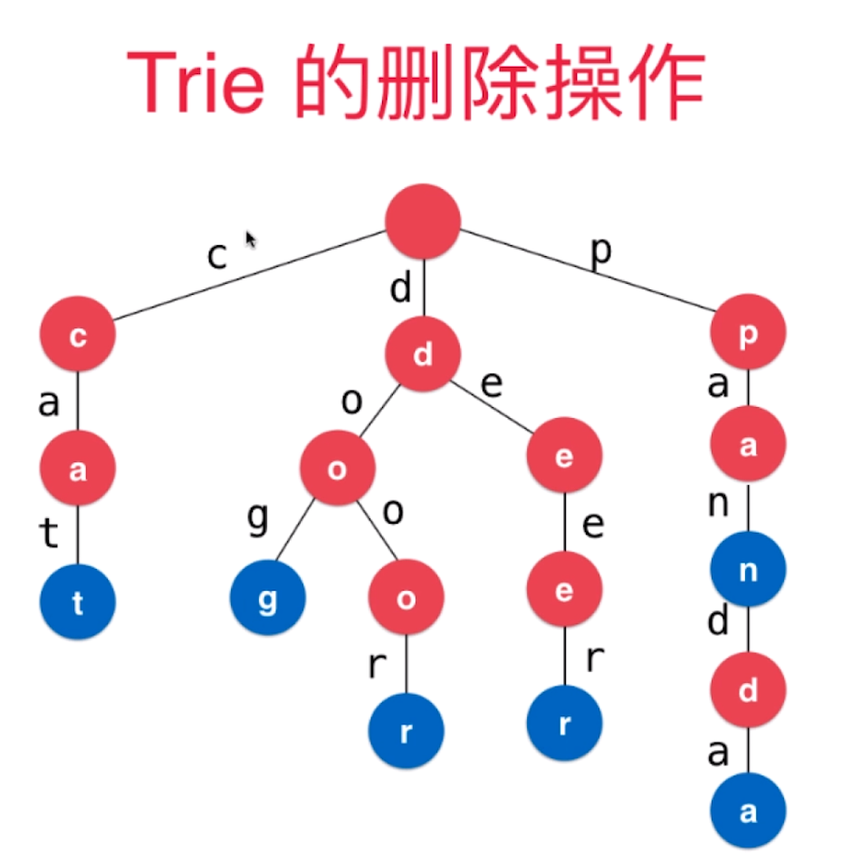
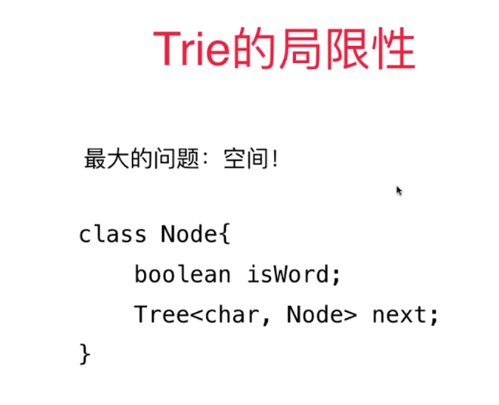
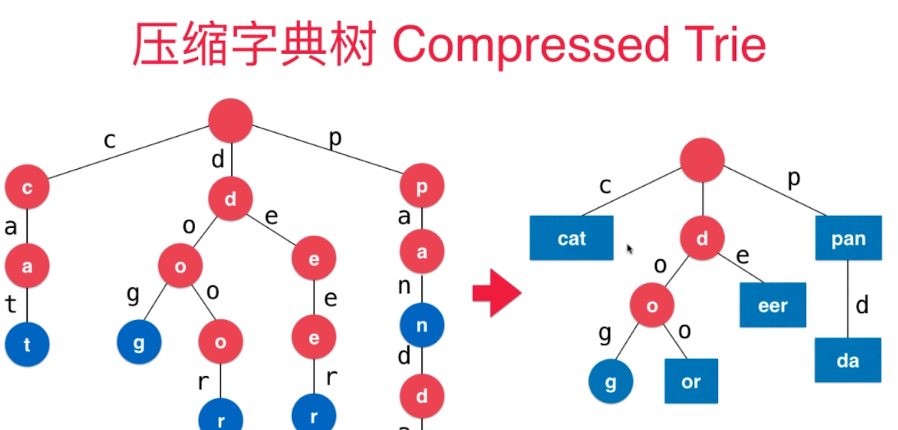
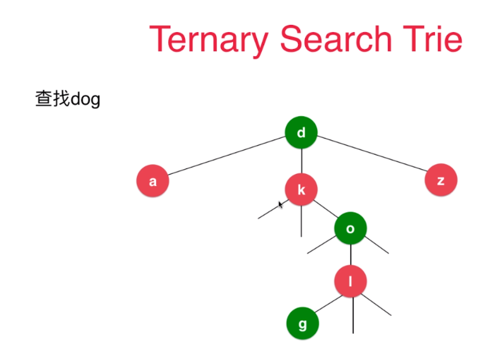
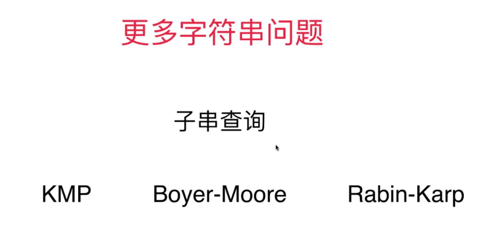
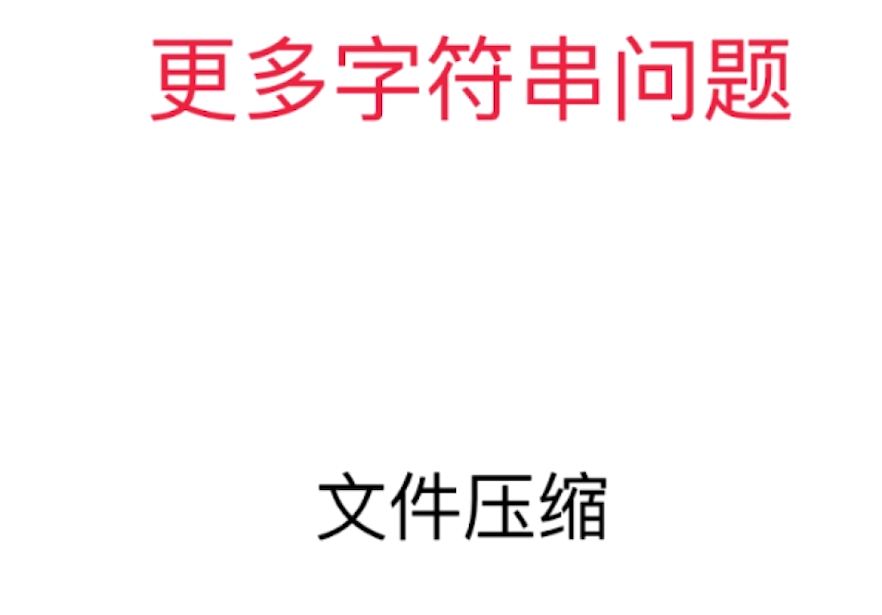
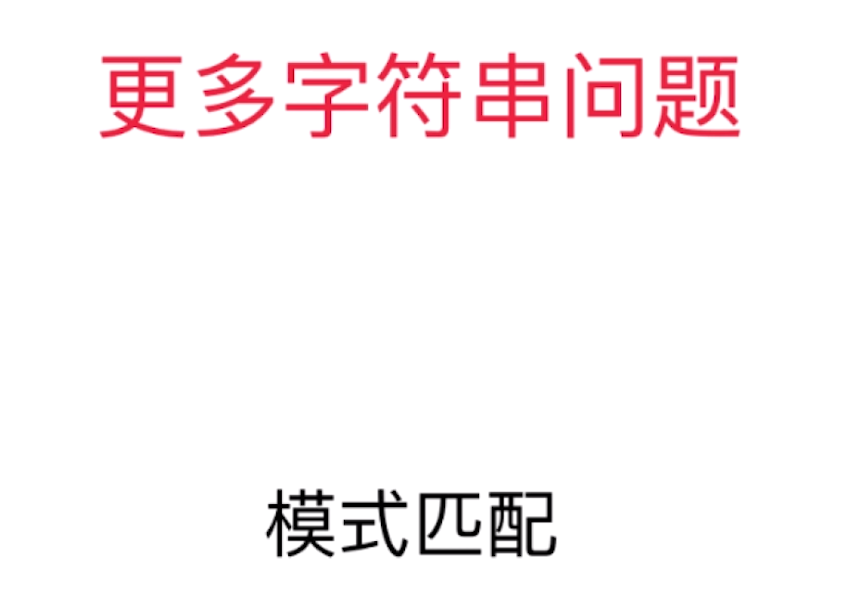
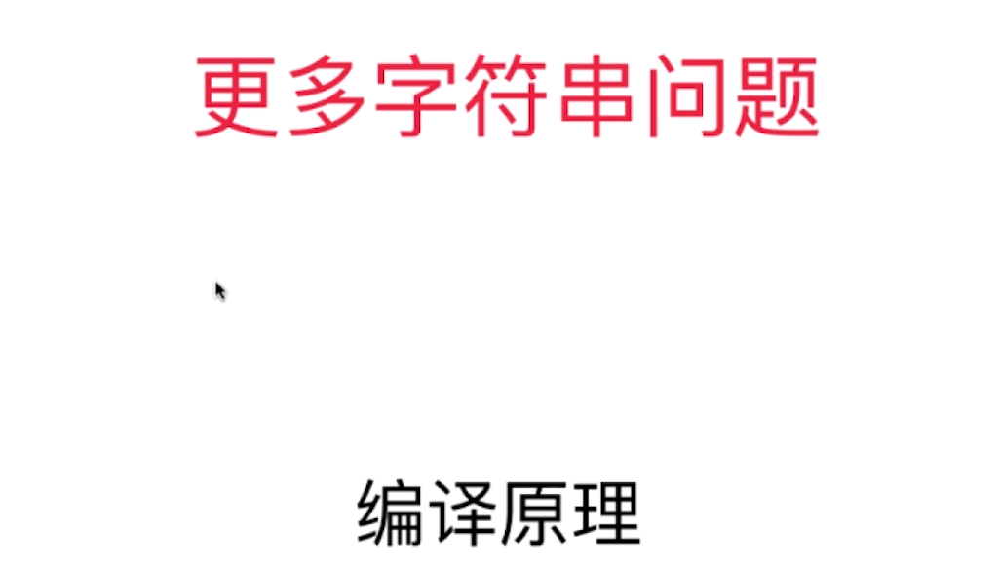

[TOC]

通常Trie只被用来处理字符串

# 字典
如果有n个条目，使用树结构，查询的时间复杂度是O(logn)，如果有100万个条目（2^20），logn大约是20
# Trie
查询每个条目的时间复杂度，和字典中一共有多少条目无关，时间复杂度为O(w)，w为查询单词的长度，大多数单词的长度小于10
每个节点有若干个指向下个节点的指针


单词Trie
每个节点有26个指向下个节点的指针（不考虑大小写）
```java
class Node{
    char c;
    boolean isWord;
    Node next[26];
}

class Node{
    //char c;
    boolean isWord;
    Map<char,Node> next;
}
```

```java
import java.util.TreeMap;
Trie
getSize
add
contains
boolean isPrefix(String prefix)
```

# Trie和前缀搜索

# Trie字典树和字符串映射

# 更多的拓展






维护成本更高




# 后缀树








DNA