[TOC]

# 连接问题
网络中节点间的连接状态
网络是个抽象的概念：用户之间形成的网络
数学中的集合类实现

# 并查集UnionFind
对于一组数据，主要支持两个动作：
union(p,q)
isConnected(p,q)


```java
getSize()
find(int p)
isConnected(int p,int q)
unionElements(int p,int q)
```

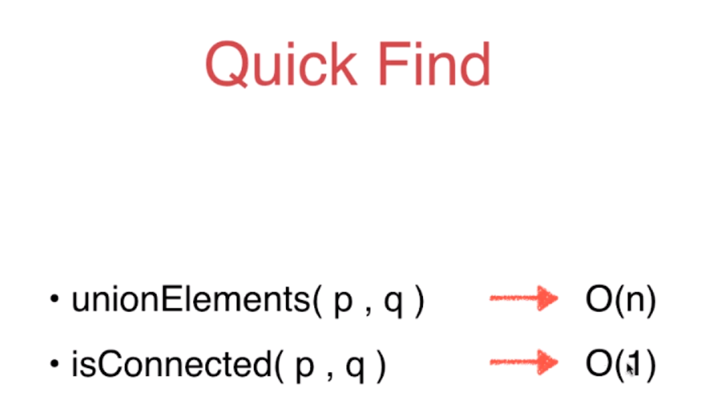

---

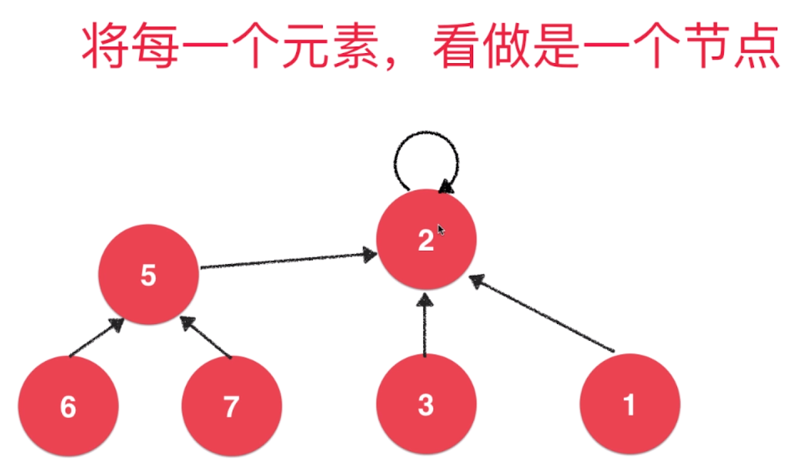


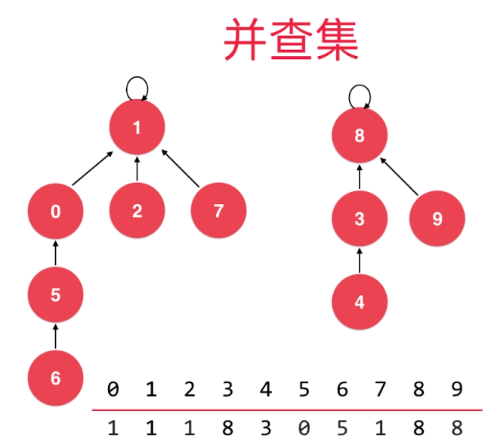

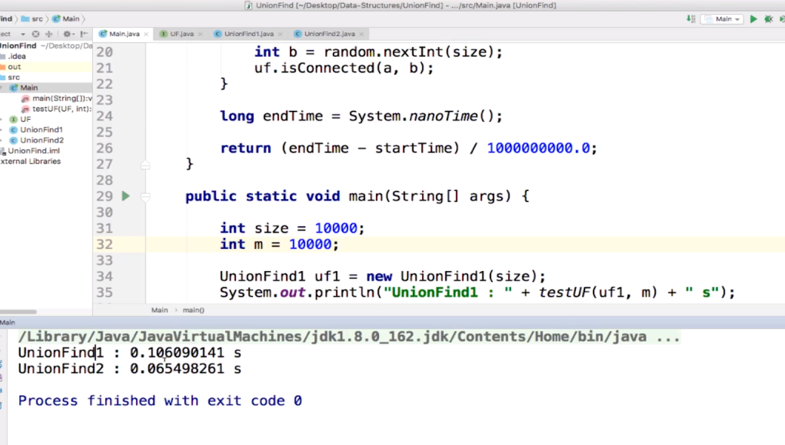

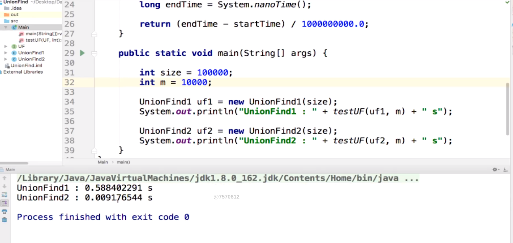


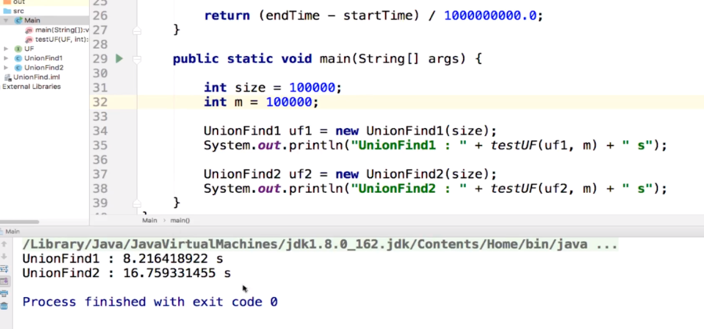

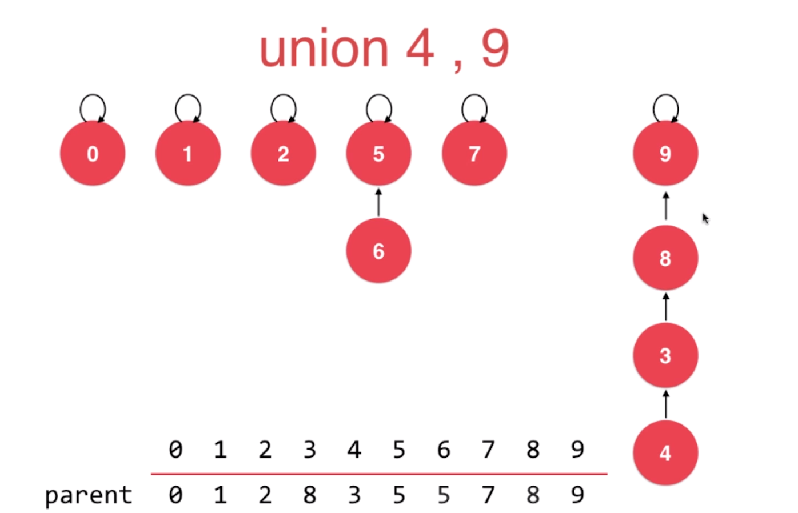
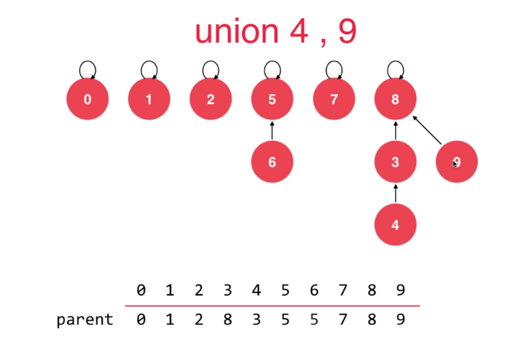

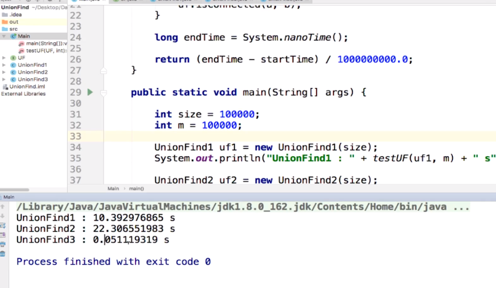

rank pk size

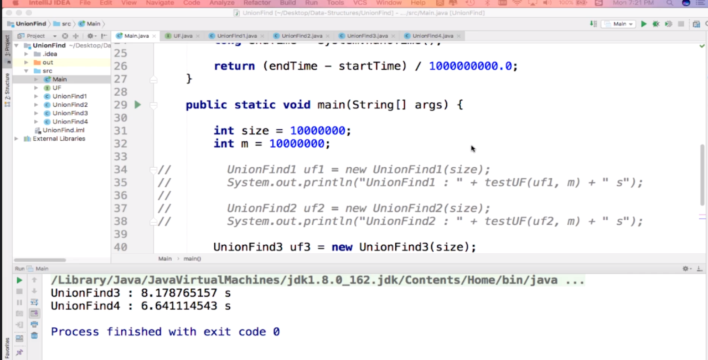

# 路径压缩 Path Compression

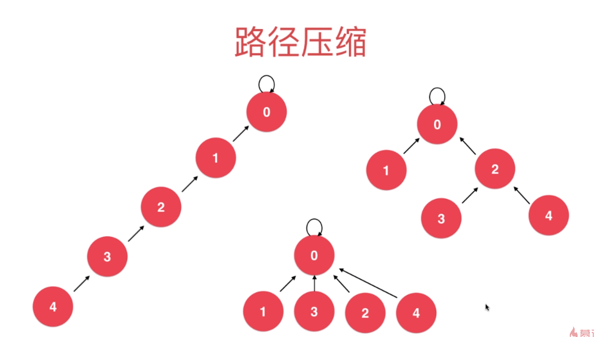

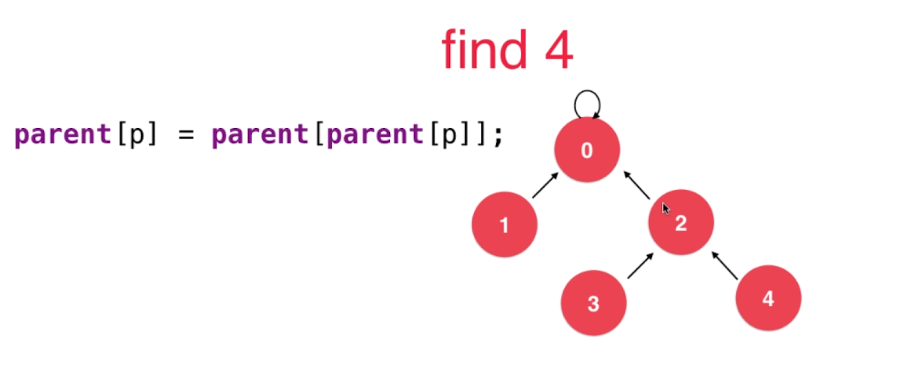

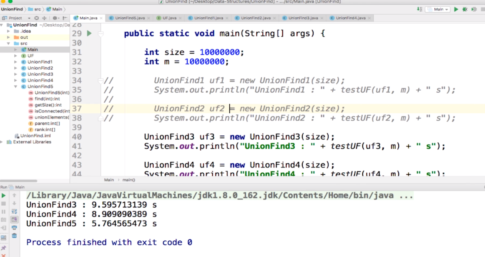

rank不是深度也不是个数，仅是个排名

并查集的时间复杂度分析
O(h)
严格意义上：O(log*n) iterated logarithm

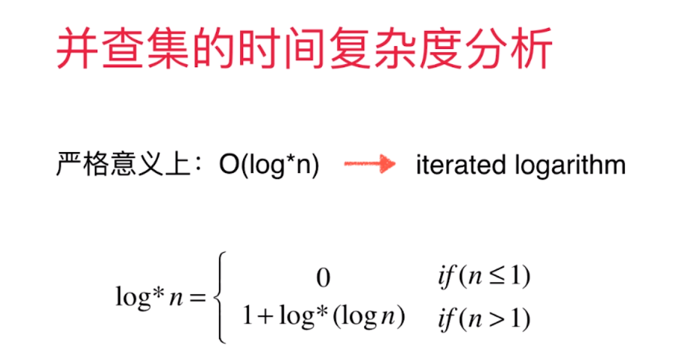

log*n比logn还快，近乎是O(1)级别的