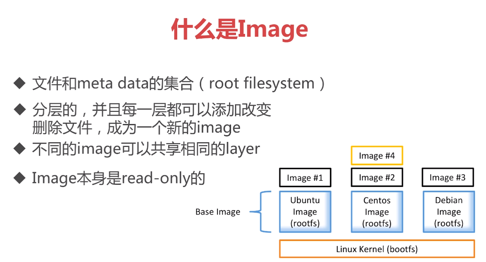

[TOC]



所有image共用Linux Kernel(bootfs)
base image 也可以共享
baseimage 只包含rootfs，所以image很小


docker有一种文件dockerfile，通过dockerfile可以定义image

```
FORM ubuntu:14 #baseimage
LEBEL maintainer="1990frog@gmail.com" #作者
RUN apt-get update #运行之后执行命令
EXPOSE 6379 #暴露端口
ENTRYPOINT ["/usr/bin/redis-server"] #入口
```

# Docker hub

# 非sudo执行docker
```
sudo groupadd docker    #创建docker用户组
sudo gpasswd -a {user} docker    #添加用户到docker组
重启docker,shell生效
```
# DIY Base Image
```
docker pull hello-world
docker run hello-world
```

创建一个c的执行文件

创建dockerfile
vim Dockerfile
```
FROM scratch
ADD hello /
CMD ["/hello"]
```
docker build -t dockerid/filename .    #在当前目录查找dockerfile


查看docker分层：
docker history id


# Container


`docker container ls`当前本地正在运行的容器
`docker container ls -a`当前所有的容器，包括运行的与退出的

command：启动运行

`docker run -it`
-it交互式运行

```
Options:
      --config string      Location of client config files (default "/home/cai/.docker")
  -c, --context string     Name of the context to use to connect to the daemon
                           (overrides DOCKER_HOST env var and default context set with
                           "docker context use")
  -D, --debug              Enable debug mode
  -H, --host list          Daemon socket(s) to connect to
  -l, --log-level string   Set the logging level ("debug"|"info"|"warn"|"error"|"fatal")
                           (default "info")
      --tls                Use TLS; implied by --tlsverify
      --tlscacert string   Trust certs signed only by this CA (default
                           "/home/cai/.docker/ca.pem")
      --tlscert string     Path to TLS certificate file (default
                           "/home/cai/.docker/cert.pem")
      --tlskey string      Path to TLS key file (default "/home/cai/.docker/key.pem")
      --tlsverify          Use TLS and verify the remote
  -v, --version            Print version information and quit

Management Commands:
  builder     Manage builds
  config      Manage Docker configs
  container   Manage containers
  context     Manage contexts
  engine      Manage the docker engine
  image       Manage images
  network     Manage networks
  node        Manage Swarm nodes
  plugin      Manage plugins
  secret      Manage Docker secrets
  service     Manage services
  stack       Manage Docker stacks
  swarm       Manage Swarm
  system      Manage Docker
  trust       Manage trust on Docker images
  volume      Manage volumes

Commands:
  attach      Attach local standard input, output, and error streams to a running container
  build       Build an image from a Dockerfile
  commit      Create a new image from a container's changes
  cp          Copy files/folders between a container and the local filesystem
  create      Create a new container
  diff        Inspect changes to files or directories on a container's filesystem
  events      Get real time events from the server
  exec        Run a command in a running container
  export      Export a container's filesystem as a tar archive
  history     Show the history of an image
  images      List images
  import      Import the contents from a tarball to create a filesystem image
  info        Display system-wide information
  inspect     Return low-level information on Docker objects
  kill        Kill one or more running containers
  load        Load an image from a tar archive or STDIN
  login       Log in to a Docker registry
  logout      Log out from a Docker registry
  logs        Fetch the logs of a container
  pause       Pause all processes within one or more containers
  port        List port mappings or a specific mapping for the container
  ps          List containers
  pull        Pull an image or a repository from a registry
  push        Push an image or a repository to a registry
  rename      Rename a container
  restart     Restart one or more containers
  rm          Remove one or more containers
  rmi         Remove one or more images
  run         Run a command in a new container
  save        Save one or more images to a tar archive (streamed to STDOUT by default)
  search      Search the Docker Hub for images
  start       Start one or more stopped containers
  stats       Display a live stream of container(s) resource usage statistics
  stop        Stop one or more running containers
  tag         Create a tag TARGET_IMAGE that refers to SOURCE_IMAGE
  top         Display the running processes of a container
  unpause     Unpause all processes within one or more containers
  update      Update configuration of one or more containers
  version     Show the Docker version information
  wait        Block until one or more containers stop, then print their exit codes

Run 'docker COMMAND --help' for more information on a command.
```

docker container ls -aq 列举所有container的id

docker container ls -a | awk {'print$1'}

docker rm $(docker container ls -aq)
docker rm $(docker container ls -f "status=exited" -q)