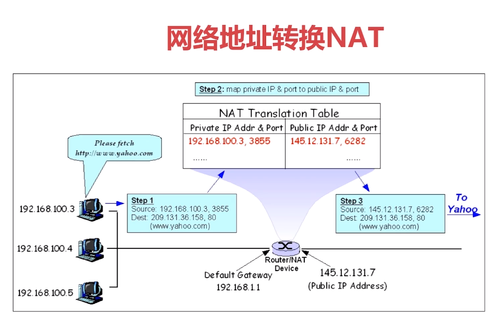
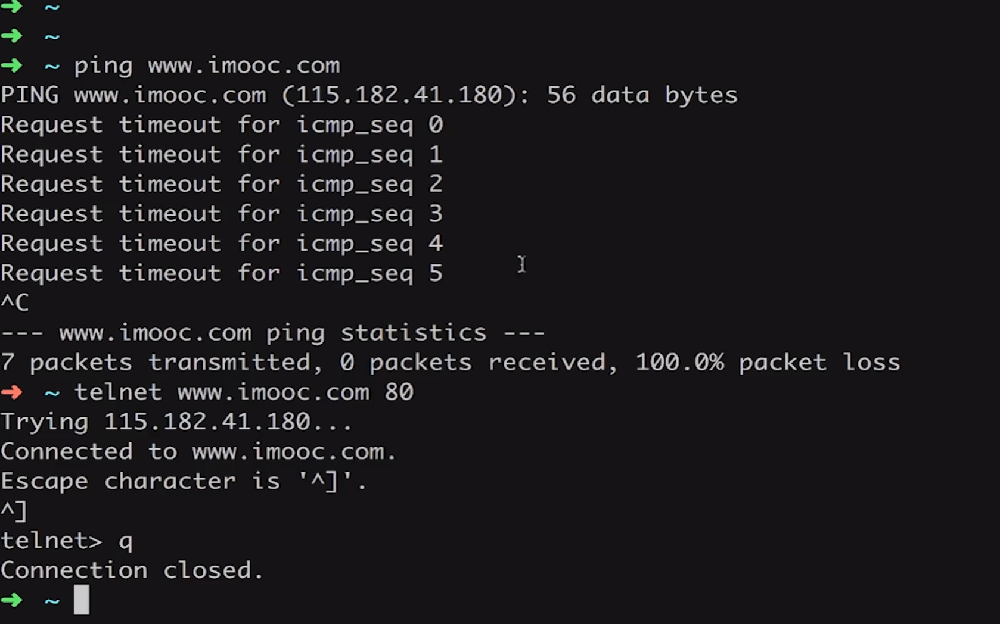
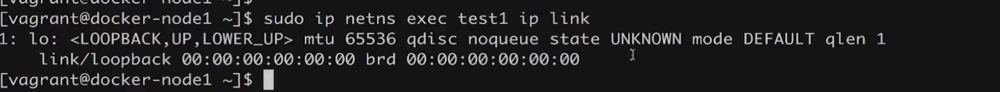
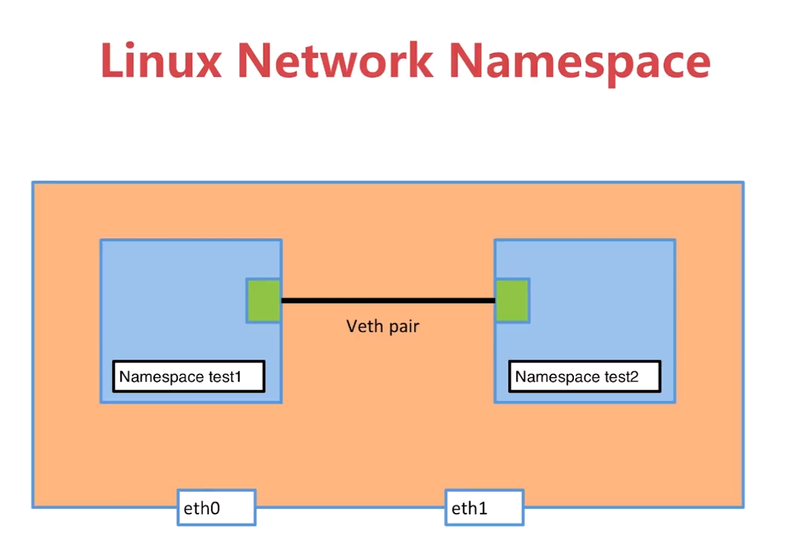
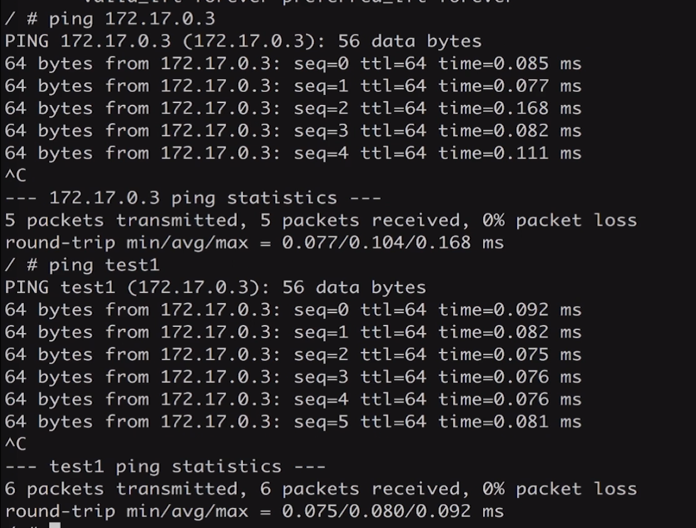

[TOC]

# 基础网络概念





iptable
firewall


# 推荐工具
wireshark


# network namespace


# 删除network namespace
sudo ip netns list
sudo ip netns delete test1
sudo ip netns add test1

sudo ip netns exec test1 ip a

ip link
ip a

sudo ip netns exec test1 ip link set dev lo up

端口要up起来是需要两端连起来的，单个端口不行，要一对

linux network namespace


sudo ip link add veth-test1 type veth peer name veth-test2

sudo ip link set veth-test1 netns test1

sudo ip netns exec test1 ip addr add 192.168.1.1/24 dev veth-test1
sudo ip netns exec test2 ip addr add 192.168.1.1/24 dev veth-test2

sudo ip netns exec test1 ip link set dev veth-test1 up
sudo ip netns exec test2 ip link set dev veth-test2 up

# bridge0
```
docker network ls

NETWORK ID          NAME                DRIVER              SCOPE
066fa4cd91da        bridge              bridge              local
49ad827e3676        host                host                local
12c827beac75        none                null                local
```

docker network inspect [container_id]

bridge-utils
brctl show


iptables

# link

```
sudo docker run -d --name test2 --link test1 busybox /bin/sh -c "while true;do sleep 3600;done"
```


不需要具体知道test1的ip地址，只要知道test1名字就好

link是单向的

# 建立自己的bridge

sudo docker network create -d bridge my-bridge

linux:bridge,host

sudo docker run -d --name test3 --network my-bridge ...

已创建的container映射到新的bridge
sudo docker network connect my-bridge test2

用户自定义bridge与系统默认docker0的区别：
两个容器都连接到用户自定义的bridge上，是可以互通的（不用建立link），而默认的docker0不行

# 容器端口映射

多种方法查看ip地址
sudo docker network inspect bridge

sudo docker run --name web -d -p 80:80 nginx


docker-machine ?


# 容器网络之host和none