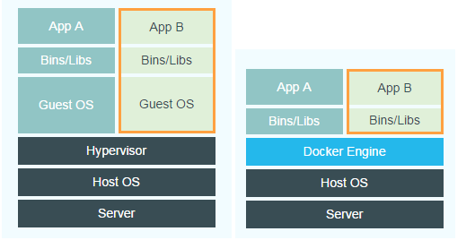

[TOC]

容器是app层面的隔离
虚拟化是物力资源层面的隔离

# 虚拟化vs容器化
虚拟化的优点
资源池：一个物理机的资源分配到了不同的虚拟机里
很容易扩展：加物理机器or加虚拟机
很容易云化：亚马逊AWS,阿里云等
虚拟化的局限性
每一个虚拟机都是一个完整的操作系统，要给其分配资源，当虚拟机数量增多时，操作系统本身消耗的资源势必增多

# 什么是容器
对软件和其依赖的标准化打包
应用之间相互隔离
共享一个OS Kernel
可以运行在很多主流操作系统上

# 虚拟机
首先，大家需要明确一点，Docker容器不是虚拟机！
使用虚拟机运行多个相互隔离的应用时，如下图：

+ 基础设施（Infrastructure）。它可以是你的个人电脑，数据中心的服务器，或者是云主机。
+ 主操作系统（Host Operating System）。你的个人电脑之上，运行的可能是MacOS，Windows或者某个Linux发行版。
+ **虚拟机管理系统（Hypervisor）**。利用Hypervisor，可以在主操作系统之上运行多个不同的从操作系统。类型1的Hypervisor有支持MacOS的HyperKit，支持Windows的Hyper-V以及支持Linux的KVM。类型2的Hypervisor有VirtualBox和VMWare。
+ 从操作系统（Guest Operating System）。假设你需要运行3个相互隔离的应用，则需要使用Hypervisor启动3个从操作系统，也就是3个虚拟机。这些虚拟机都非常大，也许有700MB，这就意味着它们将占用2.1GB的磁盘空间。更糟糕的是，它们还会消耗很多CPU和内存。

各种依赖。每一个从操作系统都需要安装许多依赖。如果你的的应用需要连接PostgreSQL的话，则需要安装libpq-dev；如果你使用Ruby的话，应该需要安装gems；如果使用其他编程语言，比如Python或者Node.js，都会需要安装对应的依赖库。
应用。安装依赖之后，就可以在各个从操作系统分别运行应用了，这样各个应用就是相互隔离的。

# Docker容器
使用Docker容器运行多个相互隔离的应用时，如下图：

+ 主操作系统（Host Operating System）。所有主流的Linux发行版都可以运行Docker。对于MacOS和Windows，也有一些办法"运行"Docker。
+ Docker守护进程（Docker Daemon）。Docker守护进程取代了Hypervisor，它是运行在操作系统之上的后台进程，负责管理Docker容器。
+ 各种依赖。对于Docker，应用的所有依赖都打包在Docker镜像中，Docker容器是基于Docker镜像创建的。
+ 应用。应用的源代码与它的依赖都打包在Docker镜像中，不同的应用需要不同的Docker镜像。不同的应用运行在不同的Docker容器中，它们是相互隔离的。

# 对比虚拟机与Docker
Docker守护进程可以直接与主操作系统进行通信，为各个Docker容器分配资源；它还可以将容器与主操作系统隔离，并将各个容器互相隔离。虚拟机启动需要数分钟，而Docker容器可以在数毫秒内启动。由于没有臃肿的从操作系统，Docker可以节省大量的磁盘空间以及其他系统资源。

说了这么多Docker的优势，大家也没有必要完全否定虚拟机技术，因为两者有不同的使用场景：
+ 虚拟机更擅长于彻底隔离整个运行环境。例如，云服务提供商通常采用虚拟机技术隔离不同的用户。
+ Docker通常用于隔离不同的应用，例如前端，后端以及数据库。

+ 容器使用由Linux内核提供的命名空间，大多数人把命名空间认为是一个上下文或域的授权决定（进程X有权访问资源Y）。
+ 如果容器内的进程扫描文件系统来寻找要获取的东西，它只能找到容器内明确可见的文件。
+ 如果容器内的进程中想尝试做一些恶意的事情，比如打开端口31337后门服务，它不会有多大用处，因为这个端口实际上不会暴露在容器外的任何地方。容器内部的恶意进程不能访问的任何容器外的其他进程的内存。
+ 有几个方法可以摆脱容器的束缚，但这些通常需要容器的root访问权限。
+ 不要以root运行应用程序，通过简单的几个步骤稳固root访问权限。
+ 容器使用cgroup来提供与虚拟机相同级别的资源使用保护机制。容器和虚拟机都可以获取整个网络链接。
+ 容器运行的是不完整的操作系统（尽管它们可以），虚拟机必须运行完整的。
+ 容器比虚拟机使用更少的闲置资源，它们不运行完整的操作系统。
+ 容器在在云硬件（或虚拟机）中可以被复用，就像虚拟机在裸机上可以被复用。
+ 容器需要毫秒分配，虚拟机需要几分钟。所以，你可以另配、重新平衡、释放以及使用容器比虚拟机的迭代更加迅速。
+ 如果每个容器运行的只有一个服务或者数据库，这是比较容易管理的。而且比较容易监控性能，了解故障的影响，并预测成本。
+ 离目标进程越远，隔离会变得更昂贵。虚拟机是伟大的，它通过抽象来增加并行，服务于多操作系统的使用情况以及业界最好的安全性。但对于隔离，它们相当的昂贵，容器提供的隔离就便宜。

# 服务器虚拟化vs Docker
服务器好比运输码头：拥有场地和各种设备（服务器硬件资源）

服务器虚拟化好比作码头上的仓库：拥有独立的空间堆放各种货物或集装箱

(仓库之间完全独立，独立的应用系统和操作系统）

Docker比作集装箱：各种货物的打包

(将各种应用程序和他们所依赖的运行环境打包成标准的容器,容器之间隔离)

Docker有着小巧、迁移部署快速、运行高效等特点，但隔离性比服务器虚拟化差：不同的集装箱属于不同的运单（Docker上运行不同的应用实例），相互独立（隔离）。但由同一个库管人员管理（主机操作系统内核），因此通过库管人员可以看到所有集装箱的相关信息（因为共享操作系统内核，因此相关信息会共享）。

服务器虚拟化就好比在码头上（物理主机及虚拟化层），建立了多个独立的“小码头”—仓库（虚拟机）。其拥有完全独立（隔离）的空间，属于不同的客户（虚拟机所有者）。每个仓库有各自的库管人员（当前虚拟机的操作系统内核），无法管理其它仓库。不存在信息共享的情况

因此，我们需要根据不同的应用场景和需求采用不同的方式使用Docker技术或使用服务器虚拟化技术。例如一个典型的Docker应用场景是当主机上的Docker实例属于单一用户的情况下，在保证安全的同时可以充分发挥Docker的技术优势。对于隔离要求较高的环境如混合用户环境，就可以使用服务器虚拟化技术。正则科技提供了丰富的Docker应用实例，满足您的各种应用需求，并且支持在已经安装了自在（Isvara）服务器虚拟化软件的主机上同时使用服务器虚拟化技术和Docker技术提供不同技术场景。
