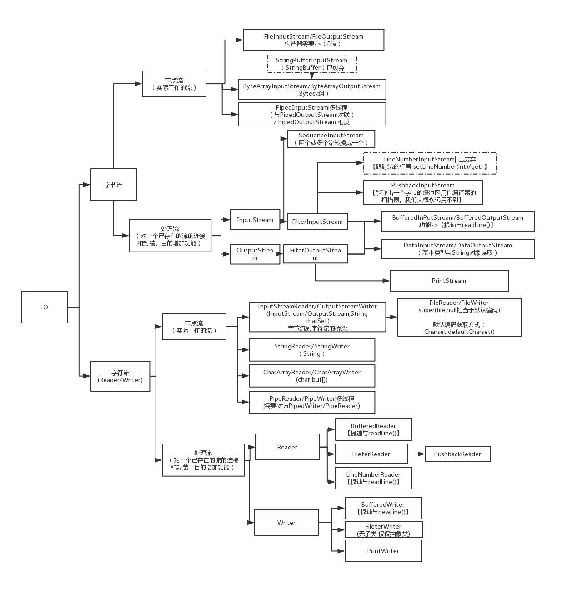

以Reader这块来讲解装饰器模式在IO中的应用

+ 抽象类
Reader，是一个抽象类，里面定义了接口
+ 被装饰的类
InputStreamReader、CharArrayReader、PipedReader、StringReader、FileReader
+ 装饰器类
FilterReader、BufferedReader
+ 具体的装饰器类
BufferedReader、PushbackReader
FileReader尽管也在第三行，但是FileReader构不成一个具体的装饰器类，因为它不是BufferedReader的子类也不是FilterReader的子类，不持有Reader的引用
读写IO的时候每次打开文件会非常耗时，我们可以使用BufferedReader装饰FileReader这些被装饰器类，使用缓冲提高性能

