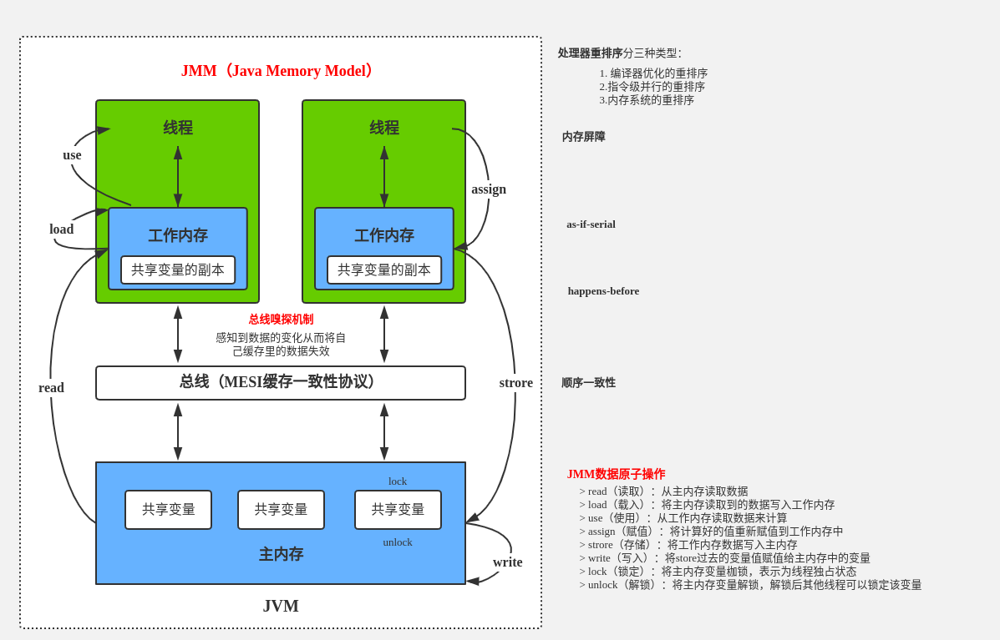

[TOC]

# 内存间交互操作
关于主内存与工作内存之间具体的交互协议，即一个变量如何从主内存拷贝到工作内存、如何从工作内存同步回主内存之类的实现细节，Java内存模型中定义了以下8种操作来完成，虚拟机实现时必须保证下面提及的每一种操作都是原子的、不可再分的
+ lock（锁定）：作用于主内存的变量，它把一个变量标识为一条线程独占的状态。
+ unlock（解锁）：作用于主内存的变量，它把一个处于锁定状态的变量释放出来，释放后的变量才可以被其他线程锁定。
+ read（读取）：作用于主内存的变量，它把一个变量的值从主内存传输到线程的工作内存中，以便随后的load动作使用。
+ load（载入）：作用于工作内存的变量，它把read操作从主内存中得到的变量值放入工作内存的变量副本中。
+ use（使用）：作用于工作内存的变量，它把工作内存中一个变量的值传递给执行引擎，每当虚拟机遇到一个需要使用到变量的值的字节码指令时将会执行这个操作。
+ assign（赋值）：作用于工作内存的变量，它把一个从执行引擎接收到的值赋给工作内存的变量，每当虚拟机遇到一个给变量赋值的字节码指令时执行这个操作。
+ store（存储）：作用于工作内存的变量，它把工作内存中一个变量的值传送到主内存中，以便随后的write操作使用。
+ write（写入）：作用于主内存的变量，它把store操作从工作内存中得到的变量的值放入主内存的变量中。

# 从Java代码到CPU指令的变化过程？
我们在Java代码中，使用的控制并发的手段例如synchronized关键字，最终也是要转化为CPU指令来生效的，我们来回顾一下从Java代码到最终执行的CPU指令的流程：
1. 最开始，我们编写的Java代码，是*.java文件
2. 在编译（javac命令）后，从刚才的*.java文件会变出一个新的Java字节码文件（*.class）
3. JVM会执行刚才生成的字节码文件（*.class），并把字节码文件转化为机器指令
4. 机器指令可以直接在CPU上执运行，也就是最终的程序执行
5. 而不同的JVM实现会带来不同的“翻译”，不同的CPU平台的机器指令又千差万别；所以我们在java代码层写的各种Lock，其实最后依赖的是JVM的具体实现（不同版本会有不同实现）和CPU的指令，才能帮我们达到线程安全的效果。
7. 由于最终效果依赖处理器，不同处理器结果不一样，这样无法保证并发安全，所以需要一个标准，让多线程运行的结果可预期，这个标准就是JMM。

# 易混淆点
+ jvm内存结构：和java虚拟机的运行时区域有关
+ java内存模型：和java的并发编程有关
+ java对象模型：和java对象在虚拟机中的表现形式有关

## jvm内存结构（jvm运行时内存结构）
Java虚拟机在执行Java程序的过程中会把它所管理的内存划分为若干个不同的数据区域。这些区域都有各自的用途，以及创建和销毁的时间，有的区域随着虚拟机的进程启动而存在，有些区域则依赖用户线程的启动和结束而建立和销毁。

根据《Java虚拟机规范（Java SE 8）》的规定，Java虚拟机所管理的内存将会包括以下几个运行时数据区域，JVM运行时内存区域结构如下：


## java内存模型
java内存模型中线程间共享变量有：实例域、静态域、数组元素，存储在堆内存中，线程间共享；
线程间私有：局部变量(local variables)、方法定义参数(format method parameters)、异常处理参数(exception handler parameters)。

java内存模型主要是保证<<共享内存部分>>的原子性、可见性、有序性，内存模型定义了共享内存中多线程程序读写宝座行为的规范。
内存模型解决并发问题主要采用两种方式:
+ 限制处理器优化
+ 使用内存屏障。


## java对象模型
Java是一种面向对象的语言，而Java对象在JVM中的存储也是有一定的结构的。而这个关于Java对象自身的存储模型称之为Java对象模型。

HotSpot虚拟机中，设计了一个OOP-Klass Model。OOP（Ordinary Object Pointer）指的是普通对象指针，而Klass用来描述对象实例的具体类型。
如下图所示, 就是一个简单的Java对象的OOP-Klass模型，即Java对象模型。


## 小结
+ jvm 运行时内存结构 java虚拟机运行时数据区域有关
+ java 内存模型 java并发编程有关，共享内存的可见性、原子性、有序性。
+ java 对象模型 java对象的存储结构，不同对象存储在不同数据区，方法区、堆、栈。

# JMM是规范（Java Memory Model）
+ JMM是一组规范，需要各个JVM的实现来准守JMM规范，以便于开发者可以利用这些规范，更方便地开发多线程程序。
+ 如果没有这样的一个JMM内存模型来规范，那么很可能经过了不同jvm的不同规则的重排序之后，导致不同的虚拟机上运行的结果不一样，那是很大的问题。
+ 最重要的3点内容：重排序、可见性、原子性

# JMM是工具类和关键字的原理
+ volatile、synchronized、Lock等的原理都是jmm
+ 如果没有jmm，那就需要我们自己指定什么时候用内存栅栏等，那是相当麻烦的，幸好有了jmm，让我们只需要用同步工具和关键字就可以开发并发程序。
+ c语言不存在内存模型的概念，依赖处理器，不同处理器结果不一样，无法保证并发安全。所以在java中需要一个标准，让多线程运行的结果可预期。

# 重排序实例
```java
public class OutOfOrderExecution {

    private volatile static int x = 0, y = 0;
    private volatile static int a = 0, b = 0;

    public static void main(String[] args) throws InterruptedException {
        int i = 0;
        for (; ; ) {
            i++;
            x = 0;
            y = 0;
            a = 0;
            b = 0;

            CountDownLatch latch = new CountDownLatch(1);

            Thread one = new Thread(new Runnable() {
                @Override
                public void run() {
                    try {
                        latch.await();
                    } catch (InterruptedException e) {
                        e.printStackTrace();
                    }
                    a = 1;
                    x = b;
                }
            });
            Thread two = new Thread(new Runnable() {
                @Override
                public void run() {
                    try {
                        latch.await();
                    } catch (InterruptedException e) {
                        e.printStackTrace();
                    }
                    b = 1;
                    y = a;
                }
            });
            two.start();
            one.start();
            latch.countDown();
            one.join();
            two.join();

            String result = "第" + i + "次（" + x + "," + y + ")";
            if (x == 0 && y == 0) {
                System.out.println(result);
                break;
            } else {
                System.out.println(result);
            }
        }
    }
}
```
分析：四个赋值操作的执行顺序决定了最终x和y的结果
```
{a = 1;x = b;}
{b = 1;y = a;}
```
一共有4种情况：
1. a=1;x=b(0);b=1;y=a(1)，最终结果是x=0,y=1
2. b=1;x=a(0);a=1;y=b(1)，最终结果是x=1,y=0
3. a=1;b=1;x=b(1);y=a(1)，最终结果是x=1,y=1
4. y=a;a=1;x=b;b=1;最终结果x=0,y=0


# 什么是重排序
在线程1内部的两行代码的实际执行顺序和代码在Java文件中的顺序不一致，代码指令并不是严格按照代码语句顺序执行的，它们的顺序被改变了，这就是重排序，这里被颠倒的是y=a和b=1这两行语句。

# 重排序的好处
提高处理速度

对比重排序前后的指令优化：
```
# 正常执行
a=3;
b=2;
a=a+1;

Instructions
Load a
Set to 3
Store a

Load b
Set to 2
Store b

Load a
Set to 4
Store a

# 假设重排序之后：
a=3;
a=a+1;
b=2;

Instructions
Load a
Set to 3
Set to 4
Store a

Load b
Set to 2
Store b

# 结论：重排序明显提高了性能
```

# 重排序发生的3种情况
+ **编译器优化**
编译器（包括JVM，JIT编译器等）出于优化的目的（例如当前有了数据a，那么如果把对a的操作放到一起效率会更高，避免了读取b后又返回来重新读取a的时间开销），在编译的过程中会进行一定程度的重排，导致生成的机器指令和之前的字节码的顺序不一致。
在刚才的例子中，编译器将y=a和b=1这两行语句换了顺序（也可能是线程2的两行换了顺序，同理），因为它们之间没有数据依赖关系，那就不难得到 x =0，y = 0 这种结果了。
+ **CPU指令重排**
就算编译器不发生重排，CPU也可能对指令进行重排
和编译器优化很类似，是通过乱序执行的技术，来提高执行效率。所以就算编译器不发生重排，CPU 也可能对指令进行重排，所以我们开发中，一定要考虑到重排序带来的后果。
+ **内存的“重排序”**
线程A的修改线程B却看不到，引出可见性问题
内存系统内不存在重排序，但是内存会带来看上去和重排序一样的效果，所以这里的“重排序”打了双引号。由于内存有缓存的存在，在JMM里表现为主存和本地内存，由于主存和本地内存的不一致，会使得程序表现出乱序的行为。
在刚才的例子中，假设没编译器重排和指令重排，但是如果发生了内存缓存不一致，也可能导致同样的情况：线程1 修改了 a 的值，但是修改后并没有写回主存，所以线程2是看不到刚才线程1对a的修改的，所以线程2看到a还是等于0。同理，线程2对b的赋值操作也可能由于没及时写回主存，导致线程1看不到刚才线程2的修改。


# 可见性问题
cpu有多级缓存，导致读的数据过期

高速缓存的容量比主内存小，但是速度仅次于寄存器，所以在cpu和主内存之间就多了Cache层。
线程间的对于共享变量的可见性问题不是直接由多核引起的，而是由多缓存引起的。

如果所有核心都只用一个缓存，那么也就不存在内存可见性问题了。
每个核心都会将自己需要的数据读到独占缓存中，数据修改后也是写入到缓存中，然后等待刷入到主存中。所以会导致有些核心读取的值是一个过期的值。

## 什么是主内存和本地内存

1. Java作为高级语言，屏蔽了这些底层细节，用jmm定义了一套读写内存数据的规范，虽然我们不再需要关心一级缓存和二级缓存的问题，但是，jmm抽象了主内存和本地内存的概念。
2.这里说的本地内存并不是真的是一块给每个线程分配的内存，而是JMM的一个抽象，是对于寄存器、一级缓存、二级缓存等的抽象。

# 主内存和本地内存的图示

JMM有以下规定:
+ 所有的变量都存储在主内存中，同时每个线程也有自己独立的工作内存，工作内存中的变量内容是主内存中的拷贝
+ 线程不能直接读写主内存中的变量,而是只能操作自己工作内存中的变量，然后再同步到主内存中
+ 主内存是多个线程共享的，但线程间不共享工作内存,如果线程间需要通信，必须借助主内存中转来完成
+ 所有的共享变量存在于主内存中，每个线程有自己的本地内存，而且线程读写共享数据也是通过本地内存交换的，所以才导致了可见性问题。

Java内存模型的主要目标是定义程序中各个变量的访问规则，即在虚拟机中将变量存储到内存和从内存中取出变量这样的底层细节。

此处的变量（Variables）与Java编程中所说的变量有所区别，它包括了实例字段、静态字段和构成数组对象的元素，但不包括局部变量与方法参数，因为后者是线程私有的 [3]，不会被共享，自然就不会存在竞争问题。

Java内存模型规定了所有的变量都存储在主内存（Main Memory）中（此处的主内存与介绍物理硬件时的主内存名字一样，两者也可以互相类比，但此处仅是虚拟机内存的一部分）。每条线程还有自己的工作内存（Working Memory，可与前面讲的处理器高速缓存类比），线程的工作内存中保存了被该线程使用到的变量的主内存副本拷贝，线程对变量的所有操作（读取、赋值等）都必须在工作内存中进行，而不能直接读写主内存中的变量。不同的线程之间也无法直接访问对方工作内存中的变量，线程间变量值的传递均需要通过主内存来完成


# 生成对象的过程不是原子操作
1. 新建一个空的Person对象
2. 把这个对象的地址指向p
3. 指向Person的构造函数

# 对于volatile型变量的特殊规则
当一个变量定义为volatile之后，它将具备两种特性，第一是保证此变量对所有线程的可见性，这里的“可见性”是指当一条线程修改了这个变量的值，新值对于其他线程来说是可以立即得知的。而普通变量不能做到这一点，普通变量的值在线程间传递均需要通过主内存来完成，例如，线程A修改一个普通变量的值，然后向主内存进行回写，另外一条线程B在线程A回写完成了之后再从主内存进行读取操作，新变量值才会对线程B可见。

volatile变量在各个线程的工作内存中不存在一致性问题（在各个线程的工作内存中，volatile变量也可以存在不一致的情况，但由于每次使用之前都要先刷新，执行引擎看不到不一致的情况，因此可以认为不存在一致性问题），但是Java里面的运算并非原子操作，导致volatile变量的运算在并发下一样是不安全的

由于volatile变量只能保证可见性，在不符合以下两条规则的运算场景中，我们仍然要通过加锁（使用synchronized或java.util.concurrent中的原子类）来保证原子性。

运算结果并不依赖变量的当前值，或者能够确保只有单一的线程修改变量的值。

变量不需要与其他的状态变量共同参与不变约束。

使用volatile变量的第二个语义是禁止指令重排序优化，普通的变量仅仅会保证在该方法的执行过程中所有依赖赋值结果的地方都能获取到正确的结果，而不能保证变量赋值操作的顺序与程序代码中的执行顺序一致。

# 原子性、可见性与有序性
原子性（Atomicity）：由Java内存模型来直接保证的原子性变量操作包括read、load、assign、use、store和write，我们大致可以认为基本数据类型的访问读写是具备原子性的（例外就是long和double的非原子性协定，读者只要知道这件事情就可以了，无须太过在意这些几乎不会发生的例外情况）。

可见性（Visibility）：可见性是指当一个线程修改了共享变量的值，其他线程能够立即得知这个修改。上文在讲解volatile变量的时候我们已详细讨论过这一点。Java内存模型是通过在变量修改后将新值同步回主内存，在变量读取前从主内存刷新变量值这种依赖主内存作为传递媒介的方式来实现可见性的，无论是普通变量还是volatile变量都是如此，普通变量与volatile变量的区别是，volatile的特殊规则保证了新值能立即同步到主内存，以及每次使用前立即从主内存刷新。因此，可以说volatile保证了多线程操作时变量的可见性，而普通变量则不能保证这一点。

除了volatile之外，Java还有两个关键字能实现可见性，即synchronized和final。同步块的可见性是由“对一个变量执行unlock操作之前，必须先把此变量同步回主内存中（执行store、write操作）”这条规则获得的，而final关键字的可见性是指：被final修饰的字段在构造器中一旦初始化完成，并且构造器没有把“this”的引用传递出去（this引用逃逸是一件很危险的事情，其他线程有可能通过这个引用访问到“初始化了一半”的对象），那在其他线程中就能看见final字段的值。

有序性（Ordering）：Java内存模型的有序性在前面讲解volatile时也详细地讨论过了，Java程序中天然的有序性可以总结为一句话：如果在本线程内观察，所有的操作都是有序的；如果在一个线程中观察另一个线程，所有的操作都是无序的。前半句是指“线程内表现为串行的语义”（Within-Thread As-If-Serial Semantics），后半句是指“指令重排序”现象和“工作内存与主内存同步延迟”现象。