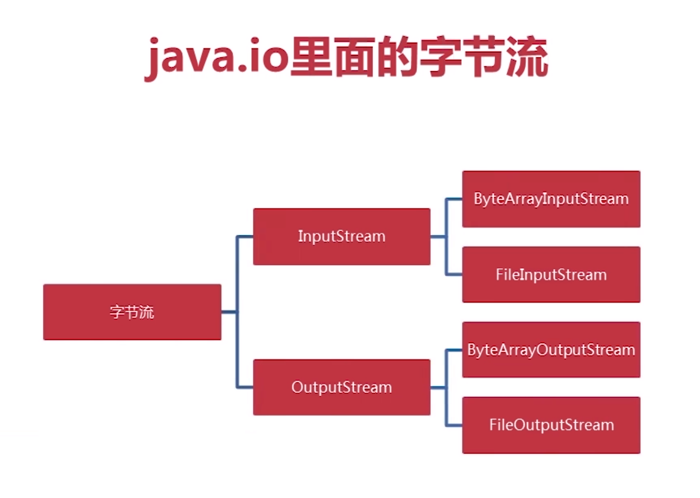

stream 
input
output

reader
write

DataOutputStream\DataOutputStream 输出基本数据类型

java.io 设计模式（装饰器模式）

异步同步调用结果

# BIO
B(lock)IO

+ Java BIO (blocking I/O)： 同步并阻塞，服务器实现模式为一个连接一个线程，即客户端有连接请求时服务器端就需要启动一个线程进行处理，如果这个连接不做任何事情会造成不必要的线程开销，当然可以通过线程池机制改善。
+ Java NIO (non-blocking I/O)： 同步非阻塞，服务器实现模式为一个请求一个线程，即客户端发送的连接请求都会注册到多路复用器上，多路复用器轮询到连接有I/O请求时才启动一个线程进行处理。
+ Java AIO(NIO.2) (Asynchronous I/O) ： 异步非阻塞，服务器实现模式为一个有效请求一个线程，客户端的I/O请求都是由OS先完成了再通知服务器应用去启动线程进行处理，

BIO、NIO、AIO适用场景分析:

+ BIO方式适用于连接数目比较小且固定的架构，这种方式对服务器资源要求比较高，并发局限于应用中，JDK1.4以前的唯一选择，但程序直观简单易理解。
+ NIO方式适用于连接数目多且连接比较短（轻操作）的架构，比如聊天服务器，并发局限于应用中，编程比较复杂，JDK1.4开始支持。
+ AIO方式使用于连接数目多且连接比较长（重操作）的架构，比如相册服务器，充分调用OS参与并发操作，编程比较复杂，JDK7开始支持。

# BIO中的阻塞
ServerSocket.accept()
InputStream.read()
OutputStream.write()
无法在同一个线程里处理多个Stream I/O