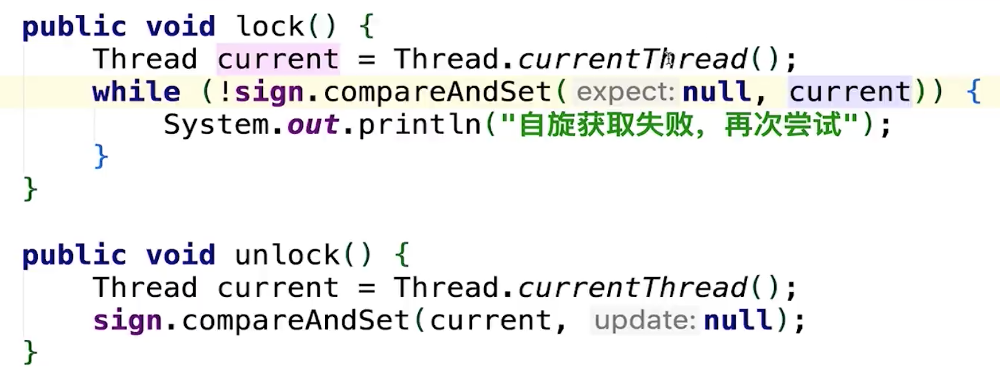
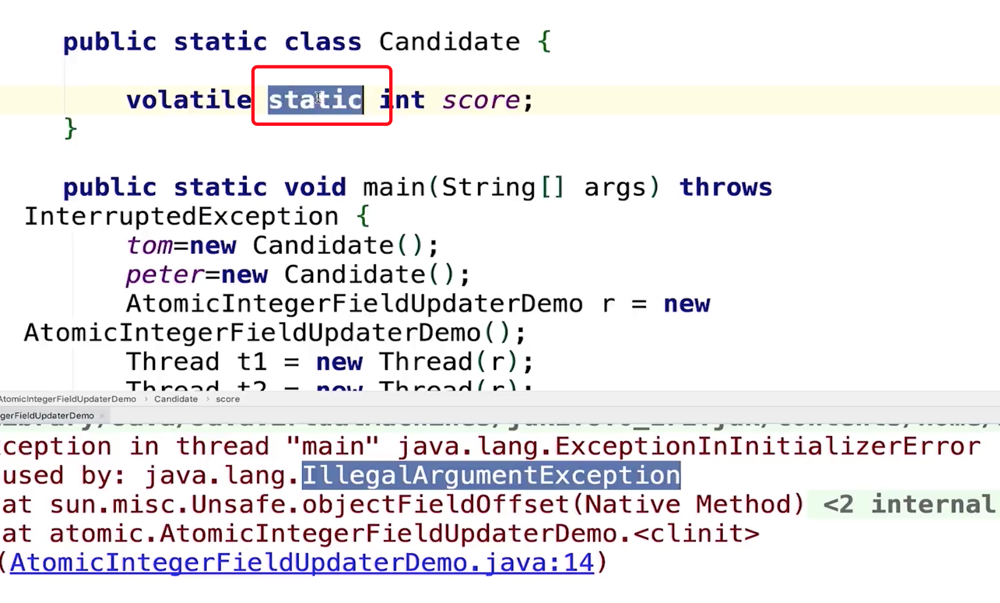
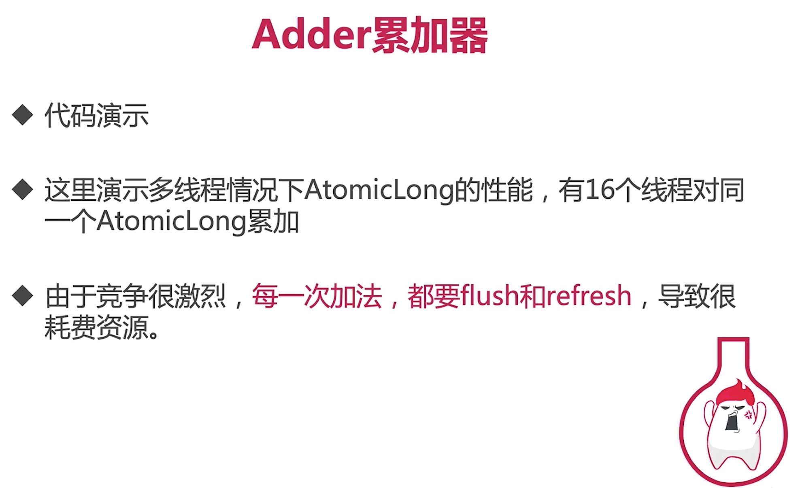
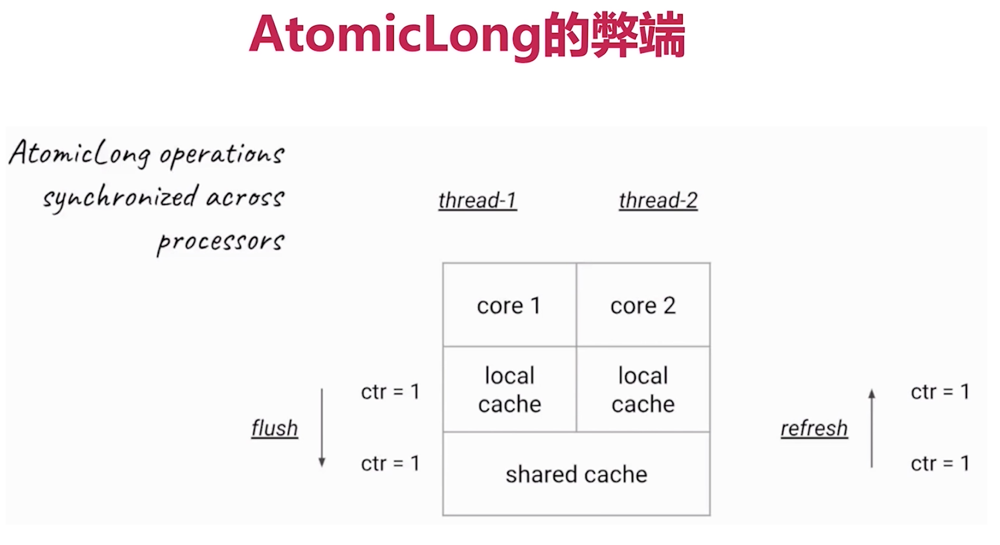
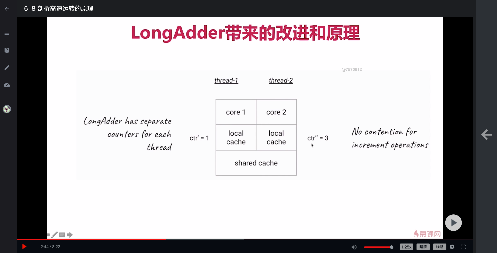
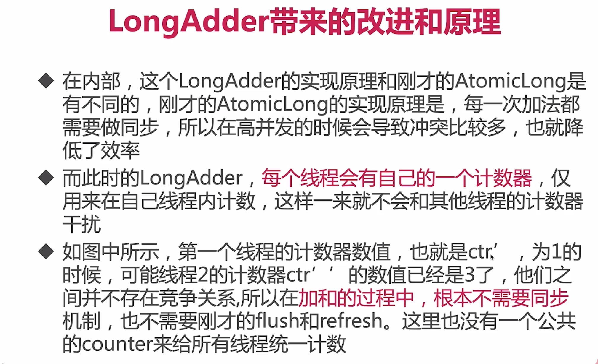
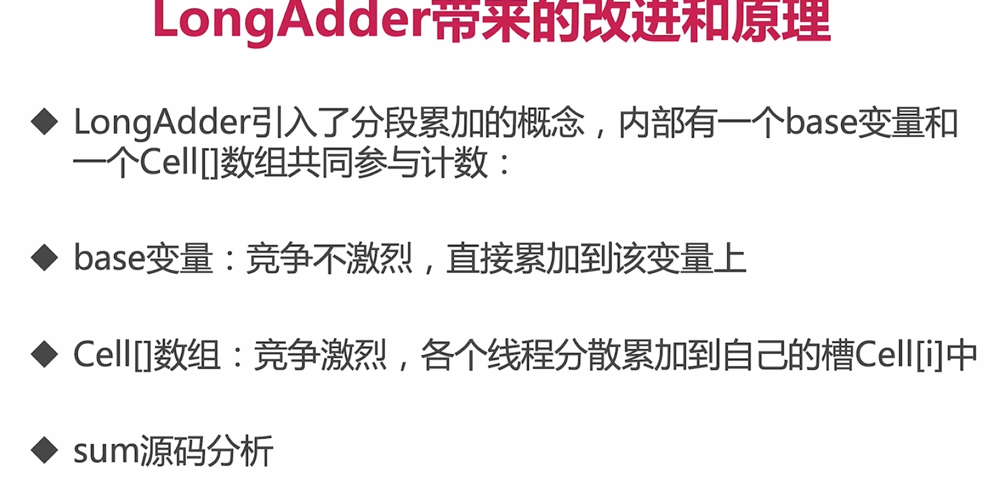
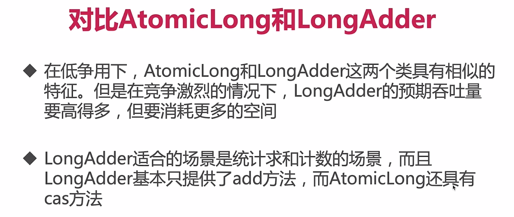

# 什么是元子类，有什么作用
+ 原子类的作用和锁类似，是为了保证并发情况下线程安全。不过原子类相比于锁，有一定的优势
+ 粒度更细：原子变量可以把竞争范围缩小到变量级别，这是我们可以获得的最细粒度的情况了，通常锁的粒度都要大于原子变量的粒度
+ 效率更高：通常，使用原子类的效率会比使用锁的效率更高，除了高度竞争的情况

# 六类原子类
## Atomic基本类型原子类
AtomicInterget
AtomicLong
AtomicBoolean
## AtomicArray数组类型原子类
AtomicIntegerArray
AtomicLongArray
AtomicReferenceArray
## AtomicReference引用类型原子类
AtomicReference
AtomicStampedReference
AtomicMarkableReference
## AtomicFieldUpdater升级类型原子类
AtomicIntegerfieldupdater
AtomicLongFieldUpdater
AtomicReferenceFieldUpdater
## Adder累加器
LongAdder
DoubleAdder
## Accumulator累加器
LongAccumulator
DoubleAccumulator

# AtomicInteger常用方法
public final int get()    //获取当前值
public final int getAndSet(int newValue)    //获取当前值并设置新的值
public final int getAndINcrement()    //获取当前值并自增
getAndDecrement()    //获取当前的值，并自减
getAndAdd(int delta)    //获取当前的值，并加上预期的值
boolean compareAndSet(int expect,int update)    //如果输入的数值等于预期值，则以原子方式将该值设置为输入值（update）

# Atomic*Reference引用类型原子类
AtomicReference类的作用，和AtomicInteger并没有本质区别，AtomicInteger可以让一个整数保证原子性，而AtomicReference可以让一个对象保证原子性，当然，AtomicReference的功能明细比AtomicInteger强，因为一个对象里可以包含很多属性，用法和AtomicInteger类似

# 把普通变量升级为具有原子功能
+ AtomicIntegerFieldUpdater对普通变量进行升级
+ 使用场景：偶尔需要一个原子get-set操作，或一个类不是我们编写的

# AtomicIntegerFieldUpdater注意点
+ 可见范围
+ 不支持static

# Adder累加器
+ 是java8引入的，相对是比较新的一个类
+ 高并发下LongAdder比AtomicLong效率高，不过本质是空间换时间
+ 竞争激烈的时候，LongAdder把不同线程对应到不同的Cell上进行修改，降低冲突的概率，是多段锁的理念，提高了并发性

# Accumulator累加器
Accumulator和Adder非常相似，Accumulator就是一个更通用版本的Adder