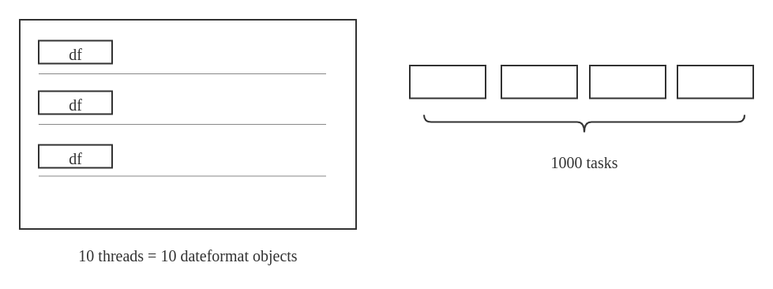
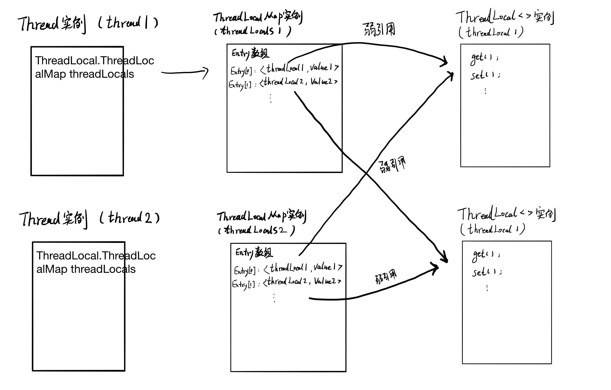
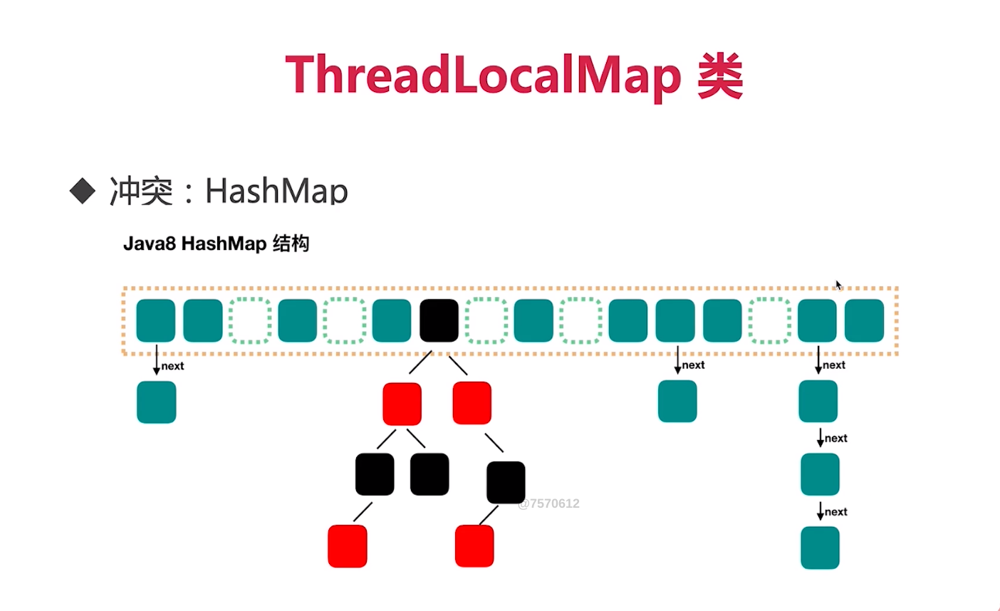

[TOC]


# 个人总结
ThreadLocal就是让当前线程持有一个对象
# Threadlocal两大使用场景
+ 每个线程需要一个独享的对象（典型需要使用的类有SimpleDateFormat和Random）
+ 每个线程内需要保存全局变量（例如在拦截器中获取用户信息），可以让不同方法直接使用，避免参数传递的麻烦
# 场景1：每个线程需要一个独享的对象
每个Thread内有<font color="red">自己</font>的实例副本，<font color="red">不共享</font>
比喻：<font color="red">教材</font>只有一本，一起做笔记有线程安全问题。<font color="red">复印</font>后没问题

需求：打印1000个时间戳，最好不重复
## 方法一，每次都生成一个新的SimpleDateFormat对象，浪费了大量资源
```java
public class ThreadLocalNormalUsage02 {

    public static ExecutorService threadPool = Executors.newFixedThreadPool(10);

    public static void main(String[] args) throws InterruptedException {
        for (int i = 0; i < 1000; i++) {
            int finalI = i;
            threadPool.submit(() -> {
                String date = new ThreadLocalNormalUsage02().date(finalI);
                System.out.println(date);
            });
        }
        threadPool.shutdown();
    }

    public String date(int seconds) {
        //参数的单位是毫秒，从1970.1.1 00:00:00 GMT计时
        Date date = new Date(1000 * seconds);
        SimpleDateFormat dateFormat = new SimpleDateFormat("yyyy-MM-dd HH:mm:ss");
        return dateFormat.format(date);
    }
}
```
## 方法二，使用线程池来输出日期，创建了10个线程，由于SimpleDateFormat是线程不安全的，无法得到正确的结果
```java
public class ThreadLocalNormalUsage03 {

    public static ExecutorService threadPool = Executors.newFixedThreadPool(10);
    static SimpleDateFormat dateFormat = new SimpleDateFormat("yyyy-MM-dd HH:mm:ss");

    public static void main(String[] args) throws InterruptedException {
        for (int i = 0; i < 1000; i++) {
            int finalI = i;
            threadPool.submit(() -> {
                String date = new ThreadLocalNormalUsage03().date(finalI);
                System.out.println(date);
            });
        }
        threadPool.shutdown();
    }

    public String date(int seconds) {
        //参数的单位是毫秒，从1970.1.1 00:00:00 GMT计时
        Date date = new Date(1000 * seconds);
        return dateFormat.format(date);
    }
}
```
## 方法三：使用Synchronized同步锁，每次只有一个线程可以访问SimpleDateFormat对象，性能不足
```java
public class ThreadLocalNormalUsage04 {

    public static ExecutorService threadPool = Executors.newFixedThreadPool(10);
    static SimpleDateFormat dateFormat = new SimpleDateFormat("yyyy-MM-dd HH:mm:ss");

    public static void main(String[] args) throws InterruptedException {
        for (int i = 0; i < 1000; i++) {
            int finalI = i;
            threadPool.submit(() -> {
                String date = new ThreadLocalNormalUsage04().date(finalI);
                System.out.println(date);
            });
        }
        threadPool.shutdown();
    }

    public String date(int seconds) {
        //参数的单位是毫秒，从1970.1.1 00:00:00 GMT计时
        Date date = new Date(1000 * seconds);
        String s = null;
        synchronized (ThreadLocalNormalUsage04.class) {
            s = dateFormat.format(date);
        }
        return s;
    }
}
```
## 方法四：使用ThreadLocal，每个线程持有一个SimpleDateFomat
```java
public class ThreadLocalNormalUsage05 {

    public static ExecutorService threadPool = Executors.newFixedThreadPool(10);

    public static void main(String[] args) throws InterruptedException {
        for (int i = 0; i < 1000; i++) {
            int finalI = i;
            threadPool.submit(() -> {
                String date = new ThreadLocalNormalUsage05().date(finalI);
                System.out.println(date);
            });
        }
        threadPool.shutdown();
    }

    public String date(int seconds) {
        //参数的单位是毫秒，从1970.1.1 00:00:00 GMT计时
        Date date = new Date(1000 * seconds);
//        SimpleDateFormat dateFormat = new SimpleDateFormat("yyyy-MM-dd HH:mm:ss");
        SimpleDateFormat dateFormat = ThreadSafeFormatter.dateFormatThreadLocal2.get();
        return dateFormat.format(date);
    }
}

class ThreadSafeFormatter {

    public static ThreadLocal<SimpleDateFormat> dateFormatThreadLocal = new ThreadLocal<SimpleDateFormat>() {
        @Override
        protected SimpleDateFormat initialValue() {
            return new SimpleDateFormat("yyyy-MM-dd HH:mm:ss");
        }
    };

    /**
     * java8之后的lumbda表达式，和上面等效
     */
    public static ThreadLocal<SimpleDateFormat> dateFormatThreadLocal2 = ThreadLocal
            .withInitial(() -> new SimpleDateFormat("yyyy-MM-dd HH:mm:ss"));
}
```
## SimpleDateFormat的进化之路
1. 2个线程分别用自己的SimpleDateFormat，这没问题【创建两个对象消耗不大】
2. 后来延伸出10个，那就有10个线程和10个SimpleDateFormat，这虽然写法不优雅（应该复用对象），但勉强可以接受【10个也就认了】
3. 但是当需求变成了1000个，那么必然要用线程池（否则消耗内存太多）【1000个疯了】
4. 所有的线程共有同一个SimpleDateFormat对象【线程安全】
5. 这是线程不安全的，出现了并发安全问题
6. 我们可以选择加锁，加锁结果正常，但是效率低【线性执行】
7. 在这里更好的解决方案是使用ThreadLocal【每个线程持有一个】
8. lambda表达式【初始化方式】


# 场景二：当前用户信息需要被线程内所有方法共享
+ 场景：一个比较繁琐的解决方案是把user作为参数层层传递，从service1()传递到service2()，再从service2()传递到service3()，以此类推，但是这样做会导致代码冗余且不移维护
+ 目标：每个线程内需要保存全局变量，可以让不同方法直接使用，避免参数传递的麻烦
+ 方法：用ThreadLocal保存一些业务内容（用户权限信息、从用户系统获取到的用户名、userId等）
+ 总结：这些信息在同一个线程内相同，但是不同的线程使用的业务内容是不相同的
+ 缺陷：持有时间过长，或者没有remove可能会造成内存溢出
## 方法一：可以使用UserMap

当多线程同时工作时，我们需要保证线程安全，可以用synchronized，也可以用ConcurrentHashMap，但无论用什么，都会对性能有所影响
## 方法二：ThreadLocal
更好的办法是使用ThreadLocal，这样无需synchronized，可以在不影响性能的情况下，也无需层层传递参数，就可达到保存当前线程对应的用户信息的目的：
1. 用ThreadLocal保存一些业务内容（用户权限信息、从用户系统获取到的用户名、userID等）
2. 这些信息在同一个线程内相同，但是不同的线程使用的业务内容是不相同的
3. 在线程生命周期内，都通过这个静态ThreadLocal实例的get()方法取得自己set过的那个对象，避免了将这个对象（例如user对象）作为参数传递的麻烦
4. 强调的是同一个请求内（同一个线程内）不同方法间的共享
5. 不需要重写initialValue()方法，但是必须手动调用set()方法

```java
public class ThreadLocalNormalUsage06 {

    public static void main(String[] args) {
        new Service1().process("");

    }
}

class Service1 {

    public void process(String name) {
        User user = new User("超哥");
        UserContextHolder.holder.set(user);
        new Service2().process();
    }
}

class Service2 {

    public void process() {
        User user = UserContextHolder.holder.get();
        ThreadSafeFormatter.dateFormatThreadLocal.get();
        System.out.println("Service2拿到用户名：" + user.name);
        new Service3().process();
    }
}

class Service3 {

    public void process() {
        User user = UserContextHolder.holder.get();
        System.out.println("Service3拿到用户名：" + user.name);
        UserContextHolder.holder.remove();
    }
}

class UserContextHolder {

    public static ThreadLocal<User> holder = new ThreadLocal<>();


}

class User {

    String name;

    public User(String name) {
        this.name = name;
    }
}
```
# 总结：ThreadLocal的两个作用
1. 让某个需要用到的对象在**线程间隔离**（每个线程都有自己的独立对象）
2. 在任何方法中都可以轻松获取到该对象
# 根据共享对象的生成时机不同，选择initialValue或set来保存对象
+ initialValue：在ThreadLocal第一次get的时候把对象给初始化出来，对象的初始化时机可以由我们控制
+ set：如果需要保存到ThreadLocal里的对象的生成时机不有我们随意控制，例如拦截器生成的用户信息，用ThreadLocal.set直接放到我们的ThreadLocal中去，以便后续使用
+ 通过源码分析可以看出，setInitialValue和自己set最后都是利用map.set()方法来设置值
+ 也就是说，最后都会对应到ThreadLocalMap的一个Entity，只不过是起点和入口不一样

理解成构造方法赋值
# 使用ThreadLocal带来的好处
1. 达到线程安全【单线程】
2. 不需要加锁，提高执行效率【不需要排队】
3. 更高效地利用内存、节省开销：相比于每个任务都新建一个SimpleDateFormat，显然用ThreadLocal可以节省内存和开销【单线程单例】
4. 免去传参的繁琐：无论是场景一的工具类，还是场景二的用户名，都可以在任何地方直接通过ThreadLocal拿到，再也不需要每次都传同样的参数。ThreadLocal使得代码耦合度低，更优雅【打破栈封闭】
# 原理、源码分析
搞清楚Thread、ThreadLocal以及ThreadLocalMap三者之间的关系：
Thread类

```java
public class Thread implements Runnable{
    /* ThreadLocal values pertaining to this thread. This map is maintained
     * by the ThreadLocal class. */
    ThreadLocal.ThreadLocalMap threadLocals = null;
    /*
     * InheritableThreadLocal values pertaining to this thread. This map is
     * maintained by the InheritableThreadLocal class.
     */
    ThreadLocal.ThreadLocalMap inheritableThreadLocals = null;
}
```

ThreadLocal类
```java
public class ThreadLocal<T> {
    static class ThreadLocalMap {
        static class Entry extends WeakReference<ThreadLocal<?>> {
            /** The value associated with this ThreadLocal. */
            Object value;

            Entry(ThreadLocal<?> k, Object v) {
                super(k);
                value = v;
            }
        }
    }
}
```
1. 每一个Thread实例里都有一个ThreadLocalMap属性,名称叫ThreadLocals,初始值是null,访问的时候如果是null,就会创建对象.一个Thread实例维护一个ThreadLocalMap对象
2. ThreadLocalMap是一个ThreadLocal的静态内部类(其实,这里为什么要把ThreadLocalMap写成静态内部类,我还没有搞明白,有兄台明白的望指点一二),注意:这是两个类之间的关系,而这两个类的实例之间的关系与他们两个类之间的关系不要联系到一起哦! 而ThreadLocalMap实例里维护的是一个或者多个Entry<k,v>,每个Entry的key就是ThreadLocal实例的弱引用,value就是线程的专属变量


# ThreadLocal的重要方法
## T initialValue()：初始化
1. 该方法会返回当前线程对应的“初始值”，这是一个延迟加载的方法，只有在调用get的时候，才会触发
2. 当线程第一次使用get方法访问变量时，将调用次方法，除非线程当前调用了set方法，在这种情况下，不会为线程调用initialValue方法
3. 通常，每个线程最多调用一次此方法，但如果已经调用了remove()后，在调用get()，则可以再次调用此方法
4. 如果不重写本方法，这个方法会返回null。一般使用匿名内部类的方法来重写initialize()方法，以便在后续使用者可以初始化副本对象
## void set(T t)：为这个线程设置一个新值

```java
/**
     * Sets the current thread's copy of this thread-local variable
     * to the specified value.  Most subclasses will have no need to
     * override this method, relying solely on the {@link #initialValue}
     * method to set the values of thread-locals.
     *
     * @param value the value to be stored in the current thread's copy of
     *        this thread-local.
     */
    public void set(T value) {
        Thread t = Thread.currentThread();
        ThreadLocalMap map = getMap(t);
        if (map != null)
            map.set(this, value);
        else
            createMap(t, value);
    }
```
## T get()：得到这个线程对应的value。如果是首次调用get()，则会调用initialize来得到这个值
+ get方法是先取出当前线程的ThreadLocalMap，然后调用map.getEntry方法，把本ThreadLocal的引用作为参数传入，取出map中属于本ThreadLocal的value
+ 注意，这个map以及map中的key和value都是保存在线程中的，而不是保存在ThreadLocal中

```java
/**
 * Returns the value in the current thread's copy of this
 * thread-local variable.  If the variable has no value for the
 * current thread, it is first initialized to the value returned
 * by an invocation of the {@link #initialValue} method.
 *
 * @return the current thread's value of this thread-local
 */
public T get() {
    Thread t = Thread.currentThread();
    ThreadLocalMap map = getMap(t);
    if (map != null) {
        ThreadLocalMap.Entry e = map.getEntry(this);
        if (e != null) {
            @SuppressWarnings("unchecked")
            T result = (T)e.value;
            return result;
        }
    }
    return setInitialValue();
}
```
## void remove()：删除对应这个线程的值
```java
/**
     * Removes the current thread's value for this thread-local
     * variable.  If this thread-local variable is subsequently
     * {@linkplain #get read} by the current thread, its value will be
     * reinitialized by invoking its {@link #initialValue} method,
     * unless its value is {@linkplain #set set} by the current thread
     * in the interim.  This may result in multiple invocations of the
     * {@code initialValue} method in the current thread.
     *
     * @since 1.5
     */
     public void remove() {
         ThreadLocalMap m = getMap(Thread.currentThread());
         if (m != null)
             m.remove(this);
     }
```
# ThreadLocalMap类

+ ThreadLocalMap类，也就是Thread.threadLocals
+ ThreadLocalMap类是每个线程Thread类里面的变量，里面最重要的是一个键值对数组Entry[] table，可以认为是一个map，键值对：
    键：这个ThreadLocal
    值：实际需要的成员变量，比如user或者simpleDateFormat对象
+ ThreadLocalMap这里采用的是线性探测法，也就是如果发生冲突，就继续找下一个空位置，而不是链表拉链 


从上图我们可以初步窥见ThreadLocal的核心机制：
1. 每个Thread线程内部都有一个Map
2. Map里面储存线程本地对象key和线程的变量副本value
3. Thread内部的Map是由ThreadLocal维护的，由ThreadLocal负责向Map获取和设置线程的变量值

这样对于不同的线程，每次获取副本值时，别的线程并不能获取到当前线程的副本值，这样就形成了副本隔离，互不干扰


# ThreadLocal注意点
## 内存泄露
什么是内存泄露：某个对象不再有用，但是占用的内存却不能被回收
ThreadLocalMap
```java
static class Entry extends WeakReference<ThreadLocal<?>> {
    /** The value associated with this ThreadLocal. */
    Object value;

    Entry(ThreadLocal<?> k, Object v) {
        super(k);//弱引用
        value = v;//强引用
    }
}
```
## key：
弱引用的特点是，如果这个对象只被弱引用关联（没有任何强引用关联），那么这个对象就可以被回收
所以弱引用不会阻止GC，因此这个弱引用的机制
## value：
+ ThreadLocalMap的每个Entry都是一个对key的弱引用，同时，每个Entry都包含了一个对value的强引用
+ 正常情况下，当线程终止，保存在ThreadLocal里的value会被垃圾处理器回收，因为没有任何强引用了
+ 但是，如果线程不终止（比如线程需要保持很久），那么key对应的value就不能被回收，因为有以下的调用链：Thread——>ThreadLocalMap——>Entry(key为null)——>Value
+ 因为valueheThread之间还存在这个强引用链路，所以导致value无法回收，就可能会出现OOM
+ JDK已经考虑到了这个问题，所以在set、remove、rehash方法中会扫描key为null的Entry，并把对应的value设置为null，这样value对象就可以被回收
+ 但是如果一个ThreadLocal不被使用，那么实际上set，remove，rehash方法也不会被调用，如果同时线程又不停止，那么调用链就一直存在，那么就导致了value的内存泄露

ThreadLocalMap的resize方法
```java
private void resize() {
    Entry[] oldTab = table;
    int oldLen = oldTab.length;
    int newLen = oldLen * 2;
    Entry[] newTab = new Entry[newLen];
    int count = 0;

    for (int j = 0; j < oldLen; ++j) {
        Entry e = oldTab[j];
        if (e != null) {
            ThreadLocal<?> k = e.get();
            if (k == null) {
                e.value = null; // Help the GC
            } else {
                int h = k.threadLocalHashCode & (newLen - 1);
                while (newTab[h] != null)
                    h = nextIndex(h, newLen);
                newTab[h] = e;
                count++;
            }
        }
    }
}
```
## 如何避免内存泄露（阿里规约）
调用remove方法，就会删除对应的Entry对象，可以避免内存泄露，所以使用完ThreadLocal之后，应该调用remove方法，或者使用拦截器调用remove方法
## ThreadLocal的空指针异常（NPE）
装箱拆箱导致的，而不是ThreadLocal的问题
```java
ThreadLocal<Long> ThreadLocal = new ThreadLocal<Long>();
public long get(){
    return ThreadLocal.get();//拆箱转成long报错，如果value是空的话
}
public Long get(){
    return ThreadLocal.get();
}
```
## 共享对象
如果在每个线程中ThreadLocal.set()进去的东西本来就是多线程共享的同一个对象，比如static对象，那么多个线程的ThreadLocal.get()取得的还是这个共享对象本身，还是有并发访问问题
# ThreadLocal注意点
+ 如果可以不使用ThreadLocal就解决问题，那么不要强行使用
    例如在任务数很少的时候，在局部变量中可以新建对象就可以解决问题，那么就不需要使用到ThreadLocal
+ 优先使用框架的支持，而不是自己创造
    例如在Spring中，如果可以使用RequestContextHolder，那么就不需要自己维护ThreadLocal，因为自己可能会忘记调用remove()方法等，造成内存泄露
# 实际应用场景：在Spring中的实例分析
+ DateTimeContextHolder类，看到里面用了ThreadLocal
+ RequestContextHolder类，在每次HTTP请求中都对应一个线程，线程之间相互隔离，这就是ThreadLocal的典型应用场景


[一篇文章](https://www.cnblogs.com/micrari/p/6790229.html)