[TOC]

# Lock接口
+ 锁是一种工具，用于控制对共享资源的访问
+ Lock和synchronized，这两个是最常见的锁，它们都可以达到线程安全的目的，但是在使用上和功能上又有较大的不同。
+ Lock并不是用来代替synchronized的，而是当使用synchronized不适合或不足以满足要求的时候，来提供高级功能的。
+ Lock接口最常见的实现类是ReentrantLock
+ 通常情况下，Lock只允许一个线程来访问这个共享资源。不过有的时候，一些特殊的实现也允许并发访问，比如：ReadWriteLock里面的ReadLock

# synchronized不够用？
1. 效率低：锁释放情况少、试图获得锁时不能设定超时、不能中断一个正在试图获得锁的线程
2. 不够灵活（读写锁更灵活）：加锁和释放的时机单一，每个锁仅有单一的条件（某个对象），可能是不够的
3. 无法知道是否成功获取到锁

# Lock主要方法介绍
## lock()
1. lock()就是最普通的获取锁。如果锁已被其他线程获取，则进行等待
2. Lock不会像synchronized一样在异常时自动释放锁
3. 因此最佳实践是，在finally中释放锁，以保证发生异常时锁一定被释放
4. lock()方法不能被中断，这会带来很大的隐患：一旦陷入死锁，lock()就会陷入永久等待
## tryLock()
1. tryLock()用来尝试获取锁，如果当前锁没有被其他线程占用，则获取成功，则返回true，否则返回false，代表获取锁失败
2. 相比于lock，这样的方法显然功能更强大了，我们可以根据是否能获取锁来决定后续程序的行为
3. 该方法会立即返回，即便在拿不到锁时不会一直在那等
## tryLock(long time,TimeUnit unit)
超时就放弃
## lockInterruptibly()
相当于tryLock(long time,TimeUnit unit)把超时时间设置为无限。在等待锁的过程中，线程就可以被中断
## unlock()
先解锁再写业务逻辑

# 可见性保证
happens-before
Lock的加解锁和synchronized有同样的内存语义，也就是说，下一个加锁前可以看到所有前一个解锁后发生的所有语句
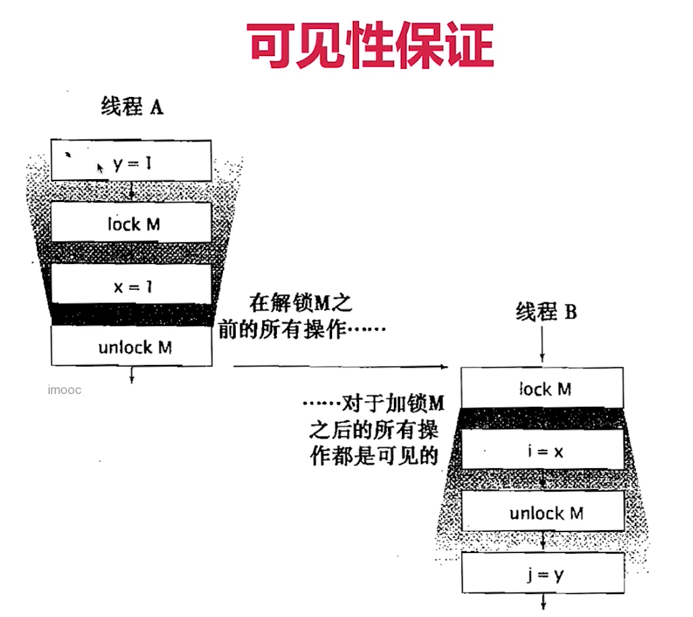

# 锁的分类
+ 这些分类，是从各种不同角度出发去看的
+ 这些分类并不是互斥的，也就是多个类型可以并存：有可能一个锁，同时属性两种类型
+ ReentrantLock既是互斥锁，又是可重入锁
+ 好比一个人可以同时是男人，又是军人，这个不冲突

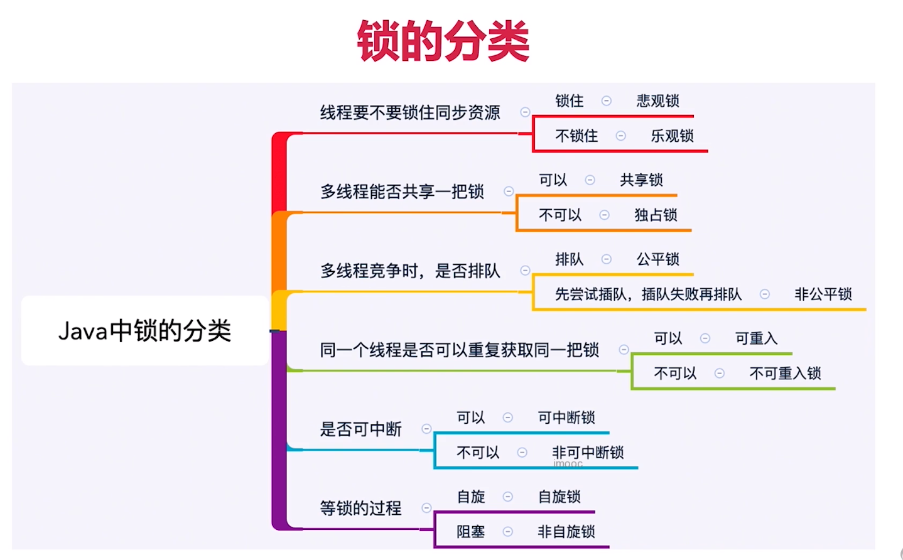

# 乐观锁与悲观锁
为什么诞生非互斥同步锁，互斥同步锁的劣势：
+ 阻塞和唤醒带来的性能劣势
+ 永久阻塞：如果持有锁的线程被永久阻塞，比如遇到了无限循环、死锁等活跃性问题，那么等待该线程释放锁的那几个悲催的线程，将永远也得不到执行
+ 优先级反转

# 悲观锁
+ 如果我不锁住这个资源，别人就回来争抢，就会造成数据结果错误，所以每次悲观锁为了确保结果的正确性，会在每次获取并修改数据时，把数据锁住，让别人无法访问该数据，这样就可以确保数据内容万无一失
+ Java中的悲观锁的实现就是synchronized和Lock相关类
![](_v_images/20200109230045226_233697470.png

# 乐观锁
+ 如果数据和我一开始拿到的不一样了，说明其他人在这段时间内改过数据，那我就不能继续刚才的更新数据过程了，我会选择放弃、报错、重试等策略
+ 乐观锁的实现一般都是利用CAS算法来实现的

## 例子：
1. 线程1发现没人在计算期间修改资源，于是把自己的计算结果写到资源里
2. 线程2计算完并判断资源是否已被修改
3. 线程2发现在计算期间有人修改了资源，于是报错或重试

# 典型例子
+ 悲观锁：synchronized和lock接口
+ 乐观锁：原子类、并发容器等

# 乐观锁例子
Git：Git就是乐观锁的典型例子，当我们往远端仓库push的时候，git会检查远端仓库版本是不是领先于我们现在的版本，如果远程仓库的版本号和本地的不一样，就表示有其他人修改了远端代码了，我们的这次提交就失败；如果远端和本地版本号一致，我们就可以顺利提交版本到远端仓库
。git不适合用悲观锁，否则公司倒闭。

# 典型例子
悲观锁：select for update就是悲观锁
乐观锁：用version控制数据库就是乐观锁

添加一个字段lcok_version
先查询这个更新语句的version：select * from table
然后update set num=2,version=version+1 where version=1 and id=5;
如果version被更新了等于2，不一样就会更新出错，这就是乐观锁的原理

# 开销对比
+ 悲观锁的原始开销要高于乐观锁，但是特点是一劳永逸，临界区持锁时间就算越来越差，也不会对互斥锁的开销造成影响
+ 相反，虽然乐观锁一开始的开销比悲观锁小，但是如果自旋时间很长或者不停重试，那么消耗的资源也会越来越多

# 两种锁各自的使用场景：各有千秋
+ 悲观锁：适合并发写入多的情况，适用于临界区持锁时间比较长的情况，悲观锁可以避免大量的无用自旋等消耗，典型情况：
     1. 临界区有IO操作
     2. 临界区代码复杂或者循环量大
     3. 临界区竞争非常激烈
+ 乐观锁：适合并发写入少，大部分是读取的场景，不加锁的能让读取性能大幅增高

# 可重入锁与非可重入锁（以ReentrantLock为例 ）

电影院买票选座位

# 可重入性质
什么是可重入：
摇号的故事
具体解释
好处：
避免死锁
提升封装性

递归调用不释放锁不停获取锁

# 源码对比
可重入锁ReentrantLock以及非可重入锁ThreadPoolExecutor的Worker类

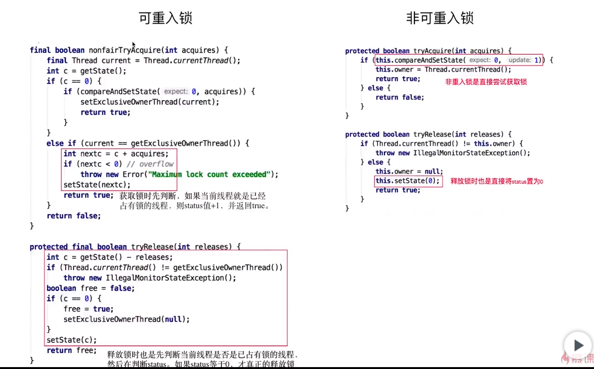

---

# 公平锁和非公平锁
+ 公平指的是按照线程请求的顺序，来分配锁；非公平指的是，不完全按照请求的顺序，在一定情况下，可以插队
+ 注意：非公平也同样不提倡“插队”行为，这里的非公平，指的是“在合适的时机”插队，而不是盲目插队
+ 什么是合适的时机呢？
+ 火车票被插队的例子

## 为什么要有非公平锁
为了提高效率，避免唤醒带来的空档期

唤醒的开销很大，在此期间利用空档期提高吞吐量

女神找不到男朋友之间备胎来补救

## 公平的情况（以ReentrantLock为例）
如果在创建ReentrantLock对象时，参数填写为true，那么这就是个公平锁

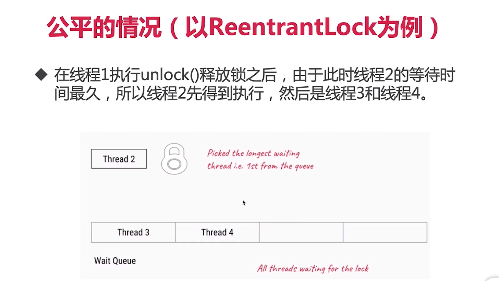

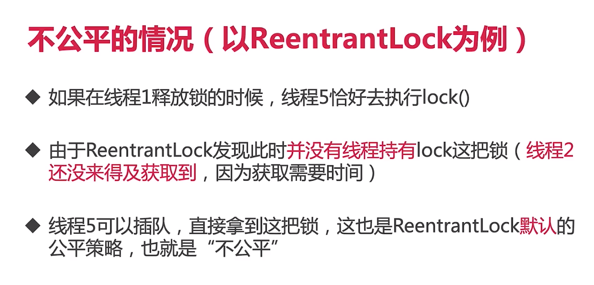

---

# 共享锁和排它锁

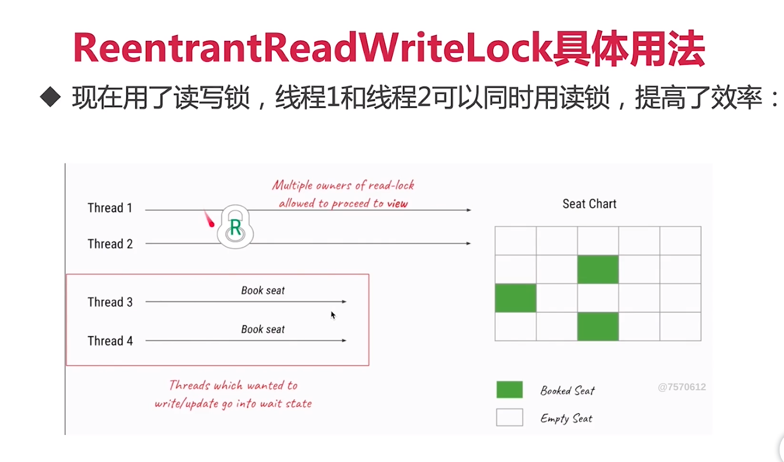

# 读锁和写锁的交互方式
+ 选择规则
+ 读线程插队（比喻：男女共用厕所，男生可以插队吗？）
+ 升降级

# ReentrantReadWriteLock的实现
+ 插队：不允许读锁插队
+ 升降级：允许降级，不允许升级

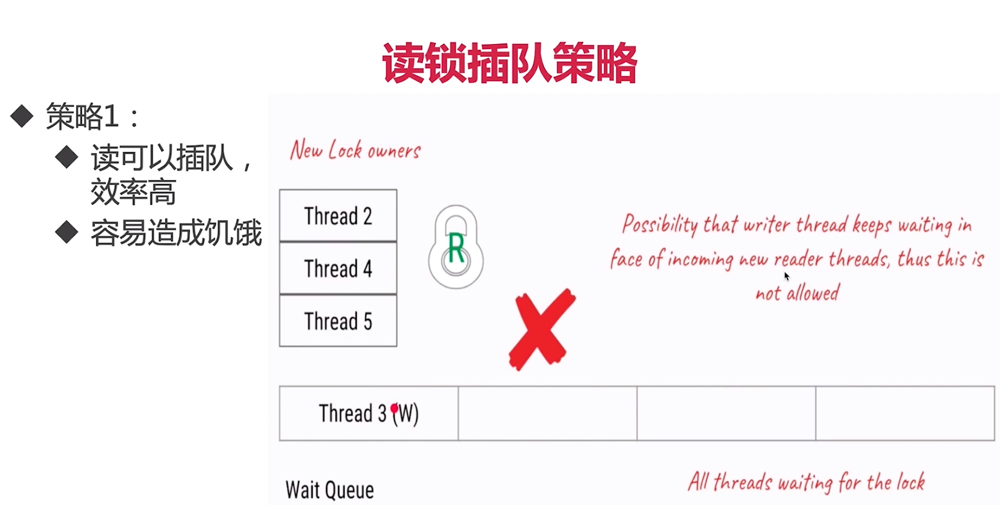

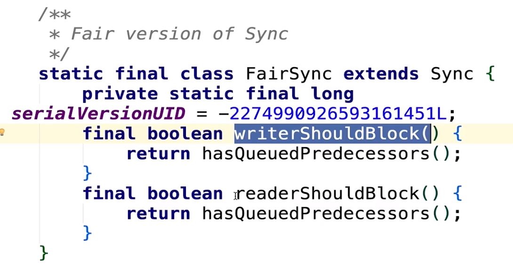

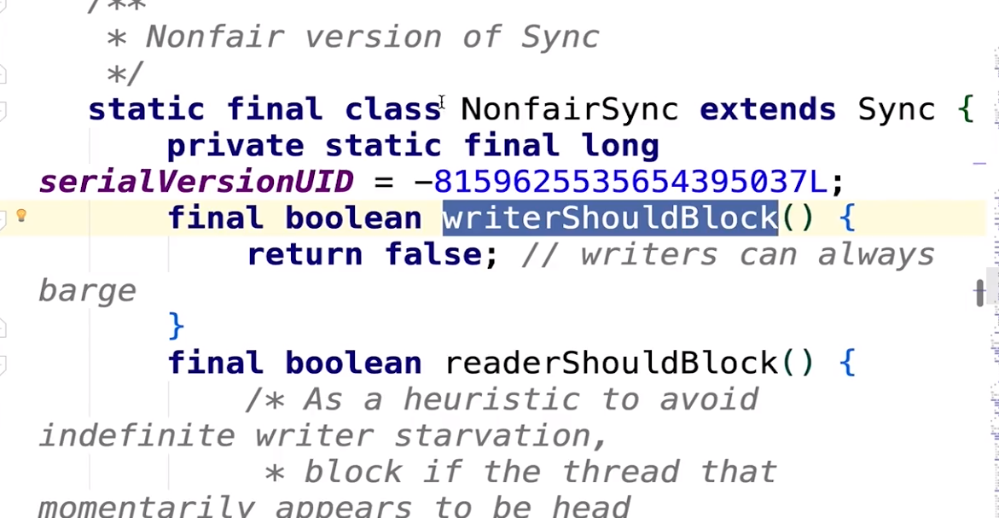

插队不成功就去排队了

执行栈？？？有序？？？

公平锁在哪排队？

# 锁的升降级
+ 支持锁的降级，不支持升级
+ 为什么不支持锁的升级？死锁
如果a，b两个读锁都想升级写锁，那就会造成死锁

# 共享锁和排它锁总结
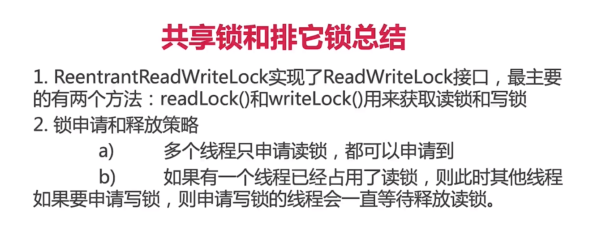

# 自旋锁和阻塞锁

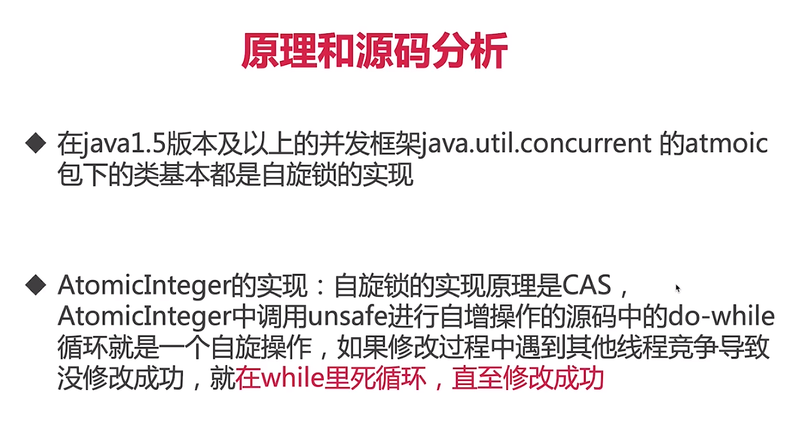

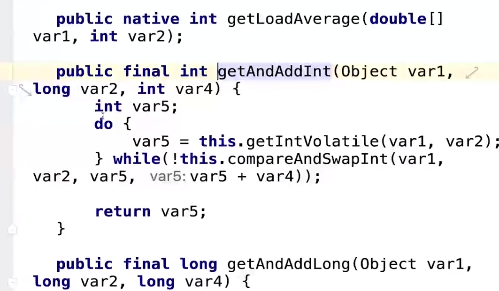

自己实现一个简单的自旋锁：spinlock

# 可中断锁

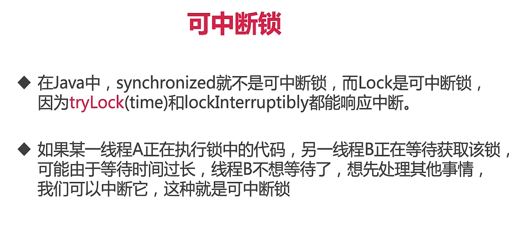

# 锁优化

# 锁总结
