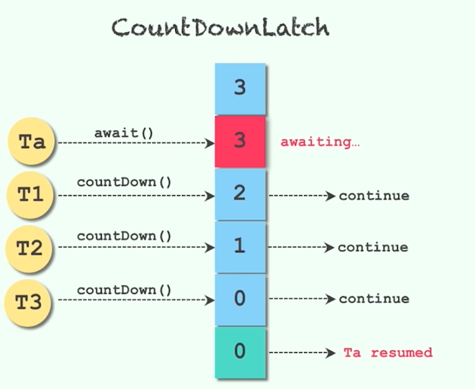

[TOC]

# 主要四种
+ CountDownLatch倒计时门闩
+ Semaphore信号量
+ Condition接口（又称条件对象）
+ CyclicBarrier循环栅栏

# 什么是控制并发流程
+ 控制并发流程的工具类，作用就是帮助我们程序员更容易得让线程之间合作
+ 让线程之间相互配合，来满足业务逻辑
+ 比如让线程A等待线程B执行完毕后在执行等合作策略

# 有哪些控制并发流程的工具类
|       类       |                                  作用                                   |                         说明                         |
| ------------- | ---------------------------------------------------------------------- | ---------------------------------------------------- |
| Semaphore      | 信号量，可以通过控制“许可证”的数量，来保证线程之间的配合                          | 线程只有在拿到“许可证”后才能继续运行。相比于其他的同步器，更灵活 |
| CyclicBarrier  | 线程会等待，直到足够多线程达到了事先规定的数目。一旦达到触发条件，就可以进行下一步的动作 | 适用于线程之间相互等待处理结果就绪的场景                     |
| Phaser         | 和CyclicBarrier类似，但是计数可变                                           | Java7加入的                                           |
| CountDownLatch | 和CyclicBarrier类似，数量递减到0时，触发动作                                  | 不可重复使用                                           |
| Exchanger      | 让两个线程在合适时交换对象                                                   | 适用场景：当两个线程工作在同一个类的不同实例上时，用于交换数据   |
| Condition      | 可以控制线程的“等待”和“唤醒”                                                | 是Object.wait()的升级版                                |

# CountDownLatch
倒数门闩
例子：购物拼团；大巴人满发车
流程：倒数结束之前，一直处于等待状态，直到倒计时结束了，此线程才继续工作

## 类的主要方法
CountDownLatch(int count)：仅有一个构造函数，参数count为需要倒数的数值
await()：调用await()方法的线程会被挂起，它会等待直到count值为0才继续执行
countDown()：将count值减1，直到为0时，等待的线程会被唤起

## 用法一：一个线程等待多个线程都执行完毕，再继续自己的工作
场景：体检

## 用法二：多个线程等待某一个线程的信号，同时开始执行
服务器压测：让所有的并发同一时刻发生，模拟高峰流量
count为5等5次，count为1等1次
多个CountDownLatch一起使用
一等多，多等一

## 注意点
+ 多个线程等多个线程完成执行后，再同时执行
+ CountDownLatch是不能够重用的，如果需要重新计数，可以考虑使用CyclicBarrier或者创建新的CountDownLatch实例

## 总结
+ 两个典型用法：一等多和多等一
+ CountDownLatch类在创建实例的时候，需要传递倒数次数。倒数到0的时候，之前等待的线程会继续执行。
+ 创建时传递倒数次数（count构造函数），谁想等待谁就调用await()，谁去倒数谁就调用countDown()，这三个方法结合起来之后，直到countDown到0之后，之前的await的方法都会触发
+ CountDownLatch不能回滚重置（复用）

# Semaphore信号量
+ Semaphore可以用来限制或管理数量有限的资源的使用情况
+ 信号量的作用是维护一个“许可证”的计数，线程可以“获取”许可证，那信号量剩余的许可证就减一，线程也可以“释放”一个许可证，那信号量剩余的许可证就加一，当信号量所拥有的许可证数量为0，那么下一个还想要获取许可证的线程，就需要等待，直到有另外的线程释放了许可证

## 信号量使用流程
+ 初始化Semaphore并指定许可证的数量
+ 在需要被现在的代码前加acquire()或者acquireUninterruptibly()方法
+ 在任务执行结束后，调用release()来释放许可证

## 信号量主要方法介绍
+ new Semaphore(int permits,boolean fair)：这里可以设置是否要使用公平策略，如果传入true，那么Semaphore会把之前等待的线程放到FIFO的队列里，以便于当有了新的许可证，可以分发给之前等了最长时间的线程
+ acquire()响应中断
+ acquireUninterruptibly()不响应中断
+ tryAcquire()：看看现在有没有空闲的许可证，如果有的话就获取，如果没有的话也没关系，我不必陷入阻塞，我可以去做别的事，过一会再来查看许可证的空闲情况
+ tryAcquire(timeout)：和tryAcquire()一样，但是多了一个超时时间，比如“在3秒内获取不到许可证，我就去做别的事”

## 信号量的特殊用法
acquire(int n)一次拿n个许可证
可以让用户根据负载来控制，同时释放n个许可证

### 一次性获取或释放多个许可证
+ 比如TaskA会调用很消耗资源的method1()，而TaskB调用的是不太消耗资源的method2()，假设我们一共有5个许可证。那么我们就可以要求TaskA获取5个许可证才能执行，而TaskB只需要获取到一个许可证就能执行，这样就避免了A和B同时运行的情况，我们可以根据自己的需求合理分配资源
+ 获取和释放的许可证数量必须一致，否则比如每次都获取2个但是只释放1个甚至不释放，随着时间的推移，到最后许可证数量不够用，会导致程序卡死。（虽然信号量类并不对释放和获取的数量做规定，但是这是我们的编程规范，否则容易出错）
+ 注意在初始化Semaphore的时候设置公平性，一般设置为true会更合理
+ 并不是必须由获取许可证的线程释放那个许可证，事实上，获取和释放许可证对线程并无要求，也许是A获取了，然后由B释放，只要逻辑合理即可（跨线程、跨线程池，如果将信号量设置为静态的，那就可以全局访问）
+ 信号量的作用，除了控制临界区最多同时有N个线程访问外，另一个作用是可以实现“条件等待”，例如线程1需要在线程2完成准备工作后才能开始工作，那么就线程1调用acquire()，而线程2完成任务后release()，这样的话，相当于是轻量级的CountDownLatch

# Condition接口（又称条件对象）

## Condition作用
+ 当线程1需要等待某个条件的时候，它就去执行condition.await()方法，一旦执行了await()方法，线程就会进入阻塞状态
+ 然后通常会有另外一个线程，假设是线程2，去执行对应的条件，知道这个条件达成的时候，线程2就会去执行condition.signal()方法，这时JVM就会从被阻塞的线程里找，找到那些等待该condition的线程，当线程1就会收到可执行信号的时候，它的线程状态就会变成Runnable可执行状态

## signalAll()和signal()区别
+ signalAll()会唤醒所有的正在等待的线程
+ 但是signal()是公平的，只会唤起那个等待时间最长的线程

## 阻塞与线程状态阻塞区别

## 生产者消费者模式

# Condition注意点
+ 实际上，如果说Lock用来代替synchronized，那么Condition就是用来代替相应的Object.wait/notify的，所以在用法和性质上，几乎都一样
+ await方法会自动释放持有的Lock锁，和Object.wait一样，不需要自己手动先释放锁
+ 调用await的时候，必须持有锁，否则会抛出异常，和Object.wait一样

# CyclicBarrier循环栅栏
+ CyclicBarrier循环栅栏和CountDownLatch很类似，都能阻塞一组线程
+ 当有大量线程相互配合，分别计算不同任务，并且需要最后统一汇总的时候，我们可以使用CyclicBarrier。CyclicBarrier可以构造一个集结点，当某一个线程执行完毕。它就会到集结点等待，直到所有的线程都到了集结点，那么该栅栏就被撤销，所有线程再统一出发，继续执行剩下的任务
+ 生活中的例子：3个人明天在学校碰面，都到齐后，一起讨论下学期的计划

## CyclicBarrier和CountDownLatch的区别
+ 作用不同：CyclicBarrier要等固定数量的线程都到达了栅栏位置才能继续执行，而CountDownLatch只需等待数字到0，也就是说，CountDownLatch用于事件，但是CyclicBarrier是用于线程的
+ 可重用性不同：CountDownLatch在倒数到0并触发门闩打开后，就不能再次使用了，触发新建新的实例；而CyclicBarrier可以重复使用

# 总结
什么是控制并发流程：等待某个事件或某个条件达到要求