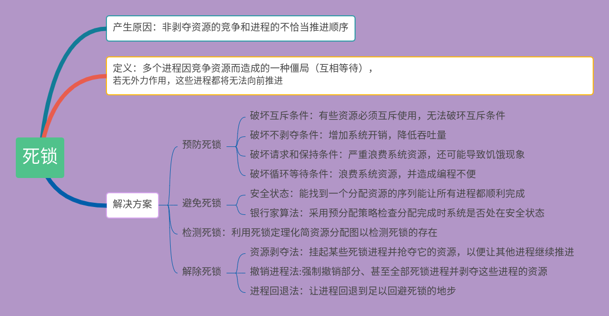
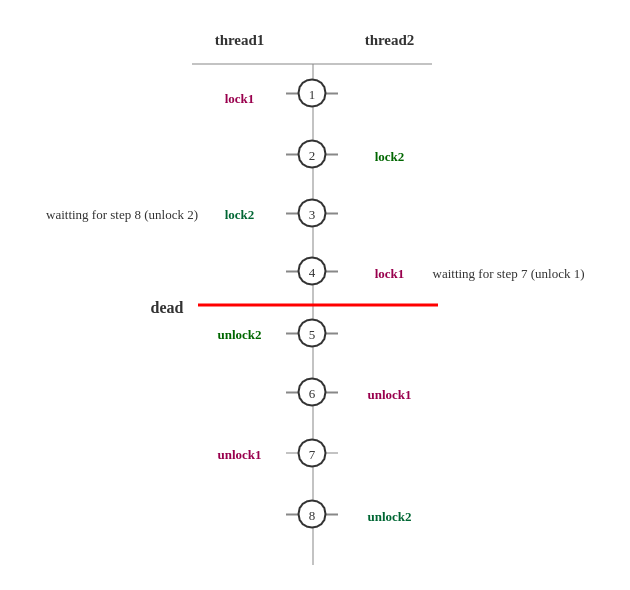

[TOC]


# 死锁的4个必要条件（缺一不可）
+ 互斥（mutual exclusion）：资源只能同时分配给一个行程，无法多个行程共享
+ 持有和等待（hold and wait）：一个进程可以在等待时持有系统资源，例如：第一个线程请求第二把锁但是持有第一把锁
+ 禁止抢占（no preemption）：不能有外界干扰、外界剥夺
+ 循环等待（circular waiting）：构成环路

死锁只有在四个条件同时满足时发生，预防死锁必须至少破坏其中一项。
破解其中一个条件，就不会发生死锁
# 什么是死锁
互不想让：当两个（或更多）线程（或进程）互相持有对方所需要的资源，又不主动释放，导致所有人都无法相继前进，导致程序陷入无尽的阻塞，这就是死锁。如果多个线程之间的依赖关系是环形，存在环路的锁的依赖关系，那么也可能会发生死锁。

# 死锁的影响
死锁的影响在不同系统中是不一样的，这取决于系统对死锁的处理能力
数据库中：检查并放弃事务（类似第一个事务放弃，后面执行之后任务再接着执行第一个事物）
JVM中：无法自动处理（但可以检测）

几率不高但危害大
不一定发生，但是遵守“墨菲定律”，一旦发生，多是高并发场景，影响用户多。整个系统崩溃、子系统崩溃、性能降低，压力测试无法找出所有潜在的死锁
# 如何定位死锁
+ jstack
+ ThreadMXBean

```shell
jps
jstack <pid>
```
# 修复死锁的策略
+ 避免策略：哲学家就餐的换手方案、转账换序方案（用换序来避免转账死锁：hashcode、主键来决定获取锁的顺序，如果相同就加把竞争锁）
+ 检测与恢复策略：一点时间检测是否有死锁，如果有就剥夺某一个资源，来打开死锁
+ 鸵鸟策略
# 实际工程中如何避免死锁
1. 设置超时时间（Lock的tryLock（long timeout,TimeUnit unit））
synchronized不具备尝试锁的能力
造成超时的可能性多：发生了死锁、线程陷入死循环、线程执行很慢
获取锁失败：打日志、发报警邮件、重启等

释放锁顺序

2. 多使用并发类而不是自己设计锁：
ConcurrentHashMap、ConcurrentLinkedQueue、AtomicBoolean等
实际使用中java.util.concurrent.atomic十分有用，简单方便且效率比使用Lock更高

多用并发集合少用同步集合，并发集合比同步集合的可扩展性更好
并发场景需要用到map，首先想到用ConcurrentHashMap

3. 尽量降低锁的使用粒度：用不同的锁而不是一个锁
4. 如果能使用同步代码块，就不使用同步方法：自己指定锁对象（缩小范围、可控锁对象，同步方法的锁不是我们控制的）
5. 给线程起个有意义的名字：debug和排查时事半功倍，框架和JDK都遵守这个最佳实践
6. 避免锁的嵌套：MustDeadLock类
7. 分配资源前先看能不能收回来：银行家算法
8. 尽量不要几个功能用同一把锁：专锁专用
