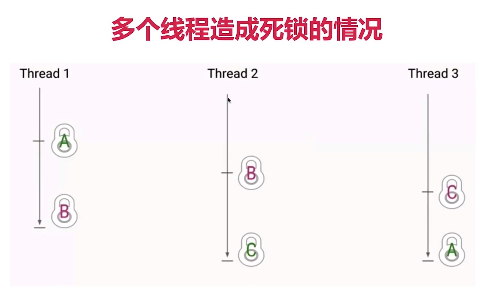

[TOC]

# 死锁的4个必要条件（缺一不可）
+ 互斥条件
+ 请求与保持条件：第一个线程请求第二把锁但是持有第一把锁
+ 不剥夺条件：不能有外界干扰、外界剥夺
+ 循环等待条件：构成环路

如果系统中只有一个进程，当然不会产生死锁。如果每个进程仅需求一种系统资源，也不会产生死锁。不过这只是理想状态，在现实中是可遇不可求的。
+ 禁止抢占（no preemption）：系统资源不能被强制从一个进程中退出
+ 持有和等待（hold and wait）：一个进程可以在等待时持有系统资源
+ 互斥（mutual exclusion）：资源只能同时分配给一个行程，无法多个行程共享。
+ 循环等待（circular waiting）：一系列进程互相持有其他进程所需要的资源

死锁只有在四个条件同时满足时发生，预防死锁必须至少破坏其中一项。
破解其中一个条件，就不会发生死锁

# 什么是死锁
互不想让：当两个（或更多）线程（或进程）互相持有对方所需要的资源，又不主动释放，导致所有人都无法相继前进，导致程序陷入无尽的阻塞，这就是死锁。


如果多个线程之间的依赖关系是环形，存在环路的锁的依赖关系，那么也可能会发生死锁。



# 死锁的影响
死锁的影响在不同系统中是不一样的，这取决于系统对死锁的处理能力
数据库中：检查并放弃事物（类似第一个事物放弃，后面执行之后再接着执行第一个事物）
JVM中：无法自动处理（但可以检测）

# 几率不高但危害大
不一定发生，但是遵守“墨菲定律”
一旦发生，多是高并发场景，影响用户多
整个系统崩溃、子系统崩溃、性能降低
压力测试无法找出所有潜在的死锁

# 发生死锁的例子
实际生产中的例子：多个人转账

注意看退出信号：Process finished with exit code 130(interrupted by signal 2:SIGINT)，是不正常退出的信号，对比正常结束的程序的结束信号是0。

# 转账
需要两把锁
获取两把锁成功，且余额大于0，则扣除转出人，增加收款人的余额，是原子操作
顺序相反导致死锁（互相转钱）

# 分布式锁与单机锁


# 如何定位死锁
+ jstack
+ ThreadMXBean

jps
jstack <pid>
```
Found one Java-level deadlock:
=============================
"Thread-19":
  waiting to lock monitor 0x00007f04a40057e8 (object 0x000000076d431918, a src.main.java.base.concurrency.moocwukong.deadlock.TransferMoney$Account),
  which is held by "Thread-11"
"Thread-11":
  waiting to lock monitor 0x00007f04a4005738 (object 0x000000076d4323e8, a src.main.java.base.concurrency.moocwukong.deadlock.TransferMoney$Account),
  which is held by "Thread-19"

Java stack information for the threads listed above:
===================================================
"Thread-19":
	at src.main.java.base.concurrency.moocwukong.deadlock.TransferMoney.transferMoneyDeadLock(TransferMoney.java:48)
	- waiting to lock <0x000000076d431918> (a src.main.java.base.concurrency.moocwukong.deadlock.TransferMoney$Account)
	- locked <0x000000076d4323e8> (a src.main.java.base.concurrency.moocwukong.deadlock.TransferMoney$Account)
	at src.main.java.base.concurrency.moocwukong.deadlock.MultiTransferMoney$1TransferThread.run(MultiTransferMoney.java:32)
"Thread-11":
	at src.main.java.base.concurrency.moocwukong.deadlock.TransferMoney.transferMoneyDeadLock(TransferMoney.java:48)
	- waiting to lock <0x000000076d4323e8> (a src.main.java.base.concurrency.moocwukong.deadlock.TransferMoney$Account)
	- locked <0x000000076d431918> (a src.main.java.base.concurrency.moocwukong.deadlock.TransferMoney$Account)
	at src.main.java.base.concurrency.moocwukong.deadlock.MultiTransferMoney$1TransferThread.run(MultiTransferMoney.java:32)

Found 1 deadlock.
```

# 修复死锁的策略


用换序来避免转账死锁（hashcode、主键来决定获取锁的顺序，如果相同就加把竞争锁）  

# 哲学家就餐问题


+ 互斥条件（1,3）
+ 请求与保持条件（1,3）
+ 不剥夺条件（领导调节）
+ 循环等待条件（1,2,3）

# 检测与恢复策略

# 实际工程中如何避免死锁
1. 设置超时时间（Lock的tryLock（long timeout,TimeUnit unit））
synchronized不具备尝试锁的能力
造成超时的可能性多：发生了死锁、线程陷入死循环、线程执行很慢
获取锁失败：打日志、发报警邮件、重启等

释放锁顺序

2. 多使用并发类而不是自己设计锁：
ConcurrentHashMap、ConcurrentLinkedQueue、AtomicBoolean等
实际使用中java.util.concurrent.atomic十分有用，简单方便且效率比使用Lock更高

多用并发集合少用同步集合，并发集合比同步集合的可扩展性更好
并发场景需要用到map，首先想到用ConcurrentHashMap

3. 尽量降低锁的使用粒度：用不同的锁而不是一个锁
4. 如果能使用同步代码块，就不使用同步方法：自己指定锁对象（缩小范围、可控锁对象，同步方法的锁不是我们控制的）
5. 给线程起个有意义的名字：debug和排查时事半功倍，框架和JDK都遵守这个最佳实践
6. 避免锁的嵌套：MustDeadLock类
7. 分配资源前先看能不能收回来：银行家算法
8. 尽量不要几个功能用同一把锁：专锁专用
# 活锁

# 饥饿