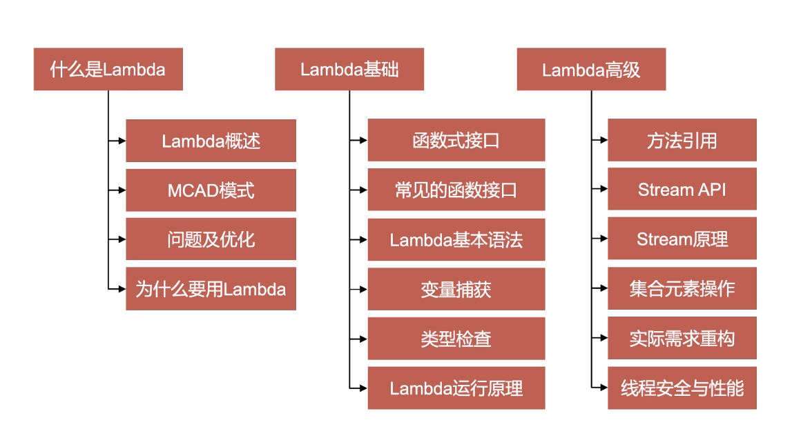

# 什么是Lambda
Lambda表达式也被称为箭头函数、匿名函数、闭包
Lambda表达式体现的是轻量级函数式编程思想
'->'符号是Lambda表达式核心操作符号，符号左侧操作参数，符号右侧是操作表达式

# Model Code as Data
编码及数据，尽可能轻量级的将代码封装为数据
解决方案：接口&实现类（匿名内部类）
存在问题：语法冗余、this关键字（匿名内部类）、变量捕获、数据控制等

# 函数式接口（function interface）
+ 函数式接口，就是java类型系统中的接口
+ 函数式接口，是只包含一个接口方法的特殊接口（只要求有一个未实现的接口即可，不包括默认式方法、静态方法）
+ 语义话检测注解：@FunctionalInterface
+ 函数式接口，只包含一个操作方法
+ Lambda表达式，只能操作一个方法
+ Java中的Lambda表达式，核心就是一个函数式接口的实现

默认接口方法、静态接口方法
```java
public interface I{
    String do();// 接口
    default String get(){// 默认方法
    }
    static boolean set(){// 类（静态）方法
    }
}
```
来自Object继承的方法，即使是抽象的也不会影响lambda的语义

## 匿名内部类实现接口的抽象方法
```java
I i = new I(){
    @Override
    public String do(){return ""}
}
```
## Lambda表达式实现
()对应函数接口参数括号

# Java类型系统内建函数式接口
java.lang.Runnable
java.lang.Comparable
java.lang.Comparator
java.io.FileFilter
more......

jdk8提供了java.util.function包，提供了常用的函数式功能接口
单一方法的分析：参与运算的参数，与方法运算结束后的返回值情况

java.util.function.Predicate<T>
接收参数对象T，返回一个boolean类型结果
```java
Predicate<String> pre = (String username) -> {
    return "hello".equal(username);
}
pre.test("hello");
```
java.util.function.Consumer<T>
接收参数对象T，不返回结果
```java
Consumer com = (Stirng s) -> {
    sout(s);
}
com.accept("hello");
```

java.util.function.Function<T,R>
接收参数对象T，返回结果对象R
```java
Function<Integer,Integer> func = (Integer a) -> {
    return 0 - a;
}
func.apply(10);
```

java.util.function.Supplier<T>
不接受参数，提供T对象的创建工厂
```java
Supplier<String> sup = () -> {
    return UUID.randomUUID().toString();
}
String str = sup.get();
```

java.util.function.UnaryOperator<T>
接收参数对象T，返回结果对象T
```java
UnaryOperator uo = (String s) -> {
    return s;
}
uo.apply("hello");
```

java.util.function.BinaryOpeartor<T>
接收两个T对象，返回一个T对象结果
```java
BinaryOperator<Integer> bo = (int a,int b)// error 不进行自动装箱

BinaryOperator<Integer> bo = (Integer a,Integer b) -> {
    return a-b;
}
bo.apply(12,13);
```


java.util.function提供了大量的函数式接口

# 基本语法
## 四个部分
1. 声明部分：就是和lambda表达式绑定的接口类型
2. 参数：包含在一对圆括号中，和绑定的接口中的抽象方法中的参数及顺序一致
3. 操作符：->
4. 执行代码块：包含在一对大括号中，出现在操作符的右侧

[接口声明] = （参数）-> {执行代码块}
```java
interface ILambda1{
    void test();
}
psvm(){
    ILambda1 i1 = (String n,int b) -> {
        sout(n+b);
    };
    ILambda1 i2 = (n,b) -> {
        sout(n+b);
    };
}
```

1. lambda表达式，必须和接口进行绑定
2. lambda表达式的参数，可以附带0个到n个参数，括号中的参数类型可以不用指定，jvm在运行时，会自动根据绑定的抽象方法中的参数进推断
3. lambda表达式的返回值，如果代码块只有一行，并且没有大括号，不用写return关键字，单行代码的执行结果，会自动返回，如果添加了大括号，或者有多行代码，必须通过return关键字返回结果

# 变量捕获
+ 匿名内部类中的变量捕获
+ Lambda表达式中的变量捕获

```java
public class App {
    String s1 = "全量变量";

    // 1.匿名内部类型中对于变量的访问
    public void testInnerClass(){
        String s2 = "局部变量";

        new Thread(new Runnable() {
            String s3 = "内部变量";
            @Override
            public void run() {
                // 访问全局变量
                System.out.println(s1);
                //this关键字表示是当前内部类的对象
//                System.out.println(this.s1);
                //局部变量的访问，不能对局部变量进行数据的修改[final]
                System.out.println(s2);
//                s2 = "hello";
                System.out.println(s3);
                System.out.println(this.s3);
            }
        }).start();
    }

    public void testLambda(){
        String s2 = "局部变量Lambda";
        new Thread(()->{
            String s3 = "内部变量Lambda";

            // 访问全局变量
            //this关键字表示是当前内部类的对象
            System.out.println(this.s1);
            // 访问局部变量
            System.out.println(s2);
            //局部变量的访问，不能对局部变量进行数据的修改[final]
//            s2 = "hello";
            s3 = "lambda 内部变量修改";
            System.out.println(s3);
        }).start();
    }
}
```

lambda 具备变量修改赋值？

# Lambda表达式类型检查
+ 表达式类型检查
+ 参数类型检查(参数是lambda表达式)


# 方法重载的问题
+ Java类型系统中的方法重载
+ 方法重载的实现
+ 当方法重载遇上Lambda表达式

```java
public class App2 {

    interface Param1{
        void outInfo(String info);
    }
    interface Param2{
        void outInfo(String info);
    }

    public void lambdaMethod(Param1 param){
        param.outInfo("hello param1");
    }

    public void lambdaMethod(Param2 param){
        param.outInfo("hello param2");
    }

    public static void main(String[] args) {
        App2 app2 = new App2();
        app2.lambdaMethod(new Param1() {
            @Override
            public void outInfo(String info) {
                System.out.println(info);
            }
        });
        app2.lambdaMethod(new Param2() {
            @Override
            public void outInfo(String info) {
                System.out.println(info);
            }
        });
    }
}
```
lambda表达式存在类型检查-->自动推断lambda表达式的目标类型
lambdaMethod()-->方法-->方法重载
-->Param1函数式接口
-->Param2函数式接口
调用方法-->传递lambda表达式-->自动推断-->Param1|Param2

# 深入理解Lambda表达式
+ Lambda表达式在JVM底层解析成私有静态方法和匿名内部类型
+ 通过实现接口的匿名内部类型中接口方法调用静态实现方法，完成Lambda表达式的执行

```java
public class App{

    @FunctionalInterface
    interface Inter{
        void test();
    }

    public static void main(String[] arrgs){
        Inter inter = ()->System.out.println("test");
        inter.test();
    }
}
```

简单查看Lambda字节码
`javap -p App`
```java
Compiled from "App.java"
public class App {
  public App();
  public static void main(java.lang.String[]);
  private static void lambda$main$0();
}
```


导出内部类：
`java -Djdk.internal.lambda.dumpProxyClasses App`
test

结合以上我们可以总结出：
+ lambda表达式会被编译为invokedynamic指令
+ 每一个lambda表达式的实现逻辑均会被封装为一个静态私有方法
+ 只要存在lambda表达式调用，便会生成一个内部类
+ 内部类中每一个方法（启动方法 BoostrapMethod）对应一个lambda表达式所生成的静态私有方法，内部类中的方法用以生成对应的调用点绑定到相应的invokedynamic指令上
