# 什么是Lambda
Lambda表达式也被称为箭头函数、匿名函数、闭包
Lambda表达式体现的是轻量级函数式编程思想
'->'符号是Lambda表达式核心操作符号，符号左侧操作参数，符号右侧是操作表达式

# Model Code as Data
编码及数据，尽可能轻量级的将代码封装为数据
解决方案：接口&实现类（匿名内部类）
存在问题：语法冗余、this关键字（匿名内部类）、变量捕获、数据控制等

# 函数式接口（function interface）
+ 函数式接口，就是java类型系统中的接口
+ 函数式接口，是只包含一个接口方法的特殊接口（只要求有一个未实现的接口即可，不包括默认式方法、静态方法）
+ 语义话检测注解：@FunctionalInterface
+ 函数式接口，只包含一个操作方法
+ Lambda表达式，只能操作一个方法
+ Java中的Lambda表达式，核心就是一个函数式接口的实现

默认接口方法、静态接口方法
```java
public interface I{
    String do();// 接口
    default String get(){// 默认方法
    }
    static boolean set(){// 类（静态）方法
    }
}
```
来自Object继承的方法，即使是抽象的也不会影响lambda的语义

## 匿名内部类实现接口的抽象方法
```java
I i = new I(){
    @Override
    public String do(){return ""}
}
```
## Lambda表达式实现
()对应函数接口参数括号

# Java类型系统内建函数式接口
java.lang.Runnable
java.lang.Comparable
java.lang.Comparator
java.io.FileFilter
more......

jdk8提供了java.util.function包，提供了常用的函数式功能接口
单一方法的分析：参与运算的参数，与方法运算结束后的返回值情况

java.util.function.Predicate<T>
接收参数对象T，返回一个boolean类型结果
```java
Predicate<String> pre = (String username) -> {
    return "hello".equal(username);
}
pre.test("hello");
```
java.util.function.Consumer<T>
接收参数对象T，不返回结果
```java
Consumer com = (Stirng s) -> {
    sout(s);
}
com.accept("hello");
```

java.util.function.Function<T,R>
接收参数对象T，返回结果对象R
```java
Function<Integer,Integer> func = (Integer a) -> {
    return 0 - a;
}
func.apply(10);
```

java.util.function.Supplier<T>
不接受参数，提供T对象的创建工厂
```java
Supplier<String> sup = () -> {
    return UUID.randomUUID().toString();
}
String str = sup.get();
```

java.util.function.UnaryOperator<T>
接收参数对象T，返回结果对象T
```java
UnaryOperator uo = (String s) -> {
    return s;
}
uo.apply("hello");
```

java.util.function.BinaryOpeartor<T>
接收两个T对象，返回一个T对象结果
```java
BinaryOperator<Integer> bo = (int a,int b)// error 不进行自动装箱

BinaryOperator<Integer> bo = (Integer a,Integer b) -> {
    return a-b;
}
bo.apply(12,13);
```


java.util.function提供了大量的函数式接口

# 基本语法
## 四个部分
1. 声明部分：就是和lambda表达式绑定的接口类型
2. 参数：包含在一对圆括号中，和绑定的接口中的抽象方法中的参数及顺序一致
3. 操作符：->
4. 执行代码块：包含在一对大括号中，出现在操作符的右侧

[接口声明] = （参数）-> {执行代码块}

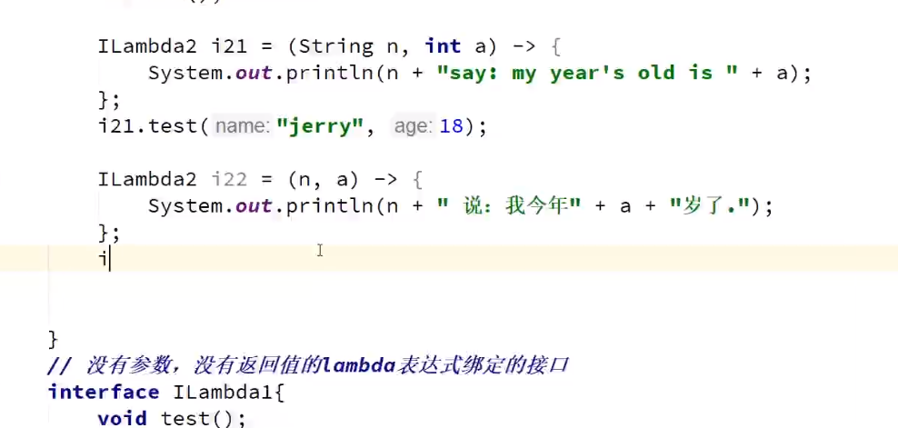

1. lambda表达式，必须和接口进行绑定
2. lambda表达式的参数，可以附带0个到n个参数，括号中的参数类型可以不用指定，jvm在运行时，会自动根据绑定的抽象方法中的参数进推断
3. lambda表达式的返回值，如果代码块只有一行，并且没有大括号，不用写return关键字，单行代码的执行结果，会自动返回，如果添加了大括号，或者有多行代码，必须通过return关键字返回结果

# 变量捕获
+ 匿名内部类中的变量捕获
+ Lambda表达式中的变量捕获

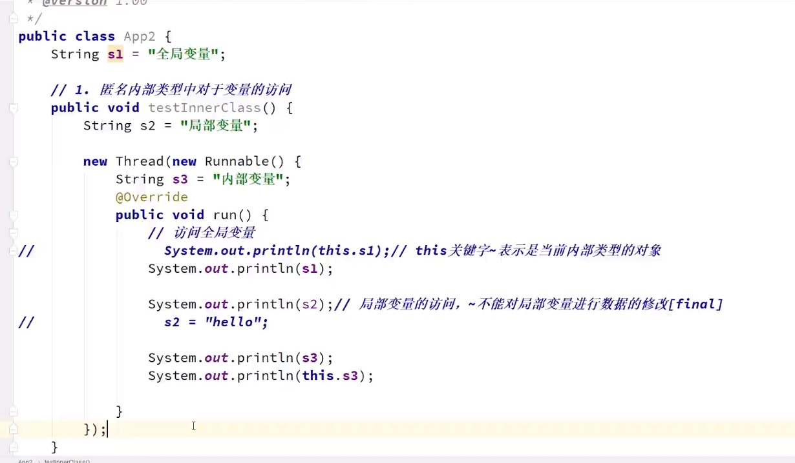

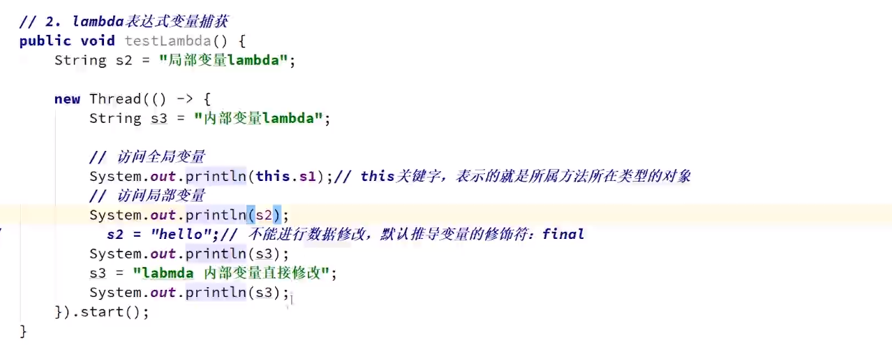

# Lambda表达式类型检查
+ 表达式类型检查
+ 参数类型检查

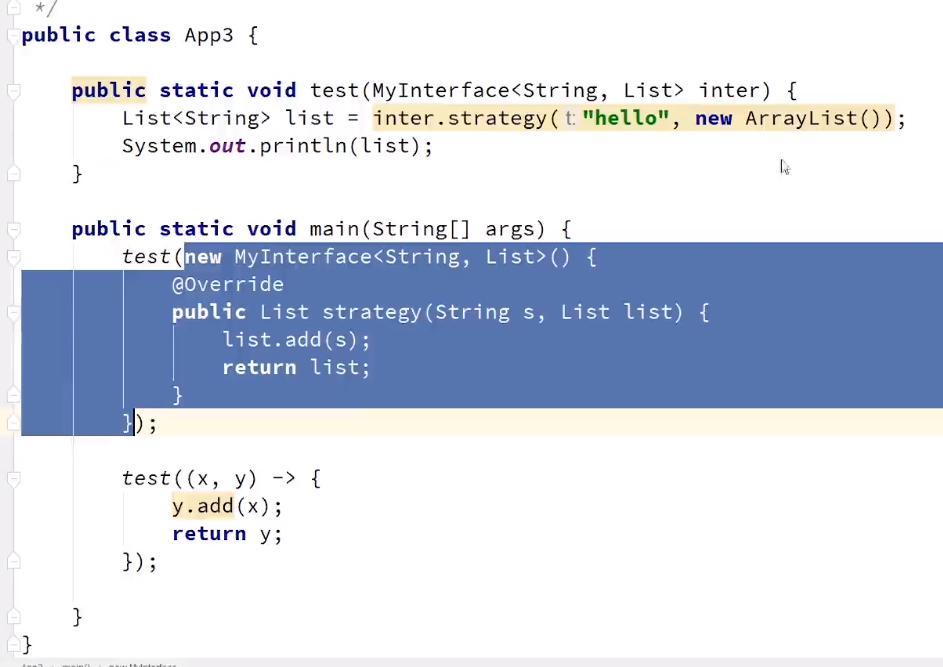

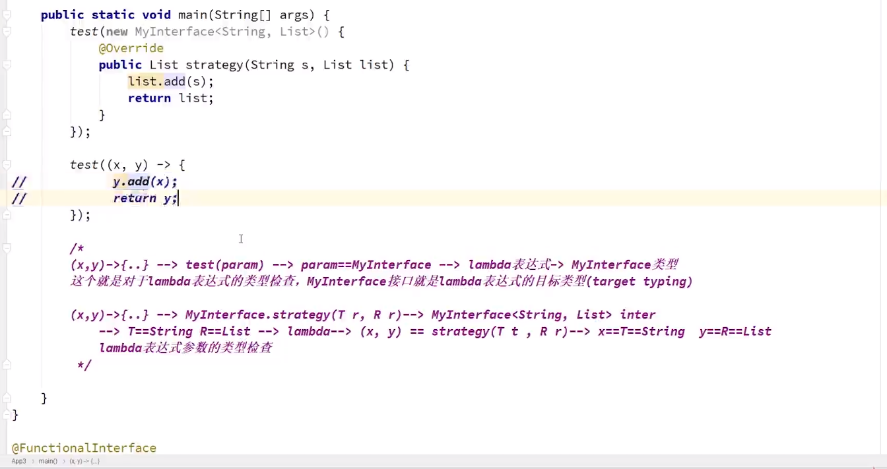

# 方法重载的问题
+ Java类型系统中的方法重载
+ 方法重载的实现
+ 当方法重载遇上Lambda表达式
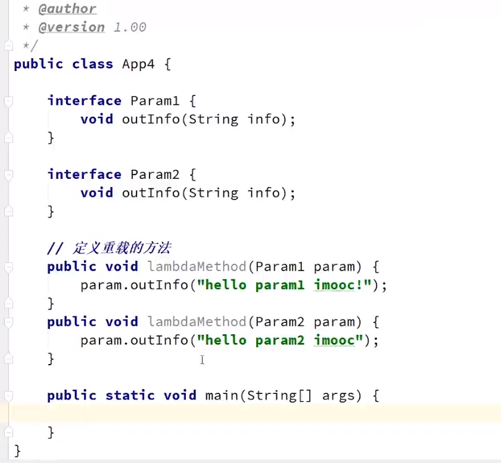
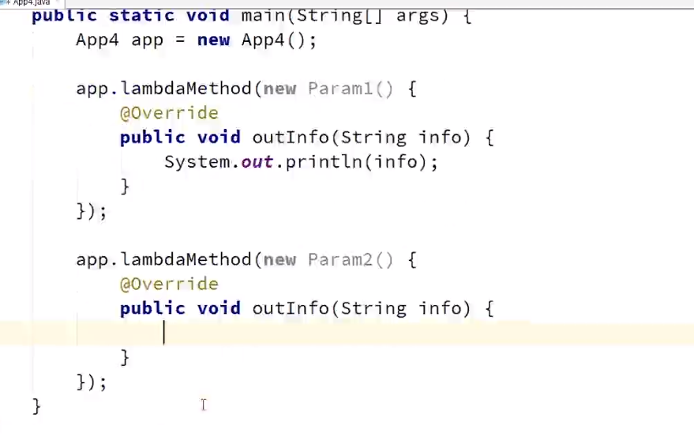
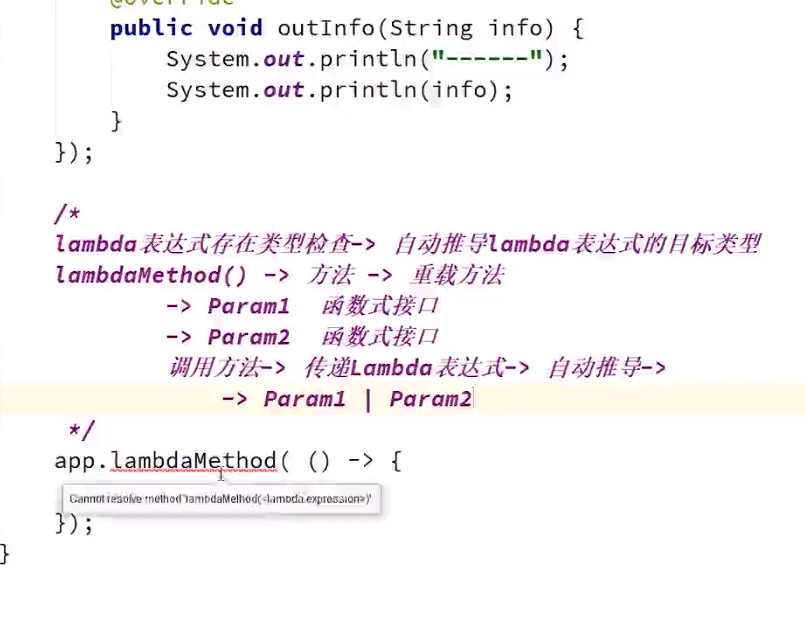

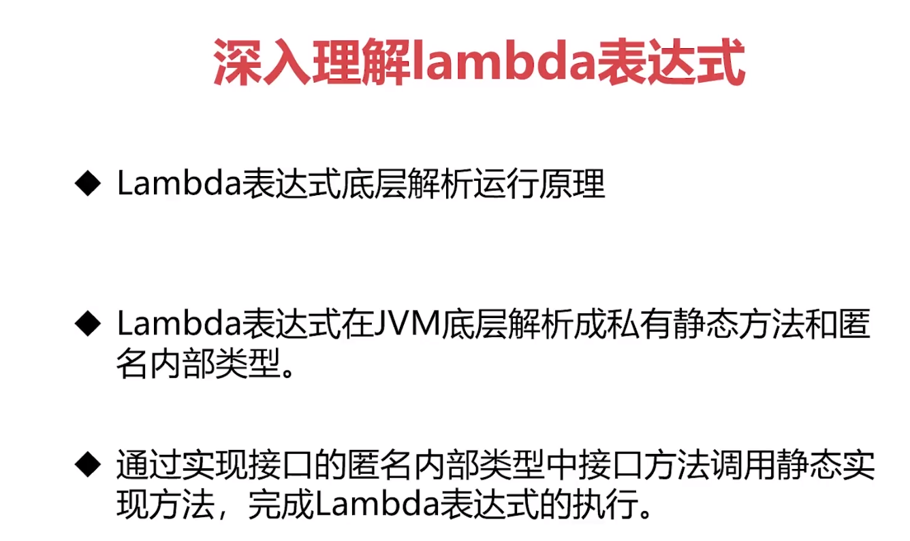

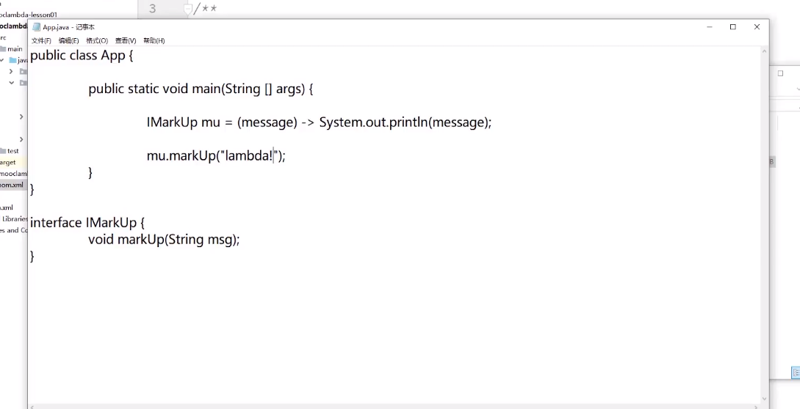
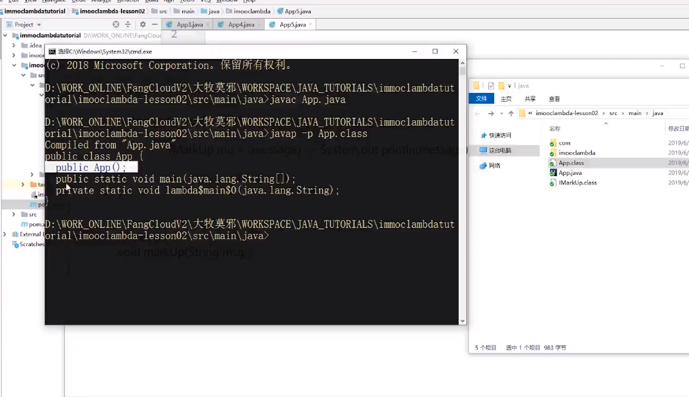

java -Djdk.internal.lambda.dumpProxyClasses App


