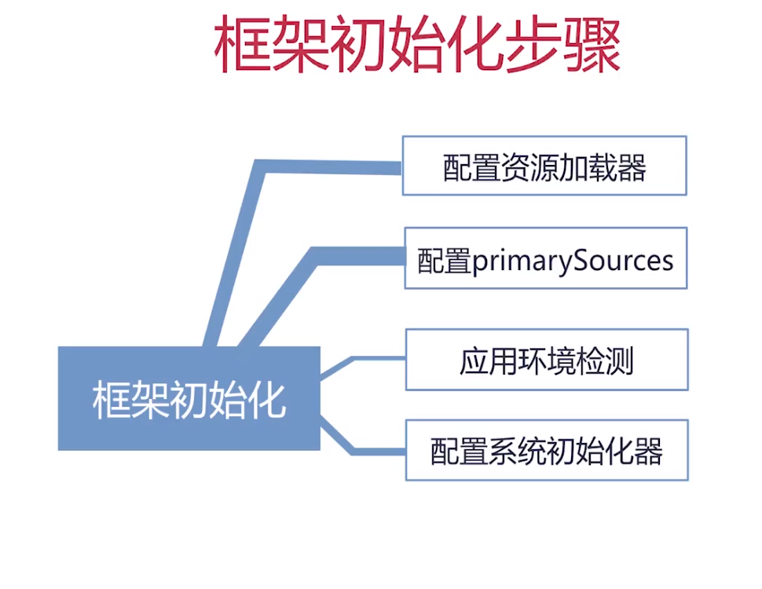
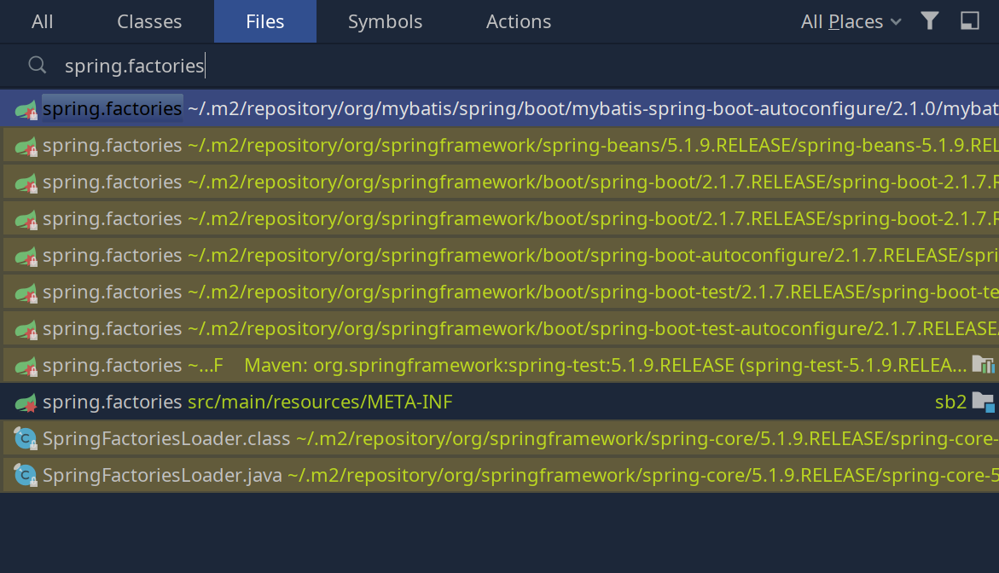
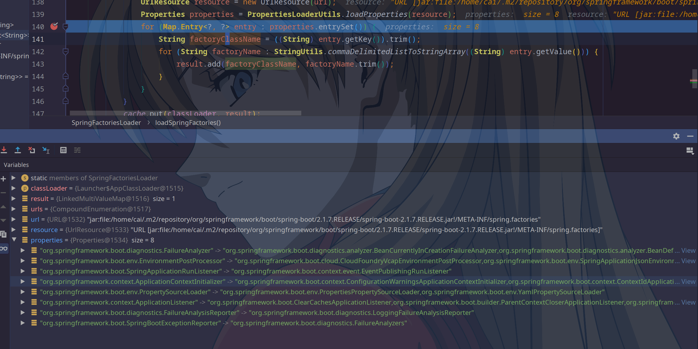

[TOC]

# SpringFactoriesLoader
# ApplicationContextAware
# ApplicationContext.getEnvironment()

# 系统初始化器介绍
+ 类名：ApplicationContextInitializer
+ 介绍：Spring容器刷新之前执行的一个回调函数
+ 作用：向SpringBoot容器注册属性
+ 使用方式：继承接口自定义实现

# ApplicationContextInitializer
+ 用于在spring容器刷新之前初始化Spring ConfigurableApplicationContext的回调接口。（剪短说就是在容器刷新之前调用该类的 initialize 方法。并将 ConfigurableApplicationContext 类的实例传递给该方法）
+ 通常用于需要对应用程序上下文进行编程初始化的web应用程序中。例如，根据上下文环境注册属性源或激活配置文件等。
+ 可排序的（实现Ordered接口，或者添加@Order注解）

# 实现方式一
+ 实现ApplicationContextInitializer接口
+ spring.factories内填写接口实现
+ key值为org.springframework.context.ApplicationContextInitializer

# 实现方式二
+ 实现ApplicationContextInitializer接口
+ SpringApplication类初始化后设置进去

# 实现方式三
+ 实现ApplicationContextInitializer接口
+ application.properties内填写接口实现
+ key值为context.initializer.classes

# tips
+ 都要实现ApplicationContextInitializer接口
+ Order值越小越先执行
+ application.properties中定义的优先于其它方式

# SpringFactoriesLoader
+ 框架内部使用的通用工厂加载机制
+ 从classpath下多个jar包特定的位置读取文件并初始化类
+ 文件内容必须是key_value形式，即properties类型
`<pre class="code">example.MyService=example.MyServiceImpl1,example.MyServiceImpl2</pre>`
+ key是全限定名（抽象类|接口）、value是实现，多个实现用逗号分隔



# SpringApplication.java
```java
/**
 * Run the Spring application, creating and refreshing a new
 * {@link ApplicationContext}.
 * @param args the application arguments (usually passed from a Java main method)
 * @return a running {@link ApplicationContext}
 */
public ConfigurableApplicationContext run(String... args) {
	StopWatch stopWatch = new StopWatch();
	stopWatch.start();
	ConfigurableApplicationContext context = null;
	Collection<SpringBootExceptionReporter> exceptionReporters = new ArrayList<>();
	configureHeadlessProperty();
	SpringApplicationRunListeners listeners = getRunListeners(args);
	listeners.starting();
	try {
		ApplicationArguments applicationArguments = new DefaultApplicationArguments(args);
		ConfigurableEnvironment environment = prepareEnvironment(listeners, applicationArguments);
		configureIgnoreBeanInfo(environment);
		Banner printedBanner = printBanner(environment);
		context = createApplicationContext();
		// 系统初始化器
		exceptionReporters = getSpringFactoriesInstances(SpringBootExceptionReporter.class,
				new Class[] { ConfigurableApplicationContext.class }, context);
		prepareContext(context, environment, listeners, applicationArguments, printedBanner);
		refreshContext(context);
		afterRefresh(context, applicationArguments);
		stopWatch.stop();
		if (this.logStartupInfo) {
			new StartupInfoLogger(this.mainApplicationClass).logStarted(getApplicationLog(), stopWatch);
		}
		listeners.started(context);
		callRunners(context, applicationArguments);
	}
	catch (Throwable ex) {
		handleRunFailure(context, ex, exceptionReporters, listeners);
		throw new IllegalStateException(ex);
	}

	try {
		listeners.running(context);
	}
	catch (Throwable ex) {
		handleRunFailure(context, ex, exceptionReporters, null);
		throw new IllegalStateException(ex);
	}
	return context;
}

private <T> Collection<T> getSpringFactoriesInstances(Class<T> type, Class<?>[] parameterTypes, Object... args) {
    // step1:类加载器
	ClassLoader classLoader = getClassLoader();
	// step2:获取全部系统初始化器的全量名
	Set<String> names = new LinkedHashSet<>(SpringFactoriesLoader.loadFactoryNames(type, classLoader));
	// step3:获得实例
	List<T> instances = createSpringFactoriesInstances(type, parameterTypes, classLoader, args, names);
	// step4：排序
	AnnotationAwareOrderComparator.sort(instances);
	return instances;
}

private <T> List<T> createSpringFactoriesInstances(Class<T> type, Class<?>[] parameterTypes,
			ClassLoader classLoader, Object[] args, Set<String> names) {
	List<T> instances = new ArrayList<>(names.size());
	for (String name : names) {
		try {
			Class<?> instanceClass = ClassUtils.forName(name, classLoader);
			Assert.isAssignable(type, instanceClass);
			Constructor<?> constructor = instanceClass.getDeclaredConstructor(parameterTypes);
			T instance = (T) BeanUtils.instantiateClass(constructor, args);
			instances.add(instance);
		}
		catch (Throwable ex) {
			throw new IllegalArgumentException("Cannot instantiate " + type + " : " + name, ex);
		}
	}
	return instances;
}
```
SpringFactoriesLoader类
```java
public static List<String> loadFactoryNames(Class<?> factoryClass, @Nullable ClassLoader classLoader) {
	String factoryClassName = factoryClass.getName();
	return loadSpringFactories(classLoader).getOrDefault(factoryClassName, Collections.emptyList());
}
private static Map<String, List<String>> loadSpringFactories(@Nullable ClassLoader classLoader) {
	MultiValueMap<String, String> result = cache.get(classLoader);
	if (result != null) {
		return result;
	}

	try {
		Enumeration<URL> urls = (classLoader != null ?
				classLoader.getResources(FACTORIES_RESOURCE_LOCATION) :
				ClassLoader.getSystemResources(FACTORIES_RESOURCE_LOCATION));
		result = new LinkedMultiValueMap<>();
		while (urls.hasMoreElements()) {
			URL url = urls.nextElement();
			UrlResource resource = new UrlResource(url);
			// 将META-INF下的spring.factories文件读入properties对象
			Properties properties = PropertiesLoaderUtils.loadProperties(resource);
			// 将properties设置为key：map，注入到容器当中
			for (Map.Entry<?, ?> entry : properties.entrySet()) {
				String factoryClassName = ((String) entry.getKey()).trim();
				for (String factoryName : StringUtils.commaDelimitedListToStringArray((String) entry.getValue())) {
					result.add(factoryClassName, factoryName.trim());
				}
			}
		}
		cache.put(classLoader, result);
		return result;
	}
	catch (IOException ex) {
		throw new IllegalArgumentException("Unable to load factories from location [" +
				FACTORIES_RESOURCE_LOCATION + "]", ex);
	}
}
```






读取到类初始化信息后，通过路径创建实例
createSpringFactoriesInstances方法

# SpringFactoriesLoader作用
+ SpringBoot框架中从类路径jar包中读取特定文件实现扩展类的载入


# loadFactories流程


# 系统初始化器解析

# 作用
+ 上下文刷新即refresh方法前调用
+ 用来编码设置一些属性变量通常用在web环境中
+ 可以通过order接口进行排序


```java
/**
 * Run the Spring application, creating and refreshing a new
 * {@link ApplicationContext}.
 * @param args the application arguments (usually passed from a Java main method)
 * @return a running {@link ApplicationContext}
 */
public ConfigurableApplicationContext run(String... args) {
	StopWatch stopWatch = new StopWatch();
	stopWatch.start();
	ConfigurableApplicationContext context = null;
	Collection<SpringBootExceptionReporter> exceptionReporters = new ArrayList<>();
	configureHeadlessProperty();
	SpringApplicationRunListeners listeners = getRunListeners(args);
	listeners.starting();
	try {
		ApplicationArguments applicationArguments = new DefaultApplicationArguments(args);
		ConfigurableEnvironment environment = prepareEnvironment(listeners, applicationArguments);
		configureIgnoreBeanInfo(environment);
		Banner printedBanner = printBanner(environment);
		context = createApplicationContext();
		// 系统初始化器
		exceptionReporters = getSpringFactoriesInstances(SpringBootExceptionReporter.class,
				new Class[] { ConfigurableApplicationContext.class }, context);
		// 调用系统初始化器
		prepareContext(context, environment, listeners, applicationArguments, printedBanner);
		// 调用点在刷新上下文之前
		refreshContext(context);
		afterRefresh(context, applicationArguments);
		stopWatch.stop();
		if (this.logStartupInfo) {
			new StartupInfoLogger(this.mainApplicationClass).logStarted(getApplicationLog(), stopWatch);
		}
		listeners.started(context);
		callRunners(context, applicationArguments);
	}
	catch (Throwable ex) {
		handleRunFailure(context, ex, exceptionReporters, listeners);
		throw new IllegalStateException(ex);
	}

	try {
		listeners.running(context);
	}
	catch (Throwable ex) {
		handleRunFailure(context, ex, exceptionReporters, null);
		throw new IllegalStateException(ex);
	}
	return context;
}

private void prepareContext(ConfigurableApplicationContext context, ConfigurableEnvironment environment, SpringApplicationRunListeners listeners, ApplicationArguments applicationArguments, Banner printedBanner) {
	context.setEnvironment(environment);
	postProcessApplicationContext(context);
	applyInitializers(context);
	listeners.contextPrepared(context);
	if (this.logStartupInfo) {
		logStartupInfo(context.getParent() == null);
		logStartupProfileInfo(context);
	}
	// Add boot specific singleton beans
	ConfigurableListableBeanFactory beanFactory = context.getBeanFactory();
	beanFactory.registerSingleton("springApplicationArguments", applicationArguments);
	if (printedBanner != null) {
		beanFactory.registerSingleton("springBootBanner", printedBanner);
	}
	if (beanFactory instanceof DefaultListableBeanFactory) {
		((DefaultListableBeanFactory) beanFactory)
				.setAllowBeanDefinitionOverriding(this.allowBeanDefinitionOverriding);
	}
	// Load the sources
	Set<Object> sources = getAllSources();
	Assert.notEmpty(sources, "Sources must not be empty");
	load(context, sources.toArray(new Object[0]));
	listeners.contextLoaded(context);
}

/**
 * Apply any {@link ApplicationContextInitializer}s to the context before it is
 * refreshed.
 * @param context the configured ApplicationContext (not refreshed yet)
 * @see ConfigurableApplicationContext#refresh()
 */
@SuppressWarnings({ "rawtypes", "unchecked" })
protected void applyInitializers(ConfigurableApplicationContext context) {
	for (ApplicationContextInitializer initializer : getInitializers()) {
		Class<?> requiredType = GenericTypeResolver.resolveTypeArgument(initializer.getClass(),
				ApplicationContextInitializer.class);
		Assert.isInstanceOf(requiredType, context, "Unable to call initializer.");
		initializer.initialize(context);
	}
}
```

# 实现方式二的实现原理