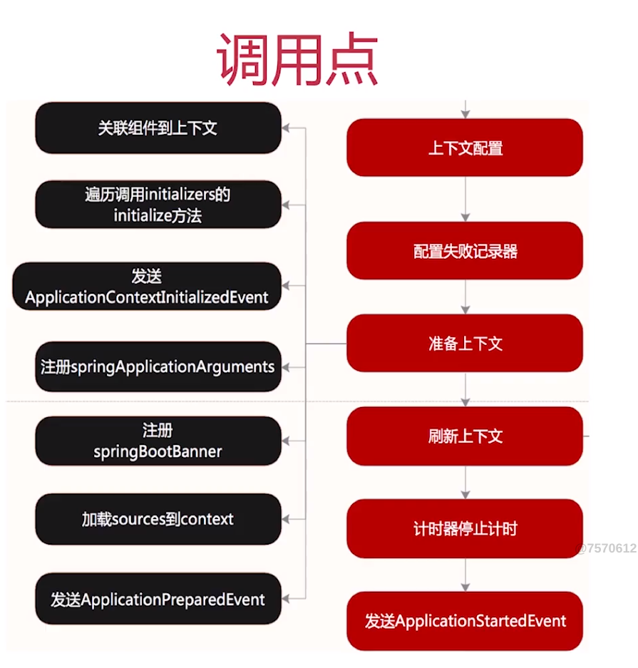
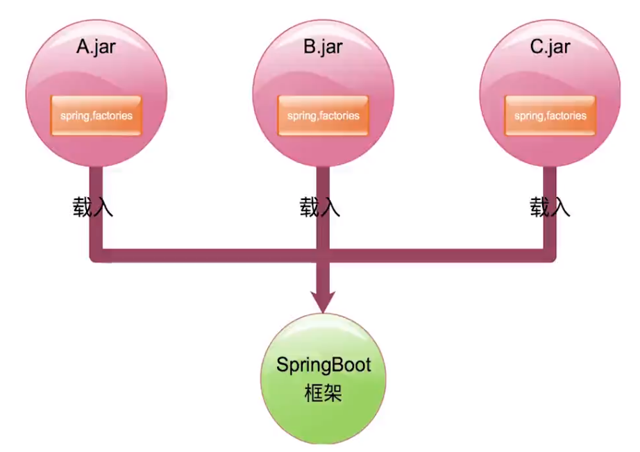
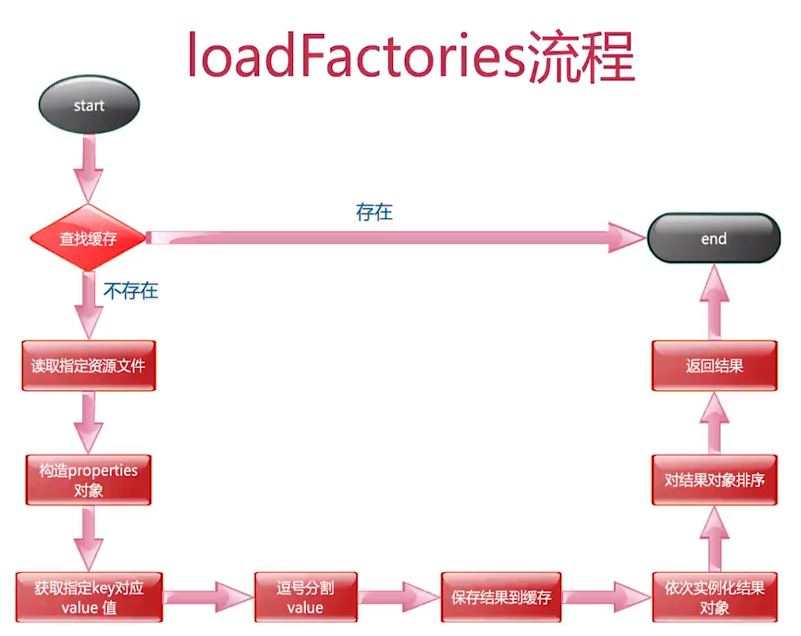
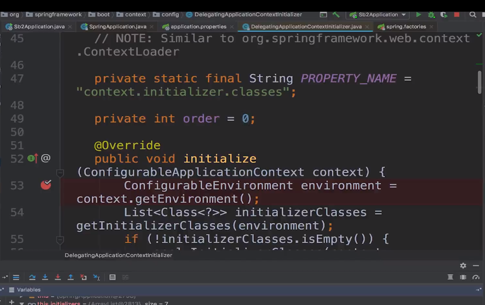
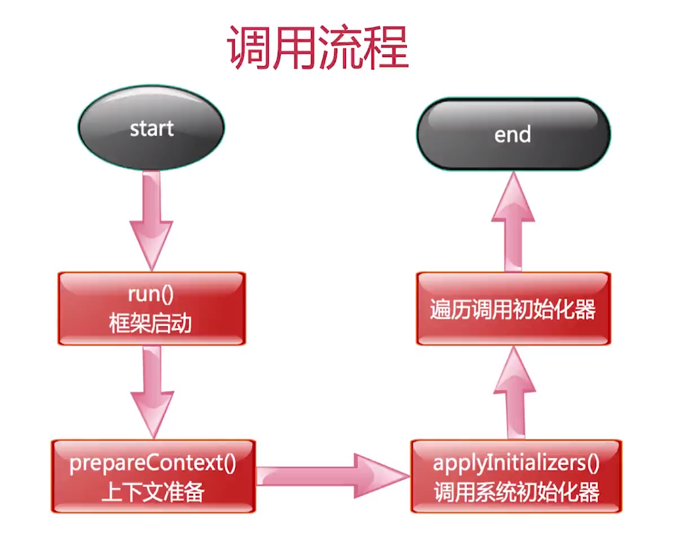
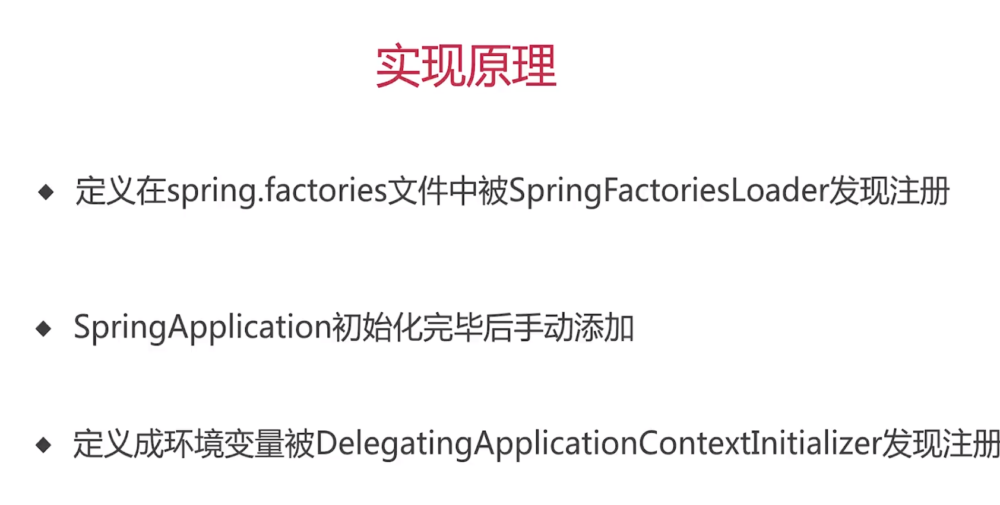

[TOC]

# 系统初始化器介绍
+ 类名：ApplicationContextInitializer
+ 介绍：Spring容器刷新之前执行的一个回调函数
+ 作用：向SpringBoot容器注册属性
+ 使用方式：继承接口自定义实现

# 三种实现方式
## 实现方式一
+ 实现ApplicationContextInitializer接口
+ spring.factories内填写接口实现
+ key值为org.springframework.context.ApplicationContextInitializer

```java
@Order(1)
public class FirstInitializer implements ApplicationContextInitializer<ConfigurableApplicationContext> {
    @Override
    public void initialize(ConfigurableApplicationContext applicationContext) {
        ConfigurableEnvironment environment = applicationContext.getEnvironment();
//        environment.setRequiredProperties("mooc");
        Map<String, Object> map = new HashMap<>();
        map.put("key1", "value1");
        MapPropertySource mapPropertySource = new MapPropertySource("firstInitializer", map);
        environment.getPropertySources().addLast(mapPropertySource);
        System.out.println("run firstInitializer");
    }
}
```
resources/META-INF/spring.factories
```
org.springframework.context.ApplicationContextInitializer=com.initializer.FirstInitializer
```

## 实现方式二
+ 实现ApplicationContextInitializer接口
+ SpringApplication类初始化后设置进去

```java
@Order(2)
public class SecondInitializer implements ApplicationContextInitializer<ConfigurableApplicationContext> {
    @Override
    public void initialize(ConfigurableApplicationContext applicationContext) {
        ConfigurableEnvironment environment = applicationContext.getEnvironment();
        Map<String, Object> map = new HashMap<>();
        map.put("key2", "value2");
        MapPropertySource mapPropertySource = new MapPropertySource("secondInitializer", map);
        environment.getPropertySources().addLast(mapPropertySource);
        System.out.println("run secondInitializer");
    }
}
```
SpringbootApplication
```java
@SpringBootApplication
public class SpringbootApplication {

    public static void main(String[] args) {
        SpringApplication springApplication = new SpringApplication(SpringbootApplication.class);
        springApplication.addInitializers(new SecondInitializer());
        springApplication.run(args);
    }

}

```

## 实现方式三
+ 实现ApplicationContextInitializer接口
+ application.properties内填写接口实现
+ key值为context.initializer.classes

```java
@Order(3)
public class ThirdInitializer implements ApplicationContextInitializer<ConfigurableApplicationContext> {
    @Override
    public void initialize(ConfigurableApplicationContext applicationContext) {
        ConfigurableEnvironment environment = applicationContext.getEnvironment();
        Map<String, Object> map = new HashMap<>();
        map.put("key3", "value3");
        MapPropertySource mapPropertySource = new MapPropertySource("thirdInitializer", map);
        environment.getPropertySources().addLast(mapPropertySource);
        System.out.println("run thirdInitializer");
    }
}
```
application.properties
```
context.initializer.classes=com.initializer.ThirdInitializer
```

# tips
+ 都要实现ApplicationContextInitializer接口
+ Order值越小越先执行
+ application.properties中定义的优先于其它方式(上面三种对比3-1-2)


# SpringFactoriesLoader
# ApplicationContextAware
# ApplicationContext.getEnvironment()


# 实现ApplicationContextInitializer：初始化器接口，定义回调方法Initializer
+ 用于在spring容器刷新之前初始化Spring ConfigurableApplicationContext的回调接口。（剪短说就是在容器刷新之前调用该类的 initialize 方法。并将 ConfigurableApplicationContext 类的实例传递给该方法）
+ 通常用于需要对应用程序上下文进行编程初始化的web应用程序中。例如，根据上下文环境注册属性源或激活配置文件等。
+ 可排序的（实现Ordered接口，或者添加@Order注解）


# 框架初始化步骤
+ 配置资源加载器
+ 配置primarySources
+ 应用环境检测
+ 配置系统初始化器


读取到类初始化信息后，通过路径创建实例
createSpringFactoriesInstances方法


# 系统初始化器解析

# 作用
+ 上下文刷新即refresh方法前调用
+ 用来编码设置一些属性变量通常用在web环境中
+ 可以通过order接口进行排序




# 源码
## SpringApplication类run方法
```java
@SuppressWarnings({ "unchecked", "rawtypes" })
public SpringApplication(ResourceLoader resourceLoader, Class<?>... primarySources) {
	this.resourceLoader = resourceLoader;
	Assert.notNull(primarySources, "PrimarySources must not be null");
	this.primarySources = new LinkedHashSet<>(Arrays.asList(primarySources));
	this.webApplicationType = WebApplicationType.deduceFromClasspath();
	setInitializers((Collection) getSpringFactoriesInstances(ApplicationContextInitializer.class));
	setListeners((Collection) getSpringFactoriesInstances(ApplicationListener.class));
	this.mainApplicationClass = deduceMainApplicationClass();
}

public ConfigurableApplicationContext run(String... args) {
	StopWatch stopWatch = new StopWatch();
	stopWatch.start();
	ConfigurableApplicationContext context = null;
	Collection<SpringBootExceptionReporter> exceptionReporters = new ArrayList<>();
	configureHeadlessProperty();
	SpringApplicationRunListeners listeners = getRunListeners(args);
	listeners.starting();
	try {
		ApplicationArguments applicationArguments = new DefaultApplicationArguments(args);
		ConfigurableEnvironment environment = prepareEnvironment(listeners, applicationArguments);
		configureIgnoreBeanInfo(environment);
		Banner printedBanner = printBanner(environment);
		context = createApplicationContext();
		// 初始化器
		exceptionReporters = getSpringFactoriesInstances(SpringBootExceptionReporter.class,
				new Class[] { ConfigurableApplicationContext.class }, context);
		prepareContext(context, environment, listeners, applicationArguments, printedBanner);
		refreshContext(context);
		afterRefresh(context, applicationArguments);
		stopWatch.stop();
		if (this.logStartupInfo) {
			new StartupInfoLogger(this.mainApplicationClass).logStarted(getApplicationLog(), stopWatch);
		}
		listeners.started(context);
		callRunners(context, applicationArguments);
	}
	catch (Throwable ex) {
		handleRunFailure(context, ex, exceptionReporters, listeners);
		throw new IllegalStateException(ex);
	}

	try {
		listeners.running(context);
	}
	catch (Throwable ex) {
		handleRunFailure(context, ex, exceptionReporters, null);
		throw new IllegalStateException(ex);
	}
	return context;
}

private <T> Collection<T> getSpringFactoriesInstances(Class<T> type, Class<?>[] parameterTypes, Object... args) {
	ClassLoader classLoader = getClassLoader();
	// 初始化器去重，通过SpringFactoriesLoader类
	Set<String> names = new LinkedHashSet<>(SpringFactoriesLoader.loadFactoryNames(type, classLoader));
	// 初始化器反射实例化
	List<T> instances = createSpringFactoriesInstances(type, parameterTypes, classLoader, args, names);
	AnnotationAwareOrderComparator.sort(instances);
	return instances;
}

private <T> List<T> createSpringFactoriesInstances(Class<T> type, Class<?>[] parameterTypes,
			ClassLoader classLoader, Object[] args, Set<String> names) {
	List<T> instances = new ArrayList<>(names.size());
	for (String name : names) {
		try {
			Class<?> instanceClass = ClassUtils.forName(name, classLoader);
			Assert.isAssignable(type, instanceClass);
			Constructor<?> constructor = instanceClass.getDeclaredConstructor(parameterTypes);
			T instance = (T) BeanUtils.instantiateClass(constructor, args);
			instances.add(instance);
		}
		catch (Throwable ex) {
			throw new IllegalArgumentException("Cannot instantiate " + type + " : " + name, ex);
		}
	}
	return instances;
}
```
BeanUtils类型
```java
public static <T> T instantiateClass(Constructor<T> ctor, Object... args) throws BeanInstantiationException {
    Assert.notNull(ctor, "Constructor must not be null");

    try {
        ReflectionUtils.makeAccessible(ctor);
        if (KotlinDetector.isKotlinReflectPresent() && KotlinDetector.isKotlinType(ctor.getDeclaringClass())) {
            return BeanUtils.KotlinDelegate.instantiateClass(ctor, args);
        } else {
            Class<?>[] parameterTypes = ctor.getParameterTypes();
            Assert.isTrue(args.length <= parameterTypes.length, "Can't specify more arguments than constructor parameters");
            Object[] argsWithDefaultValues = new Object[args.length];

            for(int i = 0; i < args.length; ++i) {
                if (args[i] == null) {
                    Class<?> parameterType = parameterTypes[i];
                    argsWithDefaultValues[i] = parameterType.isPrimitive() ? DEFAULT_TYPE_VALUES.get(parameterType) : null;
                } else {
                    argsWithDefaultValues[i] = args[i];
                }
            }

            return ctor.newInstance(argsWithDefaultValues);
        }
    } catch (InstantiationException var6) {
        throw new BeanInstantiationException(ctor, "Is it an abstract class?", var6);
    } catch (IllegalAccessException var7) {
        throw new BeanInstantiationException(ctor, "Is the constructor accessible?", var7);
    } catch (IllegalArgumentException var8) {
        throw new BeanInstantiationException(ctor, "Illegal arguments for constructor", var8);
    } catch (InvocationTargetException var9) {
        throw new BeanInstantiationException(ctor, "Constructor threw exception", var9.getTargetException());
    }
}
```
# SpringFactoriesLoader:获取要创建的类的清单（spring.factories）工厂
+ 框架内部使用的通用工厂加载机制
+ 从classpath下多个jar包特定的位置读取文件并初始化类
+ 文件内容必须是key_value形式，即properties类型
`<pre class="code">example.MyService=example.MyServiceImpl1,example.MyServiceImpl2</pre>`
+ key是全限定名（抽象类|接口）、value是实现，多个实现用逗号分隔

# SpringFactoriesLoader作用
+ SpringBoot框架中从类路径jar包中读取特定文件实现扩展类的载入



SpringApplication类中调用了loadFactoryName方法，获取需要创建的工厂类名称
```java
/**
 * Load the fully qualified class names of factory implementations of the
 * given type from {@value #FACTORIES_RESOURCE_LOCATION}, using the given
 * class loader.
 * @param factoryType the interface or abstract class representing the factory
 * @param classLoader the ClassLoader to use for loading resources; can be
 * {@code null} to use the default
 * @throws IllegalArgumentException if an error occurs while loading factory names
 * @see #loadFactories
 */
public static List<String> loadFactoryNames(Class<?> factoryType, @Nullable ClassLoader classLoader) {
	String factoryTypeName = factoryType.getName();
	return loadSpringFactories(classLoader).getOrDefault(factoryTypeName, Collections.emptyList());
}
```

# loadFactories流程


# 第二种实现方式
step1：SpringApplication构造方法初始化加载spring.factories
```java
public SpringApplication(ResourceLoader resourceLoader, Class<?>... primarySources) {
	this.resourceLoader = resourceLoader;
	Assert.notNull(primarySources, "PrimarySources must not be null");
	this.primarySources = new LinkedHashSet<>(Arrays.asList(primarySources));
	this.webApplicationType = WebApplicationType.deduceFromClasspath();
	setInitializers((Collection) getSpringFactoriesInstances(ApplicationContextInitializer.class));
	setListeners((Collection) getSpringFactoriesInstances(ApplicationListener.class));
	this.mainApplicationClass = deduceMainApplicationClass();
}
```
step2:`springApplication.addInitializers(new SecondInitializer());`将新的初始化器存入存放factories初始化的容器里
```java
public void addInitializers(ApplicationContextInitializer<?>... initializers) {
	this.initializers.addAll(Arrays.asList(initializers));
}
```
step3：run方法通过反射实例化

# 第三种实现方式
通过DelegatingApplicationContextInitializer.java（这也是一个系统初始化器的实现），定义在spring.factories文件里面

因为order为0

优先级最高



