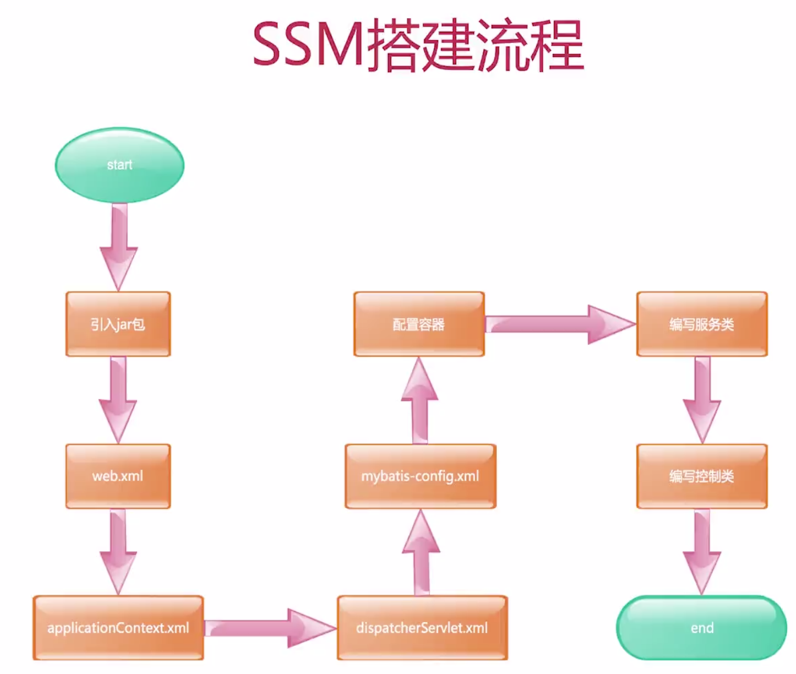
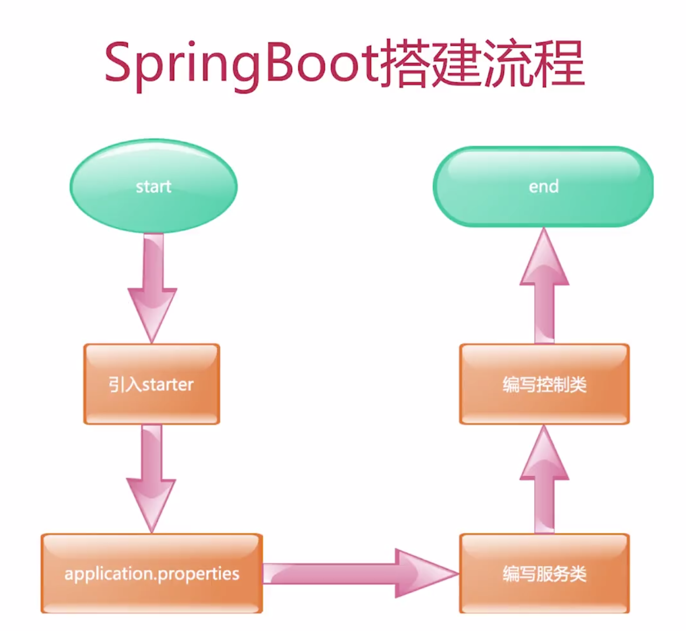
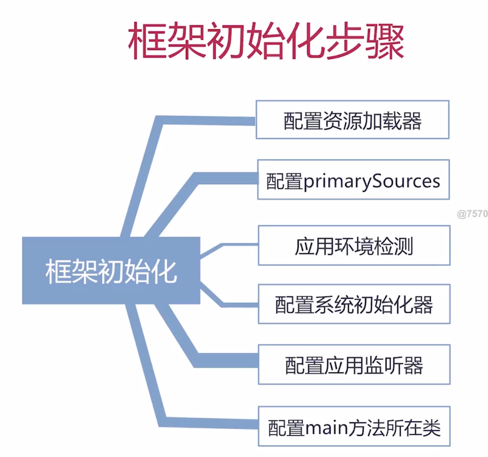
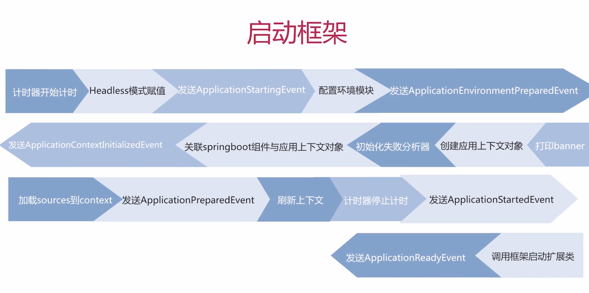
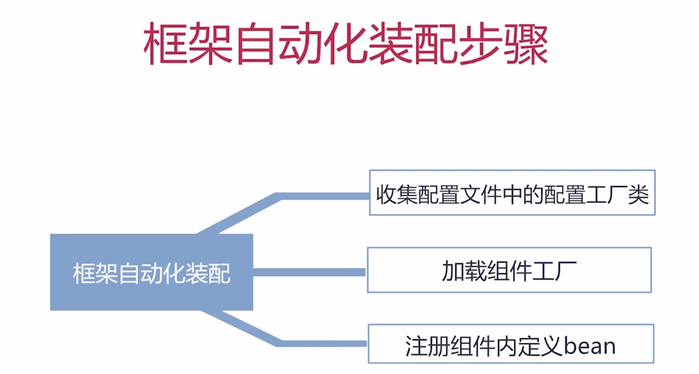

[TOC]

# Java8新特性
+ Lambda表达式
+ Stream操作
+ 接口默认&静态方法
+ 方法引用
+ 重复注解
+ 类型注解
+ 日期&时间API
+ base64加解密API
+ 数组并行操作
+ JVM新增元空间

# Maven优点
+ 依赖管理
+ 项目构建
+ 生命周期
+ 插件机制

《高性能MySQL》

# SSM框架介绍

# SpringBoot搭建总结
+ 耗时短
+ 配置文件简洁
+ 不关注版本管理

