[TOC]

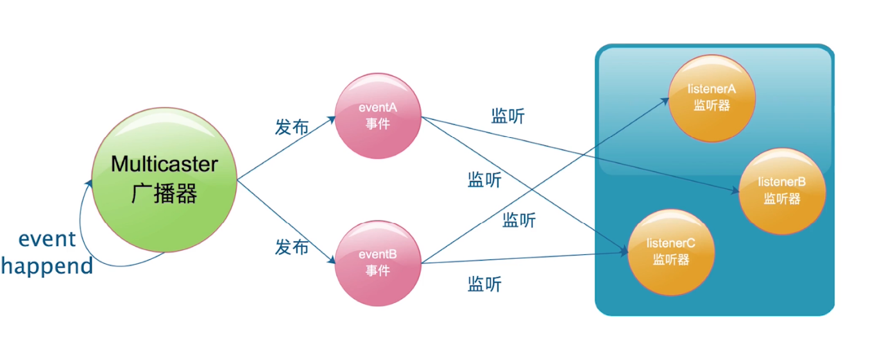

# 监听器模式要素
事件
监听器
广播器
触发机制


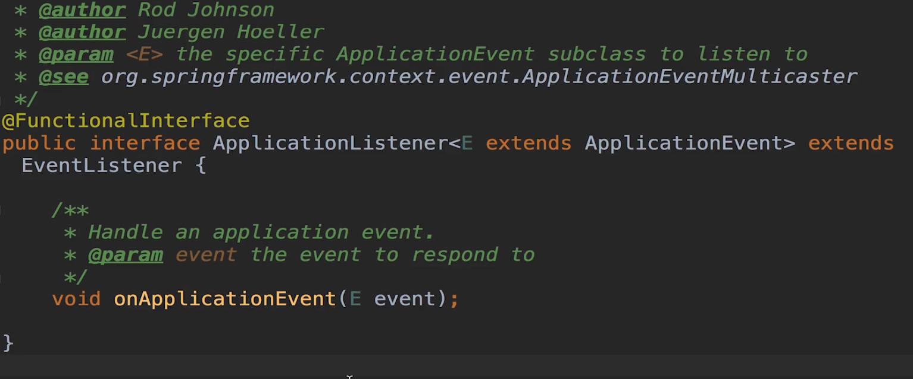

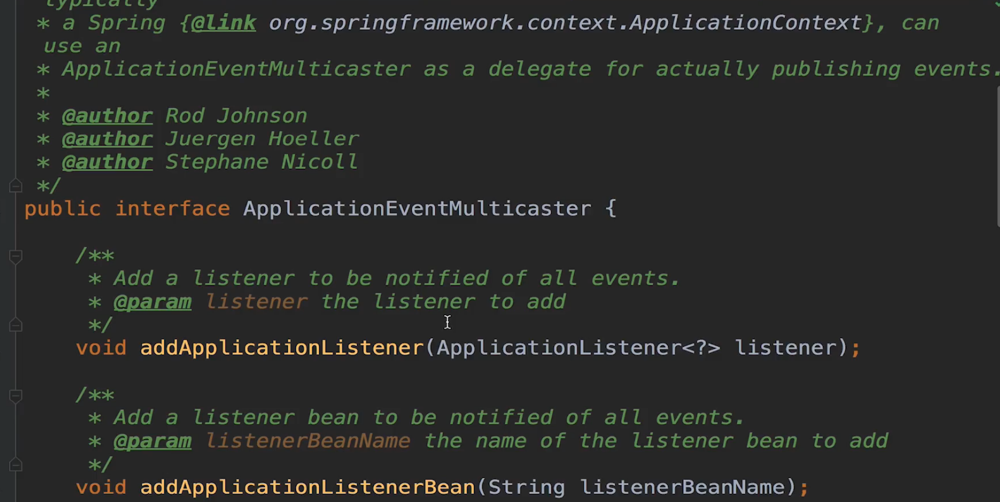

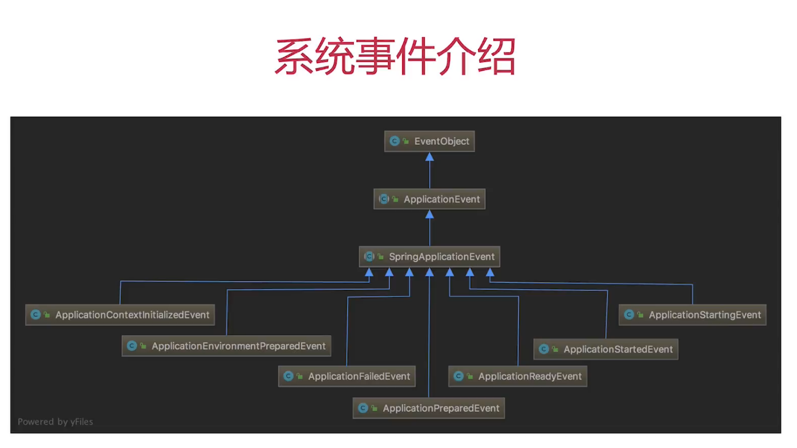

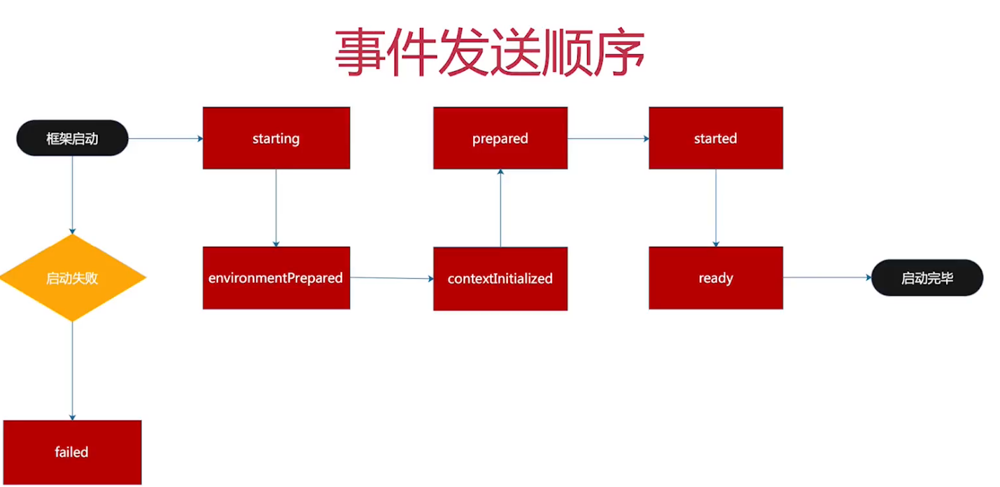
starting事件
environmentPrepared事件

# 监听器注册
```java
public SpringApplication(ResourceLoader resourceLoader, Class<?>... primarySources) {
		this.resourceLoader = resourceLoader;
		Assert.notNull(primarySources, "PrimarySources must not be null");
		this.primarySources = new LinkedHashSet<>(Arrays.asList(primarySources));
		this.webApplicationType = WebApplicationType.deduceFromClasspath();
		setInitializers((Collection) getSpringFactoriesInstances(ApplicationContextInitializer.class));
		setListeners((Collection) getSpringFactoriesInstances(ApplicationListener.class));
		this.mainApplicationClass = deduceMainApplicationClass();
	}
```

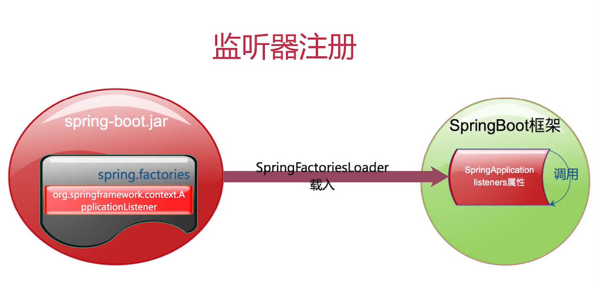


# SpringApplicationRunListeners


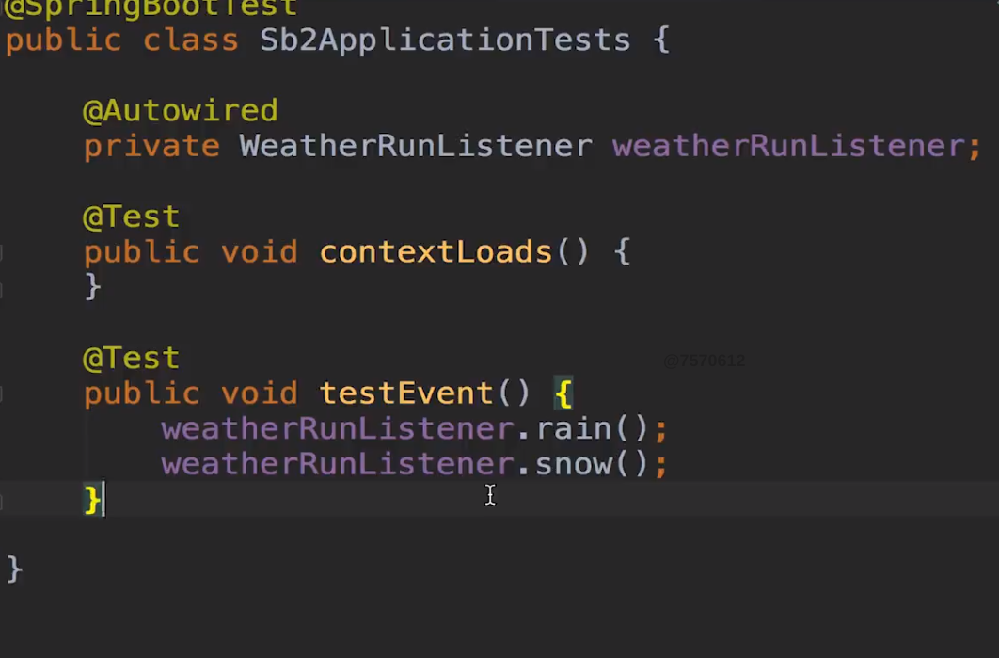
低耦合高内聚

---

# SpringBoot内置监听器实现接口

ApplicationListener
ApplicationListener<E extends ApplicationEvent> extends EventListener

ApplicationEventMulticaster

SpringApplicationEvent子类

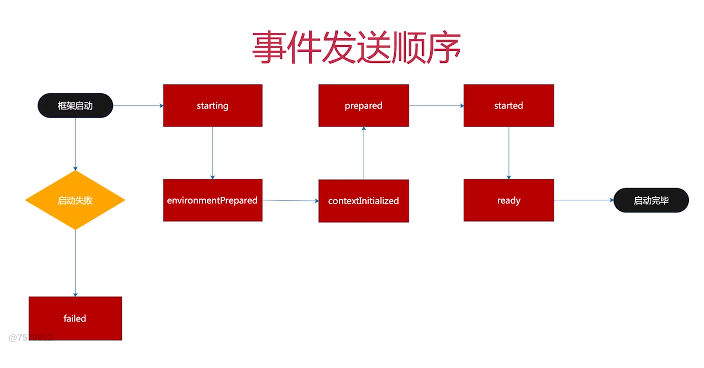
框架启动事件发送顺序
starting事件
environmentPrepared事件
contextInitialized事件
prepared事件
started事件
ready事件
启动完毕
启动失败：failed事件

监听器初始化与初始化器类似
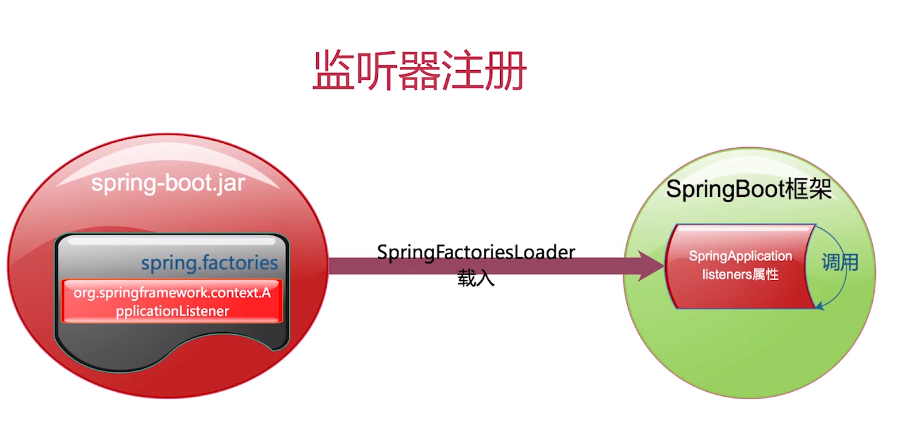

创建工厂

---

SpringApplicationRunListeners
```java
void starting() {
	for (SpringApplicationRunListener listener : this.listeners) {
		listener.starting();
	}
}
```
SpringApplicationRunListener


---
SpringBoot默认事件

ApplicationContextInitializedEvent
ApplicationEnvironmentPreparedEvent
ApplicationFailedEvent
ApplicationPreparedEvent
ApplicationReadyEvent
ApplicationStartedEvent
ApplicationStartingEvent
EventPublishingRunListener
dSpringApplicationEvent

三种注册方式，两种实现方式

实现方式一
+ 实现ApplicationListener接口
+ spring.factories内填写接口实现
+ key值为org.springframework.context.ApplicationListener

实现方式一
+ 实现ApplicationListener接口
+ SpringApplication类初始后设置进去

实现方式三
+ 实现ApplicationListener接口
+ application.properties内填写接口实现，key值为context.listener.classes

实现方式四
+ 实现SmartApplicationListener接口
+ 重写supportsEventType方法
+ 同前三种注入方式注入框架

TIPS
+ 实现ApplicationListener接口针对单一事件监听
+ 实现SmartApplicationListener接口针对多种事件监听
+ Order值越小越先执行
+ application.properties中定义的优先于其他方式

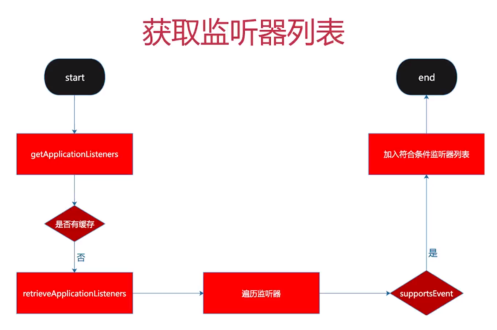
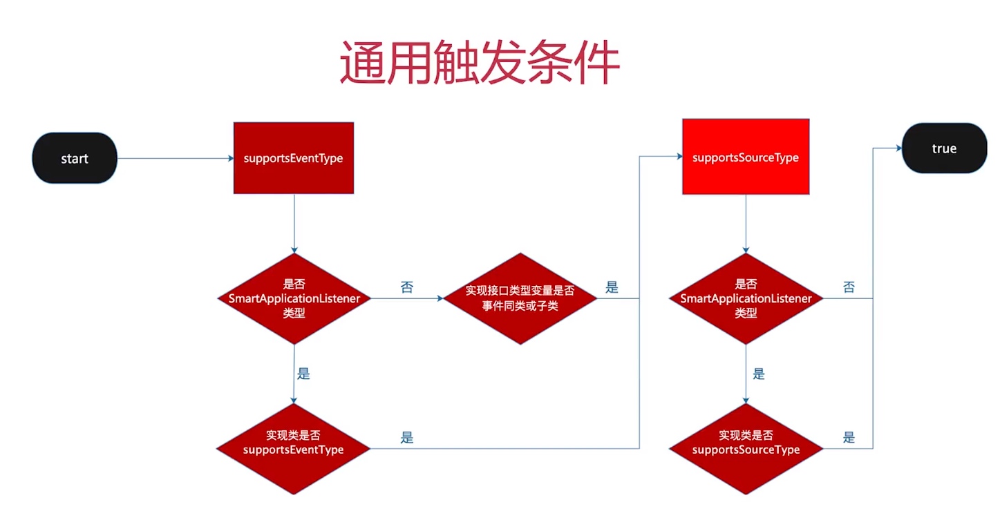

SpringApplicationRunListener
里面定义了各种事件
SpringApplicationRunListeners

EventPublishingRunListener

SimpleApplicationEventMulticaster