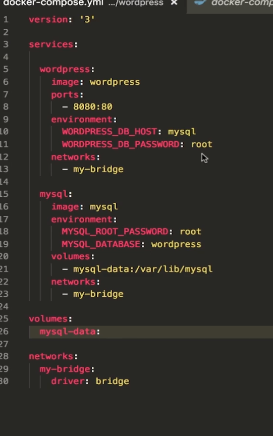

[TOC]

# 准备
```docker
docker run -d --name mysql -v mysql-data:/var/lib/mysql -e MYSQL_ROOT_PASSWORD=root -e MYSQL_DATABASE=test
docker run -d -e WORDPRESS_DB_HOST=mysql:3306 --link mysql -p 8080:80 wordpress
```

# Docker Compose
+ Docker Compose是一个工具
+ 这个工具可以通过一个yml文件定义多容器的docker应用
+ 通过一条命令就可以根据yml文件的定义去创建或者管理这多个容器

# docker-compose.yml
+ Services
+ Networks
+ Volumes

# Docker Compose版本差异

# Services
+ 一个service代表一个container，这个container可以从dockerhub的image来创建，或者从本地的DockerFile build出来的image来创建
+ service的启动类似docker run，我们可以给其指定network和volume，所以可以给service指定network和volume的引用

```docker
services:
    db:
        image:postgres:9.4
    volumes:
        - "db-data:/var/lib/postgresql/data"
    networks:
        - back-tier
```

```docker
services:
    worker:
        build:./worker
        links:
            - db
            - redis
        networks:
            - back-tier
```



# 安装
```
┌─[cai@frog] - [~] - [四 1月 09, 22:13]
└─[$] <> sudo pacman -S docker-compose
[sudo] cai 的密码：
正在解析依赖关系...
正在查找软件包冲突...

软件包 (18) python-asn1crypto-1.2.0-3  python-bcrypt-3.1.7-3
            python-cached-property-1.5.1-4  python-cffi-1.13.2-2
            python-cryptography-2.8-1  python-docker-4.1.0-3
            python-docker-pycreds-0.4.0-5  python-dockerpty-0.4.1-6
            python-jsonschema-3.2.0-1  python-paramiko-2.6.0-3
            python-ply-3.11-4  python-pyasn1-0.4.8-1  python-pycparser-2.19-3
            python-pynacl-1.3.0-3  python-pyrsistent-0.15.6-1
            python-texttable-1.6.2-3  python-websocket-client-0.57.0-1
            docker-compose-1.25.0-1

下载大小:    2.03 MiB
全部安装大小：  13.11 MiB
```

docker-compose -f docker-compose.yml up
docker-compose up

docker-compose ps

docker-compose start
docker-compose stop/down

docker-compose exec mysql bash


# Using Compose is basically a three-step process:
1. Define your app’s environment with a Dockerfile so it can be reproduced anywhere.
2. Define the services that make up your app in docker-compose.yml so they can be run together in an isolated environment.
3. Run docker-compose up and Compose starts and runs your entire app.

# A docker-compose.yml looks like this:
```yml
version: '3'
services:
  web:
    build: .
    ports:
    - "5000:5000"
    volumes:
    - .:/code
    - logvolume01:/var/log
    links:
    - redis
  redis:
    image: redis
volumes:
  logvolume01: {}
```

# Compose has commands for managing the whole lifecycle of your application:
1. Start, stop, and rebuild services
2. View the status of running services
3. Stream the log output of running services
4. Run a one-off command on a service

# demo
## setp1:Setup
1.Create a directory for the project:
```shell
$ mkdir composetest
$ cd composetest
```
2.Create a file called app.py in your project directory and paste this in:
```python
import time

import redis
from flask import Flask

app = Flask(__name__)
cache = redis.Redis(host='redis', port=6379)


def get_hit_count():
    retries = 5
    while True:
        try:
            return cache.incr('hits')
        except redis.exceptions.ConnectionError as exc:
            if retries == 0:
                raise exc
            retries -= 1
            time.sleep(0.5)


@app.route('/')
def hello():
    count = get_hit_count()
    return 'Hello World! I have been seen {} times.\n'.format(count)
```
pipfile:
```
flask
redis
```
# Step 2: Create a Dockerfile
In this step, you write a Dockerfile that builds a Docker image. The image contains all the dependencies the Python application requires, including Python itself.

In your project directory, create a file named Dockerfile and paste the following:
```
FROM python:3.7-alpine
WORKDIR /code
ENV FLASK_APP app.py
ENV FLASK_RUN_HOST 0.0.0.0
RUN apk add --no-cache gcc musl-dev linux-headers
COPY requirements.txt requirements.txt
RUN pip install -r requirements.txt
COPY . .
CMD ["flask", "run"]
```
This tells Docker to:
+ Build an image starting with the Python 3.7 image.
+ Set the working directory to /code.
+ Set environment variables used by the flask command.
+ Install gcc so Python packages such as MarkupSafe and SQLAlchemy can compile speedups.
+ Copy requirements.txt and install the Python dependencies.
+ Copy the current directory . in the project to the workdir . in the image.
+ Set the default command for the container to flask run.

# Step 3: Define services in a Compose file
Create a file called docker-compose.yml in your project directory and paste the following:
```yml
version: '3'
services:
  web:
    build: .
    ports:
      - "5000:5000"
  redis:
    image: "redis:alpine"
```
This Compose file defines two services: web and redis.
## Web service
The web service uses an image that’s built from the Dockerfile in the current directory. It then binds the container and the host machine to the exposed port, 5000. This example service uses the default port for the Flask web server, 5000.
## Redis service
The redis service uses a public Redis image pulled from the Docker Hub registry.
# Step 4: Build and run your app with Compose
1.From your project directory, start up your application by running docker-compose up.
```
$ docker-compose up
Creating network "composetest_default" with the default driver
Creating composetest_web_1 ...
Creating composetest_redis_1 ...
Creating composetest_web_1
Creating composetest_redis_1 ... done
Attaching to composetest_web_1, composetest_redis_1
web_1    |  * Running on http://0.0.0.0:5000/ (Press CTRL+C to quit)
redis_1  | 1:C 17 Aug 22:11:10.480 # oO0OoO0OoO0Oo Redis is starting oO0OoO0OoO0Oo
redis_1  | 1:C 17 Aug 22:11:10.480 # Redis version=4.0.1, bits=64, commit=00000000, modified=0, pid=1, just started
redis_1  | 1:C 17 Aug 22:11:10.480 # Warning: no config file specified, using the default config. In order to specify a config file use redis-server /path/to/redis.conf
web_1    |  * Restarting with stat
redis_1  | 1:M 17 Aug 22:11:10.483 * Running mode=standalone, port=6379.
redis_1  | 1:M 17 Aug 22:11:10.483 # WARNING: The TCP backlog setting of 511 cannot be enforced because /proc/sys/net/core/somaxconn is set to the lower value of 128.
web_1    |  * Debugger is active!
redis_1  | 1:M 17 Aug 22:11:10.483 # Server initialized
redis_1  | 1:M 17 Aug 22:11:10.483 # WARNING you have Transparent Huge Pages (THP) support enabled in your kernel. This will create latency and memory usage issues with Redis. To fix this issue run the command 'echo never > /sys/kernel/mm/transparent_hugepage/enabled' as root, and add it to your /etc/rc.local in order to retain the setting after a reboot. Redis must be restarted after THP is disabled.
web_1    |  * Debugger PIN: 330-787-903
redis_1  | 1:M 17 Aug 22:11:10.483 * Ready to accept connections
```
2.Stop the application, either by running docker-compose down from within your project directory in the second terminal, or by hitting CTRL+C in the original terminal where you started the app.

# Step 5: Edit the Compose file to add a bind mount

# Step 6: Re-build and run the app with Compose


