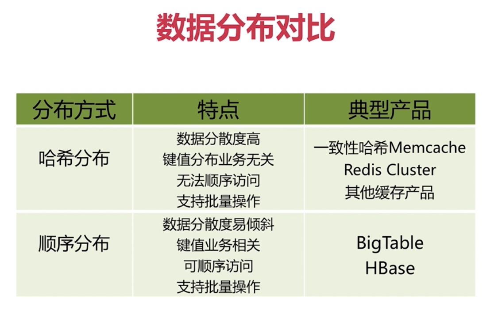
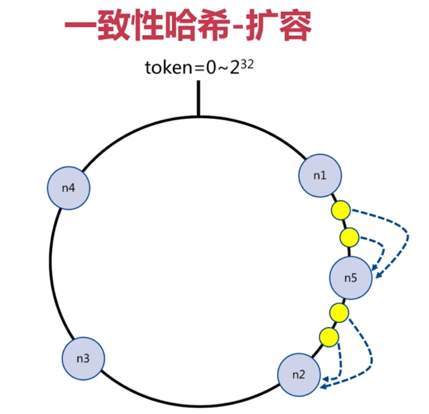
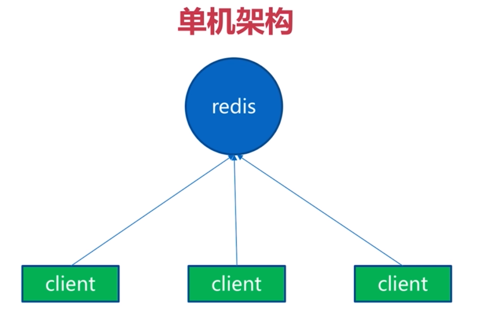
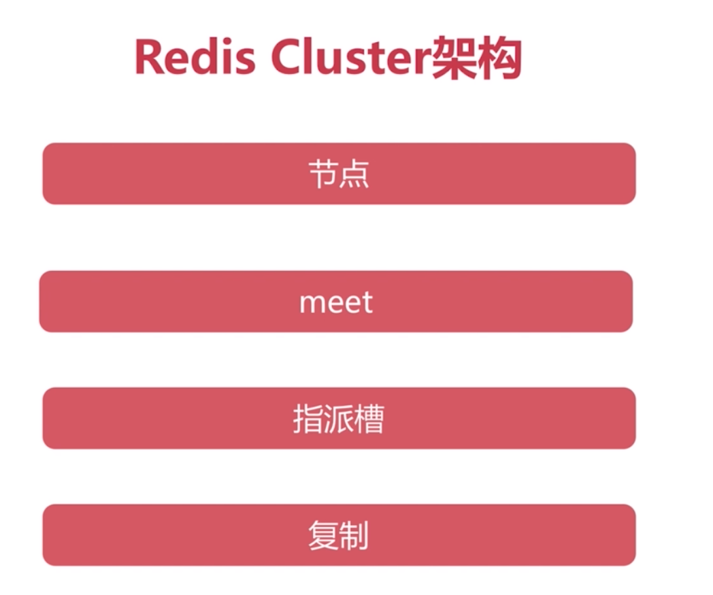
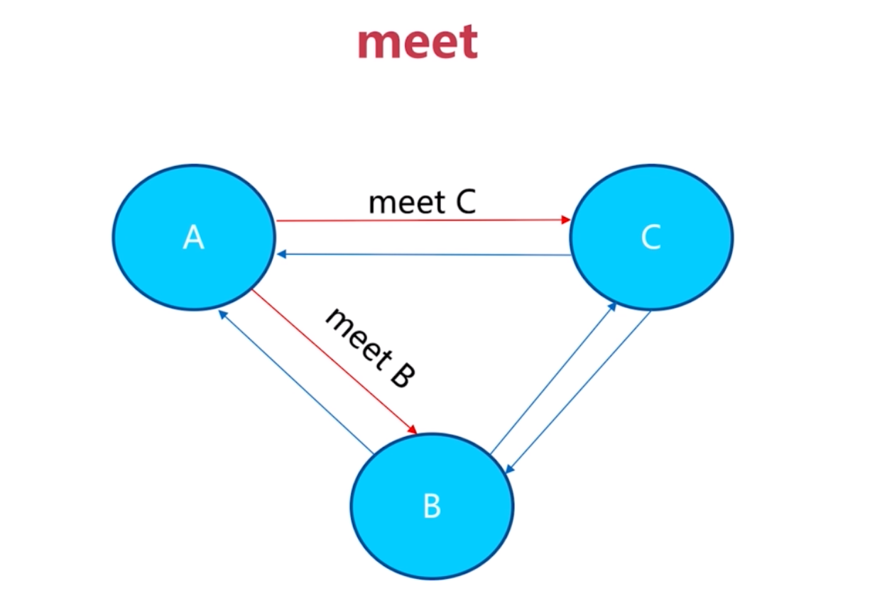
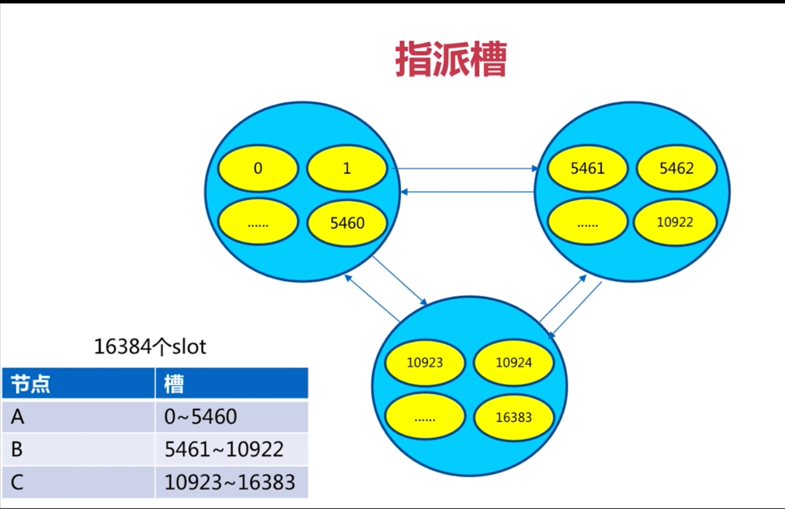
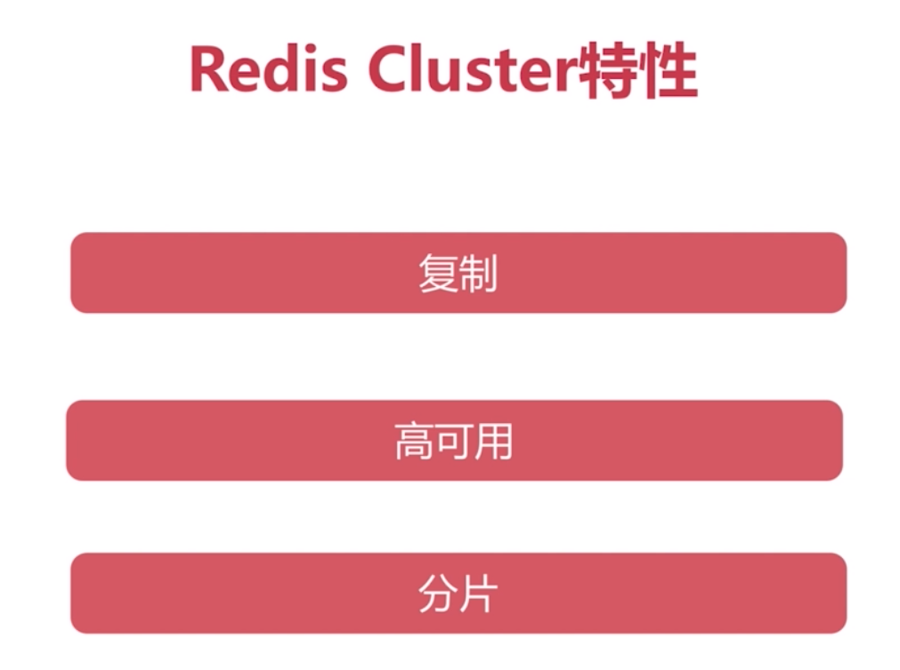

[TOC]

# 为什么要集群
1.并发量
2.数据量
3.网络
打个比方：如果一辆马车太重了，一匹马拉不动，那换一只大象来拉，那如果大象也拉不动呢
团队的力量

# 集群：规模化需求
并发量：OPS
数据量：大数据

# 分布式数据库-数据分区

# 顺序分区和哈希分区

# 哈希分布
+ 节点取余分区
+ 一致性哈希分区
+ 虚拟槽分区

# 节点取余分区

如果增加了一个节点，会造成数据漂移

# 一致性哈希

客户端分片：哈希+顺时针（优化取余）
节点伸缩：只影响临近的节点，但是还是有数据迁移
翻倍伸缩：保证最小迁移数据和负债均衡

# 虚拟槽分区

---

# 基本架构

